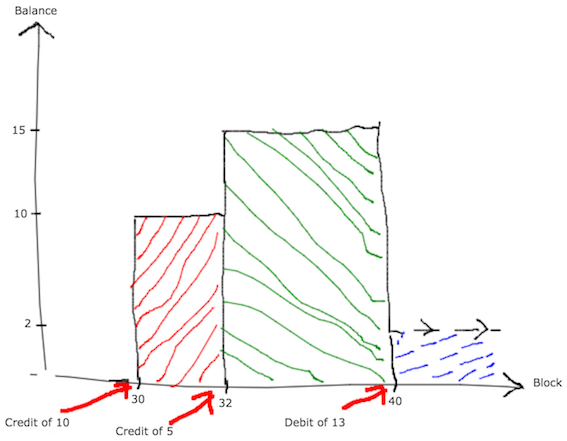

## Accounts Value Held by integral of balance function

### How an account is modeled

Accounts can be modeled according to its financial activities: each account or contract might receive or transfer value. 

Anytime an account/contract receives an amount of value in *wei* by a transaction, that value is understood as a credit to the account. To the other hand, anytime an account provides  an arbitrary amount of *wei* to a transaction, that value is seen as a debit against the account. For the simplification and modeling sake, we have the following data for each debit or credit:

* **value**: integer value transacted from or to an account. Positive if the value is a credit, otherwise is negative
* **block number**: the block index where the transaction that performed the value transfer were performed

Therefore, each account is associated with a list of debits and credits sorted ascending by the block number of each entry in the list. This list is called account's statement.

#### Example

Let the account 0x0123... be a hypothetical account/contract and has the following activity tracked:
* **credit of 10 wei at block 30**
* **credit of 5 wei at block 32**
* **debit of 13 wei at block 40**

Up to block 40 and on the account will be associated with the following statement:

`0x0123... -> [(10, 30),(5, 32),(-13, 40)]`, note each position is the correspondent credit or debit already sorted by the block number that is inside each position as the 2nd tuple value.


### Balance function

Accounts can be associated with their respective balance that evolves along the time. A new credit will add value to the balance, meanwhile a dedit immediately will hurt the balance. 

Based on the account's statement, we are able to extract the list with the balance of the account along the blocks in an ascending fashion. Besides to illustrate the balance for the account, this list tells how the balance evolves along the time and wich points took place any change in the balance. We call that simply as balance list and can be seen as a list of points of a balance function.

For the statement above mentioned, we have the following balance list for the account 0x0123...:

`0x0123... -> [(10,30), (15, 32), (2, 40)]`, where each position is the updated value of the balance when any change in the value took place(credit or debit).

The figure bellow, shows the function curve(degree) for the list of balances above:


The current experiments ranks the accounts based on the integral of this function that is simply the sum of the rectangles highlited in the graph, considering the block range desired. This area tells how much of balance has been held along the time.

### Retrieving and preprocessing data


```python
from pyspark.sql import SparkSession
from pyspark.storagelevel import StorageLevel 

spark = SparkSession\
    .builder\
    .appName("acct_value_holding_exp")\
    .master("spark://master:7077")\
    .getOrCreate()
spark._jsc.hadoopConfiguration().set('fs.azure.account.key...', '...')
```


```python
txs = spark.read.json("wasb://.../txs/*.json")
txs.persist(StorageLevel.DISK_ONLY)
txs.registerTempTable("txs")
txs.count()
```


    54199828


```python
max_block_number = spark.sql("select max(block_number) as max_block_number from txs").rdd.map(lambda row: row.max_block_number).take(1)[0]
min_block_number = spark.sql("select min(block_number) as min_block_number from txs").rdd.map(lambda row: row.min_block_number).take(1)[0]
```


```python
print(min_block_number, max_block_number)
```

    46147 4242240


```python
income = spark.sql("select `to` acct, cast(value as decimal(38,0)) value, block_number from txs where `to` is not null")
outcome = spark.sql("select `from` acct, -1 * cast(value as decimal(38,0)) value, block_number from txs where `from` is not null")
statement = income.unionAll(outcome)
statement.persist(StorageLevel.DISK_ONLY)
statement.registerTempTable("statement")
statement.count()
```


    108399656


```python
keyed_statement_rdd = statement.rdd.sortBy(lambda row: row[-1]).map(lambda row: (row[0], [(row[1], row[2])]))
keyed_statement_rdd.persist(StorageLevel.DISK_ONLY)
keyed_statement_rdd.count()
```


    108399656


```python
keyed_statement_rdd.take(10)
```


    [('0x5df9b87991262f6ba471f09758cde1c0fc1de734', [(Decimal('31337'), 46147)]),
     ('0xa1e4380a3b1f749673e270229993ee55f35663b4', [(Decimal('-31337'), 46147)]),
     ('0x5c12a8e43faf884521c2454f39560e6c265a68c8',
      [(Decimal('19900000000000000000'), 46169)]),
     ('0xbd08e0cddec097db7901ea819a3d1fd9de8951a2',
      [(Decimal('-19900000000000000000'), 46169)]),
     ('0xc93f2250589a6563f5359051c1ea25746549f0d8',
      [(Decimal('599989500000000000000'), 46170)]),
     ('0x63ac545c991243fa18aec41d4f6f598e555015dc',
      [(Decimal('-599989500000000000000'), 46170)]),
     ('0x7e7ec15a5944e978257ddae0008c2f2ece0a6090',
      [(Decimal('100000000000000000000'), 46194)]),
     ('0x037dd056e7fdbd641db5b6bea2a8780a83fae180',
      [(Decimal('-100000000000000000000'), 46194)]),
     ('0x4bd5f0ee173c81d42765154865ee69361b6ad189',
      [(Decimal('803989500000000000000'), 46205)]),
     ('0x3f2f381491797cc5c0d48296c14fd0cd00cdfa2d',
      [(Decimal('-803989500000000000000'), 46205)])]


```python
from decimal import Decimal
def accumulative_credit_list(stmt):
    block_dict = {}
    accumulative_list = [(Decimal("0"), -1)]
    for entry in stmt:
        if entry[1] not in block_dict:
            block_dict[entry[1]] = entry[0]
        else:
            block_dict[entry[1]] += entry[0]
    
    for block_number in sorted(block_dict):
        accumulative_list.append((accumulative_list[-1][0]+block_dict[block_number], block_number))
        
    return accumulative_list[1:]
```


```python
account_accumulated_value = keyed_statement_rdd.reduceByKey(lambda stmt1, stmt2: stmt1 + stmt2).map(lambda stmt: (stmt[0], accumulative_credit_list(stmt[1])))
account_accumulated_value.persist(StorageLevel.DISK_ONLY)
account_accumulated_value.count()
```


    5770104


```python
account_accumulated_value.take(100)
```


    [('0x1c10a5aabc2555ee3027d5758c4b7b462605f972',
      [(Decimal('10000'), 136948),
       (Decimal('70000010000'), 137246),
       (Decimal('7070000010000'), 137262),
       (Decimal('700007070000010000'), 137328),
       (Decimal('700007070000009000'), 137337),
       (Decimal('700007070000008000'), 137362),
       (Decimal('630321363000007200'), 137390),
       (Decimal('567709226700006480'), 137416),
       (Decimal('511463304030005832'), 137440),
       (Decimal('511463304030005827'), 137496),
       (Decimal('511463304030005822'), 137527),
       (Decimal('511463304030005817'), 139390),
       (Decimal('511463304030005812'), 141878),
       (Decimal('511463304030005807'), 141907),
       (Decimal('511463304030005803'), 141934),
       (Decimal('511463304030005799'), 141959),
       (Decimal('511463304030005795'), 141979),
       (Decimal('511463304030005791'), 141997),
       (Decimal('511463304030005787'), 142014),
       (Decimal('511463304030005783'), 142053),
       (Decimal('511463304030005779'), 142073),
       (Decimal('511463304030005775'), 142109),
       (Decimal('511463304030005771'), 142137),
       (Decimal('511463304030005767'), 142161),
       (Decimal('511463304030005763'), 142180),
       (Decimal('511463304030005759'), 142218),
       (Decimal('511463304030005755'), 142239),
       (Decimal('511463304030005751'), 142273),
       (Decimal('511463304030005747'), 142295),
       (Decimal('511463304030005743'), 142315),
       (Decimal('511463304030005739'), 142331),
       (Decimal('511463304030005735'), 142400),
       (Decimal('511463304030005731'), 142485),
       (Decimal('511463304030005727'), 142516),
       (Decimal('511463304030005723'), 142539),
       (Decimal('511463304030005719'), 142556),
       (Decimal('511463304030005715'), 142576),
       (Decimal('511463304030005711'), 142599),
       (Decimal('511463304030005707'), 142613),
       (Decimal('511463304030005703'), 142631),
       (Decimal('511463304030005699'), 142648),
       (Decimal('511463304030005695'), 142667),
       (Decimal('511463304030005691'), 142689),
       (Decimal('511463304030005687'), 142708),
       (Decimal('511463304030005683'), 142732),
       (Decimal('511463304030005679'), 142749),
       (Decimal('511463304030005675'), 142764),
       (Decimal('511463304030005671'), 142787),
       (Decimal('511463304030005667'), 142797),
       (Decimal('511463304030005663'), 142812),
       (Decimal('511463304030005659'), 142833),
       (Decimal('511463304030005655'), 142851),
       (Decimal('511463304030005651'), 142880),
       (Decimal('511463304030005647'), 142900),
       (Decimal('511463304030005643'), 142924),
       (Decimal('511463304030005639'), 142963),
       (Decimal('511463304030005635'), 143055),
       (Decimal('511463304030005631'), 143077),
       (Decimal('511463304030005627'), 143124),
       (Decimal('511463304030005623'), 143138),
       (Decimal('511463304030005619'), 143151),
       (Decimal('511463304030005615'), 143175),
       (Decimal('511463304030005615'), 143194),
       (Decimal('511463304030005611'), 143237),
       (Decimal('511463304030005607'), 143320),
       (Decimal('511463304030005603'), 143343),
       (Decimal('511463304030005599'), 143365),
       (Decimal('511463304030005595'), 143386),
       (Decimal('511463304030005591'), 143405),
       (Decimal('511463304030005587'), 143425),
       (Decimal('511463304030005583'), 143446),
       (Decimal('511463304030005579'), 143514),
       (Decimal('511463304030005575'), 143532),
       (Decimal('511463304030005571'), 143585),
       (Decimal('511463304030005567'), 143600),
       (Decimal('511463304030005563'), 143669),
       (Decimal('511463304030005559'), 143688),
       (Decimal('511463304030005555'), 143706),
       (Decimal('511463304030005551'), 143743),
       (Decimal('511463304030005547'), 143785),
       (Decimal('511463304030005543'), 143806),
       (Decimal('511463304030005539'), 143834),
       (Decimal('511463304030005535'), 143868),
       (Decimal('511463304030005531'), 143882),
       (Decimal('511463304030005527'), 143900),
       (Decimal('511463304030005523'), 143920),
       (Decimal('1511463304030005523'), 143930),
       (Decimal('1511463304030005522'), 143940),
       (Decimal('1511463304030005521'), 143961),
       (Decimal('1511463304030005520'), 143981),
       (Decimal('1369354462426859868'), 143999),
       (Decimal('1369354462426859867'), 144017),
       (Decimal('1369354462426859866'), 144035),
       (Decimal('1369354462426859865'), 144056),
       (Decimal('1369354462426859864'), 144077),
       (Decimal('1369354462426859863'), 144102),
       (Decimal('1369354462426859862'), 144115),
       (Decimal('1369354462426859861'), 144140),
       (Decimal('1369354462426859860'), 144243),
       (Decimal('1242401504984028774'), 144267),
       (Decimal('1242401504984028773'), 144308),
       (Decimal('1242401504984028772'), 144467),
       (Decimal('1242401504984028771'), 144633),
       (Decimal('1242401504984028770'), 144795),
       (Decimal('1128668843285480793'), 144813),
       (Decimal('1128668843285480792'), 144842),
       (Decimal('1128668843285480791'), 144860),
       (Decimal('1128668843285480790'), 144890),
       (Decimal('1026729447756787611'), 144913),
       (Decimal('1026729447756787602'), 144944),
       (Decimal('1026729447756787593'), 144971),
       (Decimal('1026729447756787584'), 144992),
       (Decimal('1026729447756787575'), 145011),
       (Decimal('1026729447756787566'), 145244),
       (Decimal('1026729447756787557'), 145320),
       (Decimal('1026729447756787548'), 145335),
       (Decimal('1026729447756787539'), 145360),
       (Decimal('1026729447756787530'), 145531),
       (Decimal('936033991780963677'), 145547),
       (Decimal('936033991780963669'), 145563),
       (Decimal('936033991780963661'), 145583),
       (Decimal('936033991780963653'), 145599),
       (Decimal('936033991780963645'), 145614),
       (Decimal('936033991780963637'), 145789),
       (Decimal('936033991780963629'), 146040),
       (Decimal('936033991780963621'), 146186),
       (Decimal('936033991780963613'), 146431),
       (Decimal('936033991780963605'), 146539),
       (Decimal('936033991780963597'), 146560),
       (Decimal('936033991780963589'), 146579),
       (Decimal('936033991780963509'), 146598),
       (Decimal('936033991780963492'), 146612),
       (Decimal('936033991780963475'), 146628),
       (Decimal('855983081402722035'), 146646),
       (Decimal('784042262062304731'), 146690),
       (Decimal('719400524655929155'), 146705),
       (Decimal('661327960990191147'), 146761),
       (Decimal('609167653691026931'), 146846),
       (Decimal('562328377121779139'), 147038),
       (Decimal('520278028209456123'), 147213),
       (Decimal('482537714188365411'), 147228),
       (Decimal('448676431569383771'), 147248),
       (Decimal('418306277212300295'), 147299),
       (Decimal('391078138290925167'), 147315),
       (Decimal('366677813261687551'), 147334),
       (Decimal('344822520735373695'), 147351),
       (Decimal('325257757461691223'), 147372),
       (Decimal('307754470515377003'), 147386),
       (Decimal('292106512263694203'), 147408),
       (Decimal('278128349837179683'), 147528),
       (Decimal('265653003653316615'), 147572),
       (Decimal('254530192087839853'), 147591),
       (Decimal('244624661678910769'), 147611),
       (Decimal('235814684310874591'), 147626),
       (Decimal('227990704679642033'), 147640),
       (Decimal('221054123011532730'), 147657),
       (Decimal('214916199510234357'), 147670),
       (Decimal('209497068359065821'), 147688),
       (Decimal('204724850323014139'), 147732),
       (Decimal('200534854090567626'), 147872),
       (Decimal('196868857481365764'), 147888),
       (Decimal('193674460533084088'), 148018),
       (Decimal('190904503279630579'), 148101),
       (Decimal('188516541751522421'), 148137),
       (Decimal('186472376376225079'), 148154),
       (Decimal('184737627538457471'), 148201),
       (Decimal('183281353584466624'), 148220),
       (Decimal('182075707025874862'), 148261),
       (Decimal('181095625123142276'), 148277),
       (Decimal('180318551410682949'), 148293),
       (Decimal('179724185069469555'), 148327),
       (Decimal('179294255362377500'), 148340),
       (Decimal('179012318625994650'), 148358),
       (Decimal('178863575563250085'), 148374),
       (Decimal('178834706806779977'), 148389),
       (Decimal('178834706806779977'), 151421),
       (Decimal('517901633644093054'), 151728),
       (Decimal('484073959079538646'), 151739),
       (Decimal('453734051971439682'), 151757),
       (Decimal('426533135574150614'), 151776),
       (Decimal('402157310816590454'), 151788),
       (Decimal('380324068534786310'), 151795),
       (Decimal('360779150481162578'), 151807),
       (Decimal('343293724232901222'), 151823),
       (Decimal('327661840609466000'), 151837),
       (Decimal('313698145348374300'), 151855),
       (Decimal('301235819613391770'), 151867),
       (Decimal('290124726451907494'), 151882),
       (Decimal('280229742606571644'), 151901),
       (Decimal('271429257145769380'), 151919),
       (Decimal('263613820231047342'), 151941),
       (Decimal('256684927007797508'), 151953),
       (Decimal('250553923106872657'), 151969),
       (Decimal('245141019596040291'), 151987),
       (Decimal('240374406436291162'), 152004),
       (Decimal('236189454592516946'), 152025),
       (Decimal('232527997933120152'), 152037),
       (Decimal('229337686939663037'), 152051),
       (Decimal('226571407045551634'), 152073),
       (Decimal('224186755140851371'), 152091),
       (Decimal('222145568426621134'), 152111),
       (Decimal('220413500383813921'), 152245),
       (Decimal('218959639145287429'), 152426),
       (Decimal('217756164030613587'), 152552),
       (Decimal('216778036427407129'), 152712),
       (Decimal('216002721584521317'), 152730),
       (Decimal('215409938225924086'), 152942),
       (Decimal('214989957129142578'), 153125),
       (Decimal('214716974142039221'), 153611),
       (Decimal('214576289453646199'), 153949),
       (Decimal('214554673234092480'), 154598),
       (Decimal('248461365917823857'), 156900),
       (Decimal('245156242051852372'), 156913),
       (Decimal('242286630572478035'), 156922),
       (Decimal('239808980241041132'), 156942),
       (Decimal('237684094942747919'), 156962),
       (Decimal('235876698174284027'), 156975),
       (Decimal('234355041082666525'), 156990),
       (Decimal('233090549700210773'), 157005),
       (Decimal('233090549700210773'), 157267),
       (Decimal('232162507456000596'), 158200),
       (Decimal('231432269436211437'), 160320),
       (Decimal('230880055218401194'), 161043),
       (Decimal('230488062422371975'), 161227),
       (Decimal('230240268905945678'), 162433),
       (Decimal('230122254741162011'), 162862),
       (Decimal('230121041992856710'), 162895),
       (Decimal('232027734676588087'), 164790),
       (Decimal('231940973934740179'), 164802),
       (Decimal('1142897139632862864'), 165611),
       (Decimal('1051828438395387472'), 165624),
       (Decimal('969971607281659632'), 165630),
       (Decimal('896405459279304576'), 165641),
       (Decimal('830300926077185024'), 165668),
       (Decimal('770911846195277424'), 165679),
       (Decimal('717566674301560576'), 165690),
       (Decimal('669661019597215416'), 165708),
       (Decimal('626650930363304776'), 165722),
       (Decimal('588046850052785200'), 165734),
       (Decimal('553408177773317580'), 165750),
       (Decimal('522338372721796724'), 165759),
       (Decimal('494480548175427952'), 165853),
       (Decimal('494540878284305374'), 166281),
       (Decimal('494594861953631631'), 166484),
       (Decimal('494913149256991960'), 166690),
       (Decimal('469902847057103664'), 166921),
       (Decimal('469902847057103669'), 167221),
       (Decimal('469902847057103670'), 167224),
       (Decimal('469902847057103673'), 167225),
       (Decimal('469902847057103674'), 167231),
       (Decimal('469902847057103679'), 167232),
       (Decimal('469902847057103680'), 167233),
       (Decimal('469902847057103687'), 167240),
       (Decimal('469902847057103687'), 167256),
       (Decimal('502634398416140823'), 167261),
       (Decimal('476956971300337643'), 167775),
       (Decimal('453952286896114779'), 167789),
       (Decimal('433353070932314199'), 167802),
       (Decimal('414918776564893679'), 167974),
       (Decimal('398432911634215211'), 168205),
       (Decimal('383700633196604591'), 168519),
       (Decimal('370546582602755033'), 168710),
       (Decimal('358812937068290429'), 168772),
       (Decimal('348357656087272287'), 169461),
       (Decimal('339052903204355959'), 169571),
       (Decimal('339052903204355959'), 169629),
       (Decimal('330888625609731263'), 169886),
       (Decimal('323645775774569037'), 169986),
       (Decimal('317232210922923033'), 170384),
       (Decimal('311565002556441630'), 171505),
       (Decimal('306569515026608367'), 171714),
       (Decimal('302178576249758430'), 171776),
       (Decimal('298331731350593487'), 171846),
       (Decimal('294974570941345038'), 171856),
       (Decimal('292058126573021434'), 171868),
       (Decimal('289538326641530191'), 172286),
       (Decimal('287375506703188072'), 172415),
       (Decimal('285533968758680165'), 172466),
       (Decimal('283981584608623049'), 172632),
       (Decimal('282689438873571645'), 172725),
       (Decimal('281631507712025381'), 172976),
       (Decimal('280784369666633743'), 172989),
       (Decimal('307132685480537031'), 173270),
       (Decimal('303840429658294228'), 173279),
       (Decimal('300982399418275705'), 173304),
       (Decimal('298515172202259035'), 173503),
       (Decimal('296399667707844032'), 173606),
       (Decimal('294600713662870529'), 173775),
       (Decimal('293086655022394377'), 175098),
       (Decimal('291829002245965840'), 175108),
       (Decimal('290802114747180156'), 175777),
       (Decimal('289982915998273041'), 175792),
       (Decimal('289350637124256637'), 175813),
       (Decimal('288886586137641874'), 175822),
       (Decimal('288573940249688587'), 175939),
       (Decimal('288397558950530629'), 176190),
       (Decimal('288343815781288467'), 176217),
       (Decimal('296699458929624836'), 178038),
       (Decimal('295531059178897461'), 178675),
       (Decimal('294695419390779192'), 178687),
       (Decimal('294142625570878664'), 178698),
       (Decimal('293830250823963215'), 178707),
       (Decimal('293722232289085083'), 178715),
       (Decimal('444658846921622329'), 185028),
       (Decimal('429608974955270995'), 185039),
       (Decimal('416169090185554795'), 185056),
       (Decimal('404178193892810215'), 185076),
       (Decimal('393491387229340093'), 185093),
       (Decimal('383978261232216985'), 185108),
       (Decimal('375521447834806187'), 185127),
       (Decimal('368025225122942269'), 185140),
       (Decimal('361383624682264742'), 185160),
       (Decimal('355511184285654968'), 185175),
       (Decimal('350330987928706171'), 185192),
       (Decimal('345773811207452254'), 185206),
       (Decimal('341777352158323729'), 185222),
       (Decimal('338285539014108056'), 185234),
       (Decimal('335247907184313951'), 185250),
       (Decimal('332619038537499256'), 185267),
       (Decimal('330358056755366031'), 185289),
       (Decimal('328428173151446128'), 185305),
       (Decimal('326796277907918216'), 185321),
       (Decimal('325432572188743095'), 185383),
       (Decimal('324310237041485486'), 185502),
       (Decimal('323405135408953638'), 186488),
       (Decimal('322695543939674975'), 186574),
       (Decimal('322161911617324178'), 187003),
       (Decimal('321786642527208461'), 187040),
       (Decimal('321553900346104315'), 187054),
       (Decimal('321449432383110584'), 187076),
       (Decimal('1854652633997049016'), 206042),
       (Decimal('1701343292668960824'), 206057),
       (Decimal('1563469885473681432'), 206074),
       (Decimal('1439488818997929976'), 206089),
       (Decimal('1328010859169753688'), 206112),
       (Decimal('1227785695324395016'), 206129),
       (Decimal('1137688047863572216'), 206145),
       (Decimal('1056705165148831704'), 206166),
       (Decimal('983925570705565240'), 206189),
       (Decimal('918528935706625416'), 206199),
       (Decimal('859776964207579576'), 206212),
       (Decimal('807005189858438312'), 206226),
       (Decimal('759615592944211184'), 206244),
       (Decimal('717069955721406768'), 206258),
       (Decimal('678883882220882792'), 206275),
       (Decimal('644621416070411216'), 206292),
       (Decimal('613890196534986792'), 206309),
       (Decimal('586337098953104816'), 206328),
       (Decimal('561644311129411032'), 206348),
       (Decimal('561644311129411032'), 206368),
       (Decimal('539630802088086628'), 206389),
       (Decimal('519923643950894668'), 206411),
       (Decimal('502292201627421900'), 206429),
       (Decimal('486528903536296410'), 206760),
       (Decimal('472446935254283470'), 206818),
       (Decimal('459878163800471822'), 206831),
       (Decimal('448671269492041340'), 207181),
       (Decimal('438690064614453906'), 207259),
       (Decimal('429811980224625215'), 207323),
       (Decimal('421926704273779394'), 208192),
       (Decimal('414934955918018155'), 208423),
       (Decimal('408747382397833040'), 208497),
       (Decimal('403283566229666436'), 208789),
       (Decimal('398471131678316492'), 208810),
       (Decimal('394244940582101543'), 208829),
       (Decimal('390546368595508089'), 209160),
       (Decimal('387322653807573980'), 209494),
       (Decimal('384526310498433282'), 209947),
       (Decimal('382114601520206654'), 210569),
       (Decimal('380049063439802689'), 211985),
       (Decimal('378295079167439121'), 212000),
       (Decimal('376821493322311909'), 212282),
       (Decimal('375600266061697419'), 213767),
       (Decimal('374606161527144377'), 213784),
       (Decimal('373816467446046640'), 214034),
       (Decimal('373210742773058676'), 214590),
       (Decimal('372770590567369509'), 214756),
       (Decimal('372479453582249259'), 214929),
       (Decimal('372322430295641034'), 214944),
       (Decimal('372286109337693631'), 216066),
       (Decimal('372286109337698581'), 216555),
       (Decimal('372286109337698581'), 216634),
       (Decimal('372286109337703531'), 216635),
       (Decimal('372286109337703532'), 216636),
       (Decimal('372286109337703537'), 216637),
       (Decimal('372286109337703542'), 216638),
       (Decimal('372286109337703548'), 216639),
       (Decimal('372286109337703572'), 216640),
       (Decimal('372286109337703593'), 216641),
       (Decimal('372286109337703620'), 216642),
       (Decimal('372286109337703651'), 216643),
       (Decimal('372286109337703652'), 216644),
       (Decimal('372286109337703654'), 216645),
       (Decimal('372286109337703746'), 216646),
       (Decimal('372286109337703772'), 216647),
       (Decimal('372286109337703978'), 216648),
       (Decimal('372286109337704005'), 216649),
       (Decimal('372286109337706548'), 216650),
       (Decimal('372286109337706713'), 216651),
       (Decimal('372286109337706883'), 216652),
       (Decimal('372286109337707060'), 216653),
       (Decimal('372286109337707060'), 216654),
       (Decimal('372286109337707160'), 216703),
       (Decimal('372286109337722010'), 216704),
       (Decimal('372286109337722110'), 216709),
       (Decimal('372286109337722418'), 216710),
       (Decimal('372286109337722629'), 216711),
       (Decimal('372286109337722736'), 216712),
       (Decimal('372286109337723063'), 216713),
       (Decimal('372286109337723264'), 216714),
       (Decimal('372286109337723466'), 216715),
       (Decimal('372286109337724078'), 216716),
       (Decimal('372286109337726186'), 216717),
       (Decimal('372286109337726627'), 216718),
       (Decimal('372286109337727072'), 216719),
       (Decimal('372286109337736878'), 216720),
       (Decimal('372286109337737278'), 216722),
       (Decimal('614724019337737278'), 224764),
       (Decimal('590552539475580250'), 224778),
       (Decimal('568903207599638926'), 224796),
       (Decimal('549540843958751934'), 224815),
       (Decimal('532219716681953640'), 224836),
       (Decimal('516735702132835176'), 224852),
       (Decimal('502905089038628558'), 224869),
       (Decimal('490562537253842602'), 224890),
       (Decimal('479559240647535242'), 224909),
       (Decimal('469761273701858618'), 224926),
       (Decimal('461048103450749656'), 224946),
       (Decimal('453311250224751590'), 224965),
       (Decimal('446453082321353331'), 224984),
       (Decimal('440385731208294898'), 224998),
       (Decimal('435030115206542308'), 225023),
       (Decimal('430315060804964977'), 225043),
       (Decimal('426176511843545380'), 225064),
       (Decimal('422556817778267742'), 225079),
       (Decimal('419404093119517868'), 225091),
       (Decimal('416671640926642981'), 225109),
       (Decimal('414317433953055583'), 225125),
       (Decimal('412303647676826925'), 225144),
       (Decimal('410596240028221133'), 225163),
       (Decimal('409164573144475920'), 225181),
       (Decimal('407981072949105228'), 225193),
       (Decimal('407020922773271606'), 225209),
       (Decimal('406261787615021346'), 225228),
       (Decimal('405683565972596112'), 225245),
       (Decimal('405268166494413401'), 225262),
       (Decimal('404999306964048961'), 225279),
       (Decimal('404862333386720965'), 225495),
       (Decimal('404862333386720966'), 225578),
       (Decimal('404844057167125770'), 225580),
       (Decimal('404844057167125771'), 225634),
       (Decimal('404844057167125907'), 225662),
       (Decimal('423844057167125907'), 225706),
       (Decimal('754044057167125907'), 225708),
       (Decimal('755944057167125907'), 225746),
       (Decimal('766294057167125907'), 225748),
       (Decimal('778194057167125907'), 225750),
       (Decimal('778954057167125907'), 225751),
       (Decimal('804544057167125907'), 225752),
       (Decimal('804563057167125907'), 225769),
       (Decimal('804592057167125907'), 225770),
       (Decimal('809594057167125907'), 225771),
       (Decimal('809594057167125908'), 225852),
       (Decimal('769207608569490212'), 226050),
       (Decimal('732964804831618092'), 226191),
       (Decimal('700451281467533184'), 226430),
       (Decimal('671294110439856768'), 227141),
       (Decimal('645157656514947992'), 227656),
       (Decimal('621739847982530092'), 227676),
       (Decimal('600768820303353984'), 227694),
       (Decimal('581999895392095484'), 227990),
       (Decimal('565212862971962834'), 228531),
       (Decimal('550209533793843452'), 228895),
       (Decimal('536811537533536008'), 229367),
       (Decimal('524858340899259308'), 229684),
       (Decimal('514205463928410278'), 229707),
       (Decimal('504722874654646150'), 229863),
       (Decimal('496293544308258435'), 229932),
       (Decimal('488812146996509491'), 229953),
       (Decimal('482183889415935442'), 229969),
       (Decimal('476323457593418798'), 230719),
       (Decimal('471154068953153818'), 230829),
       (Decimal('466606619176915336'), 231059),
       (Decimal('462618914378300703'), 231887),
       (Decimal('459134980059547533'), 232124),
       (Decimal('456104439172669680'), 232140),
       (Decimal('453481952374479612'), 232284),
       (Decimal('451226714256108551'), 232618),
       (Decimal('449301999949574596'), 232724),
       (Decimal('447674757073694037'), 232735),
       (Decimal('446315238485401534'), 233615),
       (Decimal('445196671755938281'), 234596),
       (Decimal('444294961699421353'), 234760),
       (Decimal('444337791556919323'), 235835),
       (Decimal('443626969520304291'), 235851),
       (Decimal('443092229687350762'), 236036),
       (Decimal('442715963837692586'), 236203),
       (Decimal('442482324573000228'), 236475),
       (Decimal('442377049234777106'), 236723),
       (Decimal('537825262641502066'), 254397),
       (Decimal('528290693496428758'), 254415),
       (Decimal('519817525755944182'), 254435),
       (Decimal('512296674789508064'), 254454),
       (Decimal('505632908919715558'), 254473),
       (Decimal('499740519636902302'), 254488),
       (Decimal('494542369282370372'), 254502),
       (Decimal('489969033963291634'), 254516),
       (Decimal('485958032176120771'), 254532),
       (Decimal('482453130567666994'), 254548),
       (Decimal('479403719120058595'), 254565),
       (Decimal('476764248817211036'), 254584),
       (Decimal('474493725544648233'), 254601),
       (Decimal('472555254599341710'), 254620),
       (Decimal('470915630748565839'), 254641),
       (Decimal('469544969282867555'), 254665),
       (Decimal('468416373963739100'), 254685),
       (Decimal('467505638176523490'), 254706),
       (Decimal('466790975968029441'), 254722),
       (Decimal('466252779980384797'), 254741),
       (Decimal('465873403591504618'), 254755),
       (Decimal('465636964841512457'), 254776),
       (Decimal('465529169966519512'), 254795),
       (Decimal('570083773977018456'), 282503),
       (Decimal('559636298188474910'), 282509),
       (Decimal('550357032513041618'), 282525),
       (Decimal('542111174756773456'), 282540),
       (Decimal('534794902776132110'), 282552),
       (Decimal('528315257993554899'), 282569),
       (Decimal('522588577689235409'), 282589),
       (Decimal('517539565415347868'), 282603),
       (Decimal('513100454368849081'), 282623),
       (Decimal('509210254427000173'), 282638),
       (Decimal('505814074479336156'), 282658),
       (Decimal('502862512526438541'), 282664),
       (Decimal('500311106768830687'), 282678),
       (Decimal('498119841586983619'), 282692),
       (Decimal('496252702923321257'), 282705),
       (Decimal('494677278126025132'), 282722),
       (Decimal('493364395808458619'), 282735),
       (Decimal('492287801722648757'), 282750),
       (Decimal('491423867045419882'), 282773),
       (Decimal('490751325835913894'), 282788),
       (Decimal('490251038747358505'), 282808),
       (Decimal('489905780367658655'), 282824),
       (Decimal('489700047825928790'), 282846),
       (Decimal('489619888538371911'), 282864),
       (Decimal('590156864593405895'), 309237),
       (Decimal('580136023629101307'), 309244),
       (Decimal('571237855508884176'), 309259),
       (Decimal('563334504200688758'), 309277),
       (Decimal('556326488023312882'), 309296),
       (Decimal('550124273463674594'), 309312),
       (Decimal('544647280360000135'), 309323),
       (Decimal('539822986566693121'), 309343),
       (Decimal('535586122152716809'), 309352),
       (Decimal('531877944180138128'), 309371),
       (Decimal('528645584004817315'), 309389),
       (Decimal('525841459847028584'), 309399),
       (Decimal('523422748105018726'), 309417),
       (Decimal('521350907537209854'), 309432),
       (Decimal('519591251026181869'), 309444),
       (Decimal('518112560166256683'), 309461),
       (Decimal('516886738392324015'), 309480),
       (Decimal('515888498795784614'), 309493),
       (Decimal('515095083158899153'), 309516),
       (Decimal('514486009085702238'), 309529),
       (Decimal('514042842419825015'), 309545),
       (Decimal('513748992420535514'), 309564),
       (Decimal('513589527421174963'), 309579),
       (Decimal('513551008921750467'), 309597),
       (Decimal('614398215442868435'), 321677),
       (Decimal('604383828141274591'), 321682),
       (Decimal('595497203343056332'), 321708),
       (Decimal('587604241024659898'), 321725),
       (Decimal('580605574938103108'), 321742),
       (Decimal('574411775460201998'), 321764),
       (Decimal('568942355930090998'), 321775),
       (Decimal('564124878352991098'), 321788),
       (Decimal('559894148533601189'), 321800),
       (Decimal('556191491696150270'), 321820),
       (Decimal('552964100542444443'), 321835),
       (Decimal('550164448504109199'), 321850),
       (Decimal('547749761669607479'), 321866),
       (Decimal('545681543518555931'), 321888),
       (Decimal('543925147182609538'), 321901),
       (Decimal('542449390480257785'), 321922),
       (Decimal('541226209448141207'), 321943),
       (Decimal('540230346519236287'), 321962),
       (Decimal('539439069883221859'), 321980),
       (Decimal('538831920910808874'), 321996),
       (Decimal('538390486835637187'), 322016),
       (Decimal('538098196167982669'), 322033),
       (Decimal('537940134567093603'), 322048),
       (Decimal('537902879126293443'), 322070),
       (Decimal('638548784616107363'), 334242),
       (Decimal('628555664170405827'), 334264),
       (Decimal('619666855769274445'), 334274),
       (Decimal('611771928208256200'), 334293),
       (Decimal('604771493403339780'), 334314),
       (Decimal('598576102078915002'), 334339),
       (Decimal('593105249886932702'), 334358),
       (Decimal('588286482914148632'), 334371),
       (Decimal('584054592638642969'), 334387),
       (Decimal('580350891390687872'), 334410),
       (Decimal('577122560267528285'), 334422),
       (Decimal('574322062256684657'), 334442),
       (Decimal('571906614046925392'), 334463),
       (Decimal('569837710658142053'), 334488),
       (Decimal('568080697608237048'), 334510),
       (Decimal('566604385863322544'), 334529),
       (Decimal('565380705292899490'), 334547),
       (Decimal('564384392779518741'), 334561),
       (Decimal('563592711517476067'), 334578),
       (Decimal('562985198381637661'), 334597),
       (Decimal('562543436559383095'), 334617),
       (Decimal('562250850919353986'), 334629),
       (Decimal('562092523843327788'), 334644),
       (Decimal('562055029474904210'), 334868),
       (Decimal('660001396096201234'), 356702),
       (Decimal('650278014502490310'), 356717),
       (Decimal('641639524043915079'), 356734),
       (Decimal('633969882631197372'), 356751),
       (Decimal('627172205359751434'), 356771),
       (Decimal('621159295815450091'), 356787),
       (Decimal('615852677225578882'), 356810),
       (Decimal('611181720494694794'), 356834),
       (Decimal('607082859436899115'), 356856),
       (Decimal('603498884484883004'), 356870),
       (Decimal('600378307028068504'), 356889),
       (Decimal('597674787316935454'), 356906),
       (Decimal('595346619576915709'), 356921),
       (Decimal('593356268610897939'), 356936),
       (Decimal('591669952741481945'), 356954),
       (Decimal('590257268459007551'), 356972),
       (Decimal('589090852604780596'), 356987),
       (Decimal('588146078335976337'), 357003),
       (Decimal('587400781494052504'), 357018),
       (Decimal('586835014336321054'), 357042),
       (Decimal('586430823894362749'), 357055),
       (Decimal('586172052496600275'), 357070),
       (Decimal('586044158238614048'), 357085),
       (Decimal('586034053406426444'), 357104),
       (Decimal('694717039862971532'), 401606),
       (Decimal('790433011274956620'), 416572),
       (Decimal('886546651381352700'), 449572),
       (Decimal('875774258386729346'), 459806),
       (Decimal('847001143539730210'), 459884),
       (Decimal('821210340177430990'), 459904),
       (Decimal('798103617151361690'), 459922),
       (Decimal('777412566427899322'), 459941),
       (Decimal('758895620776783190'), 459953),
       (Decimal('742335369690778670'), 459971),
       (Decimal('727536143713374602'), 459990),
       (Decimal('714321840333710942'), 460005),
       (Decimal('702533967292013648'), 460021),
       (Decimal('692029881554486084'), 460039),
       (Decimal('682681204390711276'), 460059),
       (Decimal('674372394943313948'), 460080),
       (Decimal('666999466440656353'), 460101),
       (Decimal('660468830788264518'), 460124),
       (Decimal('654696258701111866'), 460136),
       (Decimal('649605943822674480'), 460157),
       (Decimal('645129660432080832'), 460174),
       (Decimal('641206005380546549'), 460196),
       (Decimal('637779715834165694'), 460217),
       (Decimal('634801055242422925'), 460236),
       (Decimal('632225260709854433'), 460259),
       (Decimal('630012045630542790'), 460277),
       (Decimal('628125152059162311'), 460294),
       (Decimal('626531947844919880'), 460308),
       (Decimal('625203064052101692'), 460320),
       (Decimal('624112068638565323'), 460336),
       (Decimal('623235172766382591'), 460360),
       (Decimal('622550966481418132'), 460380),
       (Decimal('622040180824950119'), 460394),
       (Decimal('621685473734128908'), 460412),
       (Decimal('621471237352389818'), 460432),
       (Decimal('621383424608824637'), 460449),
       (Decimal('725665581272268749'), 485342),
       (Decimal('715263334136715673'), 485351),
       (Decimal('706021659109255205'), 485368),
       (Decimal('697809151584540784'), 485385),
       (Decimal('690522894812297805'), 485406),
       (Decimal('684070263717279124'), 485417),
       (Decimal('678367895731762311'), 485429),
       (Decimal('673340764544797180'), 485444),
       (Decimal('668921346476528562'), 485468),
       (Decimal('665048870215086806'), 485483),
       (Decimal('661668641579789225'), 485497),
       (Decimal('658731435808021403'), 485517),
       (Decimal('656192950613430363'), 485535),
       (Decimal('654013313938298427'), 485552),
       (Decimal('652156640930679685'), 485570),
       (Decimal('650590635223822817'), 485588),
       (Decimal('649286230087651636'), 485606),
       (Decimal('648217265465097573'), 485624),
       (Decimal('647360197304798916'), 485640),
       (Decimal('646693835960530125'), 485652),
       (Decimal('646199110750688213'), 485672),
       (Decimal('645858858061830492'), 485688),
       (Decimal('645657630641858543'), 485705),
       (Decimal('645581525963883789'), 485727),
       (Decimal('740677874225330893'), 523185),
       (Decimal('731204745189008905'), 523205),
       (Decimal('722783929056319115'), 523221),
       (Decimal('715310194536898304'), 523238),
       (Decimal('708688833469419574'), 523254),
       (Decimal('702834608508688716'), 523269),
       (Decimal('697670806044030945'), 523286),
       (Decimal('693128383825838951'), 523309),
       (Decimal('689145203829466156'), 523322),
       (Decimal('685665341832730641'), 523340),
       (Decimal('682638466035668677'), 523347),
       (Decimal('680019277818312910'), 523363),
       (Decimal('677767008422692719'), 523386),
       (Decimal('675844965966634547'), 523409),
       (Decimal('674220127756182193'), 523427),
       (Decimal('672862773366775074'), 523443),
       (Decimal('671746154416308667'), 523460),
       (Decimal('670846197360888901'), 523474),
       (Decimal('670141236011011111'), 523495),
       (Decimal('669611770796121100'), 523509),
       (Decimal('669240252102720090'), 523532),
       (Decimal('669010885278659181'), 523555),
       (Decimal('668909455137004363'), 523573),
       (Decimal('771742095520103403'), 548692),
       (Decimal('761472544354304163'), 548699),
       (Decimal('752340568400077947'), 548722),
       (Decimal('744226790041274352'), 548741),
       (Decimal('737029389518351117'), 548760),
       (Decimal('730656729047720205'), 548776),
       (Decimal('725026334624152384'), 548790),
       (Decimal('720063979642941346'), 548806),
       (Decimal('715702860159851412'), 548823),
       (Decimal('711882852625070471'), 548833),
       (Decimal('708549845843767624'), 548849),
       (Decimal('705655139740595062'), 548865),
       (Decimal('703154904247739756'), 548882),
       (Decimal('701009692304169981'), 548899),
       (Decimal('699184001554957183'), 548914),
       (Decimal('697645879880665665'), 548938),
       (Decimal('696366570373803299'), 548951),
       (Decimal('695320191817627169'), 548965),
       (Decimal('694483451117068653'), 548975),
       (Decimal('693835384486565988'), 548989),
       (Decimal('693357124519113590'), 549010),
       (Decimal('693031690548406431'), 549033),
       (Decimal('692843799974769988'), 549044),
       (Decimal('692779698458497190'), 549058),
       (Decimal('789164505680678182'), 576291),
       (Decimal('779579705993122664'), 576309),
       (Decimal('771058386274322698'), 576326),
       (Decimal('887070544018854794'), 818423),
       (Decimal('879512179809913124'), 820993),
       (Decimal('871953815600971454'), 821018),
       (Decimal('854515908459364910'), 823490),
       (Decimal('838926792031919018'), 823505),
       (Decimal('825001587247217716'), 823519),
       (Decimal('812573902940986544'), 823535),
       (Decimal('801504309217961890'), 823546),
       (Decimal('791646674867239702'), 823567),
       (Decimal('782879803951589732'), 823593),
       (Decimal('775094620127504759'), 823610),
       (Decimal('768192954685828283'), 823623),
       (Decimal('762086455788319455'), 823644),
       (Decimal('756695606780561509'), 823667),
       (Decimal('751948842673579358'), 823681),
       (Decimal('747781754977295422'), 823703),
       (Decimal('744136376050639880'), 823716),
       (Decimal('740960535016649892'), 823739),
       (Decimal('738207278086058903'), 823750),
       (Decimal('735834346848527013'), 823759),
       (Decimal('733803708734748312'), 823772),
       (Decimal('732081134432347481'), 823784),
       (Decimal('730635817560186733'), 823805),
       (Decimal('729440032375242060'), 823816),
       (Decimal('728472278966152554'), 823839),
       (Decimal('727706300897971999'), 823863),
       (Decimal('727121920636609500'), 823882),
       (Decimal('726700978401383250'), 823901),
       (Decimal('726427130389679625'), 823917),
       (Decimal('726285667179146363'), 823937),
       (Decimal('726269038059322527'), 823954),
       (Decimal('830687610712339583'), 838704),
       (Decimal('820335787239196425'), 840519),
       (Decimal('811124146113367581'), 840522),
       (Decimal('802938669100121623'), 840536),
       (Decimal('795676739788200261'), 840550),
       (Decimal('789246003407471035'), 840561),
       (Decimal('783563340664814732'), 840579),
       (Decimal('778553944196424058'), 840595),
       (Decimal('774150487374872453'), 840613),
       (Decimal('770292376235476008'), 840628),
       (Decimal('766925076210019207'), 840646),
       (Decimal('763999506187108086'), 840657),
       (Decimal('761471493166488077'), 840676),
       (Decimal('759301281447930070'), 840694),
       (Decimal('757453090901227863'), 840708),
       (Decimal('755894719409195877'), 840722),
       (Decimal('754597185066367090'), 840743),
       (Decimal('753534404157821181'), 840760),
       (Decimal('752682901340129863'), 840782),
       (Decimal('752021548804207677'), 840799),
       (Decimal('751531331521877710'), 840819),
       (Decimal('751195135967780739'), 840835),
       (Decimal('750997559969093466'), 840847),
       (Decimal('750924741570274920'), 840865),
       (Decimal('753782652866472000'), 842054),
       (Decimal('753536325177915600'), 842059),
       (Decimal('753419630258214840'), 842079),
       (Decimal('753419604830484156'), 842092),
       (Decimal('861231197208371900'), 851296),
       (Decimal('850555015085625510'), 851306),
       (Decimal('841054227601552658'), 851327),
       (Decimal('832608518865887092'), 851342),
       (Decimal('825112381003788082'), 851356),
       (Decimal('818470856927898974'), 851370),
       (Decimal('812598485259598776'), 851396),
       (Decimal('807418350758128598'), 851411),
       (Decimal('802861229706805438'), 851428),
       (Decimal('798864820760614594'), 851449),
       (Decimal('795373052709042835'), 851464),
       (Decimal('792335461462628252'), 851476),
       (Decimal('789706629340855127'), 851492),
       (Decimal('787445680431259314'), 851509),
       (Decimal('785515826412623083'), 851532),
       (Decimal('783883957795850475'), 851545),
       (Decimal('782520276040755128'), 851567),
       (Decimal('781397962461169316'), 851594),
       (Decimal('780492880239542085'), 851619),
       (Decimal('779790499054558877'), 851641),
       (Decimal('779263355988073990'), 851663),
       (Decimal('778893927228237591'), 851675),
       (Decimal('778666441344384832'), 851691),
       (Decimal('778566704048917349'), 851707),
       (Decimal('887135367515179221'), 866282),
       (Decimal('876293737602632299'), 866301),
       (Decimal('866641270681340069'), 866322),
       (Decimal('858059050452177063'), 866345),
       (Decimal('850440052245930357'), 866368),
       (Decimal('843687953860308321'), 866386),
       (Decimal('837718500555557989'), 866408),
       (Decimal('832450992581282690'), 866430),
       (Decimal('827815235404434921'), 866456),
       (Decimal('823748053945271929'), 866480),
       (Decimal('820200392000401436'), 866503),
       (Decimal('817112496250017993'), 866524),
       (Decimal('814438390074672894'), 866541),
       (Decimal('812144635188452905'), 866558),
       (Decimal('810185255790854915'), 866580),
       (Decimal('808526814333016724'), 866602),
       (Decimal('807139217020962352'), 866621),
       (Decimal('805995379440113417'), 866635),
       (Decimal('805070925617349376'), 866650),
       (Decimal('804343917176861739'), 866673),
       (Decimal('803794609580422866'), 866694),
       (Decimal('803405232743627880'), 866708),
       (Decimal('803159793590512392'), 866731),
       (Decimal('803043898352708453'), 866743),
       (Decimal('812624810908530043'), 867876),
       (Decimal('811667413938924339'), 867882),
       (Decimal('810910756666279206'), 867898),
       (Decimal('810334765120898586'), 867918),
       (Decimal('809921372730056028'), 867933),
       (Decimal('809654319578297726'), 867942),
       (Decimal('809518971741715254'), 867964),
       (Decimal('809502158688791029'), 867978),
       (Decimal('909138133189870101'), 883977),
       (Decimal('899264403992130391'), 883984),
       (Decimal('890492030227341353'), 884004),
       (Decimal('1133043870902230985'), 891463),
       (Decimal('1100998550446431889'), 891619),
       (Decimal('1072262762036212697'), 891629),
       (Decimal('1046505552467015425'), 891633),
       (Decimal('1023429063854737881'), 891636),
       (Decimal('1002765224103688093'), 891641),
       (Decimal('984272768327743285'), 891645),
       (Decimal('967734558129392955'), 891648),
       (Decimal('952955168950877659'), 891651),
       (Decimal('939758718690213893'), 891654),
       (Decimal('927986913455616505'), 891660),
       (Decimal('917497288744478853'), 891663),
       (Decimal('908161626504454969'), 891666),
       (Decimal('899864530488433471'), 891671),
       (Decimal('892502144074014124'), 891675),
       (Decimal('885980996301036711'), 891679),
       (Decimal('880216963305357040'), 891686),
       (Decimal('875134333609245336'), 891693),
       (Decimal('870664966882744803'), 891697),
       (Decimal('866747536828894323'), 891703),
       (Decimal('863326849780428891'), 891707),
       (Decimal('860353231436810002'), 891709),
       (Decimal('857781974927553002'), 891712),
       (Decimal('855572844069221702'), 891715),
       (Decimal('853689626296723532'), 891721),
       (Decimal('852099730301475179'), 891724),
       (Decimal('852099730301475179'), 891727),
       (Decimal('850878823905751661'), 891729),
       (Decimal('849657917510028143'), 891730),
       (Decimal('848891192393449329'), 891734),
       (Decimal('848306139788528397'), 891738),
       (Decimal('847884592444099558'), 891740),
       (Decimal('847610199834113603'), 891744),
       (Decimal('847468246485126243'), 891748),
       (Decimal('847445488471037619'), 891753),
       (Decimal('983183600574700851'), 893141),
       (Decimal('969671549137566143'), 893143),
       (Decimal('957743460858233529'), 893147),
       (Decimal('947113181406834175'), 893150),
       (Decimal('937650929900574757'), 893153),
       (Decimal('928188678394315339'), 893154),
       (Decimal('920828877189307805'), 893157),
       (Decimal('914310056104801024'), 893159),
       (Decimal('908548117128744922'), 893163),
       (Decimal('903467372050294430'), 893169),
       (Decimal('898999701479688987'), 893172),
       (Decimal('895083797966144089'), 893177),
       (Decimal('891664484803953680'), 893180),
       (Decimal('925425514713230880'), 893184),
       (Decimal('922453132867259512'), 893185),
       (Decimal('916506886214957561'), 893187),
       (Decimal('911260264227885805'), 893190),
       (Decimal('906643304439521224'), 893195),
       (Decimal('902593040629993102'), 893201),
       (Decimal('899052803201417792'), 893203),
       (Decimal('895971589515700013'), 893209),
       (Decimal('893303497198554012'), 893213),
       (Decimal('890635404881408011'), 893214),
       (Decimal('888710931027691210'), 893217),
       (Decimal('887083904559346089'), 893219),
       (Decimal('885724580737835481'), 893226),
       (Decimal('884606189298475933'), 893230),
       (Decimal('883704637003052340'), 893234),
       (Decimal('882998239937171106'), 893239),
       (Decimal('882467482577877996'), 893241),
       (Decimal('882094800954514197'), 893245),
       (Decimal('881864387493486778'), 893249),
       (Decimal('881762015378562101'), 893252),
       (Decimal('1142276822395139125'), 896424),
       (Decimal('1116238206790049213'), 896427),
       (Decimal('1092908452745468293'), 896430),
       (Decimal('1069578698700887373'), 896431),
       (Decimal('1046248944656306453'), 896432),
       (Decimal('1030233116825099807'), 896434),
       (Decimal('1015923871777013827'), 896437),
       (Decimal('1003150551233736445'), 896441),
       (Decimal('991759562744786801'), 896445),
       (Decimal('981612673104732121'), 896448),
       (Decimal('972585472428682909'), 896450),
       (Decimal('964565991820238618'), 896454),
       (Decimal('957453459272638756'), 896457),
       (Decimal('951157179979798881'), 896460),
       (Decimal('945595528616242993'), 896464),
       (Decimal('940695042389042694'), 896470),
       (Decimal('936389604784562425'), 896473),
       (Decimal('932619710940530183'), 896476),
       (Decimal('929331806480901165'), 896480),
       (Decimal('926043902021272147'), 896481),
       (Decimal('923623578453568932'), 896487),
       (Decimal('921550287242636039'), 896489),
       (Decimal('919789325152796435'), 896491),
       (Decimal('918309459271940792'), 896496),
       (Decimal('917082579979170713'), 896500),
       (Decimal('916083388615677642'), 896503),
       (Decimal('915289116388533878'), 896505),
       (Decimal('913700571934246350'), 896506),
       (Decimal('913459581375245715'), 896509),
       (Decimal('913347689872145144'), 896513),
       (Decimal('1186360689166714360'), 901457),
       (Decimal('1159063686884466924'), 901462),
       (Decimal('1134612241087712032'), 901469),
       (Decimal('1112725905569671828'), 901473),
       (Decimal('1093143301312792348'), 901475),
       (Decimal('1073560697055912868'), 901476),
       (Decimal('1058119142826482580'), 901481),
       (Decimal('1044327833863093722'), 901485),
       (Decimal('1032020655796043750'), 901489),
       (Decimal('1021049195535698774'), 901491),
       (Decimal('1011279881301388298'), 901493),
       (Decimal('1002592498490508868'), 901495),
       (Decimal('994878853960717382'), 901498),
       (Decimal('988041573883905044'), 901504),
       (Decimal('981993021814773940'), 901509),
       (Decimal('976654324952555946'), 901513),
       (Decimal('971954497776559752'), 901519),
       (Decimal('967829653318163177'), 901525),
       (Decimal('964222293305606260'), 901528),
       (Decimal('961080669294305034'), 901533),
       (Decimal('958358207684133931'), 901536),
       (Decimal('956012992234979938'), 901538),
       (Decimal('954007298330741345'), 901544),
       (Decimal('952307173816926611'), 901547),
       (Decimal('950882061754493350'), 901549),
       (Decimal('949704460898303415'), 901551),
       (Decimal('948749620127732474'), 901555),
       (Decimal('947995263434218627'), 901559),
       (Decimal('947421342410056165'), 901563),
       (Decimal('947009813488309949'), 901568),
       (Decimal('946744437458738355'), 901572),
       (Decimal('946610599032123920'), 901575),
       ...]),
     ('0xce2b6a73e0155c41c002d0745d93d9bed0fbd019',
      [(Decimal('1000000000000000000'), 65666),
       (Decimal('2000000000000000000'), 65668),
       (Decimal('1001214560000000000'), 65670),
       (Decimal('2382430000000000'), 65685),
       (Decimal('36002382430000000000'), 70773),
       (Decimal('3545790000000000'), 70814),
       (Decimal('6703545790000000000'), 75459),
       (Decimal('4731430000000000'), 75468),
       (Decimal('1004731430000000000'), 120961),
       (Decimal('5768300000000000'), 120965),
       (Decimal('4366776349023545000'), 121053),
       (Decimal('6818299023545000'), 121058),
       (Decimal('79766818299023545000'), 127697),
       (Decimal('8071359023551144'), 127720),
       (Decimal('4158071359023551144'), 127821),
       (Decimal('9277319023551144'), 127840),
       (Decimal('4109277319023551144'), 164226),
       (Decimal('10434569023551144'), 164246),
       (Decimal('42010434569023551144'), 164283),
       (Decimal('11613109023553192'), 164287),
       (Decimal('1018617419023553192'), 370776),
       (Decimal('12663109023553192'), 370780),
       (Decimal('1408582679023553192'), 380617),
       (Decimal('13713109023553192'), 380626),
       (Decimal('1139040459023553192'), 384332),
       (Decimal('14763109023553192'), 384339),
       (Decimal('1040732359023553192'), 390484),
       (Decimal('15813109023553192'), 390490),
       (Decimal('1085470879023553192'), 398067),
       (Decimal('16863109023553192'), 398071),
       (Decimal('1020270509023553192'), 401234),
       (Decimal('17913109023553192'), 401248),
       (Decimal('1034328029023553192'), 405936),
       (Decimal('18963109023553192'), 405956),
       (Decimal('1144417019023553192'), 415556),
       (Decimal('20013109023553192'), 415559),
       (Decimal('454890013109023553192'), 423144),
       (Decimal('21063109023577768'), 423161),
       (Decimal('21321063109023577768'), 433773),
       (Decimal('22113109023577768'), 433777),
       (Decimal('1965608019023577768'), 434455),
       (Decimal('23163109023577768'), 434481),
       (Decimal('25483163109023577768'), 444647),
       (Decimal('24213109023577768'), 444659),
       (Decimal('1632399289023577768'), 445612),
       (Decimal('25269599023577768'), 445624),
       (Decimal('1127501459023577768'), 451704),
       (Decimal('26319599023577768'), 451721),
       (Decimal('15590319599023577768'), 454250),
       (Decimal('27369599023577768'), 454268),
       (Decimal('1364256449023577768'), 458192),
       (Decimal('28419599023577768'), 458195),
       (Decimal('1195154259023577768'), 463998),
       (Decimal('29469599023577768'), 464016),
       (Decimal('1139328069023577768'), 468414),
       (Decimal('30519599023577768'), 468428),
       (Decimal('1067703909023577768'), 471304),
       (Decimal('31569599023577768'), 471311),
       (Decimal('1242617949023577768'), 477892),
       (Decimal('32619599023577768'), 477912),
       (Decimal('1074656239023577768'), 542128),
       (Decimal('33669599023577768'), 542145),
       (Decimal('1122134749023577768'), 547310),
       (Decimal('34719599023577768'), 547323),
       (Decimal('1095778839023577768'), 549826),
       (Decimal('35979599023577768'), 549833),
       (Decimal('1117715519023577768'), 552396),
       (Decimal('37239599023577768'), 553310),
       (Decimal('1105041759023577768'), 554921),
       (Decimal('38499599023577768'), 554931),
       (Decimal('1153394609023577768'), 557221),
       (Decimal('39759599023577768'), 557233),
       (Decimal('1105421539023577768'), 559781),
       (Decimal('41019599023577768'), 559787),
       (Decimal('1070095819023577768'), 562379),
       (Decimal('42279599023577768'), 562391),
       (Decimal('1093055949023577768'), 565139),
       (Decimal('43539599023577768'), 565148),
       (Decimal('1116134009023577768'), 567739),
       (Decimal('44799599023577768'), 567754),
       (Decimal('1114977129023577768'), 570025),
       (Decimal('46059599023577768'), 570654),
       (Decimal('1077764559023577768'), 572119),
       (Decimal('47319599023577768'), 572124),
       (Decimal('1079582709023577768'), 574479),
       (Decimal('48579599023577768'), 574495),
       (Decimal('1117116009023577768'), 576693),
       (Decimal('49839599023577768'), 576708),
       (Decimal('1108468779023577768'), 578791),
       (Decimal('51099599023577768'), 578803),
       (Decimal('1143405809023577768'), 581059),
       (Decimal('52359599023577768'), 581068),
       (Decimal('1069447899023577768'), 583180),
       (Decimal('53619599023577768'), 583190),
       (Decimal('1149374999023577768'), 585584),
       (Decimal('54879599023577768'), 585597),
       (Decimal('1170446839023577768'), 588128),
       (Decimal('56139599023577768'), 588132),
       (Decimal('1120746429023577768'), 590286),
       (Decimal('57399599023577768'), 590294),
       (Decimal('1067389779023577768'), 592425),
       (Decimal('58659599023577768'), 592440),
       (Decimal('246558659599023577768'), 594750),
       (Decimal('59919599023594152'), 594765),
       (Decimal('1159540269023594152'), 607002),
       (Decimal('61179599023594152'), 607307),
       (Decimal('1280751359023594152'), 611750),
       (Decimal('62439599023594152'), 611759),
       (Decimal('1127194299023594152'), 617754),
       (Decimal('63699599023594152'), 617766),
       (Decimal('1118230489023594152'), 627119),
       (Decimal('64959599023594152'), 627129),
       (Decimal('1089678519023594152'), 652785),
       (Decimal('66219599023594152'), 652807),
       (Decimal('1066660779023594152'), 688724),
       (Decimal('67479599023594152'), 688734),
       (Decimal('27067479599023594152'), 764878),
       (Decimal('68739599023594152'), 764895),
       (Decimal('1062739599023594147'), 807379),
       (Decimal('2056739599023594142'), 807394),
       (Decimal('69999599023594142'), 807404),
       (Decimal('83526854379023594602'), 807477),
       (Decimal('71259599023600746'), 807483),
       (Decimal('35071259599023600746'), 838359),
       (Decimal('72519599023600746'), 838381),
       (Decimal('30072519599023600746'), 876851),
       (Decimal('73779599023600746'), 876863),
       (Decimal('10073779599023600746'), 891830),
       (Decimal('75039599023600746'), 891866),
       (Decimal('375075039599023600746'), 892341),
       (Decimal('76299599023617130'), 892394),
       (Decimal('10076299599023617130'), 896434),
       (Decimal('77559599023617130'), 896489),
       (Decimal('5477559599023617130'), 899336),
       (Decimal('11747559599023617130'), 899347),
       (Decimal('6348819599023617130'), 899350),
       (Decimal('80079599023617130'), 899374),
       (Decimal('5080079599023617130'), 903917),
       (Decimal('8480079599023617130'), 903923),
       (Decimal('81551219023617130'), 903952),
       (Decimal('17651551219023617130'), 918021),
       (Decimal('25801551219023617130'), 918073),
       (Decimal('8232811219023617130'), 918074),
       (Decimal('84071219023617130'), 918110),
       (Decimal('29444071219023617130'), 931779),
       (Decimal('85331219023617130'), 931821),
       (Decimal('48085331219023617130'), 947129),
       (Decimal('86591219023617130'), 947179),
       (Decimal('20476591219023617130'), 963062),
       (Decimal('88012079023619178'), 963085),
       (Decimal('1089637389023619178'), 968666),
       (Decimal('89259369023619178'), 968718),
       (Decimal('13579259369023619178'), 977496),
       (Decimal('90519369023619178'), 977528),
       (Decimal('34980519369023619178'), 977613),
       (Decimal('91779369023619178'), 977668),
       (Decimal('10891779369023619178'), 988163),
       (Decimal('93039369023619178'), 988183),
       (Decimal('11267039369023619178'), 999383),
       (Decimal('94299369023619178'), 999451),
       (Decimal('159374299369023619178'), 1063732),
       (Decimal('95559369023635562'), 1063791),
       (Decimal('15435559369023635562'), 1068760),
       (Decimal('96819369023635562'), 1068786),
       (Decimal('4396819369023635562'), 1083925),
       (Decimal('98079369023635562'), 1083958),
       (Decimal('39728079369023635562'), 1084369),
       (Decimal('99339369023635562'), 1084457),
       (Decimal('138159339369023635562'), 1160901),
       (Decimal('99969369023643754'), 1160935),
       (Decimal('89119969369023643754'), 1226533),
       (Decimal('100599369023643754'), 1226548),
       (Decimal('10100599369023643754'), 1463314),
       (Decimal('101229369023643754'), 1463378),
       (Decimal('12601229369023643754'), 1527114),
       (Decimal('101859369023643754'), 1527124),
       (Decimal('40101859369023643754'), 1701691),
       (Decimal('102489369023643754'), 1701710),
       (Decimal('3102489369023643754'), 2024168),
       (Decimal('103689369023643754'), 2024174),
       (Decimal('446229562431647895362'), 2024208),
       (Decimal('104563271647895362'), 2024216),
       (Decimal('23875521521505912543'), 2090539),
       (Decimal('105437171505912543'), 2090548),
       (Decimal('19105437171505912543'), 2235981),
       (Decimal('106311071505912543'), 2235995),
       (Decimal('45106311071505912543'), 2239998),
       (Decimal('107184971505912543'), 2240017),
       (Decimal('13347184971505912543'), 2476690),
       (Decimal('108140091505912543'), 2476719),
       (Decimal('5108140091505912543'), 2483461),
       (Decimal('108666391505912543'), 2483487),
       (Decimal('1072105892665912543'), 2494643),
       (Decimal('6072105892665912543'), 2494819),
       (Decimal('109273912665912543'), 2494842),
       (Decimal('5059273912665912543'), 2801920),
       (Decimal('109881432665912543'), 2801938),
       (Decimal('18109881432665912543'), 2826955),
       (Decimal('110489752665912543'), 2826981),
       (Decimal('10110489752665912543'), 2845468),
       (Decimal('111098072665912543'), 2845484),
       (Decimal('19915940672665912543'), 2929252),
       (Decimal('111706392665912543'), 2929271),
       (Decimal('10170497785355912543'), 2990814),
       (Decimal('112314705355912543'), 2990826),
       (Decimal('10194948655769512543'), 3036949),
       (Decimal('112923025769512543'), 3036967),
       (Decimal('16112923025769512543'), 3129128),
       (Decimal('113531345769512543'), 3129135),
       (Decimal('5072641427119512543'), 3129383),
       (Decimal('114139667119512543'), 3129391),
       (Decimal('1170283557119512543'), 3241277),
       (Decimal('114747987119512543'), 3241299),
       (Decimal('1338599767119512543'), 3248419),
       (Decimal('115356307119512543'), 3248476),
       (Decimal('1169616787119512543'), 3253644),
       (Decimal('115989127119512543'), 3253671),
       (Decimal('1158781697119512543'), 3259207),
       (Decimal('116572947119512543'), 3259227),
       (Decimal('1136106497119512543'), 3264725),
       (Decimal('117209247119512543'), 3264783),
       (Decimal('1141515187119512543'), 3271216),
       (Decimal('117817567119512543'), 3271233),
       (Decimal('1131899987119512543'), 3276736),
       (Decimal('118425887119512543'), 3276814),
       (Decimal('1130280097119512543'), 3282454),
       (Decimal('119034207119512543'), 3282469),
       (Decimal('1143229557119512543'), 3294348),
       (Decimal('119642527119512543'), 3294362),
       (Decimal('1138544737119512543'), 3298147),
       (Decimal('120250847119512543'), 3298172),
       (Decimal('1186754367119512543'), 3302120),
       (Decimal('120859167119512543'), 3302136),
       (Decimal('1182262047119512543'), 3305857),
       (Decimal('121467487119512543'), 3305881),
       (Decimal('1143436147119512543'), 3309548),
       (Decimal('122075807119512543'), 3309571),
       (Decimal('1191375517119512543'), 3313052),
       (Decimal('122684127119512543'), 3313068),
       (Decimal('1238125647119512543'), 3316920),
       (Decimal('123292447119512543'), 3316932),
       (Decimal('1155105337119512543'), 3320528),
       (Decimal('123900767119512543'), 3320548),
       (Decimal('1135028647119512543'), 3324322),
       (Decimal('124509087119512543'), 3324346),
       (Decimal('1170441807119512543'), 3328018),
       (Decimal('125117407119512543'), 3328045),
       (Decimal('1144273687119512543'), 3332276),
       (Decimal('125725727119512543'), 3332293),
       (Decimal('1178786007119512543'), 3336194),
       (Decimal('126375467119512543'), 3336215),
       (Decimal('1205750467119512543'), 3340194),
       (Decimal('126983787119512543'), 3340206),
       (Decimal('1157328347119512543'), 3344179),
       (Decimal('127638107119512543'), 3344197),
       (Decimal('1191838637119512543'), 3349239),
       (Decimal('128207077119512543'), 3349256),
       (Decimal('1175533487119512543'), 3353123),
       (Decimal('128808747119512543'), 3353145),
       (Decimal('1174910847119512543'), 3357233),
       (Decimal('129417067119512543'), 3357252),
       (Decimal('100129417067119512543'), 3360816),
       (Decimal('130025387119512543'), 3360829),
       (Decimal('400130025387119512543'), 3360869),
       (Decimal('130711757119512543'), 3360896),
       (Decimal('1146730597119512543'), 3361390),
       (Decimal('131318897119512543'), 3361429),
       (Decimal('1142067147119512543'), 3365639),
       (Decimal('131894697119512543'), 3365659),
       (Decimal('583115253717892915375'), 3366367),
       (Decimal('132503017892915375'), 3366397),
       (Decimal('1146547247892915375'), 3370665),
       (Decimal('133111337892915375'), 3370716),
       (Decimal('1568822517892915375'), 3377642),
       (Decimal('133719657892915375'), 3377661),
       (Decimal('1185646217892915375'), 3382863),
       (Decimal('134327977892915375'), 3382879),
       (Decimal('1181740987892915375'), 3388677),
       (Decimal('134936297892915375'), 3388690),
       (Decimal('1152022867892915375'), 3393628),
       (Decimal('135544617892915375'), 3393731),
       (Decimal('5088900495292915375'), 3416893),
       (Decimal('4072422245292915375'), 3416896),
       (Decimal('136761255292915375'), 3416904),
       (Decimal('5086593254292915375'), 3441446),
       (Decimal('137507324292915375'), 3441510),
       (Decimal('10049916000292915375'), 3506940),
       (Decimal('138027100292915375'), 3507594),
       (Decimal('8187530688028549902'), 3527567),
       (Decimal('138635428028549902'), 3527574),
       (Decimal('31802542728028549902'), 3749220),
       (Decimal('139434248028549902'), 3750985)]),
     ('0xc6c764fc6c1e1211d2b4a06ef2170f660a4512fa',
      [(Decimal('211772480642000000'), 181000),
       (Decimal('5211772480642000000'), 183067),
       (Decimal('5898490375926000000'), 183135),
       (Decimal('320898490375926000000'), 183244),
       (Decimal('320900420259529919903'), 185305),
       (Decimal('321148589496292919903'), 185453),
       (Decimal('326148589496292919903'), 186928),
       (Decimal('500148589496292919903'), 187005),
       (Decimal('500570265058534919903'), 187796),
       (Decimal('740570265058534919903'), 188068),
       (Decimal('741186838820976919903'), 190375),
       (Decimal('741979603285760919903'), 193064),
       (Decimal('742521994900909919903'), 202748),
       (Decimal('743193535098083919903'), 205101),
       (Decimal('743790632168067919903'), 207543),
       (Decimal('744336044956316919903'), 210208),
       (Decimal('744770231274542919903'), 212571),
       (Decimal('745326174565031919903'), 215175),
       (Decimal('745898120551126919903'), 217747),
       (Decimal('981898120551126919903'), 218420),
       (Decimal('982363290756522093663'), 220175),
       (Decimal('982961841055987426271'), 222700),
       (Decimal('983287514241721064031'), 227717),
       (Decimal('983807621106878064031'), 230319),
       (Decimal('984327196240218806367'), 232624),
       (Decimal('984741060187050489823'), 235090),
       (Decimal('985214038215189784159'), 237369),
       (Decimal('985755846481226762591'), 239907),
       (Decimal('986215549236905192095'), 242288),
       (Decimal('986688502247081546399'), 244838),
       (Decimal('987432864058743575839'), 247254),
       (Decimal('988064079002009895839'), 249664),
       (Decimal('988834462453089874207'), 251989),
       (Decimal('989471673641098569503'), 254402),
       (Decimal('990249799726164859935'), 256934),
       (Decimal('990922637218090939423'), 259452),
       (Decimal('991603329890360775455'), 262161),
       (Decimal('992200515488575109535'), 264818),
       (Decimal('992865101356518167711'), 267277),
       (Decimal('993466996332361728159'), 269846),
       (Decimal('994037580900138575647'), 272207),
       (Decimal('994768915146204824351'), 274894),
       (Decimal('994268915146204824351'), 276074),
       (Decimal('994268916146204824351'), 276078),
       (Decimal('993768916146204824351'), 276088),
       (Decimal('994768916146204824351'), 276092),
       (Decimal('993768916146204824351'), 276098),
       (Decimal('997768916146204824351'), 276103),
       (Decimal('995768916146204824351'), 276131),
       (Decimal('995768917146204824351'), 276134),
       (Decimal('993768917146204824351'), 276136),
       (Decimal('996435583812871490847'), 276141),
       (Decimal('994435583812871490847'), 276147),
       (Decimal('995102250479538157343'), 276150),
       (Decimal('997768917146204823839'), 276158),
       (Decimal('998298881635781718495'), 277381),
       (Decimal('996298881635781718495'), 278315),
       (Decimal('1000298881635781718495'), 278318),
       (Decimal('995298881635781718495'), 278338),
       (Decimal('990298882635781718495'), 278342),
       (Decimal('1000298882635781718495'), 278345),
       (Decimal('995298882635781718495'), 278348),
       (Decimal('1005298882635781718495'), 278353),
       (Decimal('1002798882635781718495'), 278359),
       (Decimal('1002798883635781718495'), 278363),
       (Decimal('1000798883635781718495'), 278367),
       (Decimal('1000798884635781718495'), 278371),
       (Decimal('995798884635781718495'), 278373),
       (Decimal('995798885635781718495'), 278378),
       (Decimal('990798885635781718495'), 278379),
       (Decimal('1000798885635781718495'), 278384),
       (Decimal('999798885635781718495'), 278455),
       (Decimal('999798886635781718495'), 278459),
       (Decimal('998798886635781718495'), 278460),
       (Decimal('998798887635781718495'), 278464),
       (Decimal('997798887635781718495'), 278470),
       (Decimal('997798888635781718495'), 278474),
       (Decimal('996798888635781718495'), 278475),
       (Decimal('996798889635781718495'), 278478),
       (Decimal('992798889635781718495'), 278479),
       (Decimal('1008798889635781718495'), 278484),
       (Decimal('1004798889635781718495'), 278504),
       (Decimal('1012798889635781718495'), 278508),
       (Decimal('1008798889635781718495'), 278580),
       (Decimal('1016798889635781718495'), 278584),
       (Decimal('1012798889635781718495'), 278664),
       (Decimal('1018132222969115051487'), 278667),
       (Decimal('1014132222969115051487'), 278762),
       (Decimal('1014132223969115051487'), 278768),
       (Decimal('1010132223969115051487'), 278792),
       (Decimal('1010132224969115051487'), 278797),
       (Decimal('1006132224969115051487'), 278805),
       (Decimal('1014132224969115051487'), 278809),
       (Decimal('1010132224969115051487'), 278811),
       (Decimal('1018132224969115051487'), 278819),
       (Decimal('1015132224969115051487'), 278869),
       (Decimal('1012132225969115051487'), 278874),
       (Decimal('1009132226969115051487'), 278880),
       (Decimal('1006132227969115051487'), 278883),
       (Decimal('1003132228969115051487'), 278887),
       (Decimal('1003132229969115051487'), 278890),
       (Decimal('1000132229969115051487'), 278894),
       (Decimal('1000132230969115051487'), 278902),
       (Decimal('997132230969115051487'), 278905),
       (Decimal('997132231969115051487'), 278908),
       (Decimal('994132231969115051487'), 278917),
       (Decimal('1024132231969115051487'), 278920),
       (Decimal('1019132231969115051487'), 278934),
       (Decimal('1014132232969115051487'), 278938),
       (Decimal('1024132232969115051487'), 278942),
       (Decimal('1019132232969115051487'), 278943),
       (Decimal('1014132233969115051487'), 278949),
       (Decimal('1024132233969115051487'), 278955),
       (Decimal('1019132233969115051487'), 278956),
       (Decimal('1029132233969115051487'), 278961),
       (Decimal('1024132233969115051487'), 278963),
       (Decimal('1028882233969115051487'), 278968),
       (Decimal('1024882233969115051487'), 278981),
       (Decimal('1032882233969115051487'), 278987),
       (Decimal('1027882233969115051487'), 278991),
       (Decimal('1027882234969115051487'), 278996),
       (Decimal('1022882234969115051487'), 279001),
       (Decimal('1022882235969115051487'), 279006),
       (Decimal('1017882235969115051487'), 279008),
       (Decimal('1017882236969115051487'), 279014),
       (Decimal('1012882236969115051487'), 279020),
       (Decimal('1012882237969115051487'), 279025),
       (Decimal('1007882237969115051487'), 279027),
       (Decimal('1002882237969115051487'), 279029),
       (Decimal('1002882238969115051487'), 279030),
       (Decimal('1007632238969115051487'), 279033),
       (Decimal('1003632238969115051487'), 279046),
       (Decimal('1003632239969115051487'), 279053),
       (Decimal('999632239969115051487'), 279054),
       (Decimal('1003632239969115051487'), 279057),
       (Decimal('1011632239969115051487'), 279061),
       (Decimal('1007832239969115051487'), 279068),
       (Decimal('1004032240969115051487'), 279071),
       (Decimal('1004032241969115051487'), 279075),
       (Decimal('1000232241969115051487'), 279080),
       (Decimal('992632241969115051487'), 279081),
       (Decimal('1007832241969115051487'), 279084),
       (Decimal('1004032241969115051487'), 279087),
       (Decimal('1011632241969115051487'), 279092),
       (Decimal('1006632241969115051487'), 279096),
       (Decimal('1006632242969115051487'), 279100),
       (Decimal('1009232242969115051487'), 279102),
       (Decimal('1009232243969115051487'), 279107),
       (Decimal('1005432243969115051487'), 279109),
       (Decimal('1000432243969115051487'), 279110),
       (Decimal('989032243969115051487'), 279112),
       (Decimal('996632244969115051487'), 279113),
       (Decimal('996632245969115051487'), 279116),
       (Decimal('1004232245969115051487'), 279117),
       (Decimal('1004232246969115051487'), 279118),
       (Decimal('999232246969115051487'), 279133),
       (Decimal('999232247969115051487'), 279138),
       (Decimal('994232247969115051487'), 279149),
       (Decimal('989232247969115051487'), 279150),
       (Decimal('989232248969115051487'), 279152),
       (Decimal('989232249969115051487'), 279156),
       (Decimal('984232249969115051487'), 279157),
       (Decimal('979232249969115051487'), 279158),
       (Decimal('979232250969115051487'), 279160),
       (Decimal('969232250969115051487'), 279161),
       (Decimal('969232252969115051487'), 279165),
       (Decimal('969232253969115051487'), 279172),
       (Decimal('957232253969115051487'), 279175),
       (Decimal('957232254969115051487'), 279178),
       (Decimal('945232254969115051487'), 279180),
       (Decimal('945232255969115051487'), 279186),
       (Decimal('937232255969115051487'), 279187),
       (Decimal('929232256969115051487'), 279191),
       (Decimal('961232256969115051487'), 279198),
       (Decimal('951232256969115051487'), 279201),
       (Decimal('951232257969115051487'), 279204),
       (Decimal('941232257969115051487'), 279206),
       (Decimal('941232258969115051487'), 279213),
       (Decimal('921232258969115051487'), 279216),
       (Decimal('921232259969115051487'), 279221),
       (Decimal('921232260969115051487'), 279222),
       (Decimal('911232260969115051487'), 279223),
       (Decimal('911232261969115051487'), 279226),
       (Decimal('897232261969115051487'), 279232),
       (Decimal('1037232261969115051487'), 279238),
       (Decimal('1033732261969115051487'), 279285),
       (Decimal('1033732262969115051487'), 279291),
       (Decimal('1030232262969115051487'), 279325),
       (Decimal('1026732263969115051487'), 279330),
       (Decimal('1023232263969115051487'), 279331),
       (Decimal('1019732263969115051487'), 279332),
       (Decimal('1012732264969115051487'), 279334),
       (Decimal('1005732264969115051487'), 279335),
       (Decimal('1009232264969115051487'), 279337),
       (Decimal('1005732264969115051487'), 279338),
       (Decimal('1019732264969115051487'), 279339),
       (Decimal('1016232264969115051487'), 279343),
       (Decimal('1012732264969115051487'), 279344),
       (Decimal('1019732264969115051487'), 279345),
       (Decimal('1026732265969115051487'), 279349),
       (Decimal('1026732266969115051487'), 279352),
       (Decimal('1033732266969115051487'), 279358),
       (Decimal('1040732266969115051487'), 279365),
       (Decimal('1047732266969115051487'), 279369),
       (Decimal('1044732266969115051487'), 279386),
       (Decimal('1050732266969115051487'), 279392),
       (Decimal('1051258767847095092127'), 280103),
       (Decimal('1042258767847095092127'), 281805),
       (Decimal('1050808767847095092127'), 281809),
       (Decimal('1045808767847095092127'), 281812),
       (Decimal('1045808768847095092127'), 281816),
       (Decimal('1040808768847095092127'), 281817),
       (Decimal('1050808768847095092127'), 281822),
       (Decimal('1045808768847095092127'), 281823),
       (Decimal('1040808769847095092127'), 281828),
       (Decimal('1050808769847095092127'), 281831),
       (Decimal('1040808769847095092127'), 281836),
       (Decimal('1040808770847095092127'), 281840),
       (Decimal('1050808770847095092127'), 281841),
       (Decimal('1045808770847095092127'), 281844),
       (Decimal('1045808771847095092127'), 281848),
       (Decimal('1040808771847095092127'), 281851),
       (Decimal('1050808771847095092127'), 281856),
       (Decimal('1045808771847095092127'), 281860),
       (Decimal('1035808771847095092127'), 281861),
       (Decimal('1045808772847095092127'), 281864),
       (Decimal('1055808772847095092127'), 281873),
       (Decimal('1056379059581641482335'), 282505),
       (Decimal('1056911356289138598559'), 285038),
       (Decimal('1057533997321072856479'), 287533),
       (Decimal('1058193404683214893215'), 290142),
       (Decimal('1058694819247531332063'), 292584),
       (Decimal('1059230989855356300703'), 295105),
       (Decimal('1054230989855356300703'), 296909),
       (Decimal('1064230989855356300703'), 296913),
       (Decimal('1059230989855356300703'), 296915),
       (Decimal('1054230990855356300703'), 296918),
       (Decimal('1064230990855356300703'), 296921),
       (Decimal('1059230990855356300703'), 296926),
       (Decimal('1079230990855356300703'), 296931),
       (Decimal('1075230990855356300703'), 296932),
       (Decimal('1080564324188689633695'), 296936),
       (Decimal('1077564324188689633695'), 296943),
       (Decimal('1072564325188689633695'), 296946),
       (Decimal('1072564326188689633695'), 296950),
       (Decimal('1067564326188689633695'), 296952),
       (Decimal('1072564326188689633695'), 296956),
       (Decimal('1067564327188689633695'), 296962),
       (Decimal('1077564327188689633695'), 296966),
       (Decimal('1072564327188689633695'), 296976),
       (Decimal('1082564327188689633695'), 296979),
       (Decimal('1077564327188689633695'), 297302),
       (Decimal('1087564327188689633695'), 297306),
       (Decimal('1088090461238799171743'), 297506),
       (Decimal('1077090461238799171743'), 297605),
       (Decimal('1085090462238799171743'), 297610),
       (Decimal('1080090462238799171743'), 297618),
       (Decimal('1080090463238799171743'), 297624),
       (Decimal('1070090463238799171743'), 297663),
       (Decimal('1070090464238799171743'), 297668),
       (Decimal('1080090464238799171743'), 297669),
       (Decimal('1075090464238799171743'), 297685),
       (Decimal('1065090464238799171743'), 297686),
       (Decimal('1060090466238799171743'), 297692),
       (Decimal('1070090466238799171743'), 297693),
       (Decimal('1080090466238799171743'), 297697),
       (Decimal('1068090466238799171743'), 297702),
       (Decimal('1084090466238799171743'), 297706),
       (Decimal('1079090466238799171743'), 297743),
       (Decimal('1074090466238799171743'), 297745),
       (Decimal('1074090467238799171743'), 297751),
       (Decimal('1064090467238799171743'), 297753),
       (Decimal('1069090468238799171743'), 297757),
       (Decimal('1069090469238799171743'), 297762),
       (Decimal('1064090469238799171743'), 297767),
       (Decimal('1069090469238799171743'), 297768),
       (Decimal('1079090469238799171743'), 297770),
       (Decimal('1089090469238799171743'), 297782),
       (Decimal('1084090469238799171743'), 298237),
       (Decimal('1079090469238799171743'), 298238),
       (Decimal('1089090469238799171743'), 298240),
       (Decimal('1099090469238799171743'), 298252),
       (Decimal('1099567636252142391775'), 299921),
       (Decimal('1095567636252142391775'), 301694),
       (Decimal('1095567637252142391775'), 301698),
       (Decimal('1091567637252142391775'), 301746),
       (Decimal('1079567638252142391775'), 301749),
       (Decimal('1075567638252142391775'), 301751),
       (Decimal('1075567640252142391775'), 301752),
       (Decimal('1083567640252142391775'), 301753),
       (Decimal('1079567640252142391775'), 301754),
       (Decimal('1087567640252142391775'), 301760),
       (Decimal('1081567640252142391775'), 301763),
       (Decimal('1089567640252142391775'), 301767),
       (Decimal('1083567641252142391775'), 301769),
       (Decimal('1077567642252142391775'), 301775),
       (Decimal('1063567643252142391775'), 301779),
       (Decimal('1063567645252142391775'), 301782),
       (Decimal('1053567645252142391775'), 301787),
       (Decimal('1053567646252142391775'), 301790),
       (Decimal('1043567646252142391775'), 301796),
       (Decimal('1043567647252142391775'), 301801),
       (Decimal('1033567647252142391775'), 301802),
       (Decimal('1033567648252142391775'), 301807),
       (Decimal('1023567648252142391775'), 301809),
       (Decimal('1023567649252142391775'), 301815),
       (Decimal('1013567649252142391775'), 301820),
       (Decimal('1013567650252142391775'), 301823),
       (Decimal('1002567650252142391775'), 301825),
       (Decimal('997567651252142391775'), 301832),
       (Decimal('987567651252142391775'), 301833),
       (Decimal('982567651252142391775'), 301834),
       (Decimal('989234318918809057759'), 301836),
       (Decimal('984234318918809057759'), 301840),
       (Decimal('979234318918809057759'), 301841),
       (Decimal('974234318918809057759'), 301842),
       (Decimal('980900986585475723743'), 301845),
       (Decimal('987567653252142389727'), 301847),
       (Decimal('979567653252142389727'), 301848),
       (Decimal('977567654252142389727'), 301853),
       (Decimal('977567655252142389727'), 301854),
       (Decimal('981567656252142389727'), 301856),
       (Decimal('988234322918809055711'), 301865),
       (Decimal('983234322918809055711'), 301869),
       (Decimal('993234322918809055711'), 301872),
       (Decimal('985234322918809055711'), 301874),
       (Decimal('1017234322918809055711'), 301878),
       (Decimal('1017865863696795754591'), 302039),
       (Decimal('1015865863696795754591'), 302914),
       (Decimal('1019865863696795754591'), 302920),
       (Decimal('1013865863696795754591'), 302922),
       (Decimal('1021865863696795754591'), 302925),
       (Decimal('1017865863696795754591'), 302937),
       (Decimal('1013865864696795754591'), 302943),
       (Decimal('1021865864696795754591'), 302948),
       (Decimal('1017865864696795754591'), 302949),
       (Decimal('1009865864696795754591'), 302954),
       (Decimal('1009865865696795754591'), 302955),
       (Decimal('1009865866696795754591'), 302959),
       (Decimal('1001865866696795754591'), 302973),
       (Decimal('997865866696795754591'), 302974),
       (Decimal('1005865866696795754591'), 302976),
       (Decimal('1005865868696795754591'), 302977),
       (Decimal('993865868696795754591'), 302984),
       (Decimal('993865869696795754591'), 302987),
       (Decimal('993865870696795754591'), 302988),
       (Decimal('989865870696795754591'), 302991),
       (Decimal('989865871696795754591'), 302995),
       (Decimal('979865871696795754591'), 302997),
       (Decimal('975865872696795754591'), 303001),
       (Decimal('983865873696795754591'), 303005),
       (Decimal('990865873696795754591'), 303006),
       (Decimal('991976984807906865759'), 303011),
       (Decimal('986976984807906865759'), 303018),
       (Decimal('996976984807906865759'), 303022),
       (Decimal('993976984807906865759'), 303033),
       (Decimal('994976984807906865759'), 303036),
       (Decimal('994976985807906865759'), 303039),
       (Decimal('989976985807906865759'), 303042),
       (Decimal('989976986807906865759'), 303047),
       (Decimal('981976986807906865759'), 303049),
       (Decimal('981976987807906865759'), 303054),
       (Decimal('973976987807906865759'), 303058),
       (Decimal('973976988807906865759'), 303062),
       (Decimal('965976988807906865759'), 303065),
       (Decimal('960976988807906865759'), 303066),
       (Decimal('960976989807906865759'), 303069),
       (Decimal('960976990807906865759'), 303071),
       (Decimal('954976990807906865759'), 303075),
       (Decimal('918976990807906865759'), 303076),
       (Decimal('926976990807906865759'), 303080),
       (Decimal('934976991807906865759'), 303082),
       (Decimal('950976992807906865759'), 303083),
       (Decimal('947476992807906865759'), 303093),
       (Decimal('912976992807906865759'), 303095),
       (Decimal('912976993807906865759'), 303098),
       (Decimal('912976995807906865759'), 303099),
       (Decimal('866976995807906865759'), 303102),
       (Decimal('981976998807906865759'), 303106),
       (Decimal('981976999807906865759'), 303109),
       (Decimal('969976999807906865759'), 303116),
       (Decimal('957976999807906865759'), 303117),
       (Decimal('945976999807906865759'), 303119),
       (Decimal('939976999807906865759'), 303120),
       (Decimal('955976999807906865759'), 303122),
       (Decimal('963976999807906865759'), 303124),
       (Decimal('971977000807906865759'), 303125),
       (Decimal('979977000807906865759'), 303132),
       (Decimal('931977000807906865759'), 303141),
       (Decimal('939977000807906865759'), 303142),
       (Decimal('955977000807906865759'), 303144),
       (Decimal('979977000807906865759'), 303145),
       (Decimal('995977000807906865759'), 303146),
       (Decimal('1003977000807906865759'), 303147),
       (Decimal('997977000807906865759'), 303153),
       (Decimal('949977000807906865759'), 303154),
       (Decimal('949977001807906865759'), 303159),
       (Decimal('965977001807906865759'), 303160),
       (Decimal('973977002807906865759'), 303161),
       (Decimal('976977002807906865759'), 303162),
       (Decimal('954977003807906865759'), 303163),
       (Decimal('961643670474573531743'), 303165),
       (Decimal('988310340141240195679'), 303167),
       (Decimal('978310340141240195679'), 303176),
       (Decimal('969310340141240195679'), 303177),
       (Decimal('969310342141240195679'), 303181),
       (Decimal('949310342141240195679'), 303183),
       (Decimal('938310342141240195679'), 303184),
       (Decimal('974310343141240195679'), 303188),
       (Decimal('963310343141240195679'), 303189),
       (Decimal('952310344141240195679'), 303192),
       (Decimal('928310344141240195679'), 303193),
       (Decimal('1048310345141240195679'), 303199),
       (Decimal('1048310346141240195679'), 303200),
       (Decimal('1048310347141240195679'), 303205),
       (Decimal('1038310347141240195679'), 303210),
       (Decimal('1033310347141240195679'), 303211),
       (Decimal('1043310349141240195679'), 303216),
       (Decimal('1038310349141240195679'), 303221),
       (Decimal('1028310349141240195679'), 303222),
       (Decimal('1028310350141240195679'), 303226),
       (Decimal('1038310350141240195679'), 303228),
       (Decimal('1026310350141240195679'), 303233),
       (Decimal('1030310350141240195679'), 303234),
       (Decimal('1030310352141240195679'), 303238),
       (Decimal('1024310352141240195679'), 303239),
       (Decimal('1012310352141240195679'), 303240),
       (Decimal('1014310352141240195679'), 303245),
       (Decimal('1022310352141240195679'), 303246),
       (Decimal('1022310353141240195679'), 303249),
       (Decimal('1030310353141240195679'), 303256),
       (Decimal('1038310353141240195679'), 303269),
       (Decimal('1018310353141240195679'), 303272),
       (Decimal('1028310353141240195679'), 303277),
       (Decimal('1028310354141240195679'), 303278),
       (Decimal('1028310355141240195679'), 303279),
       (Decimal('1023310355141240195679'), 303280),
       (Decimal('1018310355141240195679'), 303281),
       (Decimal('1018310356141240195679'), 303285),
       (Decimal('1018310358141240195679'), 303286),
       (Decimal('1001810358141240195679'), 303288),
       (Decimal('1023810360141240195679'), 303293),
       (Decimal('1024372820804547467167'), 304585),
       (Decimal('1019372820804547467167'), 305824),
       (Decimal('1019372821804547467167'), 305827),
       (Decimal('1014372821804547467167'), 305868),
       (Decimal('1014372822804547467167'), 305875),
       (Decimal('1004372822804547467167'), 305877),
       (Decimal('1024372823804547467167'), 305883),
       (Decimal('1024951255545277739423'), 306943),
       (Decimal('1025586498887283484319'), 309239),
       (Decimal('1017586498887283484319'), 310534),
       (Decimal('1017586500887283484319'), 310540),
       (Decimal('1021586500887283484319'), 310541),
       (Decimal('1021586501887283484319'), 310542),
       (Decimal('1015586501887283484319'), 310694),
       (Decimal('1013586501887283484319'), 310695),
       (Decimal('1013586503887283484319'), 310699),
       (Decimal('1013586504887283484319'), 310700),
       (Decimal('1017586504887283484319'), 310701),
       (Decimal('1007586504887283484319'), 311111),
       (Decimal('997586504887283484319'), 311112),
       (Decimal('992586504887283484319'), 311113),
       (Decimal('1002586507887283484319'), 311117),
       (Decimal('1002586508887283484319'), 311126),
       (Decimal('997586508887283484319'), 311256),
       (Decimal('1007586508887283484319'), 311260),
       (Decimal('987586508887283484319'), 311284),
       (Decimal('997586509887283484319'), 311289),
       (Decimal('997586511887283484319'), 311290),
       (Decimal('992586511887283484319'), 311316),
       (Decimal('987586511887283484319'), 311317),
       (Decimal('982586511887283484319'), 311318),
       (Decimal('977586511887283484319'), 311319),
       (Decimal('987586511887283484319'), 311322),
       (Decimal('975586512887283484319'), 311323),
       (Decimal('969586513887283484319'), 311328),
       (Decimal('969586515887283484319'), 311329),
       (Decimal('979586516887283484319'), 311332),
       (Decimal('967586516887283484319'), 311485),
       (Decimal('967586518887283484319'), 311488),
       (Decimal('955586518887283484319'), 311495),
       (Decimal('955586520887283484319'), 311499),
       (Decimal('943586520887283484319'), 311505),
       (Decimal('929586520887283484319'), 311507),
       (Decimal('929586522887283484319'), 311508),
       (Decimal('929586524887283484319'), 311512),
       (Decimal('915586524887283484319'), 311537),
       (Decimal('915586526887283484319'), 311543),
       (Decimal('907586526887283484319'), 311559),
       (Decimal('907586527887283484319'), 311565),
       (Decimal('908311116624715782175'), 311570),
       (Decimal('900311116624715782175'), 311572),
       (Decimal('900311117624715782175'), 311576),
       (Decimal('892311117624715782175'), 311582),
       (Decimal('892311118624715782175'), 311588),
       (Decimal('884311118624715782175'), 311589),
       (Decimal('884311119624715782175'), 311592),
       (Decimal('876311119624715782175'), 311598),
       (Decimal('868311119624715782175'), 311599),
       (Decimal('868311120624715782175'), 311602),
       (Decimal('860311120624715782175'), 311604),
       (Decimal('852311120624715782175'), 311605),
       (Decimal('852311121624715782175'), 311610),
       (Decimal('825311122624715782175'), 311611),
       (Decimal('825311124624715782175'), 311615),
       (Decimal('825311125624715782175'), 311616),
       (Decimal('825311126624715782175'), 311622),
       (Decimal('807311126624715782175'), 311623),
       (Decimal('789311128624715782175'), 311626),
       (Decimal('789311129624715782175'), 311629),
       (Decimal('789311130624715782175'), 311630),
       (Decimal('780311130624715782175'), 311635),
       (Decimal('762311130624715782175'), 311636),
       (Decimal('762311131624715782175'), 311642),
       (Decimal('751311133624715782175'), 311643),
       (Decimal('740311133624715782175'), 311644),
       (Decimal('740311134624715782175'), 311648),
       (Decimal('729311134624715782175'), 311652),
       (Decimal('718311134624715782175'), 311653),
       (Decimal('718311135624715782175'), 311655),
       (Decimal('705311135624715782175'), 311656),
       (Decimal('705311136624715782175'), 311659),
       (Decimal('692311136624715782175'), 311660),
       (Decimal('692311137624715782175'), 311664),
       (Decimal('673311138624715782175'), 311667),
       (Decimal('661311138624715782175'), 311668),
       (Decimal('815311138624715782175'), 311672),
       (Decimal('799311139624715782175'), 311673),
       (Decimal('799311140624715782175'), 311674),
       (Decimal('799311141624715782175'), 311678),
       (Decimal('783311142624715782175'), 311679),
       (Decimal('783311144624715782175'), 311687),
       (Decimal('767311144624715782175'), 311691),
       (Decimal('767311145624715782175'), 311695),
       (Decimal('767311146624715782175'), 311696),
       (Decimal('747311146624715782175'), 311738),
       (Decimal('771311147624715782175'), 311743),
       (Decimal('763311147624715782175'), 311758),
       (Decimal('757311147624715782175'), 311759),
       (Decimal('769311148624715782175'), 311764),
       (Decimal('757311148624715782175'), 311790),
       (Decimal('781311148624715782175'), 311794),
       (Decimal('769311148624715782175'), 312647),
       (Decimal('769947681152914074143'), 313984),
       (Decimal('781947681152914074143'), 315291),
       (Decimal('781947682152914074143'), 315292),
       (Decimal('756322682152914074143'), 315705),
       (Decimal('751322682152914074143'), 315717),
       (Decimal('751322683152914074143'), 315720),
       (Decimal('746322683152914074143'), 315724),
       (Decimal('766322683152914074143'), 315727),
       (Decimal('766648692738211410143'), 316545),
       (Decimal('761648692738211410143'), 317344),
       (Decimal('756648693738211410143'), 317348),
       (Decimal('756648694738211410143'), 317352),
       (Decimal('751648694738211410143'), 317354),
       (Decimal('746648695738211410143'), 317357),
       (Decimal('746648696738211410143'), 317360),
       (Decimal('736648696738211410143'), 317365),
       (Decimal('736648697738211410143'), 317368),
       (Decimal('735648697738211410143'), 317373),
       (Decimal('735648698738211410143'), 317376),
       (Decimal('734648698738211410143'), 317378),
       (Decimal('733648698738211410143'), 317380),
       (Decimal('733648699738211410143'), 317381),
       (Decimal('733648700738211410143'), 317384),
       (Decimal('732648700738211410143'), 317387),
       (Decimal('732648701738211410143'), 317390),
       (Decimal('730648701738211410143'), 317396),
       (Decimal('730648703738211410143'), 317400),
       (Decimal('720648703738211410143'), 317402),
       (Decimal('720648704738211410143'), 317405),
       (Decimal('710648704738211410143'), 317407),
       (Decimal('910648704738211410143'), 317410),
       (Decimal('905648704738211410143'), 335459),
       (Decimal('905648705738211410143'), 335462),
       (Decimal('902648705738211410143'), 335465),
       (Decimal('909648705738211410143'), 335468),
       (Decimal('909648706738211410143'), 335471),
       (Decimal('904648706738211410143'), 335478),
       (Decimal('924648706738211410143'), 335481),
       (Decimal('922648706738211410143'), 335494),
       (Decimal('930648706738211410143'), 335498),
       (Decimal('928648706738211410143'), 335504),
       (Decimal('936648706738211410143'), 335508),
       (Decimal('934648706738211410143'), 335525),
       (Decimal('954648706738211410143'), 335528),
       (Decimal('952648706738211410143'), 335617),
       (Decimal('952648707738211410143'), 335620),
       (Decimal('951648707738211410143'), 335640),
       (Decimal('951648708738211410143'), 335643),
       (Decimal('949648708738211410143'), 335644),
       (Decimal('949648709738211410143'), 335647),
       (Decimal('947648709738211410143'), 335649),
       (Decimal('947648710738211410143'), 335652),
       (Decimal('946648710738211410143'), 335677),
       (Decimal('950648710738211410143'), 335680),
       (Decimal('948648710738211410143'), 335683),
       (Decimal('948648711738211410143'), 335686),
       (Decimal('946648711738211410143'), 335711),
       (Decimal('944648711738211410143'), 335712),
       (Decimal('944648712738211410143'), 335714),
       (Decimal('943648712738211410143'), 335715),
       (Decimal('947648712738211410143'), 335719),
       (Decimal('942648712738211410143'), 335721),
       (Decimal('962648713738211410143'), 335726),
       (Decimal('960648713738211410143'), 335736),
       (Decimal('960648714738211410143'), 335739),
       (Decimal('958648714738211410143'), 336399),
       (Decimal('958648715738211410143'), 336402),
       (Decimal('956648715738211410143'), 336438),
       (Decimal('956648716738211410143'), 336441),
       (Decimal('955648716738211410143'), 336956),
       (Decimal('955648717738211410143'), 336959),
       (Decimal('954648717738211410143'), 336979),
       (Decimal('954648718738211410143'), 336982),
       (Decimal('953648718738211410143'), 336984),
       (Decimal('953648719738211410143'), 336987),
       (Decimal('952648719738211410143'), 337913),
       (Decimal('952648720738211410143'), 337917),
       (Decimal('951648720738211410143'), 337961),
       (Decimal('951648721738211410143'), 337965),
       (Decimal('950648721738211410143'), 337999),
       (Decimal('950648722738211410143'), 338003),
       (Decimal('949648722738211410143'), 338059),
       (Decimal('948648722738211410143'), 338060),
       (Decimal('958648723738211410143'), 338063),
       (Decimal('957648723738211410143'), 341677),
       (Decimal('957648724738211410143'), 341680),
       (Decimal('956648724738211410143'), 341686),
       (Decimal('956648725738211410143'), 341689),
       (Decimal('951648725738211410143'), 341700),
       (Decimal('949648726738211410143'), 341703),
       (Decimal('949648727738211410143'), 341707),
       (Decimal('944648727738211410143'), 341709),
       (Decimal('944648728738211410143'), 341712),
       (Decimal('934648728738211410143'), 341713),
       (Decimal('1034648728738211410143'), 341716),
       (Decimal('1032648728738211410143'), 341730),
       (Decimal('1040648728738211410143'), 341733),
       (Decimal('1039648728738211410143'), 342911),
       (Decimal('1039648729738211410143'), 342914),
       (Decimal('1038648729738211410143'), 342930),
       (Decimal('1038648730738211410143'), 342934),
       (Decimal('1037648730738211410143'), 342959),
       (Decimal('1037648731738211410143'), 342963),
       (Decimal('1036648731738211410143'), 343120),
       (Decimal('1040648731738211410143'), 343123),
       (Decimal('1037648731738211410143'), 349611),
       (Decimal('1034648732738211410143'), 349616),
       (Decimal('1029648733738211410143'), 349619),
       (Decimal('1029648734738211410143'), 349622),
       (Decimal('1025648734738211410143'), 349664),
       (Decimal('1025648735738211410143'), 349667),
       (Decimal('1023648735738211410143'), 349681),
       (Decimal('1031648735738211410143'), 349684),
       (Decimal('1022648735738211410143'), 349689),
       (Decimal('1016648736738211410143'), 349692),
       (Decimal('1016648737738211410143'), 349695),
       (Decimal('1009648737738211410143'), 349697),
       (Decimal('1079648737738211410143'), 349700),
       (Decimal('1075648737738211410143'), 349721),
       (Decimal('1075648738738211410143'), 349724),
       (Decimal('1073648738738211410143'), 352709),
       (Decimal('1073648739738211410143'), 352713),
       (Decimal('1071648739738211410143'), 352720),
       (Decimal('1071648740738211410143'), 352723),
       (Decimal('1070648740738211410143'), 352732),
       (Decimal('1074648740738211410143'), 352736),
       (Decimal('1073648740738211410143'), 352739),
       (Decimal('1073648741738211410143'), 352743),
       (Decimal('1072648741738211410143'), 352748),
       (Decimal('1072648742738211410143'), 352751),
       (Decimal('1071648742738211410143'), 352754),
       (Decimal('1071648743738211410143'), 352758),
       (Decimal('1066648743738211410143'), 352765),
       (Decimal('1066648744738211410143'), 352770),
       (Decimal('1061648744738211410143'), 352774),
       (Decimal('1057648745738211410143'), 352778),
       (Decimal('1057648746738211410143'), 352782),
       (Decimal('1049648746738211410143'), 352784),
       (Decimal('1041648747738211410143'), 352787),
       (Decimal('1032648748738211410143'), 352791),
       (Decimal('1068648748738211410143'), 352794),
       (Decimal('1067648748738211410143'), 352808),
       (Decimal('1071648748738211410143'), 352811),
       (Decimal('1070648748738211410143'), 352812),
       (Decimal('1070648749738211410143'), 352815),
       (Decimal('1067648749738211410143'), 352826),
       (Decimal('1079648749738211410143'), 352829),
       (Decimal('1075648749738211410143'), 352842),
       (Decimal('1075648750738211410143'), 352847),
       (Decimal('1070648750738211410143'), 360205),
       (Decimal('1070648751738211410143'), 360208),
       (Decimal('1064648751738211410143'), 360218),
       (Decimal('1072648751738211410143'), 360222),
       (Decimal('1067648751738211410143'), 360224),
       (Decimal('1067648752738211410143'), 360227),
       (Decimal('1062648752738211410143'), 360238),
       (Decimal('1062648753738211410143'), 360241),
       (Decimal('1057648753738211410143'), 360246),
       (Decimal('1055648754738211410143'), 360249),
       (Decimal('1055648755738211410143'), 360252),
       (Decimal('1050648755738211410143'), 360255),
       (Decimal('1050648756738211410143'), 360258),
       (Decimal('1048648756738211410143'), 360267),
       (Decimal('1048648757738211410143'), 360270),
       (Decimal('1046648757738211410143'), 360273),
       (Decimal('1046648758738211410143'), 360277),
       (Decimal('1044648758738211410143'), 360340),
       (Decimal('1052648758738211410143'), 360344),
       (Decimal('1044648758738211410143'), 360350),
       (Decimal('1044648759738211410143'), 360353),
       (Decimal('1036648759738211410143'), 360356),
       (Decimal('1036648760738211410143'), 360360),
       (Decimal('1028648760738211410143'), 360373),
       (Decimal('1060648760738211410143'), 360376),
       (Decimal('1052648760738211410143'), 360381),
       (Decimal('1052648761738211410143'), 360384),
       (Decimal('1043648761738211410143'), 360387),
       (Decimal('1043648762738211410143'), 360390),
       (Decimal('1034648762738211410143'), 360408),
       (Decimal('1034648763738211410143'), 360412),
       (Decimal('1025648763738211410143'), 360414),
       (Decimal('1025648764738211410143'), 360417),
       (Decimal('1016648764738211410143'), 360420),
       (Decimal('1016648765738211410143'), 360423),
       (Decimal('1006658765738211410143'), 360426),
       (Decimal('1106558765738211410143'), 360429),
       (Decimal('1105558765738211410143'), 360442),
       (Decimal('1105558766738211410143'), 360446),
       (Decimal('1104558766738211410143'), 360447),
       (Decimal('1104558767738211410143'), 360450),
       (Decimal('1103558767738211410143'), 360453),
       (Decimal('1107558767738211410143'), 360456),
       (Decimal('1105558767738211410143'), 360466),
       (Decimal('1105558768738211410143'), 360469),
       (Decimal('1104558768738211410143'), 360473),
       (Decimal('1104558769738211410143'), 360476),
       (Decimal('1103558769738211410143'), 360482),
       (Decimal('1107558769738211410143'), 360487),
       (Decimal('1106558769738211410143'), 360488),
       (Decimal('1106558770738211410143'), 360492),
       (Decimal('1105558770738211410143'), 360513),
       (Decimal('1105558771738211410143'), 360517),
       (Decimal('1104558771738211410143'), 360567),
       (Decimal('1104558772738211410143'), 360570),
       (Decimal('1102558772738211410143'), 360587),
       (Decimal('1102558773738211410143'), 360590),
       (Decimal('1100558773738211410143'), 360600),
       (Decimal('1100558774738211410143'), 360603),
       (Decimal('1095558774738211410143'), 360624),
       (Decimal('1095558775738211410143'), 360627),
       (Decimal('1089558775738211410143'), 360641),
       (Decimal('1089558776738211410143'), 360644),
       (Decimal('1082558776738211410143'), 360652),
       (Decimal('1082558777738211410143'), 360655),
       (Decimal('1072558777738211410143'), 360692),
       (Decimal('1072558778738211410143'), 360695),
       (Decimal('1069558778738211410143'), 360703),
       (Decimal('1081558778738211410143'), 360707),
       (Decimal('1078558778738211410143'), 360719),
       (Decimal('1075558778738211410143'), 360720),
       (Decimal('1072558778738211410143'), 360721),
       (Decimal('1072558779738211410143'), 360723),
       (Decimal('1072558780738211410143'), 360724),
       (Decimal('1084558780738211410143'), 360733),
       (Decimal('1080558780738211410143'), 360739),
       (Decimal('1080558781738211410143'), 360742),
       (Decimal('1072558781738211410143'), 360754),
       (Decimal('1072558782738211410143'), 360758),
       (Decimal('1070558782738211410143'), 360759),
       (Decimal('1078558782738211410143'), 360762),
       (Decimal('1077558782738211410143'), 360944),
       (Decimal('1076558782738211410143'), 360945),
       (Decimal('1076558783738211410143'), 360948),
       (Decimal('1076558784738211410143'), 360956),
       (Decimal('1075558784738211410143'), 360977),
       (Decimal('1075558785738211410143'), 360981),
       (Decimal('1074558785738211410143'), 361389),
       (Decimal('1074558786738211410143'), 361392),
       (Decimal('1069558786738211410143'), 361454),
       (Decimal('1069558787738211410143'), 361457),
       (Decimal('1064558787738211410143'), 361589),
       (Decimal('1064558788738211410143'), 361592),
       (Decimal('1063558788738211410143'), 361597),
       (Decimal('1063558789738211410143'), 361601),
       (Decimal('1062558789738211410143'), 361611),
       (Decimal('1062558790738211410143'), 361614),
       (Decimal('1056558790738211410143'), 361628),
       (Decimal('1056558791738211410143'), 361631),
       (Decimal('1050558791738211410143'), 361645),
       (Decimal('1062558791738211410143'), 361648),
       (Decimal('1057558791738211410143'), 361651),
       (Decimal('1057558792738211410143'), 361654),
       (Decimal('1052558792738211410143'), 361655),
       (Decimal('1046558792738211410143'), 361657),
       (Decimal('1056558792738211410143'), 361658),
       (Decimal('1051558793738211410143'), 361660),
       (Decimal('1071558793738211410143'), 361663),
       (Decimal('1070558793738211410143'), 361693),
       (Decimal('1069558794738211410143'), 361697),
       (Decimal('1069558795738211410143'), 361700),
       (Decimal('1068558795738211410143'), 361703),
       (Decimal('1068558796738211410143'), 361706),
       (Decimal('1062308796738211410143'), 361712),
       (Decimal('1062308797738211410143'), 361716),
       (Decimal('1055908797738211410143'), 361718),
       (Decimal('1055908798738211410143'), 361721),
       (Decimal('1049508798738211410143'), 361755),
       (Decimal('1049508799738211410143'), 361758),
       (Decimal('1044508799738211410143'), 362062),
       (Decimal('1054508799738211410143'), 362066),
       (Decimal('1049508799738211410143'), 362105),
       (Decimal('1044508800738211410143'), 362110),
       (Decimal('1044508801738211410143'), 362113),
       (Decimal('1039508801738211410143'), 362140),
       (Decimal('1029508802738211410143'), 362144),
       (Decimal('1069508802738211410143'), 362148),
       (Decimal('1065508802738211410143'), 362162),
       (Decimal('1065508803738211410143'), 362165),
       (Decimal('1061508803738211410143'), 362168),
       (Decimal('1101508803738211410143'), 362171),
       (Decimal('1099508803738211410143'), 362173),
       (Decimal('1099508804738211410143'), 362176),
       (Decimal('1093508804738211410143'), 362231),
       (Decimal('1101508804738211410143'), 362234),
       (Decimal('1095508804738211410143'), 362247),
       (Decimal('1103508804738211410143'), 362250),
       (Decimal('1097508804738211410143'), 362314),
       (Decimal('1097508805738211410143'), 362317),
       (Decimal('1092508805738211410143'), 362323),
       (Decimal('1102508805738211410143'), 362326),
       (Decimal('1097508805738211410143'), 362485),
       (Decimal('1097508806738211410143'), 362488),
       (Decimal('1092508806738211410143'), 362489),
       (Decimal('1102508806738211410143'), 362492),
       (Decimal('1097508806738211410143'), 362494),
       (Decimal('1107508806738211410143'), 362497),
       (Decimal('1107900833021638286953'), 378567),
       (Decimal('1907900833021638286953'), 458560),
       (Decimal('571905927561638286953'), 482909),
       (Decimal('2141945661638286953'), 483901),
       (Decimal('365141945661638286953'), 906968),
       (Decimal('363571945661638286953'), 982272),
       (Decimal('672829559548786953'), 982284),
       (Decimal('827046095906375913'), 989535),
       (Decimal('988194055610240873'), 991904),
       (Decimal('583879559548778013'), 999319),
       (Decimal('1583879559548778013'), 999993),
       (Decimal('2583879559548778013'), 1000002),
       (Decimal('3583879559548778013'), 1000005),
       (Decimal('3771643306303688893'), 1009616),
       (Decimal('3930188516447834877'), 1012009),
       (Decimal('4184418286138222909'), 1014598),
       (Decimal('4332931760879718909'), 1094890),
       (Decimal('4520874103865004989'), 1097396),
       (Decimal('4662154101480669085'), 1099852),
       (Decimal('4811385725492871069'), 1102380),
       (Decimal('5001697452702062205'), 1105019),
       (Decimal('5122885231442856365'), 1107511),
       (Decimal('5287853446093869613'), 1109976),
       (Decimal('5441506430614368941'), 1112438),
       (Decimal('5607792795681371405'), 1114965),
       (Decimal('5731461397883418765'), 1117413),
       (Decimal('5891971395242468205'), 1119960),
       (Decimal('6057845734584847629'), 1122463),
       (Decimal('6209098728899633069'), 1124965),
       (Decimal('6347407263541569661'), 1127503),
       (Decimal('6498289792549267229'), 1130075),
       (Decimal('6685982423623747805'), 1132627),
       (Decimal('6820633871610379485'), 1135134),
       (Decimal('6963520244524236269'), 1137706),
       (Decimal('7101900640153090141'), 1140229),
       (Decimal('7298485527753245981'), 1145189),
       (Decimal('7413106901346342845'), 1147649),
       (Decimal('7538477177764365661'), 1150266),
       (Decimal('7673742876516975437'), 1153077),
       (Decimal('7800051760048787181'), 1156099),
       (Decimal('7930279641954070845'), 1159116),
       (Decimal('8073812233830688477'), 1162137),
       (Decimal('8180351216007778109'), 1163641),
       (Decimal('8335650290786771677'), 1166652),
       (Decimal('8478125819191606285'), 1169823),
       (Decimal('8611142455707887901'), 1172655),
       (Decimal('8723021312091456573'), 1183285),
       (Decimal('8885595341452788189'), 1186291),
       (Decimal('9025697603788592829'), 1189316),
       (Decimal('9178030026060464477'), 1193791),
       (Decimal('9291064301646189069'), 1196844),
       (Decimal('9440667347858198605'), 1199859),
       (Decimal('9593211462001866285'), 1204323),
       (Decimal('9748144857872042957'), 1207376),
       (Decimal('9876835301186808653'), 1210411),
       (Decimal('9991579948626436413'), 1215021),
       (Decimal('10108495319963847037'), 1217996),
       (Decimal('10245904869781510653'), 1221039),
       (Decimal('10376832699756509821'), 1224080),
       (Decimal('10492491229097534045'), 1227062),
       (Decimal('10611831551158654797'), 1230142),
       (Decimal('11629096491158654797'), 1261777),
       (Decimal('12645987341158654797'), 1287373),
       (Decimal('13660172991158654797'), 1315011),
       (Decimal('14672919961158654797'), 1345840),
       (Decimal('15689136271158654797'), 1377432),
       (Decimal('16704380491158654797'), 1422064),
       (Decimal('131855743881158654797'), 1431835),
       (Decimal('130575743881158654797'), 1434398),
       (Decimal('192478552371158654797'), 1434624),
       (Decimal('92478552371158654797'), 1436289),
       (Decimal('93489585931158654797'), 1470374),
       (Decimal('94501356811158654797'), 1507350),
       (Decimal('577675021548778000'), 1641929),
       (Decimal('1577675021548778000'), 1923683),
       (Decimal('1577675021548778000'), 1923701),
       (Decimal('1577675021548778000'), 1923706),
       (Decimal('-100699858264251222000'), 1924500),
       (Decimal('4535500855748769808'), 3282692),
       (Decimal('-45464499144251230192'), 3367180),
       (Decimal('-50699438264251222000'), 3367394),
       (Decimal('-100699060257251222000'), 3373149),
       (Decimal('-24214961317251228144'), 3479408),
       (Decimal('-50698640237251228144'), 3561798),
       (Decimal('-50948640237251228144'), 3663956),
       (Decimal('-51698640237251228144'), 3663984),
       (Decimal('-52698640237251228144'), 3664026),
       (Decimal('-75696640237251228144'), 3664040),
       (Decimal('-76196640237251228144'), 3692969),
       (Decimal('-76696640237251228144'), 3692990),
       (Decimal('-76696640237251228144'), 3727010),
       (Decimal('-76696640237251228144'), 3727012),
       (Decimal('-76696640237251228144'), 3727013),
       (Decimal('-76696640237251228144'), 3743379),
       (Decimal('-76696640237251228144'), 3743391),
       (Decimal('-76696640237251228144'), 3759771),
       (Decimal('-101641210683636968620'), 3774709),
       (Decimal('-91551210683636968620'), 3775745),
       (Decimal('-87661021353636968620'), 3775755),
       (Decimal('-76671021353636968620'), 3783995),
       (Decimal('-77171021353636968620'), 3784380),
       (Decimal('-77171021353636968620'), 3903201),
       (Decimal('-77271021353636968620'), 3947227),
       (Decimal('-77611021353636968620'), 3947341),
       (Decimal('-78611021353636968620'), 3956073),
       (Decimal('-81611021353636968620'), 3972533),
       (Decimal('-86611021353636968620'), 3997895),
       (Decimal('-88611021353636968620'), 4039097),
       (Decimal('-101619956422636968620'), 4041221),
       (Decimal('-94564070222636968620'), 4166973),
       (Decimal('-97619515445636968620'), 4167971),
       (Decimal('-101619074445636968620'), 4167985),
       (Decimal('-96929395505636968620'), 4172003),
       (Decimal('-100928954505636968620'), 4172007),
       (Decimal('-101618192445636968620'), 4172088),
       (Decimal('-98983368085636968620'), 4185664),
       (Decimal('-99983368085636968620'), 4185683),
       (Decimal('-101617310445636968620'), 4196324)]),
     ('0x510eda5601499a0d5e1a006bfffd833672f2e267',
      [(Decimal('-1000000000000000000'), 52235),
       (Decimal('-501000000000000000000'), 53611),
       (Decimal('-498000999999999999890'), 82799),
       (Decimal('-748000999999999999890'), 88033),
       (Decimal('-998000999999999999890'), 94746),
       (Decimal('-1998000999999999999890'), 103891),
       (Decimal('-1991901999999999999691'), 124081),
       (Decimal('-1977402999999999999137'), 124390),
       (Decimal('-1957412999999999999137'), 130871),
       (Decimal('-1937422999999999999137'), 134147),
       (Decimal('-1902432999999999999137'), 135621),
       (Decimal('-1812442999999999999137'), 138953),
       (Decimal('-1631452999999999999137'), 139327),
       (Decimal('-1458462999999999999137'), 139887),
       (Decimal('-1263472999999999999137'), 143981),
       (Decimal('-1066482999999999999137'), 160248),
       (Decimal('-925492999999999999137'), 186406),
       (Decimal('-909502999999999999137'), 193330),
       (Decimal('-713512999999999999137'), 207251),
       (Decimal('-474522999999999999137'), 219956),
       (Decimal('1477000000000000863'), 385463),
       (Decimal('-497522999999999999137'), 467301),
       (Decimal('-1497522999999999999137'), 564751),
       (Decimal('-1997522999999999999137'), 895855),
       (Decimal('-1997522999999999999137'), 2390218),
       (Decimal('-1960092999999999999137'), 3294956),
       (Decimal('-1997092999999999999137'), 3372835),
       (Decimal('-1997092999999999999137'), 3391622),
       (Decimal('-1997092999999999999137'), 3463773),
       (Decimal('-1999892999999999999137'), 3736521),
       (Decimal('-1999892999999999999137'), 3764090),
       (Decimal('-1999892999999999999137'), 4229518)]),
     ('0x87a88df12dcfbc341b64cda3f37df9048c968083',
      [(Decimal('534491907842000000'), 195286),
       (Decimal('1050007842000000'), 195343),
       (Decimal('9950050007841999844'), 590302),
       (Decimal('2310007841999844'), 590304),
       (Decimal('429908372239064036'), 591460),
       (Decimal('41223908372239060966'), 591901),
       (Decimal('3570002239057894'), 591907),
       (Decimal('1678621666497640678'), 593878),
       (Decimal('4830006497640678'), 593902),
       (Decimal('168705734526497606847'), 595977),
       (Decimal('6090006497610943'), 595984),
       (Decimal('1740962361638050239'), 596347),
       (Decimal('7350001638050239'), 596407),
       (Decimal('1654456825652772543'), 598924),
       (Decimal('8610005652772543'), 598949),
       (Decimal('1130818625057966015'), 601350),
       (Decimal('9870005057966015'), 601378),
       (Decimal('1870826621232715199'), 603983),
       (Decimal('11130001232715199'), 603994),
       (Decimal('997536878622026687'), 606468),
       (Decimal('2013617268622026687'), 607697),
       (Decimal('12390008622026687'), 607703),
       (Decimal('1470859268622026687'), 611714),
       (Decimal('13650008622026687'), 611723),
       (Decimal('756250662038942911'), 626753),
       (Decimal('2432799572094140095'), 629243),
       (Decimal('14910002094140095'), 629255),
       (Decimal('1590116979198051775'), 631584),
       (Decimal('16170009198051775'), 631593),
       (Decimal('1615019103815049407'), 634201),
       (Decimal('17430003815049407'), 634220),
       (Decimal('1378075931228598719'), 636718),
       (Decimal('18690001228598719'), 636751),
       (Decimal('1638138214541523391'), 639264),
       (Decimal('19950004541523391'), 639288),
       (Decimal('1666071396124038079'), 641779),
       (Decimal('21210006124038079'), 641794),
       (Decimal('1752325631831751359'), 644299),
       (Decimal('22470001831751359'), 644313),
       (Decimal('1333030595557236671'), 646810),
       (Decimal('23730005557236671'), 646844),
       (Decimal('27895223545557236127'), 648238),
       (Decimal('24990005557238175'), 648245),
       (Decimal('1409288668498085023'), 649223),
       (Decimal('26250008498085023'), 649230),
       (Decimal('1348240221985066655'), 651705),
       (Decimal('27510001985066655'), 651723),
       (Decimal('1605142727052298655'), 654084),
       (Decimal('28770007052298655'), 654097),
       (Decimal('1371090426754695327'), 656668),
       (Decimal('30030006754695327'), 656681),
       (Decimal('867100494623424799'), 659295),
       (Decimal('2618903365086219295'), 661632),
       (Decimal('31290005086219295'), 661639),
       (Decimal('1413977045147770143'), 664116),
       (Decimal('32550005147770143'), 664128),
       (Decimal('1371765301298812447'), 666694),
       (Decimal('33810001298812447'), 666716),
       (Decimal('1776591407428475167'), 669367),
       (Decimal('35070007428475167'), 669381),
       (Decimal('1565661411924572447'), 671989),
       (Decimal('36330001924572447'), 672002),
       (Decimal('1676553347251238687'), 674420),
       (Decimal('37590007251238687'), 674436),
       (Decimal('1545288249276047135'), 677063),
       (Decimal('38850009276047135'), 677067),
       (Decimal('1524160126232312607'), 679485),
       (Decimal('40110006232312607'), 679514),
       (Decimal('1408591541669314847'), 682014),
       (Decimal('41370001669314847'), 682048),
       (Decimal('1607885627721898527'), 684677),
       (Decimal('42630007721898527'), 684694),
       (Decimal('1287048827552746527'), 687348),
       (Decimal('43890007552746527'), 687360),
       (Decimal('554755956858611487'), 689748),
       (Decimal('1201142128166553759'), 692300),
       (Decimal('45150008166553759'), 692316),
       (Decimal('1312337219899875743'), 694836),
       (Decimal('46410009899875743'), 694869),
       (Decimal('1609666996710189983'), 697538),
       (Decimal('48478926710189983'), 697553),
       (Decimal('1259947839483289247'), 699817),
       (Decimal('49738919483289247'), 699835),
       (Decimal('805072919295937055'), 702374),
       (Decimal('2083025273512975391'), 704901),
       (Decimal('50998923512975391'), 704939),
       (Decimal('1388762877860927775'), 707539),
       (Decimal('52258917860927775'), 707566),
       (Decimal('907789456947360031'), 709921),
       (Decimal('2027759212287986463'), 712445),
       (Decimal('53518922287986463'), 712488),
       (Decimal('1302278056055340831'), 714915),
       (Decimal('54778916055340831'), 714935),
       (Decimal('1362588784759008031'), 717443),
       (Decimal('56038924759008031'), 717479),
       (Decimal('1209456492897841439'), 719898),
       (Decimal('57298922897841439'), 719941),
       (Decimal('819078852031848863'), 722423),
       (Decimal('2204528254063764383'), 724847),
       (Decimal('58558924063764383'), 724883),
       (Decimal('1376415444457200543'), 727397),
       (Decimal('59818924457200543'), 727418),
       (Decimal('1581169543561295519'), 729955),
       (Decimal('61078923561295519'), 729981),
       (Decimal('1325843673281795999'), 732616),
       (Decimal('62338923281795999'), 732622),
       (Decimal('1464907441285409439'), 735011),
       (Decimal('63598921285409439'), 735072),
       (Decimal('1357750867531667615'), 737632),
       (Decimal('64858917531667615'), 737646),
       (Decimal('1426628366921741727'), 740109),
       (Decimal('66118916921741727'), 740128),
       (Decimal('1391283193621734815'), 742669),
       (Decimal('67378923621734815'), 742696),
       (Decimal('1145740348022881183'), 745173),
       (Decimal('68638918022881183'), 745194),
       (Decimal('1261805316141086367'), 747702),
       (Decimal('69898916141086367'), 747749),
       (Decimal('1284441621750356639'), 750169),
       (Decimal('71158921750356639'), 750201),
       (Decimal('1398848980937913503'), 752729),
       (Decimal('72418920937913503'), 752752),
       (Decimal('1352483872558179231'), 755252),
       (Decimal('73678922558179231'), 755274),
       (Decimal('1308470992415006623'), 757796),
       (Decimal('74938922415006623'), 757816),
       (Decimal('1418870117611080095'), 760270),
       (Decimal('76198917611080095'), 760295),
       (Decimal('1461257672119618975'), 762855),
       (Decimal('77458922119618975'), 762896),
       (Decimal('1328327526311270815'), 765319),
       (Decimal('78718916311270815'), 765337),
       (Decimal('1447392046898487199'), 767854),
       (Decimal('79978916898487199'), 767879),
       (Decimal('1428830950407962015'), 770257),
       (Decimal('81238920407962015'), 770389),
       (Decimal('1178130706121238303'), 772821),
       (Decimal('82498916121238303'), 773926),
       (Decimal('1446121340674951711'), 775370),
       (Decimal('83759270674951711'), 775382),
       (Decimal('1478770756107538463'), 777902),
       (Decimal('85019266107538463'), 777923),
       (Decimal('1510745526061791263'), 780357),
       (Decimal('86321186061791263'), 780365),
       (Decimal('1346258542380688927'), 782799),
       (Decimal('87581192380688927'), 782825),
       (Decimal('1597613148914718495'), 785287),
       (Decimal('88841188914718495'), 785300),
       (Decimal('1239007477264437279'), 787845),
       (Decimal('90101187264437279'), 787854),
       (Decimal('1473686035404561951'), 790443),
       (Decimal('91361185404561951'), 790467),
       (Decimal('1420235164397956127'), 792984),
       (Decimal('92621184397956127'), 793012),
       (Decimal('1576956369304009503'), 795528),
       (Decimal('93881189304009503'), 795552),
       (Decimal('1098529079304009503'), 796549),
       (Decimal('95141189304009503'), 796564),
       (Decimal('211243394997879679'), 798115),
       (Decimal('3243302534997879679'), 802186),
       (Decimal('96401184997879679'), 802200),
       (Decimal('3172561344997879679'), 807345),
       (Decimal('97661184997879679'), 807359),
       (Decimal('3120272924997879679'), 811911),
       (Decimal('98921184997879679'), 811928),
       (Decimal('3250245494997879679'), 817136),
       (Decimal('100181184997879679'), 817143),
       (Decimal('3230138004997879679'), 822294),
       (Decimal('101441184997879679'), 822312),
       (Decimal('3126504014997879679'), 827431),
       (Decimal('102701184997879679'), 827449),
       (Decimal('3199444644997879679'), 833357),
       (Decimal('103961184997879679'), 833380),
       (Decimal('3134365124997879679'), 838745),
       (Decimal('105221184997879679'), 838766),
       (Decimal('3167874674997879679'), 843728),
       (Decimal('106481184997879679'), 843748),
       (Decimal('3286876584997879679'), 850186),
       (Decimal('107741184997879679'), 850205),
       (Decimal('3179424674997879679'), 855721),
       (Decimal('109001184997879679'), 855731),
       (Decimal('2742476854997879679'), 860443),
       (Decimal('110261184997879679'), 860455),
       (Decimal('2629351554997879679'), 865074),
       (Decimal('111521184997879679'), 865086),
       (Decimal('2655090964997879679'), 869555),
       (Decimal('112781184997879679'), 869572),
       (Decimal('2686774894997879679'), 874157),
       (Decimal('114041184997879679'), 874171),
       (Decimal('2644590314997879679'), 878870),
       (Decimal('115301184997879679'), 878888),
       (Decimal('2659074244997879679'), 883520),
       (Decimal('116561184997879679'), 883536),
       (Decimal('2747651804997879679'), 888946),
       (Decimal('117821184997879679'), 888956),
       (Decimal('2678037524997879679'), 894159),
       (Decimal('119081184997879679'), 894192),
       (Decimal('2175778384997879679'), 898074),
       (Decimal('120341184997879679'), 898101),
       (Decimal('2344656474997879679'), 902648),
       (Decimal('121601184997879679'), 902652),
       (Decimal('2229596964997879679'), 907001),
       (Decimal('122861184997879679'), 907021),
       (Decimal('2205207814997879679'), 911608),
       (Decimal('124121184997879679'), 911846),
       (Decimal('2200647774997879679'), 917095),
       (Decimal('125549794997879679'), 917140),
       (Decimal('2223956544997879679'), 921390),
       (Decimal('126809794997879679'), 921426),
       (Decimal('2148913504997879679'), 928488),
       (Decimal('128069794997879679'), 928565),
       (Decimal('2201567684997879679'), 933033),
       (Decimal('129329794997879679'), 933064),
       (Decimal('2132684314997879679'), 937356),
       (Decimal('130589794997879679'), 937392),
       (Decimal('2171865024997879679'), 941999),
       (Decimal('131849794997879679'), 942033),
       (Decimal('2287007674997879679'), 946705),
       (Decimal('133109794997879679'), 946721),
       (Decimal('2149847464997879679'), 951014),
       (Decimal('134369794997879679'), 951041),
       (Decimal('2239704934997879679'), 955384),
       (Decimal('135629794997879679'), 955424),
       (Decimal('2788025994997879679'), 961517),
       (Decimal('136889794997879679'), 961533),
       (Decimal('2672429614997879679'), 967054),
       (Decimal('138149794997879679'), 967096),
       (Decimal('2433047114997879679'), 972166),
       (Decimal('139409794997879679'), 972195),
       (Decimal('2402333694997879679'), 977417),
       (Decimal('140669794997879679'), 977467),
       (Decimal('3351652494997879679'), 983121),
       (Decimal('141929794997879679'), 983137),
       (Decimal('2654224634997879679'), 987368),
       (Decimal('143189794997879679'), 987412),
       (Decimal('2681515924997879679'), 991609),
       (Decimal('144449794997879679'), 991641),
       (Decimal('3359132074997879679'), 997160),
       (Decimal('145709794997879679'), 997188),
       (Decimal('3248232064997879679'), 1003017),
       (Decimal('146969794997879679'), 1003036),
       (Decimal('3162274454997879679'), 1008494),
       (Decimal('148229794997879679'), 1008538),
       (Decimal('2861151354997879679'), 1013461),
       (Decimal('149489794997879679'), 1013557),
       (Decimal('2649665844997879679'), 1018032),
       (Decimal('150749794997879679'), 1018048),
       (Decimal('2784148774997879679'), 1022972),
       (Decimal('152009794997879679'), 1023000),
       (Decimal('2897110724997879679'), 1028312),
       (Decimal('153269794997879679'), 1028364),
       (Decimal('2767436224997879679'), 1033360),
       (Decimal('154529794997879679'), 1033376),
       (Decimal('2762529694997879679'), 1038455),
       (Decimal('155789794997879679'), 1038522),
       (Decimal('2943653954997879679'), 1047101),
       (Decimal('157367144997879679'), 1047125),
       (Decimal('2875975954997879679'), 1053771),
       (Decimal('158980644997879679'), 1053820),
       (Decimal('2790212654997879679'), 1060406),
       (Decimal('160240634997879679'), 1060430),
       (Decimal('2755604524997879679'), 1065650),
       (Decimal('161500634997879679'), 1065722),
       (Decimal('2795449404997879679'), 1071543),
       (Decimal('162760634997879679'), 1071599),
       (Decimal('2711212694997879679'), 1077090),
       (Decimal('164020634997879679'), 1077134),
       (Decimal('2680025574997879679'), 1082762),
       (Decimal('165280634997879679'), 1082791),
       (Decimal('2222197034997879679'), 1087429),
       (Decimal('166540634997879679'), 1087486),
       (Decimal('2316196694997879679'), 1092722),
       (Decimal('167800634997879679'), 1092773),
       (Decimal('2238555394997879679'), 1097733),
       (Decimal('169060634997879679'), 1097769),
       (Decimal('2317030424997879679'), 1102709),
       (Decimal('170320634997879679'), 1102775),
       (Decimal('2177338774997879679'), 1107721),
       (Decimal('171580634997879679'), 1107755),
       (Decimal('2206840934997879679'), 1112840),
       (Decimal('172840634997879679'), 1112931),
       (Decimal('2300036314997879679'), 1118498),
       (Decimal('174100634997879679'), 1118526),
       (Decimal('2176937194997879679'), 1123769),
       (Decimal('174730634997879679'), 1123787),
       (Decimal('2246176814997879679'), 1129124),
       (Decimal('175360634997879679'), 1129149),
       (Decimal('2216241104997879679'), 1136897),
       (Decimal('175990634997879679'), 1136934),
       (Decimal('2194316214997879679'), 1144818),
       (Decimal('176620634997879679'), 1144862),
       (Decimal('2311479734997879679'), 1150272),
       (Decimal('177250634997879679'), 1150312),
       (Decimal('2316526574997879679'), 1156060),
       (Decimal('177913094997879679'), 1156112),
       (Decimal('2219026164997879679'), 1161496),
       (Decimal('178543094997879679'), 1161551),
       (Decimal('2304479434997879679'), 1167241),
       (Decimal('179173094997879679'), 1167276),
       (Decimal('2307154084997879679'), 1172804),
       (Decimal('179803094997879679'), 1172864),
       (Decimal('2280575134997879679'), 1178260),
       (Decimal('180433094997879679'), 1178282),
       (Decimal('2190884114997879679'), 1184068),
       (Decimal('181063094997879679'), 1184124),
       (Decimal('2323925824997879679'), 1190338),
       (Decimal('181693094997879679'), 1190366),
       (Decimal('2219217974997879679'), 1198122),
       (Decimal('182323094997879679'), 1198138),
       (Decimal('2352318014997879679'), 1205593),
       (Decimal('182953094997879679'), 1205610),
       (Decimal('2185517374997879679'), 1213908),
       (Decimal('183583094997879679'), 1213946),
       (Decimal('2288214444997879679'), 1220972),
       (Decimal('184213094997879679'), 1221001),
       (Decimal('2317793324997879679'), 1227926),
       (Decimal('184843094997879679'), 1227939),
       (Decimal('2194711274997879679'), 1234496),
       (Decimal('185473094997879679'), 1234524),
       (Decimal('2197014994997879679'), 1242059),
       (Decimal('186103094997879679'), 1242096),
       (Decimal('2221372624997879679'), 1249544),
       (Decimal('186733094997879679'), 1249578),
       (Decimal('2335256154997879679'), 1257808),
       (Decimal('187363094997879679'), 1257832),
       (Decimal('2309035684997879679'), 1265374),
       (Decimal('187993094997879679'), 1265421),
       (Decimal('2209428634997879679'), 1272562),
       (Decimal('188623094997879679'), 1272602),
       (Decimal('1941713544997879679'), 1278736),
       (Decimal('189253094997879679'), 1278764),
       (Decimal('1716586644997879679'), 1284798),
       (Decimal('189883094997879679'), 1284857),
       (Decimal('1825340084997879679'), 1290565),
       (Decimal('190513094997879679'), 1290602),
       (Decimal('1755757254997879679'), 1296040),
       (Decimal('191143094997879679'), 1296103),
       (Decimal('1797465794997879679'), 1303897),
       (Decimal('191802524997879679'), 1303933),
       (Decimal('1826655964997879679'), 1309862),
       (Decimal('192515944997879679'), 1309881),
       (Decimal('1802545274997879679'), 1316222),
       (Decimal('193145944997879679'), 1316279),
       (Decimal('1735271634997879679'), 1321959),
       (Decimal('193775944997879679'), 1321992),
       (Decimal('1731479044997879679'), 1327878),
       (Decimal('194405944997879679'), 1327895),
       (Decimal('1761349304997879679'), 1334100),
       (Decimal('195667314997879679'), 1334120),
       (Decimal('1809709974997879679'), 1346502),
       (Decimal('196297314997879679'), 1346532),
       (Decimal('1725607644997879679'), 1352425),
       (Decimal('197007504997879679'), 1352455),
       (Decimal('1753500294997879679'), 1359163),
       (Decimal('197637504997879679'), 1359185),
       (Decimal('1752057494997879679'), 1365956),
       (Decimal('198267504997879679'), 1365986),
       (Decimal('1867716304997879679'), 1373176),
       (Decimal('198897504997879679'), 1373228),
       (Decimal('1743532034997879679'), 1380279),
       (Decimal('199527504997879679'), 1380300),
       (Decimal('1764613034997879679'), 1387600),
       (Decimal('200157504997879679'), 1387633),
       (Decimal('1711579914997879679'), 1394365),
       (Decimal('200787504997879679'), 1394396),
       (Decimal('1751754754997879679'), 1402274),
       (Decimal('201417504997879679'), 1402303),
       (Decimal('1746489004997879679'), 1411122),
       (Decimal('202047504997879679'), 1411144),
       (Decimal('1886448344997879679'), 1419410),
       (Decimal('202677504997879679'), 1419442),
       (Decimal('1556305374997879679'), 1425723),
       (Decimal('203307504997879679'), 1425780),
       (Decimal('1566241864997879679'), 1431821),
       (Decimal('203937504997879679'), 1431872),
       (Decimal('1603737294997879679'), 1438062),
       (Decimal('204567504997879679'), 1438086),
       (Decimal('1512015294997879679'), 1444151),
       (Decimal('205197504997879679'), 1444201),
       (Decimal('1506526114997879679'), 1451201),
       (Decimal('205827504997879679'), 1451239),
       (Decimal('1698029304997879679'), 1459040),
       (Decimal('206457504997879679'), 1459112),
       (Decimal('1569320594997879679'), 1467189),
       (Decimal('207087504997879679'), 1467228),
       (Decimal('1578909734997879679'), 1473863),
       (Decimal('207717504997879679'), 1473866),
       (Decimal('1609771994997879679'), 1479914),
       (Decimal('208347504997879679'), 1479929),
       (Decimal('1513240184997879679'), 1486716),
       (Decimal('208977504997879679'), 1486732),
       (Decimal('1533640124997879679'), 1493315),
       (Decimal('209607504997879679'), 1493343),
       (Decimal('1431648904997879679'), 1499881),
       (Decimal('210237504997879679'), 1499895),
       (Decimal('1451886324997879679'), 1506483),
       (Decimal('210867504997879679'), 1506495),
       (Decimal('1277298074997879679'), 1512451),
       (Decimal('211497504997879679'), 1512464),
       (Decimal('1240268424997879679'), 1518369),
       (Decimal('212127504997879679'), 1518379),
       (Decimal('1265632174997879679'), 1524334),
       (Decimal('212757504997879679'), 1524351),
       (Decimal('1234486694997879679'), 1529774),
       (Decimal('213387504997879679'), 1529779),
       (Decimal('1303783544997879679'), 1535373),
       (Decimal('214017504997879679'), 1535389),
       (Decimal('1323293964997879679'), 1541525),
       (Decimal('214647504997879679'), 1541539),
       (Decimal('1275868774997879679'), 1547024),
       (Decimal('215277504997879679'), 1547037),
       (Decimal('1224379234997879679'), 1552836),
       (Decimal('215907504997879679'), 1552841),
       (Decimal('1264884594997879679'), 1558925),
       (Decimal('216537504997879679'), 1558938),
       (Decimal('1238607414997879679'), 1566451),
       (Decimal('217167504997879679'), 1566458),
       (Decimal('1248628854997879679'), 1578336),
       (Decimal('217797504997879679'), 1578361),
       (Decimal('1236142274997879679'), 1584612),
       (Decimal('218427504997879679'), 1584617),
       (Decimal('1270020774997879679'), 1591312),
       (Decimal('219057504997879679'), 1591322),
       (Decimal('1251549614997879679'), 1597527),
       (Decimal('219687504997879679'), 1597541),
       (Decimal('1276150064997879679'), 1604562),
       (Decimal('220317504997879679'), 1604567),
       (Decimal('1387519754997879679'), 1612887),
       (Decimal('220947504997879679'), 1612893),
       (Decimal('1240185894997879679'), 1619051),
       (Decimal('221577504997879679'), 1619055),
       (Decimal('1224096564997879679'), 1625504),
       (Decimal('222207504997879679'), 1625512),
       (Decimal('1268889454997879679'), 1632066),
       (Decimal('222837504997879679'), 1632081),
       (Decimal('1246475874997879679'), 1639164),
       (Decimal('223467504997879679'), 1639176),
       (Decimal('1277722924997879679'), 1646210),
       (Decimal('224097504997879679'), 1646231),
       (Decimal('1297151744997879679'), 1653331),
       (Decimal('224727504997879679'), 1653351),
       (Decimal('1265415744997879679'), 1660430),
       (Decimal('225357504997879679'), 1660441),
       (Decimal('1242884524997879679'), 1666964),
       (Decimal('225987504997879679'), 1666980),
       (Decimal('1254103844997879679'), 1674115),
       (Decimal('226617504997879679'), 1674128),
       (Decimal('1263527524997879679'), 1681541),
       (Decimal('227247504997879679'), 1681556),
       (Decimal('1234042984997879679'), 1688767),
       (Decimal('227877504997879679'), 1688773),
       (Decimal('1254109374997879679'), 1696339),
       (Decimal('228507504997879679'), 1696360),
       (Decimal('1233020674997879679'), 1703390),
       (Decimal('229137504997879679'), 1703400),
       (Decimal('1246279224997879679'), 1711152),
       (Decimal('229767504997879679'), 1711163),
       (Decimal('1253892204997879679'), 1718543),
       (Decimal('230407564997879679'), 1718554),
       (Decimal('1257917014997879679'), 1725393),
       (Decimal('231037564997879679'), 1725536),
       (Decimal('1260378564997879679'), 1733916),
       (Decimal('231667564997879679'), 1733936),
       (Decimal('1259589844997879679'), 1741602),
       (Decimal('232297564997879679'), 1741610),
       (Decimal('1258412234997879679'), 1748664),
       (Decimal('232927564997879679'), 1748687),
       (Decimal('1328008014997879679'), 1757877),
       (Decimal('233557564997879679'), 1757893),
       (Decimal('1262285724997879679'), 1765000),
       (Decimal('234187564997879679'), 1765008),
       (Decimal('1283166804997879679'), 1774604),
       (Decimal('234817564997879679'), 1774609),
       (Decimal('1276786984997879679'), 1783963),
       (Decimal('235447564997879679'), 1783970),
       (Decimal('744636894997879679'), 1787996),
       (Decimal('1259444684997879679'), 1795518),
       (Decimal('236077564997879679'), 1795583),
       (Decimal('745424004997879679'), 1802510),
       (Decimal('1256622374997879679'), 1809633),
       (Decimal('236707564997879679'), 1809645),
       (Decimal('757233284997879679'), 1816406),
       (Decimal('1254116394997879679'), 1822880),
       (Decimal('237337564997879679'), 1822898),
       (Decimal('784525824997879679'), 1829717),
       (Decimal('1309288944997879679'), 1836138),
       (Decimal('237967564997879679'), 1836144),
       (Decimal('785881334997879679'), 1842936),
       (Decimal('1295670914997879679'), 1848860),
       (Decimal('238597564997879679'), 1848874),
       (Decimal('758167724997879679'), 1856209),
       (Decimal('1798284674997879679'), 1870319),
       (Decimal('239227564997879679'), 1870330),
       (Decimal('1244650174997879679'), 1884305),
       (Decimal('239857564997879679'), 1884320),
       (Decimal('1258481854997879679'), 1897376),
       (Decimal('240487564997879679'), 1897393),
       (Decimal('1254580054997879679'), 1911738),
       (Decimal('241117564997879679'), 1911744),
       (Decimal('1251479744997879679'), 1925049),
       (Decimal('241747564997879679'), 1925069),
       (Decimal('1264706464997879679'), 1943821),
       (Decimal('242947564997879679'), 1943836),
       (Decimal('1248050134997879679'), 1957370),
       (Decimal('243821464997879679'), 1957388),
       (Decimal('1259517014997879679'), 1972613),
       (Decimal('244695364997879679'), 1972620),
       (Decimal('1247479664997879679'), 1995340),
       (Decimal('245569264997879679'), 1995381),
       (Decimal('1266681174997879679'), 2008031),
       (Decimal('246443164997879679'), 2008037),
       (Decimal('1256203254997879679'), 2020526),
       (Decimal('247317064997879679'), 2020534),
       (Decimal('1281369794997879679'), 2032670),
       (Decimal('248190964997879679'), 2032710),
       (Decimal('1251421584997879679'), 2045890),
       (Decimal('249064864997879679'), 2045918),
       (Decimal('1269532124997879679'), 2059392),
       (Decimal('249938764997879679'), 2059405),
       (Decimal('1260865774997879679'), 2073688),
       (Decimal('250812664997879679'), 2073704),
       (Decimal('1259238924997879679'), 2092779),
       (Decimal('251686564997879679'), 2092793),
       (Decimal('1304333664997879679'), 2108502),
       (Decimal('252560464997879679'), 2108510),
       (Decimal('1260796074997879679'), 2125261),
       (Decimal('253434364997879679'), 2125268),
       (Decimal('1273576094997879679'), 2140828),
       (Decimal('254308264997879679'), 2140853),
       (Decimal('1285912414997879679'), 2156182),
       (Decimal('255182164997879679'), 2156190),
       (Decimal('1257832394997879679'), 2172142),
       (Decimal('256056064997879679'), 2172192),
       (Decimal('1269871904997879679'), 2188286),
       (Decimal('256929964997879679'), 2188295),
       (Decimal('1261491604997879679'), 2203853),
       (Decimal('257803864997879679'), 2203857),
       (Decimal('1284480894997879679'), 2216584),
       (Decimal('258677764997879679'), 2216597),
       (Decimal('1291180074997879679'), 2229393),
       (Decimal('259551664997879679'), 2229432),
       (Decimal('1306954144997879679'), 2240934),
       (Decimal('260425564997879679'), 2240947),
       (Decimal('1275605594997879679'), 2254987),
       (Decimal('261299464997879679'), 2255009),
       (Decimal('1286967294997879679'), 2274275),
       (Decimal('262173364997879679'), 2274291),
       (Decimal('1278312814997879679'), 2288648),
       (Decimal('263047264997879679'), 2288663),
       (Decimal('1272378274997879679'), 2302669),
       (Decimal('263921164997879679'), 2302683),
       (Decimal('1266734424997879679'), 2318806),
       (Decimal('264872314997879679'), 2319103),
       (Decimal('1295928624997879679'), 2330956),
       (Decimal('266630444997879679'), 2331455),
       (Decimal('1282607824997879679'), 2344019),
       (Decimal('267300164997879679'), 2344048),
       (Decimal('1282366614997879679'), 2375169),
       (Decimal('268162704997879679'), 2375183),
       (Decimal('1294192284997879679'), 2393561),
       (Decimal('269146464997879679'), 2393582),
       (Decimal('1354687914997879679'), 2411026),
       (Decimal('269797194997879679'), 2411048),
       (Decimal('1270982934997879679'), 2426977),
       (Decimal('270578804997879679'), 2426995),
       (Decimal('1286142304997879679'), 2445742),
       (Decimal('283644734997879679'), 2445748),
       (Decimal('1291918724997879679'), 2465804),
       (Decimal('273084684997879679'), 2465820),
       (Decimal('1285447134997879679'), 2483444),
       (Decimal('273784404997879679'), 2483456),
       (Decimal('1279786464997879679'), 2504061),
       (Decimal('274386904997879679'), 2504084),
       (Decimal('1329659834997879679'), 2517316),
       (Decimal('275025114997879679'), 2517334),
       (Decimal('1311653634997879679'), 2527333),
       (Decimal('275682834997879679'), 2527343),
       (Decimal('1290965414997879679'), 2549865),
       (Decimal('276277344997879679'), 2549882),
       (Decimal('1340580134997879679'), 2556309),
       (Decimal('276962404997879679'), 2556322),
       (Decimal('1322450564997879679'), 2562401),
       (Decimal('277750414997879679'), 2562424),
       (Decimal('1381808104997879679'), 2568521),
       (Decimal('278312334997879679'), 2568533),
       (Decimal('1359442634997879679'), 2574079),
       (Decimal('278974254997879679'), 2574088),
       (Decimal('1329423024997879679'), 2579246),
       (Decimal('279538654997879679'), 2579276),
       (Decimal('1344817464997879679'), 2585309),
       (Decimal('280146174997879679'), 2585323),
       (Decimal('1320467344997879679'), 2595058),
       (Decimal('280753694997879679'), 2595099),
       (Decimal('1342394674997879679'), 2602132),
       (Decimal('281361214997879679'), 2602146),
       (Decimal('1305588844997879679'), 2656508),
       (Decimal('281985834997879679'), 2656532),
       (Decimal('1304823964997879679'), 2664235),
       (Decimal('282642064997879679'), 2664254),
       (Decimal('1335321914997879679'), 2672228),
       (Decimal('283231014997879679'), 2672244),
       (Decimal('1347379854997879679'), 2682989),
       (Decimal('283878844997879679'), 2683027),
       (Decimal('1401396524997879679'), 2691193),
       (Decimal('284450744997879679'), 2691550),
       (Decimal('2361597294997879679'), 2713274),
       (Decimal('285236564997879679'), 2713348),
       (Decimal('2354403974997879679'), 2727927),
       (Decimal('285787654997879679'), 2727942),
       (Decimal('2315687824997879679'), 2743225),
       (Decimal('286395974997879679'), 2743242),
       (Decimal('2346504254997879679'), 2756531),
       (Decimal('287004294997879679'), 2756537),
       (Decimal('2314168614997879679'), 2771856),
       (Decimal('287612614997879679'), 2771878),
       (Decimal('2422433454997879679'), 2788058),
       (Decimal('288220934997879679'), 2788073),
       (Decimal('2351521734997879679'), 2804403),
       (Decimal('288829254997879679'), 2804420),
       (Decimal('2329810874997879679'), 2821849),
       (Decimal('289437574997879679'), 2821863),
       (Decimal('2469255084997879679'), 2839417),
       (Decimal('290045894997879679'), 2839435),
       (Decimal('2362932324997879679'), 2858922),
       (Decimal('290654214997879679'), 2858936),
       (Decimal('2322878124997879679'), 2876535),
       (Decimal('291262534997879679'), 2876553),
       (Decimal('2298200074997879679'), 2893421),
       (Decimal('291870854997879679'), 2893440),
       (Decimal('2297499314997879679'), 2911075),
       (Decimal('292479174997879679'), 2911091),
       (Decimal('2327696754997879679'), 2930609),
       (Decimal('293087494997879679'), 2930628),
       (Decimal('2308044144997879679'), 2948567),
       (Decimal('293695814997879679'), 2948577),
       (Decimal('2300372724997879679'), 2967883),
       (Decimal('294304134997879679'), 2967927),
       (Decimal('2326288394997879679'), 2987238),
       (Decimal('294912454997879679'), 2987257),
       (Decimal('2305742194997879679'), 3009049),
       (Decimal('295520774997879679'), 3009069),
       (Decimal('2313342274997879679'), 3032412),
       (Decimal('296129094997879679'), 3032445),
       (Decimal('2312518424997879679'), 3055878),
       (Decimal('296737414997879679'), 3055893),
       (Decimal('2304420824997879679'), 3083067),
       (Decimal('297345734997879679'), 3083091),
       (Decimal('2299864864997879679'), 3108985),
       (Decimal('297954054997879679'), 3109014),
       (Decimal('2313281824997879679'), 3133637),
       (Decimal('298562374997879679'), 3133681),
       (Decimal('2303350844997879679'), 3159472),
       (Decimal('299170694997879679'), 3159514),
       (Decimal('2313977774997879679'), 3186990),
       (Decimal('299779014997879679'), 3187004),
       (Decimal('2303783974997879679'), 3218451),
       (Decimal('300387334997879679'), 3218466),
       (Decimal('2314467494997879679'), 3249462),
       (Decimal('300995654997879679'), 3249497),
       (Decimal('2306424174997879679'), 3283143),
       (Decimal('301603974997879679'), 3283157),
       (Decimal('2321701384997879679'), 3318897),
       (Decimal('302212294997879679'), 3318914),
       (Decimal('2307071304997879679'), 3356300),
       (Decimal('302820614997879679'), 3356312),
       (Decimal('2305225694997879679'), 3401442),
       (Decimal('303428934997879679'), 3401448),
       (Decimal('2306967304997879679'), 3451945),
       (Decimal('304037254997879679'), 3452050),
       (Decimal('2307811324997879679'), 3503792),
       (Decimal('304645574997879679'), 3503802),
       (Decimal('2315432004997879679'), 3564258),
       (Decimal('305253894997879679'), 3564265),
       (Decimal('2305346284997879679'), 3626713),
       (Decimal('305890744997879679'), 3626722),
       (Decimal('2306232994997879679'), 3810346),
       (Decimal('306520274997879679'), 3810362),
       (Decimal('2307751464997879679'), 3968309),
       (Decimal('307973384997879679'), 3968343)]),
     ('0xfa1fa33bc9cbd7b8217c58173411fec56195901d',
      [(Decimal('101595840000000000'), 197231),
       (Decimal('1050000000000000'), 197236),
       (Decimal('300200360000000000'), 198637),
       (Decimal('2100000000000000'), 198647),
       (Decimal('311401220000000000'), 200580),
       (Decimal('3150000000000000'), 200589),
       (Decimal('19008930000000000'), 206627),
       (Decimal('675186610000000000'), 207086),
       (Decimal('4200000000000000'), 207094),
       (Decimal('1333443490000000000'), 217644),
       (Decimal('5250000000000000'), 217652),
       (Decimal('1560238180000000000'), 227803),
       (Decimal('6300000000000000'), 227813),
       (Decimal('3029282130000000000'), 246971),
       (Decimal('7350000000000000'), 246977),
       (Decimal('3568098130000000000'), 253813),
       (Decimal('8400000000000000'), 253815),
       (Decimal('209287270000000000'), 254277),
       (Decimal('9450000000000000'), 254284),
       (Decimal('209888490000000000'), 254632),
       (Decimal('10500000000000000'), 254645),
       (Decimal('210892540000000000'), 255327),
       (Decimal('11550000000000000'), 255333),
       (Decimal('215084360000000000'), 255701),
       (Decimal('12600000000000000'), 255705),
       (Decimal('212368300000000000'), 256065),
       (Decimal('13650000000000000'), 256074),
       (Decimal('214046280000000000'), 256444),
       (Decimal('14700000000000000'), 256450),
       (Decimal('225485300000000000'), 256883),
       (Decimal('15750000000000000'), 256894),
       (Decimal('218359520000000000'), 257250),
       (Decimal('16800000000000000'), 257253),
       (Decimal('224767540000000000'), 257578),
       (Decimal('17850000000000000'), 257583),
       (Decimal('2028160360000000000'), 266010),
       (Decimal('18900000000000000'), 266019),
       (Decimal('2023197490000000000'), 271445),
       (Decimal('19950000000000000'), 271454),
       (Decimal('5024420800000000000'), 282580),
       (Decimal('21000000000000000'), 282591),
       (Decimal('1438510000000000000'), 286670),
       (Decimal('22050000000000000'), 286672),
       (Decimal('324781260000000000'), 287072),
       (Decimal('23100000000000000'), 287078),
       (Decimal('332501940000000000'), 287644),
       (Decimal('24150000000000000'), 287651),
       (Decimal('325335530000000000'), 288360),
       (Decimal('25200000000000000'), 288367),
       (Decimal('324284660000000000'), 289480),
       (Decimal('26250000000000000'), 289485),
       (Decimal('326327710000000000'), 290860),
       (Decimal('27300000000000000'), 290865),
       (Decimal('335212670000000000'), 291723),
       (Decimal('28350000000000000'), 291728),
       (Decimal('328214240000000000'), 292349),
       (Decimal('29400000000000000'), 292352),
       (Decimal('331178350000000000'), 293036),
       (Decimal('30450000000000000'), 293043),
       (Decimal('329783130000000000'), 293866),
       (Decimal('31500000000000000'), 293880),
       (Decimal('330748950000000000'), 294515),
       (Decimal('32550000000000000'), 294521),
       (Decimal('339309070000000000'), 295175),
       (Decimal('33600000000000000'), 295179),
       (Decimal('334052450000000000'), 296187),
       (Decimal('34650000000000000'), 296194),
       (Decimal('334958460000000000'), 296786),
       (Decimal('35700000000000000'), 296790),
       (Decimal('336008630000000000'), 297306),
       (Decimal('36750000000000000'), 297309),
       (Decimal('339067040000000000'), 298037),
       (Decimal('37800000000000000'), 298042),
       (Decimal('342654120000000000'), 298784),
       (Decimal('38850000000000000'), 298793),
       (Decimal('341852770000000000'), 300285),
       (Decimal('39900000000000000'), 300295),
       (Decimal('340429110000000000'), 301059),
       (Decimal('40950000000000000'), 301063),
       (Decimal('344761230000000000'), 301723),
       (Decimal('42000000000000000'), 301726),
       (Decimal('452697300000000000'), 302217),
       (Decimal('43050000000000000'), 302221),
       (Decimal('343835910000000000'), 302858),
       (Decimal('44100000000000000'), 302862),
       (Decimal('344960470000000000'), 303537),
       (Decimal('45150000000000000'), 303539),
       (Decimal('344238490000000000'), 304360),
       (Decimal('46200000000000000'), 304363),
       (Decimal('346376900000000000'), 305066),
       (Decimal('47250000000000000'), 305072),
       (Decimal('349849760000000000'), 305598),
       (Decimal('48300000000000000'), 305604),
       (Decimal('351190070000000000'), 306270),
       (Decimal('49350000000000000'), 306274),
       (Decimal('357357160000000000'), 306824),
       (Decimal('50400000000000000'), 306831),
       (Decimal('349462230000000000'), 307390),
       (Decimal('51450000000000000'), 307398),
       (Decimal('351439360000000000'), 307768),
       (Decimal('52500000000000000'), 307778),
       (Decimal('1053278170000000000'), 310193),
       (Decimal('53550000000000000'), 310199),
       (Decimal('1058028080000000128'), 311974),
       (Decimal('54600000000000128'), 311979),
       (Decimal('1055221440000000384'), 313922),
       (Decimal('55650000000000384'), 313934),
       (Decimal('1055773140000000512'), 315573),
       (Decimal('56700000000000512'), 315582),
       (Decimal('1055975470000000512'), 317662),
       (Decimal('57750000000000512'), 317672),
       (Decimal('1057381990000000512'), 320372),
       (Decimal('58800000000000512'), 320383),
       (Decimal('1058876960000000640'), 322020),
       (Decimal('59850000000000640'), 322028),
       (Decimal('1059666640000000640'), 324115),
       (Decimal('60900000000000640'), 324121),
       (Decimal('1062425560000000768'), 326282),
       (Decimal('61950000000000768'), 326292),
       (Decimal('1061168900000000640'), 328229),
       (Decimal('63000000000000640'), 328235),
       (Decimal('1064058190000000768'), 330772),
       (Decimal('64050000000000768'), 330775),
       (Decimal('1063776460000000896'), 332912),
       (Decimal('65100000000000896'), 332916),
       (Decimal('1065136450000001024'), 335660),
       (Decimal('66150000000001024'), 335669),
       (Decimal('1086418660000001152'), 337590),
       (Decimal('67200000000001152'), 337595),
       (Decimal('1071644620000001280'), 340508),
       (Decimal('68250000000001280'), 340512),
       (Decimal('1072830830000001408'), 342383),
       (Decimal('69300000000001408'), 342397),
       (Decimal('1069414430000001664'), 345013),
       (Decimal('70350000000001664'), 345017),
       (Decimal('1072529220000001792'), 346748),
       (Decimal('71400000000001792'), 346753),
       (Decimal('1072748370000001920'), 348944),
       (Decimal('72450000000001920'), 348946),
       (Decimal('1079119250000002048'), 351460),
       (Decimal('73500000000002048'), 351473),
       (Decimal('1072839960000002048'), 354311),
       (Decimal('74550000000002048'), 354317),
       (Decimal('1074451980000002176'), 356390),
       (Decimal('75600000000002176'), 356396),
       (Decimal('1079852220000002304'), 357952),
       (Decimal('76650000000002304'), 357962),
       (Decimal('1078532990000002432'), 360636),
       (Decimal('77700000000002432'), 360639),
       (Decimal('1077739410000002560'), 362273),
       (Decimal('78750000000002560'), 362276),
       (Decimal('1078853640000002688'), 364382),
       (Decimal('79800000000002688'), 364393),
       (Decimal('1079685160000002688'), 366572),
       (Decimal('80850000000002688'), 366585),
       (Decimal('1092742890000002816'), 370287),
       (Decimal('81900000000002816'), 370294),
       (Decimal('1085050170000002816'), 371727),
       (Decimal('82950000000002816'), 371734),
       (Decimal('1083044820000002944'), 375047),
       (Decimal('84000000000002944'), 375057),
       (Decimal('3087860950000002944'), 382589),
       (Decimal('85050000000002944'), 382601),
       (Decimal('3086227090000002944'), 390441),
       (Decimal('86100000000002944'), 390452),
       (Decimal('3086800280000002944'), 397182),
       (Decimal('87150000000002944'), 397186),
       (Decimal('3090150390000002944'), 405658),
       (Decimal('88200000000002944'), 405669),
       (Decimal('5093795020000001920'), 416625),
       (Decimal('89250000000001920'), 416632),
       (Decimal('1063943410000001920'), 418702),
       (Decimal('90300000000001920'), 418709),
       (Decimal('10090962730000002944'), 453555),
       (Decimal('91350000000002944'), 453560),
       (Decimal('490534080000002944'), 456230),
       (Decimal('92400000000002944'), 456239),
       (Decimal('497081250000002944'), 458791),
       (Decimal('93450000000002944'), 458807),
       (Decimal('493626300000002944'), 461705),
       (Decimal('94500000000002944'), 461707),
       (Decimal('496152990000002944'), 464431),
       (Decimal('95550000000002944'), 464439),
       (Decimal('497862520000002944'), 467436),
       (Decimal('96600000000002944'), 467447),
       (Decimal('498438890000002944'), 470737),
       (Decimal('97650000000002944'), 470747),
       (Decimal('497314640000002944'), 473627),
       (Decimal('98700000000002944'), 473636),
       (Decimal('497842780000002944'), 476912),
       (Decimal('99750000000002944'), 476917),
       (Decimal('499718580000002944'), 479964),
       (Decimal('100800000000002944'), 479994),
       (Decimal('500167730000002944'), 482799),
       (Decimal('101850000000002944'), 482810),
       (Decimal('501831950000002944'), 485620),
       (Decimal('102900000000002944'), 485633),
       (Decimal('503044900000002944'), 489352),
       (Decimal('103950000000002944'), 489357),
       (Decimal('504309100000002944'), 492793),
       (Decimal('105000000000002944'), 492803),
       (Decimal('507186220000002944'), 495843),
       (Decimal('906933370000002944'), 498858),
       (Decimal('106050000000002944'), 500734),
       (Decimal('506072460000002944'), 504523),
       (Decimal('107100000000002944'), 504603),
       (Decimal('507527030000002944'), 507243),
       (Decimal('108150000000002944'), 507258),
       (Decimal('508318100000002944'), 510415),
       (Decimal('109206775047134944'), 510433),
       (Decimal('509421435047134944'), 514530),
       (Decimal('110256775047134944'), 514537),
       (Decimal('509754655047134944'), 518145),
       (Decimal('111375204720026944'), 518155),
       (Decimal('511212904720026944'), 521222),
       (Decimal('112507975008830944'), 521230),
       (Decimal('5112935655008830944'), 539080),
       (Decimal('113557975008830944'), 539088),
       (Decimal('5112887815008830944'), 554836),
       (Decimal('5336818205008830944'), 555459),
       (Decimal('114607975008830944'), 555510),
       (Decimal('321832735008830944'), 556131),
       (Decimal('115657975008830944'), 556137),
       (Decimal('317299105008830944'), 557179),
       (Decimal('116707975008830944'), 557182),
       (Decimal('317313865008830944'), 557879),
       (Decimal('117757975008830944'), 557889),
       (Decimal('321740595008830944'), 558533),
       (Decimal('118807975008830944'), 558535),
       (Decimal('323345915008830944'), 559197),
       (Decimal('119857975008830944'), 559202),
       (Decimal('324202755008830944'), 559748),
       (Decimal('120907975008830944'), 559764),
       (Decimal('319942895008830944'), 560378),
       (Decimal('121957975008830944'), 560383),
       (Decimal('332644555008830944'), 561044),
       (Decimal('123007975008830944'), 561056),
       (Decimal('322512745008830944'), 561978),
       (Decimal('124057975008830944'), 561983),
       (Decimal('323364895008830944'), 562619),
       (Decimal('125107975008830944'), 562627),
       (Decimal('324860725008830944'), 563437),
       (Decimal('126157975008830944'), 563447),
       (Decimal('325558235008830944'), 564072),
       (Decimal('127207975008830944'), 564084),
       (Decimal('326223365008830944'), 564673),
       (Decimal('128257975008830944'), 564684),
       (Decimal('328178605008830944'), 565336),
       (Decimal('129307975008830944'), 565346),
       (Decimal('329265365008830944'), 566242),
       (Decimal('130357975008830944'), 566249),
       (Decimal('331709675008830944'), 567052),
       (Decimal('530736875008830944'), 567864),
       (Decimal('731262215008830944'), 568346),
       (Decimal('931765415008830944'), 568910),
       (Decimal('1132945705008830944'), 569502),
       (Decimal('1334687865008830944'), 569975),
       (Decimal('1534558005008830944'), 570293),
       (Decimal('1736801885008830944'), 570919),
       (Decimal('1935824015008830944'), 571558),
       (Decimal('2143270215008830944'), 572112),
       (Decimal('131407975008830944'), 572725),
       (Decimal('643536195008830944'), 573621),
       (Decimal('132510475008830944'), 573623),
       (Decimal('669548935008830944'), 574933),
       (Decimal('133560475008830944'), 574936),
       (Decimal('640616695008830880'), 576403),
       (Decimal('134610475008830880'), 576415),
       (Decimal('634058705008830944'), 578044),
       (Decimal('135660475008830944'), 578050),
       (Decimal('640285455008830944'), 579688),
       (Decimal('136710475008830944'), 579697),
       (Decimal('637112415008831008'), 581082),
       (Decimal('137760475008831008'), 581084),
       (Decimal('642491895008831072'), 582669),
       (Decimal('138810475008831072'), 582675),
       (Decimal('640102765008831072'), 583913),
       (Decimal('139860475008831072'), 583922),
       (Decimal('639929705008831072'), 585360),
       (Decimal('140910475008831072'), 585366),
       (Decimal('643980055008831072'), 586929),
       (Decimal('141960475008831072'), 586939),
       (Decimal('643094615008831072'), 588495),
       (Decimal('143010475008831072'), 588499),
       (Decimal('644870975008831136'), 589998),
       (Decimal('144060475008831136'), 590005),
       (Decimal('644782055008831136'), 591648),
       (Decimal('145110475008831136'), 591650),
       (Decimal('654090805008831136'), 593108),
       (Decimal('146160475008831136'), 593116),
       (Decimal('647250245008831136'), 594283),
       (Decimal('147210475008831136'), 594286),
       (Decimal('648197375008831136'), 595800),
       (Decimal('148260475008831136'), 595805),
       (Decimal('648680535008831072'), 597166),
       (Decimal('149310475008831072'), 597173),
       (Decimal('648682855008831008'), 598816),
       (Decimal('150360475008831008'), 598827),
       (Decimal('654189445008831072'), 599897),
       (Decimal('151410475008831072'), 599901),
       (Decimal('657870435008831136'), 611531),
       (Decimal('152460475008831136'), 611541),
       (Decimal('656003115008831200'), 612864),
       (Decimal('153510475008831200'), 612869),
       (Decimal('663110965008831136'), 614169),
       (Decimal('154560475008831136'), 614176),
       (Decimal('659626465008831072'), 615534),
       (Decimal('155610475008831072'), 615536),
       (Decimal('656966465008831072'), 617376),
       (Decimal('156786383782418172'), 617378),
       (Decimal('658580253782418172'), 618757),
       (Decimal('157830393782418172'), 618767),
       (Decimal('657385923782418172'), 620056),
       (Decimal('158880393782418172'), 620072),
       (Decimal('662654273782418172'), 621799),
       (Decimal('159930393782418172'), 621810),
       (Decimal('661733713782418236'), 623949),
       (Decimal('160980393782418236'), 623952),
       (Decimal('660540423782418300'), 625544),
       (Decimal('162030393782418300'), 625547),
       (Decimal('667293713782418236'), 627069),
       (Decimal('163080393782418236'), 627076),
       (Decimal('706124443782418236'), 628389),
       (Decimal('164130393782418236'), 628391),
       (Decimal('663800193782418300'), 629483),
       (Decimal('165180393782418300'), 629487),
       (Decimal('664911533782418236'), 630781),
       (Decimal('166230393782418236'), 630792),
       (Decimal('665485653782418236'), 632158),
       (Decimal('167280393782418236'), 632175),
       (Decimal('668313693782418236'), 633480),
       (Decimal('168330393782418236'), 633488),
       (Decimal('670998053782418172'), 634754),
       (Decimal('169380393782418172'), 634759),
       (Decimal('670784623782418172'), 636089),
       (Decimal('170430393782418172'), 636099),
       (Decimal('699755293782418172'), 636958),
       (Decimal('171480393782418172'), 636961),
       (Decimal('670955223782418236'), 638231),
       (Decimal('172530393782418236'), 638233),
       (Decimal('676353833782418236'), 639472),
       (Decimal('173580393782418236'), 639480),
       (Decimal('679653863782418236'), 640853),
       (Decimal('174630393782418236'), 640855),
       (Decimal('686275673782418236'), 642186),
       (Decimal('175680393782418236'), 642190),
       (Decimal('675321403782418300'), 643793),
       (Decimal('176730393782418300'), 643798),
       (Decimal('683059803782418300'), 645298),
       (Decimal('177780393782418300'), 645304),
       (Decimal('678001313782418236'), 646767),
       (Decimal('178830393782418236'), 646779),
       (Decimal('682760803782418300'), 648227),
       (Decimal('3682760803782418300'), 648230),
       (Decimal('179880393782418300'), 648234),
       (Decimal('685213153782418364'), 649613),
       (Decimal('180930393782418364'), 649621),
       (Decimal('684442893782418364'), 651414),
       (Decimal('181980393782418364'), 651420),
       (Decimal('682129173782418300'), 652871),
       (Decimal('183030393782418300'), 652879),
       (Decimal('684947343782418300'), 654489),
       (Decimal('184080393782418300'), 654497),
       (Decimal('684466043782418300'), 655583),
       (Decimal('185130393782418300'), 655593),
       (Decimal('685982233782418364'), 657627),
       (Decimal('186180393782418364'), 657631),
       (Decimal('692822473782418364'), 659094),
       (Decimal('187230393782418364'), 659101),
       (Decimal('695143963782418428'), 660466),
       (Decimal('188280393782418428'), 660470),
       (Decimal('822668733782418428'), 662646),
       (Decimal('189330393782418428'), 662657),
       (Decimal('689590873782418428'), 664547),
       (Decimal('190380393782418428'), 664560),
       (Decimal('695686943782418428'), 665996),
       (Decimal('191430393782418428'), 666009),
       (Decimal('690994023782418492'), 667628),
       (Decimal('192480393782418492'), 667643),
       (Decimal('691968573782418428'), 668871),
       (Decimal('193530393782418428'), 668877),
       (Decimal('699211043782418364'), 670264),
       (Decimal('194580393782418364'), 670274),
       (Decimal('695530713782418300'), 671639),
       (Decimal('195630393782418300'), 671642),
       (Decimal('698869763782418236'), 673289),
       (Decimal('196680393782418236'), 673291),
       (Decimal('696451093782418236'), 675029),
       (Decimal('197730393782418236'), 675039),
       (Decimal('706552663782418236'), 676465),
       (Decimal('198780393782418236'), 676475),
       (Decimal('701726373782418236'), 678425),
       (Decimal('199830393782418236'), 678429),
       (Decimal('700235703782418236'), 679792),
       (Decimal('200880393782418236'), 679798),
       (Decimal('702878343782418236'), 681392),
       (Decimal('201930393782418236'), 681395),
       (Decimal('707403833782418300'), 682522),
       (Decimal('202980393782418300'), 682535),
       (Decimal('703552803782418236'), 684221),
       (Decimal('204030393782418236'), 684228),
       (Decimal('706493123782418236'), 685702),
       (Decimal('205080393782418236'), 685716),
       (Decimal('704232063782418300'), 687438),
       (Decimal('206130393782418300'), 687447),
       (Decimal('706482743782418300'), 689496),
       (Decimal('207180393782418300'), 689499),
       (Decimal('706673463782418300'), 690868),
       (Decimal('208230393782418300'), 690882),
       (Decimal('707374523782418300'), 692230),
       (Decimal('209280393782418300'), 692241),
       (Decimal('713324383782418300'), 694293),
       (Decimal('210330393782418300'), 694297),
       (Decimal('714022633782418300'), 695610),
       (Decimal('211380393782418300'), 695620),
       (Decimal('714989203782418300'), 697562),
       (Decimal('213432280064443950'), 697570),
       (Decimal('714747110064443950'), 699745),
       (Decimal('214434570064443950'), 699752),
       (Decimal('716288010064443950'), 701507),
       (Decimal('215484570064443950'), 701517),
       (Decimal('720982640064443950'), 703286),
       (Decimal('216551740473576050'), 703290),
       (Decimal('722105870473576114'), 704250),
       (Decimal('217600920473576114'), 704256),
       (Decimal('721572020473576114'), 705656),
       (Decimal('218650920473576114'), 705667),
       (Decimal('734110520473576114'), 706769),
       (Decimal('219700920473576114'), 706783),
       (Decimal('728950750473576114'), 708148),
       (Decimal('220750920473576114'), 708156),
       (Decimal('722678740473576114'), 709717),
       (Decimal('221800920473576114'), 709728),
       (Decimal('722527260473576178'), 710915),
       (Decimal('222850920473576178'), 710923),
       (Decimal('724473540473576178'), 712390),
       (Decimal('223900920473576178'), 712396),
       (Decimal('723763440473576178'), 713514),
       (Decimal('224950920473576178'), 713528),
       (Decimal('729476340473576178'), 714691),
       (Decimal('226000920473576178'), 714699),
       (Decimal('725126610473576114'), 715579),
       (Decimal('227050920473576114'), 715587),
       (Decimal('733146260473576114'), 717032),
       (Decimal('228100920473576114'), 717037),
       (Decimal('731319980473576178'), 718140),
       (Decimal('229150920473576178'), 718150),
       (Decimal('735290140473576178'), 719348),
       (Decimal('230200920473576178'), 719361),
       (Decimal('730074140473576178'), 720537),
       (Decimal('231250920473576178'), 720545),
       (Decimal('743669230473576242'), 722027),
       (Decimal('232300920473576242'), 722032),
       (Decimal('734351280473576242'), 723183),
       (Decimal('233350920473576242'), 723188),
       (Decimal('743740760473576242'), 724168),
       (Decimal('234400920473576242'), 724171),
       (Decimal('742414300473576178'), 725702),
       (Decimal('235450920473576178'), 725705),
       (Decimal('735904010473576242'), 727587),
       (Decimal('236500920473576242'), 727603),
       (Decimal('737644840473576178'), 728689),
       (Decimal('237550920473576178'), 728695),
       (Decimal('738265420473576114'), 730030),
       (Decimal('238600920473576114'), 730042),
       (Decimal('757547240473576050'), 731245),
       (Decimal('239650920473576050'), 731250),
       (Decimal('745930150473576050'), 732458),
       (Decimal('240700920473576050'), 732462),
       (Decimal('751336410473576050'), 733378),
       (Decimal('241750920473576050'), 733382),
       (Decimal('744944540473576050'), 734903),
       (Decimal('242800920473576050'), 734908),
       (Decimal('742512670473576050'), 736712),
       (Decimal('243986313705854200'), 736724),
       (Decimal('749769963705854200'), 737884),
       (Decimal('245029873705854200'), 737893),
       (Decimal('748659723705854264'), 739163),
       (Decimal('246079873705854264'), 739165),
       (Decimal('748040603705854200'), 740482),
       (Decimal('247129873705854200'), 740491),
       (Decimal('755216023705854200'), 741718),
       (Decimal('248179873705854200'), 741728),
       (Decimal('751063863705854136'), 742889),
       (Decimal('249229873705854136'), 742893),
       (Decimal('753891723705854072'), 744392),
       (Decimal('250279873705854072'), 744400),
       (Decimal('763376833705854136'), 745622),
       (Decimal('251329873705854136'), 745633),
       (Decimal('756143123705854136'), 747062),
       (Decimal('252379873705854136'), 747071),
       (Decimal('754944533705854136'), 748778),
       (Decimal('253429873705854136'), 748788),
       (Decimal('754646803705854136'), 749988),
       (Decimal('254479873705854136'), 750000),
       (Decimal('760097643705854072'), 750786),
       (Decimal('255529873705854072'), 750795),
       (Decimal('759555013705854072'), 752260),
       (Decimal('256579873705854072'), 752271),
       (Decimal('760632703705854072'), 753800),
       (Decimal('257629873705854072'), 753811),
       (Decimal('761220843705854072'), 754948),
       (Decimal('258679873705854072'), 754954),
       (Decimal('774104363705854072'), 756579),
       (Decimal('259729873705854072'), 756593),
       (Decimal('826879523705854008'), 758157),
       (Decimal('260779873705854008'), 758170),
       (Decimal('770088133705853944'), 759945),
       (Decimal('261829873705853944'), 759959),
       (Decimal('767894523705853944'), 761440),
       (Decimal('262879873705853944'), 761451),
       (Decimal('762817773705854008'), 763184),
       (Decimal('263929873705854008'), 763196),
       (Decimal('782128933705854072'), 764770),
       (Decimal('264979873705854072'), 764772),
       (Decimal('775477033705854072'), 766178),
       (Decimal('266029873705854072'), 766186),
       (Decimal('769947573705854072'), 767618),
       (Decimal('267079873705854072'), 767626),
       (Decimal('770664913705854136'), 769225),
       (Decimal('268129873705854136'), 769229),
       (Decimal('771764103705854072'), 770647),
       (Decimal('269255383964546472'), 770652),
       (Decimal('782092543964546472'), 771796),
       (Decimal('270301783964546472'), 771804),
       (Decimal('791270743964546536'), 772867),
       (Decimal('271351783964546536'), 772879),
       (Decimal('781148063964546536'), 774079),
       (Decimal('272401783964546536'), 774085),
       (Decimal('779564273964546536'), 775427),
       (Decimal('273451783964546536'), 775429),
       (Decimal('803233873964546536'), 776652),
       (Decimal('274501783964546536'), 776662),
       (Decimal('787169703964546472'), 777773),
       (Decimal('275551783964546472'), 777783),
       (Decimal('780922893964546472'), 778793),
       (Decimal('276601783964546472'), 778797),
       (Decimal('784301793964546472'), 779765),
       (Decimal('277651783964546472'), 779772),
       (Decimal('803752233964546536'), 780895),
       (Decimal('278701783964546536'), 780901),
       (Decimal('802362173964546536'), 782315),
       (Decimal('279751783964546536'), 782323),
       (Decimal('804692043964546600'), 783399),
       (Decimal('280801783964546600'), 783405),
       (Decimal('783453563964546600'), 784564),
       (Decimal('281851783964546600'), 784568),
       (Decimal('783319113964546600'), 785547),
       (Decimal('282901783964546600'), 785560),
       (Decimal('784667573964546600'), 786597),
       (Decimal('283951783964546600'), 786605),
       (Decimal('787498233964546600'), 787969),
       (Decimal('285001783964546600'), 787975),
       (Decimal('787409243964546600'), 788988),
       (Decimal('286051783964546600'), 789000),
       (Decimal('792073403964546536'), 789895),
       (Decimal('287101783964546536'), 789911),
       (Decimal('790710573964546536'), 791331),
       (Decimal('288151783964546536'), 791345),
       (Decimal('789543733964546536'), 792699),
       (Decimal('289201783964546536'), 792703),
       (Decimal('790137573964546536'), 793803),
       (Decimal('290251783964546536'), 793805),
       (Decimal('799144633964546472'), 794997),
       (Decimal('291301783964546472'), 795004),
       (Decimal('797919543964546472'), 796028),
       (Decimal('292351783964546472'), 796035),
       (Decimal('796135053964546472'), 796971),
       (Decimal('293401783964546472'), 796976),
       (Decimal('800622433964546536'), 797866),
       (Decimal('294451783964546536'), 797874),
       (Decimal('795361543964546536'), 799127),
       (Decimal('295501783964546536'), 799137),
       (Decimal('796209743964546472'), 800652),
       (Decimal('296551783964546472'), 800663),
       (Decimal('824109213964546472'), 801955),
       (Decimal('297601783964546472'), 801959),
       (Decimal('825714373964546472'), 803463),
       (Decimal('298651783964546472'), 803474),
       (Decimal('823168953964546472'), 804713),
       (Decimal('299701783964546472'), 804721),
       (Decimal('805302193964546472'), 805596),
       (Decimal('300751783964546472'), 805604),
       (Decimal('807251523964546472'), 806981),
       (Decimal('301801783964546472'), 806988),
       (Decimal('830271843964546408'), 808140),
       (Decimal('302851783964546408'), 808149),
       (Decimal('807229763964546408'), 809512),
       (Decimal('303901783964546408'), 809518),
       (Decimal('809642603964546408'), 810399),
       (Decimal('304951783964546408'), 810405),
       (Decimal('805071793964546344'), 811427),
       (Decimal('306001783964546344'), 811435),
       (Decimal('810313773964546408'), 812439),
       (Decimal('307051783964546408'), 812449),
       (Decimal('814295193964546344'), 813584),
       (Decimal('308101783964546344'), 813595),
       (Decimal('831676043964546280'), 814480),
       (Decimal('309151783964546280'), 814485),
       (Decimal('809663873964546216'), 815827),
       (Decimal('310423349761659716'), 815836),
       (Decimal('812268759761659780'), 816927),
       (Decimal('311462799761659780'), 816939),
       (Decimal('813863559761659780'), 818204),
       (Decimal('312512799761659780'), 818209),
       (Decimal('517867229761659780'), 818696),
       (Decimal('313562799761659780'), 818709),
       (Decimal('524292089761659780'), 819103),
       (Decimal('314612799761659780'), 819109),
       (Decimal('514570659761659780'), 819433),
       (Decimal('315662799761659780'), 819436),
       (Decimal('534121409761659780'), 819743),
       (Decimal('316712799761659780'), 819748),
       (Decimal('555237719761659780'), 820156),
       (Decimal('317762799761659780'), 820163),
       (Decimal('547958929761659780'), 820493),
       (Decimal('318812799761659780'), 820500),
       (Decimal('554981909761659780'), 820793),
       (Decimal('319862799761659780'), 820795),
       (Decimal('526150819761659780'), 821094),
       (Decimal('320912799761659780'), 821107),
       (Decimal('534677059761659780'), 821324),
       (Decimal('321962799761659780'), 821328),
       (Decimal('527411989761659780'), 821769),
       (Decimal('323012799761659780'), 821772),
       (Decimal('525601239761659780'), 821963),
       (Decimal('324062799761659780'), 821975),
       (Decimal('543409009761659780'), 822278),
       (Decimal('325112799761659780'), 822281),
       (Decimal('535350059761659780'), 822493),
       (Decimal('326162799761659780'), 822500),
       (Decimal('550946169761659780'), 822763),
       (Decimal('327212799761659780'), 822768),
       (Decimal('530580199761659780'), 823225),
       (Decimal('328262799761659780'), 823227),
       (Decimal('534963139761659780'), 823514),
       (Decimal('329414375291615680'), 823525),
       (Decimal('537881475291615680'), 823745),
       (Decimal('330459535291615680'), 823752),
       (Decimal('545489045291615680'), 824196),
       (Decimal('331509535291615680'), 824200),
       (Decimal('546053475291615680'), 824579),
       (Decimal('332559535291615680'), 824586),
       (Decimal('540605085291615680'), 824962),
       (Decimal('333609535291615680'), 824969),
       (Decimal('539657945291615680'), 825283),
       (Decimal('334659535291615680'), 825286),
       (Decimal('542716615291615680'), 825739),
       (Decimal('335709535291615680'), 825742),
       (Decimal('546433795291615680'), 825935),
       (Decimal('336759535291615680'), 825943),
       (Decimal('541467975291615680'), 826159),
       (Decimal('337809535291615680'), 826162),
       (Decimal('552931425291615680'), 826496),
       (Decimal('338859535291615680'), 826498),
       (Decimal('548767705291615680'), 826798),
       (Decimal('339909535291615680'), 826801),
       (Decimal('577124275291615680'), 827079),
       (Decimal('340959535291615680'), 827089),
       (Decimal('541937085291615680'), 827390),
       (Decimal('342009535291615680'), 827394),
       (Decimal('546270255291615680'), 827693),
       (Decimal('343059535291615680'), 827702),
       (Decimal('559687115291615680'), 827888),
       (Decimal('344109535291615680'), 827900),
       (Decimal('551358565291615680'), 828171),
       (Decimal('345159535291615680'), 828178),
       (Decimal('548954285291615680'), 828557),
       (Decimal('346209535291615680'), 828562),
       (Decimal('553050025291615680'), 829288),
       (Decimal('347259535291615680'), 829292),
       (Decimal('548566875291615680'), 829893),
       (Decimal('348309535291615680'), 829900),
       (Decimal('550691915291615680'), 830307),
       (Decimal('349359535291615680'), 830310),
       (Decimal('551946835291615680'), 830549),
       (Decimal('350409535291615680'), 830554),
       (Decimal('549703925291615680'), 831045),
       (Decimal('351459535291615680'), 831047),
       (Decimal('562425545291615680'), 831502),
       (Decimal('352509535291615680'), 831508),
       (Decimal('559605385291615680'), 831900),
       (Decimal('353559535291615680'), 831914),
       (Decimal('558991245291615680'), 832222),
       (Decimal('354609535291615680'), 832231),
       (Decimal('559006655291615680'), 832544),
       (Decimal('355659535291615680'), 832559),
       (Decimal('569001585291615680'), 832850),
       (Decimal('356709535291615680'), 832855),
       (Decimal('557259245291615680'), 833340),
       (Decimal('357759535291615680'), 833351),
       (Decimal('562829915291615680'), 833814),
       (Decimal('358809535291615680'), 833825),
       (Decimal('592717005291615680'), 834133),
       (Decimal('359859535291615680'), 834135),
       (Decimal('583667275291615680'), 834477),
       (Decimal('360909535291615680'), 834488),
       (Decimal('596819045291615680'), 834786),
       (Decimal('361959535291615680'), 834788),
       (Decimal('571458095291615680'), 835291),
       (Decimal('363009535291615680'), 835302),
       (Decimal('575730715291615680'), 835636),
       (Decimal('364059535291615680'), 835639),
       (Decimal('564889075291615680'), 835897),
       (Decimal('365109535291615680'), 835908),
       (Decimal('582535795291615680'), 836304),
       (Decimal('366159535291615680'), 836312),
       (Decimal('582812805291615680'), 836742),
       (Decimal('367209535291615680'), 836746),
       (Decimal('572515035291615680'), 837246),
       (Decimal('368259535291615680'), 837257),
       (Decimal('567681165291615680'), 837581),
       (Decimal('369309535291615680'), 837592),
       (Decimal('580762805291615680'), 837835),
       (Decimal('370359535291615680'), 837843),
       (Decimal('588121105291615680'), 838212),
       (Decimal('371409535291615680'), 838224),
       (Decimal('586193765291615680'), 838537),
       (Decimal('372459535291615680'), 838543),
       (Decimal('573817695291615680'), 838940),
       (Decimal('373509535291615680'), 838943),
       (Decimal('577004245291615680'), 839353),
       (Decimal('374559535291615680'), 839356),
       (Decimal('577091955291615680'), 839678),
       (Decimal('375609535291615680'), 839680),
       (Decimal('593787805291615680'), 840132),
       (Decimal('376659535291615680'), 840135),
       (Decimal('587008575291615680'), 840299),
       (Decimal('377709535291615680'), 840306),
       (Decimal('581141025291615680'), 840698),
       (Decimal('378759535291615680'), 840707),
       (Decimal('586981645291615680'), 841023),
       (Decimal('379809535291615680'), 841034),
       (Decimal('580069205291615680'), 841395),
       (Decimal('381021316767725430'), 841400),
       (Decimal('586720576767725430'), 841668),
       (Decimal('382063616767725430'), 841677),
       (Decimal('598909486767725430'), 841915),
       (Decimal('383113616767725430'), 841920),
       (Decimal('584609496767725430'), 842213),
       (Decimal('384163616767725430'), 842222),
       (Decimal('587080716767725430'), 842562),
       (Decimal('385213616767725430'), 842569),
       (Decimal('588882066767725430'), 842878),
       (Decimal('386263616767725430'), 842881),
       (Decimal('586118496767725430'), 843418),
       (Decimal('387313616767725430'), 843429),
       (Decimal('599242546767725430'), 843570),
       (Decimal('388363616767725430'), 843576),
       (Decimal('588221926767725430'), 843882),
       (Decimal('389413616767725430'), 843894),
       (Decimal('590472586767725430'), 844324),
       (Decimal('390463616767725430'), 844331),
       (Decimal('597306276767725430'), 844553),
       (Decimal('391513616767725430'), 844567),
       (Decimal('620307076767725430'), 844936),
       (Decimal('392563616767725430'), 844943),
       (Decimal('634561406767725430'), 845270),
       (Decimal('393613616767725430'), 845275),
       (Decimal('600029016767725430'), 845687),
       (Decimal('394663616767725430'), 845694),
       (Decimal('606519096767725430'), 846001),
       (Decimal('395713616767725430'), 846010),
       (Decimal('602072956767725430'), 846478),
       (Decimal('396763616767725430'), 846494),
       (Decimal('606272996767725430'), 846852),
       (Decimal('397813616767725430'), 846854),
       (Decimal('613146526767725430'), 847268),
       (Decimal('398863616767725430'), 847282),
       (Decimal('599481696767725430'), 847727),
       (Decimal('399913616767725430'), 847738),
       (Decimal('608389366767725430'), 848217),
       (Decimal('400963616767725430'), 848235),
       (Decimal('605123066767725430'), 848479),
       (Decimal('402013616767725430'), 848481),
       (Decimal('613028006767725430'), 848885),
       (Decimal('403063616767725430'), 848891),
       (Decimal('607819176767725430'), 849349),
       (Decimal('404113616767725430'), 849358),
       (Decimal('608831426767725430'), 849670),
       (Decimal('405163616767725430'), 849677),
       (Decimal('609770946767725430'), 850206),
       (Decimal('406213616767725430'), 850225),
       (Decimal('606172626767725430'), 850454),
       (Decimal('407263616767725430'), 850458),
       (Decimal('619523666767725430'), 850718),
       (Decimal('408313616767725430'), 850735),
       (Decimal('620283766767725430'), 850965),
       (Decimal('409363616767725430'), 850971),
       (Decimal('613628186767725430'), 851358),
       (Decimal('410413616767725430'), 851362),
       (Decimal('616564686767725430'), 851829),
       (Decimal('411463616767725430'), 851836),
       (Decimal('762834776767725430'), 852477),
       (Decimal('412513616767725430'), 852485),
       (Decimal('616493206767725430'), 852975),
       (Decimal('413563616767725430'), 852995),
       (Decimal('626733766767725430'), 853381),
       (Decimal('414613616767725430'), 853396),
       (Decimal('615485696767725430'), 853755),
       (Decimal('415663616767725430'), 853758),
       (Decimal('626227976767725430'), 853925),
       (Decimal('416713616767725430'), 853932),
       (Decimal('624029746767725430'), 854320),
       (Decimal('417763616767725430'), 854333),
       (Decimal('625697856767725430'), 854993),
       (Decimal('418813616767725430'), 855002),
       (Decimal('634766206767725430'), 855298),
       (Decimal('419863616767725430'), 855307),
       (Decimal('633388676767725430'), 855620),
       (Decimal('420913616767725430'), 855632),
       (Decimal('625620666767725430'), 855934),
       (Decimal('421963616767725430'), 855943),
       (Decimal('626120126767725430'), 856392),
       (Decimal('423013616767725430'), 856400),
       (Decimal('627969756767725430'), 856712),
       (Decimal('424063616767725430'), 856720),
       (Decimal('624119556767725430'), 857213),
       (Decimal('425113616767725430'), 857231),
       (Decimal('631657466767725430'), 857369),
       (Decimal('426163616767725430'), 857376),
       (Decimal('629474266767725430'), 857675),
       (Decimal('427213616767725430'), 857680),
       (Decimal('627697446767725430'), 857993),
       (Decimal('428263616767725430'), 857997),
       (Decimal('680888626767725398'), 858600),
       (Decimal('429313616767725398'), 858604),
       (Decimal('1449042796767725398'), 860883),
       (Decimal('430363616767725398'), 860885),
       (Decimal('1488874196767725398'), 862391),
       (Decimal('431413616767725398'), 862396),
       (Decimal('1626532746767725398'), 864321),
       (Decimal('432463616767725398'), 864332),
       (Decimal('1453668446767725398'), 866022),
       (Decimal('433513616767725398'), 866026),
       (Decimal('1682515016767725398'), 868150),
       (Decimal('434563616767725398'), 868162),
       (Decimal('1451869906767725398'), 870106),
       (Decimal('435613616767725398'), 870120),
       (Decimal('1447855526767725398'), 871815),
       (Decimal('436663616767725398'), 871830),
       (Decimal('3245673046767725398'), 876826),
       (Decimal('437713616767725398'), 876837),
       (Decimal('1456132016767725398'), 878719),
       (Decimal('438763616767725398'), 878726),
       (Decimal('1467090316767725398'), 880561),
       (Decimal('439813616767725398'), 880571),
       (Decimal('1449922316767725398'), 882529),
       (Decimal('440863616767725398'), 882534),
       (Decimal('1553922506767725398'), 884549),
       (Decimal('441913616767725398'), 884559),
       (Decimal('1454561486767725398'), 886456),
       (Decimal('442963616767725398'), 886463),
       (Decimal('1486578256767725398'), 888486),
       (Decimal('444013616767725398'), 888498),
       (Decimal('1464661646767725398'), 890364),
       (Decimal('445063616767725398'), 890367),
       (Decimal('1453215456767725398'), 892430),
       (Decimal('446113616767725398'), 892444),
       (Decimal('1461445536767725398'), 894303),
       (Decimal('447163616767725398'), 894315),
       (Decimal('1579507376767725398'), 896576),
       (Decimal('448213616767725398'), 896585),
       (Decimal('1462574826767725398'), 898587),
       (Decimal('449263616767725398'), 898602),
       (Decimal('1486480496767725398'), 900694),
       (Decimal('450313616767725398'), 900703),
       (Decimal('1482173936767725398'), 902611),
       (Decimal('451363616767725398'), 902622),
       (Decimal('1535072966767725398'), 904742),
       (Decimal('452413616767725398'), 904749),
       (Decimal('552639206767725398'), 906464),
       (Decimal('453463616767725398'), 906474),
       (Decimal('1529764796767725398'), 906945),
       (Decimal('454513616767725398'), 906958),
       (Decimal('1549398446767725398'), 909098),
       (Decimal('455563616767725398'), 909103),
       (Decimal('1460805536767725398'), 911161),
       (Decimal('456613616767725398'), 911165),
       (Decimal('1555566436767725398'), 913160),
       (Decimal('457805809271809448'), 913176),
       (Decimal('1578384139271809448'), 915293),
       (Decimal('458849039271809448'), 915308),
       (Decimal('1522802949271809448'), 917547),
       (Decimal('459933676411137498'), 917565),
       (Decimal('1519312136411137498'), 919799),
       (Decimal('460982026411137498'), 919819),
       (Decimal('1463280956411137498'), 921810),
       (Decimal('462032026411137498'), 921821),
       (Decimal('1524971626411137498'), 923951),
       (Decimal('463082026411137498'), 923959),
       (Decimal('1510731316411137498'), 926379),
       (Decimal('464132026411137498'), 926384),
       (Decimal('1648562826411137498'), 929032),
       (Decimal('465182026411137498'), 929042),
       (Decimal('1480556896411137498'), 931000),
       (Decimal('466232026411137498'), 931007),
       (Decimal('1572918016411137498'), 933230),
       (Decimal('467282026411137498'), 933236),
       (Decimal('1535381286411137498'), 935464),
       (Decimal('468332026411137498'), 935469),
       (Decimal('1537461376411137498'), 937792),
       (Decimal('469382026411137498'), 937804),
       (Decimal('1499267836411137498'), 940544),
       (Decimal('470432026411137498'), 940549),
       (Decimal('1508139466411137498'), 942773),
       (Decimal('471482026411137498'), 942785),
       (Decimal('1512127516411137498'), 945387),
       (Decimal('472532026411137498'), 945398),
       (Decimal('1708151756411137498'), 947918),
       (Decimal('473582026411137498'), 947925),
       (Decimal('1516152996411137498'), 950356),
       (Decimal('474632026411137498'), 950365),
       (Decimal('1553031686411137498'), 952424),
       (Decimal('475682026411137498'), 952433),
       (Decimal('1520717006411137498'), 954647),
       (Decimal('476732026411137498'), 954650),
       (Decimal('1597250566411137498'), 957119),
       (Decimal('477782026411137498'), 957133),
       (Decimal('1484255306411137498'), 959254),
       (Decimal('478832026411137498'), 959267),
       (Decimal('1558523566411137498'), 961440),
       (Decimal('479882026411137498'), 961445),
       (Decimal('1506422756411137498'), 963565),
       (Decimal('480932026411137498'), 963574),
       (Decimal('1571265536411137498'), 965910),
       (Decimal('481982026411137498'), 965915),
       (Decimal('1557218666411137498'), 968226),
       (Decimal('483032026411137498'), 968228),
       (Decimal('1536880236411137498'), 970605),
       (Decimal('484082026411137498'), 970613),
       (Decimal('1528937516411137498'), 972920),
       (Decimal('485132026411137498'), 972935),
       (Decimal('1553766276411137498'), 975243),
       (Decimal('486182026411137498'), 975255),
       (Decimal('1547535196411137498'), 977484),
       (Decimal('487232026411137498'), 977489),
       (Decimal('1492768876411137498'), 979802),
       (Decimal('488282026411137498'), 979812),
       (Decimal('1527822436411137498'), 981952),
       (Decimal('489459913284006498'), 981962),
       (Decimal('1534167713284006498'), 986139),
       (Decimal('490503823284006498'), 986160),
       (Decimal('1517674163284006498'), 988482),
       (Decimal('491553823284006498'), 988497),
       (Decimal('1525148973284006498'), 990934),
       (Decimal('492603823284006498'), 990945),
       (Decimal('1575148783284006498'), 993108),
       (Decimal('493653823284006498'), 993116),
       (Decimal('1564188853284006498'), 995714),
       (Decimal('494703823284006498'), 995718),
       (Decimal('1525109683284006498'), 998080),
       (Decimal('495753823284006498'), 998090),
       (Decimal('1551097353284006498'), 1000446),
       (Decimal('496803823284006498'), 1000452),
       (Decimal('564469463284006498'), 1005964),
       (Decimal('870277813284006498'), 1011800),
       (Decimal('497853823284006498'), 1011807),
       (Decimal('800158773284006498'), 1012882),
       (Decimal('498903823284006498'), 1012891),
       (Decimal('802573973284006498'), 1013765),
       (Decimal('499953823284006498'), 1013777),
       (Decimal('800621163284006498'), 1014588),
       (Decimal('501003823284006498'), 1014590),
       (Decimal('814633743284006498'), 1015269),
       (Decimal('502053823284006498'), 1015274),
       (Decimal('806795223284006498'), 1016260),
       (Decimal('503103823284006498'), 1016268),
       (Decimal('1558781323284006498'), 1017347),
       (Decimal('504153823284006498'), 1017364),
       (Decimal('1556949133284006498'), 1019979),
       (Decimal('505203823284006498'), 1019992),
       (Decimal('1513117323284006498'), 1023279),
       (Decimal('506253823284006498'), 1023292),
       (Decimal('1549972953284006498'), 1025807),
       (Decimal('507303823284006498'), 1025817),
       (Decimal('1554275973284006498'), 1028528),
       (Decimal('508353823284006498'), 1028543),
       (Decimal('1568091203284006498'), 1031315),
       (Decimal('509403823284006498'), 1031332),
       (Decimal('1532547043284006498'), 1033906),
       (Decimal('510453823284006498'), 1033917),
       (Decimal('1513526873284006498'), 1036447),
       (Decimal('511503823284006498'), 1036460),
       (Decimal('1532758953284006498'), 1038977),
       (Decimal('512553823284006498'), 1038980),
       (Decimal('1539835343284006498'), 1041601),
       (Decimal('513603823284006498'), 1041606),
       (Decimal('1515746753284006498'), 1044375),
       (Decimal('514653823284006498'), 1044383),
       (Decimal('1589156383284006498'), 1047079),
       (Decimal('516163525833088848'), 1047091),
       (Decimal('1532855385833088848'), 1049891),
       (Decimal('517191635833088848'), 1049893),
       (Decimal('1521568435833088848'), 1052502),
       (Decimal('518241635833088848'), 1052515),
       (Decimal('1538206045833088848'), 1055303),
       (Decimal('519291635833088848'), 1055312),
       (Decimal('1580935235833088848'), 1058209),
       (Decimal('520341635833088848'), 1058221),
       ...]),
     ('0x4537040f3399d9741e1dcf307cffbdd8ad11ef2d',
      [(Decimal('3084584910000000000'), 217224),
       (Decimal('1050000000000000'), 217231),
       (Decimal('2782517990000000000'), 219006),
       (Decimal('2100000000000000'), 219025),
       (Decimal('5068146960000000000'), 222415),
       (Decimal('3150000000000000'), 222419),
       (Decimal('2345080770000000000'), 223684),
       (Decimal('4200000000000000'), 223689),
       (Decimal('2547106140000000000'), 224999),
       (Decimal('5250000000000000'), 225016),
       (Decimal('4411496920000000000'), 227560),
       (Decimal('6300000000000000'), 227564),
       (Decimal('2255699210000000000'), 229164),
       (Decimal('7350000000000000'), 229174),
       (Decimal('5841571520000000000'), 232199),
       (Decimal('8400000000000000'), 232208),
       (Decimal('2281457290000000000'), 233647),
       (Decimal('9450000000000000'), 233655),
       (Decimal('2015346160000000000'), 234976),
       (Decimal('10500000000000000'), 234982),
       (Decimal('3994402610000000000'), 237040),
       (Decimal('11550000000000000'), 237048),
       (Decimal('2256389060000000000'), 238215),
       (Decimal('12600000000000000'), 238223),
       (Decimal('2490645910000000000'), 239496),
       (Decimal('13650000000000000'), 239502),
       (Decimal('5057170030000000000'), 241914),
       (Decimal('14700000000000000'), 241919),
       (Decimal('2991753830000000000'), 243069),
       (Decimal('15750000000000000'), 243085),
       (Decimal('3017984730000000000'), 244203),
       (Decimal('16800000000000000'), 244208),
       (Decimal('8062922350000000000'), 246877),
       (Decimal('17850000000000000'), 246885),
       (Decimal('5690720510000000000'), 249036),
       (Decimal('18900000000000000'), 249049),
       (Decimal('8789912540000000000'), 251738),
       (Decimal('19950000000000000'), 251752),
       (Decimal('3018506390000000000'), 253463),
       (Decimal('21000000000000000'), 253469),
       (Decimal('2384676670000000000'), 254295),
       (Decimal('22050000000000000'), 254303),
       (Decimal('8098885490000000000'), 257270),
       (Decimal('23100000000000000'), 257278),
       (Decimal('3064846020000000000'), 258367),
       (Decimal('24150000000000000'), 258383),
       (Decimal('2207642300000000000'), 259158),
       (Decimal('25200000000000000'), 259162),
       (Decimal('7200573810000000000'), 262343),
       (Decimal('26250000000000000'), 262350),
       (Decimal('3351892600000000000'), 263641),
       (Decimal('27300000000000000'), 263656),
       (Decimal('2070665690000000000'), 264542),
       (Decimal('28350000000000000'), 264545),
       (Decimal('6139992240000000000'), 267093),
       (Decimal('29400000000000000'), 267099),
       (Decimal('3001403890000000000'), 268233),
       (Decimal('30450000000000000'), 268253),
       (Decimal('3301553850000000000'), 269591),
       (Decimal('31500000000000000'), 269605),
       (Decimal('5295333180000000000'), 271627),
       (Decimal('32550000000000000'), 271638),
       (Decimal('3324587960000000000'), 272645),
       (Decimal('33600000000000000'), 272654),
       (Decimal('3698597650000000000'), 274426),
       (Decimal('34650000000000000'), 274438),
       (Decimal('7451726910000000000'), 277391),
       (Decimal('35700000000000000'), 277438),
       (Decimal('3073548330000000000'), 278863),
       (Decimal('36750000000000000'), 278869),
       (Decimal('10078385040000000000'), 282614),
       (Decimal('37800000000000000'), 282628),
       (Decimal('3110954640000000000'), 283847),
       (Decimal('38850000000000000'), 283850),
       (Decimal('3614097370000000000'), 285147),
       (Decimal('39900000000000000'), 285164),
       (Decimal('3653153810000000000'), 286809),
       (Decimal('40950000000000000'), 286819),
       (Decimal('1304488570000000000'), 286948),
       (Decimal('42000000000000000'), 286963),
       (Decimal('3666518330000000000'), 288717),
       (Decimal('43050000000000000'), 288737),
       (Decimal('1144839380000000000'), 289396),
       (Decimal('44100000000000000'), 289402),
       (Decimal('3381526570000000000'), 290073),
       (Decimal('45150000000000000'), 290084),
       (Decimal('3358269270000000000'), 291367),
       (Decimal('46200000000000000'), 291385),
       (Decimal('4416929510000000000'), 293031),
       (Decimal('47250000000000000'), 293038),
       (Decimal('1444717380000000000'), 293611),
       (Decimal('48300000000000000'), 293620),
       (Decimal('4596107800000000000'), 295503),
       (Decimal('49350000000000000'), 295511),
       (Decimal('3010728410000000000'), 296726),
       (Decimal('50400000000000000'), 296736),
       (Decimal('3340646850000000000'), 297965),
       (Decimal('51450000000000000'), 297968),
       (Decimal('4494051890000000000'), 299419),
       (Decimal('52572720000000000'), 299427),
       (Decimal('4732601440000000000'), 301739),
       (Decimal('53622720000000000'), 301751),
       (Decimal('5826669430000000000'), 304307),
       (Decimal('54672720000000000'), 304311),
       (Decimal('7029554450000000000'), 306652),
       (Decimal('55722720000000000'), 306665),
       (Decimal('7436995290000000000'), 308735),
       (Decimal('56772720000000000'), 308751),
       (Decimal('2672782590000000000'), 309453),
       (Decimal('57822720000000000'), 309479),
       (Decimal('1400558320000000000'), 309956),
       (Decimal('58872720000000000'), 309966),
       (Decimal('2365624140000000000'), 310758),
       (Decimal('59922720000000000'), 310765),
       (Decimal('1978607450000000000'), 311525),
       (Decimal('60972720000000000'), 311540),
       (Decimal('3415734480000000000'), 312347),
       (Decimal('62022720000000000'), 312351),
       (Decimal('3065752940000000000'), 313149),
       (Decimal('63072720000000000'), 313160),
       (Decimal('2898755600000000000'), 313958),
       (Decimal('64122720000000000'), 313969),
       (Decimal('2799589100000000000'), 314789),
       (Decimal('65172720000000000'), 314797),
       (Decimal('2159843650000000000'), 315623),
       (Decimal('66222720000000000'), 315634),
       (Decimal('4783850270000000000'), 317419),
       (Decimal('67272720000000000'), 317433),
       (Decimal('3290833700000000000'), 318304),
       (Decimal('68322720000000000'), 318315),
       (Decimal('2885882500000000000'), 319183),
       (Decimal('69372720000000000'), 319194),
       (Decimal('2466033480000000000'), 320058),
       (Decimal('70422720000000000'), 320065),
       (Decimal('5039827370000000000'), 321658),
       (Decimal('71472720000000000'), 321662),
       (Decimal('3659974440000000000'), 322974),
       (Decimal('72522720000000000'), 322995),
       (Decimal('2819086990000000000'), 323966),
       (Decimal('73572720000000000'), 323971),
       (Decimal('1902630220000000000'), 324654),
       (Decimal('74622720000000000'), 324668),
       (Decimal('2089082470000000000'), 325295),
       (Decimal('75672720000000000'), 325302),
       (Decimal('3872434850000000000'), 326636),
       (Decimal('76722720000000000'), 326653),
       (Decimal('2825206860000000000'), 327534),
       (Decimal('77772720000000000'), 327541),
       (Decimal('3263655780000000000'), 328365),
       (Decimal('78822720000000000'), 328371),
       (Decimal('2109855340000000000'), 329218),
       (Decimal('79872720000000000'), 329226),
       (Decimal('2629385050000000000'), 330010),
       (Decimal('80922720000000000'), 330016),
       (Decimal('4563939590000000000'), 331680),
       (Decimal('81972720000000000'), 331683),
       (Decimal('2122759630000000000'), 332496),
       (Decimal('83022720000000000'), 332511),
       (Decimal('1770937010000000000'), 333314),
       (Decimal('84072720000000000'), 333320),
       (Decimal('1666227680000000000'), 334147),
       (Decimal('85122720000000000'), 334151),
       (Decimal('5851083150000000000'), 336632),
       (Decimal('86172720000000000'), 336643),
       (Decimal('3203573960000000000'), 337512),
       (Decimal('87222720000000000'), 337518),
       (Decimal('2862549480000000000'), 338623),
       (Decimal('88272720000000000'), 338626),
       (Decimal('2524974120000000000'), 339488),
       (Decimal('89322720000000000'), 339493),
       (Decimal('2027504120000000000'), 340314),
       (Decimal('90372720000000000'), 340327),
       (Decimal('1143394100000000000'), 341256),
       (Decimal('91422720000000000'), 341274),
       (Decimal('2848245160000000000'), 342058),
       (Decimal('92472720000000000'), 342064),
       (Decimal('2113636920000000000'), 342866),
       (Decimal('93522720000000000'), 342879),
       (Decimal('2365642580000000000'), 343687),
       (Decimal('94572720000000000'), 343703),
       (Decimal('2059871360000000000'), 344447),
       (Decimal('95622720000000000'), 344456),
       (Decimal('3093421770000000000'), 345270),
       (Decimal('96672720000000000'), 345281),
       (Decimal('3203165000000000000'), 346089),
       (Decimal('97722720000000000'), 346100),
       (Decimal('3111147160000000000'), 346926),
       (Decimal('98772720000000000'), 346932),
       (Decimal('2876641310000000000'), 347787),
       (Decimal('99822720000000000'), 347796),
       (Decimal('2848523560000000000'), 348694),
       (Decimal('100872720000000000'), 348697),
       (Decimal('3330415320000000000'), 349521),
       (Decimal('101922720000000000'), 349530),
       (Decimal('2146543770000000000'), 350386),
       (Decimal('102972720000000000'), 350398),
       (Decimal('2505975460000000000'), 351236),
       (Decimal('104022720000000000'), 351238),
       (Decimal('3176987720000000000'), 352116),
       (Decimal('105072720000000000'), 352121),
       (Decimal('2811631720000000000'), 353015),
       (Decimal('106122720000000000'), 353025),
       (Decimal('2278903890000000000'), 353852),
       (Decimal('107172720000000000'), 353866),
       (Decimal('8704174440000000000'), 356314),
       (Decimal('108222720000000000'), 356329),
       (Decimal('3002903550000000000'), 357216),
       (Decimal('109272720000000000'), 357240),
       (Decimal('2299689900000000000'), 358012),
       (Decimal('110322720000000000'), 358020),
       (Decimal('2394492500000000000'), 358812),
       (Decimal('111372720000000000'), 358823),
       (Decimal('2869176920000000000'), 359652),
       (Decimal('112422720000000000'), 359674),
       (Decimal('2776988380000000000'), 360426),
       (Decimal('113472720000000000'), 360431),
       (Decimal('2114120900000000000'), 361179),
       (Decimal('114522720000000000'), 361187),
       (Decimal('2975130270000000000'), 362047),
       (Decimal('115572720000000000'), 362055),
       (Decimal('2617707740000000000'), 362874),
       (Decimal('116622720000000000'), 362887),
       (Decimal('3275403070000000000'), 363718),
       (Decimal('117672720000000000'), 363730),
       (Decimal('12743005800000000000'), 367244),
       (Decimal('118722720000000000'), 367257),
       (Decimal('7071216610000000000'), 369747),
       (Decimal('119772720000000000'), 369750),
       (Decimal('5217657930000000000'), 371168),
       (Decimal('120822720000000000'), 371183),
       (Decimal('3157528190000000000'), 372031),
       (Decimal('121872720000000000'), 372040),
       (Decimal('2105889360000000000'), 372904),
       (Decimal('122934110000000000'), 372912),
       (Decimal('3418209690000000000'), 373783),
       (Decimal('123984110000000000'), 373798),
       (Decimal('3045371390000000000'), 374652),
       (Decimal('125034110000000000'), 374667),
       (Decimal('2688230520000000000'), 375565),
       (Decimal('126084110000000000'), 375571),
       (Decimal('3294676620000000000'), 376467),
       (Decimal('127134110000000000'), 376481),
       (Decimal('2994061210000000000'), 377444),
       (Decimal('128184110000000000'), 377451),
       (Decimal('2717586140000000000'), 378307),
       (Decimal('129234110000000000'), 378325),
       (Decimal('3815656620000000000'), 379608),
       (Decimal('130284110000000000'), 379616),
       (Decimal('3304475110000000000'), 380878),
       (Decimal('131334110000000000'), 380883),
       (Decimal('3066178860000000000'), 382097),
       (Decimal('132384110000000000'), 382104),
       (Decimal('3809128920000000000'), 383298),
       (Decimal('133434110000000000'), 383301),
       (Decimal('3385327740000000000'), 384532),
       (Decimal('134484110000000000'), 384541),
       (Decimal('3909305400000000000'), 385753),
       (Decimal('135534110000000000'), 385759),
       (Decimal('4063223540000000000'), 386959),
       (Decimal('136584110000000000'), 386961),
       (Decimal('3211404250000000000'), 388222),
       (Decimal('137634110000000000'), 388236),
       (Decimal('4485573850000000000'), 389487),
       (Decimal('138684110000000000'), 389494),
       (Decimal('3720835190000000000'), 390627),
       (Decimal('139734110000000000'), 390634),
       (Decimal('4039804410000000000'), 391821),
       (Decimal('140784110000000000'), 391827),
       (Decimal('3719178390000000000'), 393107),
       (Decimal('141834110000000000'), 393124),
       (Decimal('3807294420000000000'), 394390),
       (Decimal('142884110000000000'), 394399),
       (Decimal('3926160040000000000'), 395711),
       (Decimal('143934110000000000'), 395730),
       (Decimal('4278597730000000000'), 396991),
       (Decimal('144984110000000000'), 397001),
       (Decimal('4991388840000000000'), 398226),
       (Decimal('146034110000000000'), 398246),
       (Decimal('2501271210000000000'), 399481),
       (Decimal('147084110000000000'), 399489),
       (Decimal('3795790450000000000'), 400713),
       (Decimal('148134110000000000'), 400719),
       (Decimal('4369306900000000000'), 401887),
       (Decimal('149184110000000000'), 401897),
       (Decimal('3888962360000000000'), 403153),
       (Decimal('150234110000000000'), 403170),
       (Decimal('3694579540000000000'), 404416),
       (Decimal('151284110000000000'), 404431),
       (Decimal('3883179620000000000'), 405677),
       (Decimal('152334110000000000'), 405685),
       (Decimal('4032332140000000000'), 406797),
       (Decimal('153384110000000000'), 406806),
       (Decimal('2677558020000000000'), 407631),
       (Decimal('154434110000000000'), 407637),
       (Decimal('2753156570000000000'), 408520),
       (Decimal('155484110000000000'), 408530),
       (Decimal('1813678190000000000'), 409348),
       (Decimal('156534110000000000'), 409352),
       (Decimal('1341734020000000000'), 410851),
       (Decimal('157584110000000000'), 410857),
       (Decimal('1396028790000000000'), 412649),
       (Decimal('158634110000000000'), 412663),
       (Decimal('1596097870000000000'), 413636),
       (Decimal('159684110000000000'), 413654),
       (Decimal('2551521020000000000'), 414474),
       (Decimal('160734110000000000'), 414480),
       (Decimal('2992483470000000000'), 415290),
       (Decimal('161784110000000000'), 415303),
       (Decimal('2885330180000000000'), 416152),
       (Decimal('162834110000000000'), 416159),
       (Decimal('3112942210000000000'), 416950),
       (Decimal('163884110000000000'), 416963),
       (Decimal('2870826030000000000'), 417822),
       (Decimal('164934110000000000'), 417831),
       (Decimal('2539165930000000000'), 418644),
       (Decimal('165984110000000000'), 418652),
       (Decimal('3512894170000000000'), 419508),
       (Decimal('167034110000000000'), 419524),
       (Decimal('1979822120000000000'), 420280),
       (Decimal('168084110000000000'), 420293),
       (Decimal('3306063340000000000'), 421038),
       (Decimal('169134110000000000'), 421052),
       (Decimal('3208054680000000000'), 421854),
       (Decimal('170184110000000000'), 421872),
       (Decimal('2977490970000000000'), 422671),
       (Decimal('171234110000000000'), 422678),
       (Decimal('2925077070000000000'), 423518),
       (Decimal('172284110000000000'), 423528),
       (Decimal('2714832370000000000'), 424358),
       (Decimal('173334110000000000'), 424366),
       (Decimal('2309583870000000000'), 425245),
       (Decimal('174384110000000000'), 425253),
       (Decimal('2821901900000000000'), 426111),
       (Decimal('175434110000000000'), 426115),
       (Decimal('2636636400000000000'), 426968),
       (Decimal('176484110000000000'), 426986),
       (Decimal('2816560370000000000'), 427844),
       (Decimal('177534110000000000'), 427848),
       (Decimal('2720054330000000000'), 428731),
       (Decimal('178584110000000000'), 428747),
       (Decimal('3045810770000000000'), 429632),
       (Decimal('179634110000000000'), 429647),
       (Decimal('3513442950000000000'), 430746),
       (Decimal('180684110000000000'), 430759),
       (Decimal('3060346680000000000'), 431532),
       (Decimal('181734110000000000'), 431544),
       (Decimal('2213012730000000000'), 432379),
       (Decimal('182784110000000000'), 432384),
       (Decimal('2714583190000000000'), 433314),
       (Decimal('183834110000000000'), 433334),
       (Decimal('2949144440000000000'), 434306),
       (Decimal('184884110000000000'), 434314),
       (Decimal('2336628680000000000'), 435166),
       (Decimal('185934110000000000'), 435181),
       (Decimal('1682715960000000000'), 436092),
       (Decimal('186984110000000000'), 436099),
       (Decimal('8426008400000000000'), 439348),
       (Decimal('188034110000000000'), 439352),
       (Decimal('2635477540000000000'), 440320),
       (Decimal('189084110000000000'), 440333),
       (Decimal('2165917980000000000'), 441143),
       (Decimal('190134110000000000'), 441152),
       (Decimal('2595595790000000000'), 442077),
       (Decimal('191184110000000000'), 442092),
       (Decimal('4924377020000000000'), 443769),
       (Decimal('192234110000000000'), 443775),
       (Decimal('2488890530000000000'), 444580),
       (Decimal('193284110000000000'), 444588),
       (Decimal('2494982450000000000'), 445411),
       (Decimal('194334110000000000'), 445427),
       (Decimal('2533010030000000000'), 446307),
       (Decimal('195384110000000000'), 446316),
       (Decimal('2385446540000000000'), 447186),
       (Decimal('196434110000000000'), 447199),
       (Decimal('6647107870000000000'), 449797),
       (Decimal('197484110000000000'), 449805),
       (Decimal('2409995440000000000'), 450597),
       (Decimal('198534110000000000'), 450605),
       (Decimal('2530931600000000000'), 451378),
       (Decimal('199584110000000000'), 451391),
       (Decimal('2499401340000000000'), 452215),
       (Decimal('200634110000000000'), 452224),
       (Decimal('2712584790000000000'), 453074),
       (Decimal('201684110000000000'), 453082),
       (Decimal('2547518760000000000'), 453914),
       (Decimal('202734110000000000'), 453933),
       (Decimal('7564865920000000000'), 456837),
       (Decimal('203784110000000000'), 456853),
       (Decimal('2200786060000000000'), 457766),
       (Decimal('204834110000000000'), 457776),
       (Decimal('2545266520000000000'), 458624),
       (Decimal('205884110000000000'), 458635),
       (Decimal('2704629050000000000'), 459623),
       (Decimal('206934110000000000'), 459631),
       (Decimal('2983327180000000000'), 460475),
       (Decimal('207984110000000000'), 460491),
       (Decimal('2600543620000000000'), 461367),
       (Decimal('209034110000000000'), 461372),
       (Decimal('2651952550000000000'), 462213),
       (Decimal('210084110000000000'), 462223),
       (Decimal('3763021030000000000'), 463565),
       (Decimal('211134110000000000'), 463574),
       (Decimal('3495372880000000000'), 464910),
       (Decimal('212276970000000000'), 464916),
       (Decimal('3565460090000000000'), 466213),
       (Decimal('213326970000000000'), 466233),
       (Decimal('2768614020000000000'), 467352),
       (Decimal('214376970000000000'), 467364),
       (Decimal('2456566020000000000'), 468214),
       (Decimal('215426970000000000'), 468235),
       (Decimal('2419559140000000000'), 469115),
       (Decimal('216476970000000000'), 469135),
       (Decimal('2130180010000000000'), 469961),
       (Decimal('217526970000000000'), 469970),
       (Decimal('2563433000000000000'), 470790),
       (Decimal('218576970000000000'), 470809),
       (Decimal('2355408250000000000'), 471613),
       (Decimal('219626970000000000'), 471617),
       (Decimal('6294453120000000000'), 474215),
       (Decimal('220676970000000000'), 474238),
       (Decimal('4670471600000000000'), 475583),
       (Decimal('221726970000000000'), 475589),
       (Decimal('3230248810000000000'), 476710),
       (Decimal('222776970000000000'), 476714),
       (Decimal('4280853310000000000'), 478223),
       (Decimal('223826970000000000'), 478233),
       (Decimal('2444064950000000000'), 479259),
       (Decimal('224876970000000000'), 479268),
       (Decimal('4928180600000000000'), 481093),
       (Decimal('225926970000000000'), 481111),
       (Decimal('3307877690000000000'), 482322),
       (Decimal('226976970000000000'), 482329),
       (Decimal('3758698970000000000'), 483618),
       (Decimal('228026970000000000'), 483633),
       (Decimal('3424629970000000000'), 484919),
       (Decimal('229076970000000000'), 484926),
       (Decimal('3455800950000000000'), 486232),
       (Decimal('230126970000000000'), 486253),
       (Decimal('3165376670000000000'), 487543),
       (Decimal('231176970000000000'), 487554),
       (Decimal('6371711380000000000'), 489990),
       (Decimal('232226970000000000'), 490003),
       (Decimal('2805303400000000000'), 491236),
       (Decimal('233276970000000000'), 491258),
       (Decimal('3290320580000000000'), 492460),
       (Decimal('234326970000000000'), 492475),
       (Decimal('3672866680000000000'), 493730),
       (Decimal('235376970000000000'), 493745),
       (Decimal('3643399650000000000'), 495081),
       (Decimal('236426970000000000'), 495093),
       (Decimal('3877796580000000000'), 496358),
       (Decimal('237476970000000000'), 496363),
       (Decimal('3223936810000000000'), 497674),
       (Decimal('238526970000000000'), 497681),
       (Decimal('16049610820000000000'), 504114),
       (Decimal('239576970000001024'), 504122),
       (Decimal('3240340350000001024'), 505420),
       (Decimal('240626970000001024'), 505432),
       (Decimal('3378114630000001024'), 506582),
       (Decimal('241676970000001024'), 506601),
       (Decimal('3019764090000001024'), 507609),
       (Decimal('242726970000001024'), 507623),
       (Decimal('3669387670000001024'), 508906),
       (Decimal('243776970000001024'), 508918),
       (Decimal('3020098010000001024'), 510150),
       (Decimal('244826970000001024'), 510159),
       (Decimal('3610517940000001024'), 511395),
       (Decimal('245876970000001024'), 511413),
       (Decimal('3098339220000001024'), 512606),
       (Decimal('246926970000001024'), 512612),
       (Decimal('3653155750000001024'), 513883),
       (Decimal('247976970000001024'), 513892),
       (Decimal('3386308110000001024'), 515183),
       (Decimal('249026970000001024'), 515205),
       (Decimal('2944328760000001024'), 516318),
       (Decimal('250076970000001024'), 516325),
       (Decimal('2568155550000001024'), 517341),
       (Decimal('251126970000001024'), 517364),
       (Decimal('2593133410000001024'), 518394),
       (Decimal('252176970000001024'), 518413),
       (Decimal('2900470650000001024'), 519462),
       (Decimal('253226970000001024'), 519470),
       (Decimal('4069673210000001024'), 520943),
       (Decimal('254276970000001024'), 520972),
       (Decimal('3163069780000001024'), 522191),
       (Decimal('255326970000001024'), 522202),
       (Decimal('3413931720000001024'), 523436),
       (Decimal('256376970000001024'), 523444),
       (Decimal('3268329240000001024'), 524710),
       (Decimal('257426970000001024'), 524720),
       (Decimal('3468053190000001024'), 526010),
       (Decimal('258476970000001024'), 526017),
       (Decimal('3561981890000001024'), 527265),
       (Decimal('259526970000001024'), 527270),
       (Decimal('3429796320000001024'), 528532),
       (Decimal('260576970000001024'), 528548),
       (Decimal('3885386690000001024'), 529816),
       (Decimal('261626970000001024'), 529832),
       (Decimal('3462103260000001024'), 531110),
       (Decimal('262676970000001024'), 531116),
       (Decimal('3966127640000001024'), 532368),
       (Decimal('263726970000001024'), 532388),
       (Decimal('3374920230000001024'), 533673),
       (Decimal('264776970000001024'), 533693),
       (Decimal('3618258780000001024'), 534929),
       (Decimal('265826970000001024'), 534934),
       (Decimal('3576496420000001024'), 536244),
       (Decimal('266876970000001024'), 536256),
       (Decimal('3394517780000001024'), 537471),
       (Decimal('267926970000001024'), 537484),
       (Decimal('3804493230000001024'), 538751),
       (Decimal('268976970000001024'), 538759),
       (Decimal('3739948370000001024'), 540076),
       (Decimal('270026970000001024'), 540090),
       (Decimal('3559317650000001024'), 541342),
       (Decimal('271076970000001024'), 541355),
       (Decimal('3860610450000001024'), 542654),
       (Decimal('272126970000001024'), 542667),
       (Decimal('3622304640000001024'), 543952),
       (Decimal('273176970000001024'), 543962),
       (Decimal('3124227500000001024'), 545284),
       (Decimal('274226970000001024'), 545293),
       (Decimal('2895572070000001024'), 546556),
       (Decimal('275276970000001024'), 546559),
       (Decimal('3578987310000001024'), 547771),
       (Decimal('276326970000001024'), 547784),
       (Decimal('2730741650000001024'), 548986),
       (Decimal('277586970000001024'), 548996),
       (Decimal('4262757540000001024'), 550342),
       (Decimal('278846970000001024'), 550357),
       (Decimal('3301867740000001024'), 551625),
       (Decimal('280106970000001024'), 551642),
       (Decimal('3230569060000001024'), 552842),
       (Decimal('281366970000001024'), 553363),
       (Decimal('3478348410000001024'), 554100),
       (Decimal('282626970000001024'), 554104),
       (Decimal('3749605410000001024'), 555420),
       (Decimal('283886970000001024'), 555434),
       (Decimal('4086864160000001024'), 556802),
       (Decimal('285146970000001024'), 556812),
       (Decimal('3920643290000001024'), 558012),
       (Decimal('286406970000001024'), 558017),
       (Decimal('3188510140000001024'), 559251),
       (Decimal('287666970000001024'), 559260),
       (Decimal('3566925000000001024'), 560557),
       (Decimal('288926970000001024'), 560563),
       (Decimal('3729257000000001024'), 561853),
       (Decimal('290186970000001024'), 561860),
       (Decimal('3100592930000001024'), 563123),
       (Decimal('291446970000001024'), 563135),
       (Decimal('3704351830000001024'), 564360),
       (Decimal('292706970000001024'), 564375),
       (Decimal('3803304490000001024'), 565619),
       (Decimal('293966970000001024'), 565622),
       (Decimal('2789373980000001024'), 566895),
       (Decimal('295226970000001024'), 566910),
       (Decimal('3415400660000001024'), 568016),
       (Decimal('296486970000001024'), 568022),
       (Decimal('3547202690000001024'), 569181),
       (Decimal('297746970000001024'), 569189),
       (Decimal('3646576120000001024'), 570358),
       (Decimal('299006970000001024'), 570691),
       (Decimal('3279495430000001024'), 571584),
       (Decimal('300266970000001024'), 571586),
       (Decimal('4563638790000001024'), 572822),
       (Decimal('301526970000001024'), 572844),
       (Decimal('3887018630000001024'), 574106),
       (Decimal('302786970000001024'), 574115),
       (Decimal('3619295660000001024'), 575368),
       (Decimal('304046970000001024'), 575387),
       (Decimal('3947684490000001024'), 576638),
       (Decimal('305306970000001024'), 576648),
       (Decimal('3827547630000001024'), 577910),
       (Decimal('306566970000001024'), 577917),
       (Decimal('4056519500000001024'), 579171),
       (Decimal('307826970000001024'), 579177),
       (Decimal('3686236300000001024'), 580420),
       (Decimal('309086970000001024'), 580430),
       (Decimal('4105308600000001024'), 581672),
       (Decimal('310346970000001024'), 581681),
       (Decimal('3585135770000001024'), 582960),
       (Decimal('311606970000001024'), 582966),
       (Decimal('4029877060000001024'), 584239),
       (Decimal('312866970000001024'), 584252),
       (Decimal('3759483650000001024'), 585507),
       (Decimal('314126970000001024'), 585515),
       (Decimal('3554248350000001024'), 586798),
       (Decimal('315386970000001024'), 586802),
       (Decimal('3417775650000001024'), 588071),
       (Decimal('316646970000001024'), 588084),
       (Decimal('3877477290000001024'), 589364),
       (Decimal('317906970000001024'), 589375),
       (Decimal('3429396330000001024'), 590604),
       (Decimal('319166970000001024'), 590620),
       (Decimal('3145351270000001024'), 591652),
       (Decimal('320426970000001024'), 591662),
       (Decimal('3334534220000001024'), 592814),
       (Decimal('321686970000001024'), 592820),
       (Decimal('2887261430000001024'), 594069),
       (Decimal('322946970000001024'), 594091),
       (Decimal('3702803570000001024'), 595316),
       (Decimal('324206970000001024'), 595333),
       (Decimal('3567010050000001024'), 596575),
       (Decimal('325466970000001024'), 596588),
       (Decimal('3555401250000001024'), 597899),
       (Decimal('326726970000001024'), 598663),
       (Decimal('3875709700000001024'), 599159),
       (Decimal('327986970000001024'), 599173),
       (Decimal('3902951780000001024'), 600299),
       (Decimal('329246970000001024'), 600313),
       (Decimal('3914649670000001024'), 601522),
       (Decimal('330506970000001024'), 601541),
       (Decimal('4088613270000001024'), 602838),
       (Decimal('331766970000001024'), 602845),
       (Decimal('4260227430000001024'), 604124),
       (Decimal('333026970000001024'), 604134),
       (Decimal('4212632470000001024'), 605408),
       (Decimal('334286970000001024'), 605423),
       (Decimal('3937416640000001024'), 606657),
       (Decimal('335546970000001024'), 607340),
       (Decimal('4576113410000001024'), 607950),
       (Decimal('336806970000001024'), 607983),
       (Decimal('2515965400000001024'), 609189),
       (Decimal('338066970000001024'), 609204),
       (Decimal('7477963660000001024'), 611276),
       (Decimal('339326970000001024'), 611299),
       (Decimal('4179005150000001024'), 612551),
       (Decimal('340586970000001024'), 612566),
       (Decimal('4015138180000001024'), 613875),
       (Decimal('341846970000001024'), 613898),
       (Decimal('4287099270000001024'), 615128),
       (Decimal('343106970000001024'), 615141),
       (Decimal('3834424090000001024'), 616404),
       (Decimal('344366970000001024'), 616415),
       (Decimal('2364680470000001024'), 617649),
       (Decimal('345626970000001024'), 617655),
       (Decimal('2555380410000001024'), 618962),
       (Decimal('346886970000001024'), 618974),
       (Decimal('2735140750000001024'), 620235),
       (Decimal('348146970000001024'), 620251),
       (Decimal('2557160190000001024'), 621507),
       (Decimal('349420080000001024'), 621521),
       (Decimal('2608630580000001024'), 622769),
       (Decimal('350680080000001024'), 622778),
       (Decimal('3120558230000001024'), 624032),
       (Decimal('351940080000001024'), 624040),
       (Decimal('3165788970000001024'), 625300),
       (Decimal('353200080000001024'), 625314),
       (Decimal('3400997740000001024'), 626615),
       (Decimal('354460080000001024'), 626621),
       (Decimal('2610331710000001024'), 627839),
       (Decimal('355720080000001024'), 627852),
       (Decimal('3813984200000001024'), 629147),
       (Decimal('356980080000001024'), 629153),
       (Decimal('2565717650000001024'), 630296),
       (Decimal('358240080000001024'), 630319),
       (Decimal('5062476490000001024'), 632063),
       (Decimal('359500080000001024'), 632076),
       (Decimal('4480321580000001024'), 633435),
       (Decimal('360760080000001024'), 633443),
       (Decimal('3405005250000001024'), 634671),
       (Decimal('362020080000001024'), 634678),
       (Decimal('4091479240000001024'), 635959),
       (Decimal('363280080000001024'), 635981),
       (Decimal('4097386790000001024'), 637288),
       (Decimal('364540080000001024'), 637294),
       (Decimal('3896252910000001024'), 638527),
       (Decimal('365800080000001024'), 638531),
       (Decimal('4798219970000001024'), 639835),
       (Decimal('367060080000001024'), 639850),
       (Decimal('4353355870000001024'), 641045),
       (Decimal('368320080000001024'), 641051),
       (Decimal('4091326080000001024'), 642302),
       (Decimal('369580080000001024'), 642309),
       (Decimal('3631337720000001024'), 643620),
       (Decimal('370840080000001024'), 643625),
       (Decimal('3959648190000001024'), 644820),
       (Decimal('372100080000001024'), 644826),
       (Decimal('3652203200000001024'), 646101),
       (Decimal('373360080000001024'), 646104),
       (Decimal('2924457620000001024'), 647336),
       (Decimal('374620080000001024'), 647341),
       (Decimal('3566016180000001024'), 648520),
       (Decimal('375880080000001024'), 648525),
       (Decimal('3356546020000001024'), 649719),
       (Decimal('377140080000001024'), 649723),
       (Decimal('3916060270000001024'), 651079),
       (Decimal('378400080000001024'), 651086),
       (Decimal('4041014150000001024'), 652362),
       (Decimal('379660080000001024'), 652373),
       (Decimal('3215756800000001024'), 653533),
       (Decimal('380920080000001024'), 653546),
       (Decimal('3849546250000001024'), 654800),
       (Decimal('382180080000001024'), 654808),
       (Decimal('4039419130000001024'), 656045),
       (Decimal('383440080000001024'), 656058),
       (Decimal('4017584970000001024'), 657339),
       (Decimal('384700080000001024'), 657346),
       (Decimal('4056770690000001024'), 658612),
       (Decimal('385960080000001024'), 658621),
       (Decimal('3708629680000001024'), 659841),
       (Decimal('387220080000001024'), 659849),
       (Decimal('3813916790000001024'), 661047),
       (Decimal('388480080000001024'), 661054),
       (Decimal('4273841120000001024'), 662256),
       (Decimal('389740080000001024'), 662262),
       (Decimal('4384409550000001024'), 663524),
       (Decimal('391000080000001024'), 663526),
       (Decimal('4300633280000001024'), 664859),
       (Decimal('392260080000001024'), 664868),
       (Decimal('3708356150000001024'), 666154),
       (Decimal('393520080000001024'), 666165),
       (Decimal('4460430280000001024'), 667485),
       (Decimal('394780080000001024'), 667492),
       (Decimal('4066205050000001024'), 668798),
       (Decimal('396040080000001024'), 668811),
       (Decimal('3412723200000001024'), 670086),
       (Decimal('397300080000001024'), 670099),
       (Decimal('4606006520000001024'), 671404),
       (Decimal('398560080000001024'), 671410),
       (Decimal('3509131610000001024'), 672645),
       (Decimal('399820080000001024'), 672652),
       (Decimal('3384883570000001024'), 673900),
       (Decimal('401080080000001024'), 673910),
       (Decimal('4379019960000001024'), 675211),
       (Decimal('402340080000001024'), 675217),
       (Decimal('3793209960000001024'), 676506),
       (Decimal('403600080000001024'), 676511),
       (Decimal('3554685460000001024'), 677730),
       (Decimal('404860080000001024'), 677734),
       (Decimal('2738316000000001024'), 678955),
       (Decimal('406120080000001024'), 678963),
       (Decimal('6803586390000001024'), 681643),
       (Decimal('407380080000001024'), 681650),
       (Decimal('4147304410000001024'), 682965),
       (Decimal('408640080000001024'), 682973),
       (Decimal('3462896620000001024'), 684272),
       (Decimal('409900080000001024'), 684284),
       (Decimal('4120824590000001024'), 685690),
       (Decimal('411160080000001024'), 685696),
       (Decimal('3022571630000001024'), 686973),
       (Decimal('412420080000001024'), 686982),
       (Decimal('3691859970000001024'), 688225),
       (Decimal('413680080000001024'), 688236),
       (Decimal('3067080730000001024'), 689472),
       (Decimal('414940080000001024'), 689479),
       (Decimal('3087017790000001024'), 690657),
       (Decimal('416200080000001024'), 690668),
       (Decimal('3628635170000001024'), 691974),
       (Decimal('417460080000001024'), 691981),
       (Decimal('3603558460000001024'), 693242),
       (Decimal('418720080000001024'), 693251),
       (Decimal('3634066050000001024'), 694534),
       (Decimal('419980080000001024'), 694549),
       (Decimal('3555304780000001024'), 695796),
       (Decimal('421240080000001024'), 695806),
       (Decimal('3740153860000001024'), 697103),
       (Decimal('422500080000001024'), 697110),
       (Decimal('2225408960000001024'), 698295),
       (Decimal('423760080000001024'), 698313),
       (Decimal('3254083940000001024'), 699509),
       (Decimal('425020080000001024'), 699518),
       (Decimal('5878315140000001024'), 701590),
       (Decimal('426280080000001024'), 701605),
       (Decimal('3192302380000001024'), 702939),
       (Decimal('427540080000001024'), 702945),
       (Decimal('2805816000000001024'), 704221),
       (Decimal('428800080000001024'), 704230),
       (Decimal('3343798430000001024'), 705459),
       (Decimal('430060080000001024'), 705467),
       (Decimal('3193372020000001024'), 706735),
       (Decimal('431320080000001024'), 706746),
       (Decimal('3515538640000001024'), 708018),
       (Decimal('432683400000001024'), 708026),
       (Decimal('3423998520000001024'), 709267),
       (Decimal('433943400000001024'), 709280),
       (Decimal('3489842750000001024'), 710471),
       (Decimal('435203400000001024'), 710477),
       (Decimal('3301921840000001024'), 711803),
       (Decimal('436463400000001024'), 711809),
       (Decimal('3756671310000001024'), 713051),
       (Decimal('437723400000001024'), 713064),
       (Decimal('3552662480000001024'), 714301),
       (Decimal('438983400000001024'), 714315),
       (Decimal('3043312100000001024'), 715559),
       (Decimal('440243400000001024'), 715567),
       (Decimal('2975989790000001024'), 716844),
       (Decimal('441503400000001024'), 716851),
       (Decimal('3567818800000001024'), 718094),
       (Decimal('442763400000001024'), 718116),
       (Decimal('3438520270000001024'), 719330),
       (Decimal('444023400000001024'), 719348),
       (Decimal('7433220430000001024'), 721969),
       (Decimal('445283400000001024'), 721981),
       (Decimal('4053924310000001024'), 723552),
       (Decimal('446543400000001024'), 723564),
       (Decimal('4091614230000001024'), 724830),
       (Decimal('447803400000001024'), 724885),
       (Decimal('4534348410000001024'), 726519),
       (Decimal('449063400000001024'), 726537),
       (Decimal('3965847360000001024'), 727986),
       (Decimal('450323400000001024'), 727999),
       (Decimal('3804943250000001024'), 729329),
       (Decimal('451583400000001024'), 729343),
       (Decimal('3696547620000001024'), 730678),
       (Decimal('452843400000001024'), 730695),
       (Decimal('3862085480000001024'), 732086),
       (Decimal('454115840000001024'), 732111),
       (Decimal('3343030740000001024'), 733383),
       (Decimal('455365020000001024'), 733394),
       (Decimal('3483994240000001024'), 734617),
       (Decimal('456625020000001024'), 734630),
       (Decimal('3869531280000001024'), 735902),
       (Decimal('457885020000001024'), 735923),
       (Decimal('4408957560000001024'), 737366),
       (Decimal('459145020000001024'), 737375),
       (Decimal('3335239220000001024'), 738655),
       (Decimal('460405020000001024'), 738669),
       (Decimal('3630892590000001024'), 739883),
       (Decimal('461665020000001024'), 739896),
       (Decimal('3261875420000001024'), 741158),
       (Decimal('462925020000001024'), 741169),
       (Decimal('3302061830000001024'), 742462),
       (Decimal('464185020000001024'), 742484),
       (Decimal('3683816700000001024'), 743823),
       (Decimal('465445020000001024'), 743842),
       (Decimal('4646920140000001024'), 745095),
       (Decimal('466705020000001024'), 745106),
       (Decimal('3659316360000001024'), 746368),
       (Decimal('467965020000001024'), 746389),
       (Decimal('3942871270000001024'), 747651),
       (Decimal('469225020000001024'), 747656),
       (Decimal('3462554930000001024'), 749026),
       (Decimal('470485020000001024'), 749042),
       (Decimal('3597691630000001024'), 750233),
       (Decimal('471745020000001024'), 750236),
       (Decimal('4343388530000001024'), 751507),
       (Decimal('473005020000001024'), 751514),
       (Decimal('3154220730000001024'), 752832),
       (Decimal('474265020000001024'), 752838),
       (Decimal('3669790140000001024'), 754047),
       (Decimal('475525020000001024'), 754053),
       (Decimal('3487902620000001024'), 755324),
       (Decimal('476785020000001024'), 755340),
       (Decimal('3603020510000001024'), 756610),
       (Decimal('478045020000001024'), 756622),
       (Decimal('3597226730000001024'), 757876),
       (Decimal('479305020000001024'), 757885),
       (Decimal('3365866920000001024'), 759104),
       (Decimal('480565020000001024'), 759125),
       (Decimal('4233413060000001024'), 760392),
       (Decimal('481825020000001024'), 760411),
       (Decimal('3399570580000001024'), 761656),
       (Decimal('483085020000001024'), 761676),
       (Decimal('3355732390000001024'), 762940),
       (Decimal('484345020000001024'), 762956),
       (Decimal('3534401360000001024'), 764194),
       (Decimal('485605020000001024'), 764208),
       (Decimal('3617963840000001024'), 765418),
       (Decimal('486865020000001024'), 765431),
       (Decimal('4045245820000001024'), 766670),
       (Decimal('488125020000001024'), 766690),
       (Decimal('3598919960000001024'), 767951),
       (Decimal('489385020000001024'), 767972),
       (Decimal('3944905900000001024'), 769176),
       (Decimal('490645020000001024'), 770392),
       (Decimal('3284734930000001024'), 770405),
       (Decimal('491905020000001024'), 770420),
       (Decimal('4066525550000001024'), 771640),
       (Decimal('493165020000001024'), 771654),
       (Decimal('3644019770000001024'), 772944),
       (Decimal('494425020000001024'), 773929),
       (Decimal('3194771160000001024'), 774207),
       (Decimal('495685020000001024'), 774218),
       (Decimal('4266797770000001024'), 775477),
       (Decimal('496945020000001024'), 775493),
       (Decimal('3690659140000001024'), 776734),
       (Decimal('498205020000001024'), 776751),
       (Decimal('3939440670000001024'), 778018),
       (Decimal('499465020000001024'), 778026),
       (Decimal('3517836320000001024'), 779313),
       (Decimal('500725020000001024'), 779334),
       (Decimal('3153014360000001024'), 780480),
       (Decimal('501985020000001024'), 780494),
       (Decimal('4193921870000001024'), 781697),
       (Decimal('503245020000001024'), 781715),
       (Decimal('3061187910000001024'), 782935),
       (Decimal('504505020000001024'), 782938),
       (Decimal('3831422970000001024'), 784153),
       (Decimal('505765020000001024'), 784158),
       (Decimal('4394915420000001024'), 785417),
       (Decimal('507025020000001024'), 785424),
       (Decimal('3401508770000001024'), 786696),
       (Decimal('508285020000001024'), 786706),
       (Decimal('3372223000000001024'), 787976),
       (Decimal('509545020000001024'), 787986),
       (Decimal('3570930050000001024'), 789269),
       (Decimal('510805020000001024'), 789282),
       (Decimal('3898025890000001024'), 790566),
       (Decimal('512065020000001024'), 790578),
       (Decimal('3526656430000001024'), 791824),
       (Decimal('513325020000001024'), 791838),
       (Decimal('3747461320000001024'), 793134),
       (Decimal('514585020000001024'), 793147),
       (Decimal('3767908880000001024'), 794404),
       (Decimal('515845020000001024'), 794421),
       (Decimal('3623042890000001024'), 795669),
       (Decimal('517105020000001024'), 795686),
       (Decimal('3882510070000001024'), 796976),
       (Decimal('518365020000001024'), 796989),
       (Decimal('3442747030000001024'), 798252),
       (Decimal('519625020000001024'), 798274),
       (Decimal('3758130950000001024'), 799534),
       (Decimal('520885020000001024'), 799549),
       (Decimal('3360052590000001024'), 800782),
       (Decimal('522145020000001024'), 800797),
       (Decimal('4115259360000001024'), 802086),
       (Decimal('523405020000001024'), 802103),
       (Decimal('3804254130000001024'), 803368),
       (Decimal('524665020000001024'), 803391),
       (Decimal('3685745660000001024'), 804582),
       (Decimal('525925020000001024'), 804588),
       (Decimal('3302709570000001024'), 805826),
       (Decimal('527185020000001024'), 805844),
       (Decimal('3607492880000001024'), 807185),
       (Decimal('528445020000001024'), 807188),
       (Decimal('3333645190000001024'), 808476),
       (Decimal('529705020000001024'), 808483),
       (Decimal('3570349420000001024'), 809740),
       (Decimal('530965020000001024'), 809748),
       (Decimal('3725867370000001024'), 810915),
       (Decimal('532225020000001024'), 810920),
       (Decimal('3320207540000001024'), 812141),
       (Decimal('533485020000001024'), 812149),
       (Decimal('3872435340000001024'), 813471),
       (Decimal('534745020000001024'), 813478),
       (Decimal('3617992300000001024'), 814730),
       (Decimal('536005020000001024'), 814734),
       (Decimal('4026862010000001024'), 816048),
       (Decimal('537265020000001024'), 816053),
       (Decimal('3514878350000001024'), 817349),
       (Decimal('538525020000001024'), 817365),
       (Decimal('3567650730000001024'), 818628),
       (Decimal('539785020000001024'), 818634),
       (Decimal('3564525720000001024'), 819847),
       (Decimal('541045020000001024'), 819857),
       (Decimal('3747057930000001024'), 821189),
       (Decimal('542305020000001024'), 821198),
       (Decimal('3516071380000001024'), 822452),
       (Decimal('543565020000001024'), 822462),
       (Decimal('3814963210000001024'), 823744),
       (Decimal('544825020000001024'), 823750),
       (Decimal('3768791220000001024'), 825060),
       (Decimal('546085020000001024'), 825074),
       (Decimal('3660134600000001024'), 826245),
       (Decimal('547345020000001024'), 826265),
       (Decimal('3718507440000001024'), 827520),
       (Decimal('548605020000001024'), 827538),
       (Decimal('3491232830000001024'), 828829),
       (Decimal('549865020000001024'), 828847),
       (Decimal('3868252800000001024'), 830128),
       (Decimal('551125020000001024'), 830148),
       (Decimal('3679130380000001024'), 831418),
       (Decimal('552385020000001024'), 831434),
       (Decimal('3675235800000001024'), 832717),
       (Decimal('553645020000001024'), 832744),
       (Decimal('3961006680000001024'), 833987),
       (Decimal('554905020000001024'), 833991),
       (Decimal('3673580060000001024'), 835226),
       (Decimal('556165020000001024'), 835234),
       (Decimal('3832664690000001024'), 836425),
       (Decimal('557425020000001024'), 836435),
       (Decimal('3436743660000001024'), 837664),
       (Decimal('558685020000001024'), 837667),
       (Decimal('3324428230000001024'), 838913),
       (Decimal('559945020000001024'), 838928),
       (Decimal('3410957250000001024'), 840097),
       (Decimal('561205020000001024'), 840109),
       (Decimal('3653587550000001024'), 841278),
       (Decimal('562465020000001024'), 841288),
       (Decimal('3903419990000001024'), 842603),
       (Decimal('563725020000001024'), 842609),
       (Decimal('3861483330000001024'), 843885),
       (Decimal('565082250000001024'), 843897),
       (Decimal('3949354190000001024'), 845129),
       (Decimal('566342250000001024'), 845139),
       (Decimal('3640934030000001024'), 846364),
       (Decimal('567602250000001024'), 846374),
       (Decimal('3621022230000001024'), 847703),
       (Decimal('568862250000001024'), 847720),
       (Decimal('3412927250000001024'), 849003),
       (Decimal('570122250000001024'), 849015),
       (Decimal('3587919160000001024'), 850269),
       (Decimal('571382250000001024'), 850278),
       (Decimal('3551749500000001024'), 851534),
       (Decimal('572642250000001024'), 851565),
       (Decimal('7301612540000001024'), 854102),
       (Decimal('573902250000001024'), 854124),
       (Decimal('3692875350000001024'), 855337),
       (Decimal('575162250000001024'), 855340),
       ...]),
     ('0x949615838eb69a36336392b7c738968c84269f18',
      [(Decimal('6458398950000000000000'), 221251),
       (Decimal('6447398950000000000000'), 229308),
       (Decimal('6436398950000000000000'), 229310),
       (Decimal('12436397900000000000000'), 231355),
       (Decimal('8436397900000000000000'), 231624),
       (Decimal('4436397900000000000000'), 233301),
       (Decimal('12436396850000000000000'), 305034),
       (Decimal('12436396849999999955636'), 305047),
       (Decimal('12436396849999999951200'), 305062),
       (Decimal('12436396849999999943200'), 305073),
       (Decimal('4436396849999999943200'), 305087),
       (Decimal('396849999999943200'), 305092)]),
     ('0x14fea711dca8fcea6be47e14ea1406384f18c7cc',
      [(Decimal('123348750000000000'), 231831),
       (Decimal('241697500000000000'), 231836),
       (Decimal('241697500000000000'), 235706),
       (Decimal('241697500000000000'), 236275)]),
     ('0x447236f5676252a608a60714ca23a1cf360a0e61',
      [(Decimal('1009069650000000000'), 236940),
       (Decimal('1050000000000000'), 237723),
       (Decimal('1000289170000000000'), 247278),
       (Decimal('2100000000010000'), 248064),
       (Decimal('1003077670000010128'), 257497),
       (Decimal('3150000000010128'), 258288),
       (Decimal('1004072860000010256'), 266993),
       (Decimal('4200000000010256'), 267779),
       (Decimal('1005269470000010256'), 277892),
       (Decimal('5250000000010256'), 278664),
       (Decimal('1004670160000010256'), 291174),
       (Decimal('6300000000010256'), 291950),
       (Decimal('1006026540000010256'), 303515),
       (Decimal('7350000000020256'), 304290),
       (Decimal('1013256270000020384'), 314844),
       (Decimal('8400000000020384'), 315623),
       (Decimal('1007813180000020384'), 324366),
       (Decimal('9450000000020384'), 325141),
       (Decimal('1008866010000020256'), 343371),
       (Decimal('10500000000030256'), 344158),
       (Decimal('1009855710000030256'), 356341),
       (Decimal('11550000000030256'), 357118),
       (Decimal('1010588170000030256'), 366526),
       (Decimal('12600000000040256'), 367307),
       (Decimal('1013338550000040384'), 380081),
       (Decimal('13650000000040384'), 380853),
       (Decimal('1013345330000040512'), 393304),
       (Decimal('14700000000040512'), 394079),
       (Decimal('773644940000040512'), 404260),
       (Decimal('15750000000040512'), 405044),
       (Decimal('579206830000040512'), 455244),
       (Decimal('16800000000040512'), 456019),
       (Decimal('572979060000040448'), 486770),
       (Decimal('17850000000050448'), 487554)]),
     ('0xa646a95c6d6f59f104c6541d7760757ab392b08c',
      [(Decimal('-4199900000000000000000'), 240571),
       (Decimal('-4199974292318812946062'), 1501220)]),
     ('0x2dd578f7407dfbd548d05e95ccc39c485429626a',
      [(Decimal('-4199900000000000000000'), 240573),
       (Decimal('-4199974270263033340048'), 1501224)]),
     ('0x7b4a5f30f212002eb8d528925ac5d69217a459f0',
      [(Decimal('-2000000000000000000'), 274401),
       (Decimal('-3000000000000000000'), 274520),
       (Decimal('-3000000000000000000'), 338611),
       (Decimal('-2000000000000000000'), 489668),
       (Decimal('-1000000000000000000'), 489671),
       (Decimal('-3000000000000000000'), 489682),
       (Decimal('-9995850000000000000'), 620349),
       (Decimal('-19990850000000000000'), 1548469)]),
     ('0xd2d8d510980ef02fb2c3b79479d9b57d3bc7e2e7',
      [(Decimal('0'), 347014),
       (Decimal('0'), 347073),
       (Decimal('30000'), 347083),
       (Decimal('30000000000030000'), 347089),
       (Decimal('30000000000030000'), 347100),
       (Decimal('30000000000030000'), 347103),
       (Decimal('30000000000030000'), 347127),
       (Decimal('30000000000030000'), 347132)]),
     ('0xc4fb9602670166ae7db748891e8a82faba39ea02',
      [(Decimal('250000000000000000000'), 369720),
       (Decimal('441000000000000'), 1312745)]),
     ('0xa1c24c9da4c206c6785517308945a17a9374c000',
      [(Decimal('1280000000000000000'), 389243),
       (Decimal('1280000000000000000'), 389254),
       (Decimal('1880000000000000000'), 391709),
       (Decimal('-2120000000000000000'), 391849),
       (Decimal('-2320000000000000000'), 700733),
       (Decimal('-2320000000000000000'), 811532),
       (Decimal('-2320000000000000000'), 811533),
       (Decimal('-2320000000000000000'), 811534),
       (Decimal('-2320000000000000000'), 811535),
       (Decimal('-2320000000000000000'), 811536),
       (Decimal('-2320000000000000000'), 811537),
       (Decimal('-2320000000000000000'), 811538),
       (Decimal('-2320000000000000000'), 811539),
       (Decimal('-2320000000000000000'), 811540),
       (Decimal('-2320000000000000000'), 811541),
       (Decimal('-2320000000000000000'), 811542),
       (Decimal('-2320000000000000000'), 811543),
       (Decimal('-2320000000000000000'), 811544),
       (Decimal('-2320000000000000000'), 811545),
       (Decimal('-2320000000000000000'), 811546),
       (Decimal('-2200000000000000000'), 903737),
       (Decimal('-2200000000000000000'), 903739),
       (Decimal('-2200000000000000000'), 903740),
       (Decimal('-2209083400000000000'), 1749609),
       (Decimal('-1209083400000000000'), 1801153),
       (Decimal('-1209083400000000000'), 1801160),
       (Decimal('-1209083400000000000'), 1801161),
       (Decimal('-1209083400000000000'), 1801165),
       (Decimal('-2151900084464283000'), 1976228)]),
     ('0xece3373770cf213ad5f31e6359d36366b070e1cc',
      [(Decimal('1900000000000000000000'), 404285),
       (Decimal('10000000000000000'), 404310),
       (Decimal('1570000000000000'), 1585217)]),
     ('0xca938cde9566679384cb69dfa4ae56aa5336a745',
      [(Decimal('1700900000000000000'), 63304),
       (Decimal('77167590000000000000'), 63500),
       (Decimal('82235492780000000000'), 74424),
       (Decimal('91625033350000000000'), 141910),
       (Decimal('101303302620000000000'), 144879),
       (Decimal('101303302620000000000'), 145128),
       (Decimal('101303302620000000000'), 145172),
       (Decimal('101303302620000000000'), 145449),
       (Decimal('101303302620000000000'), 145590),
       (Decimal('132499622640000000000'), 311626),
       (Decimal('130499622640000000000'), 422738),
       (Decimal('128499622640000000000'), 422765),
       (Decimal('193839207030000000000'), 462435),
       (Decimal('215519941870000000000'), 619822),
       (Decimal('237540487360000000000'), 635340),
       (Decimal('242071959270000000000'), 651229),
       (Decimal('265219119300000000000'), 651462),
       (Decimal('264219119300000000000'), 671965),
       (Decimal('254219119300000000000'), 1130296),
       (Decimal('240048692800000000000'), 1130314),
       (Decimal('221548692800000000000'), 1208549),
       (Decimal('201548692800000000000'), 1208552),
       (Decimal('200548692800000000000'), 1231848),
       (Decimal('100548692800000000000'), 1231992),
       (Decimal('99548692800000000000'), 1232003),
       (Decimal('-457734980000000000'), 1451253),
       (Decimal('1877222250000000000'), 2048357),
       (Decimal('-457314980000000000'), 2296026),
       (Decimal('1032685020000000000'), 2438500),
       (Decimal('1032685020000000000'), 2438566),
       (Decimal('1032685020000000000'), 2558520),
       (Decimal('1032685020000000000'), 2558733),
       (Decimal('1040916034000000000'), 3307164),
       (Decimal('-354083966000000000'), 3410683),
       (Decimal('-354083966000000000'), 3631693),
       (Decimal('-354083966000000000'), 3754597)]),
     ('0x41043fb6f32d0a98d9dc798a147dfd35136c75aa',
      [(Decimal('11000540000000000'), 507858)]),
     ('0xd357d457c0f1f92824496198bf15d071c9af6e95',
      [(Decimal('242989520000000000'), 443121),
       (Decimal('1050000000000000'), 443131),
       (Decimal('7355436150000000000'), 460094),
       (Decimal('2100000000000000'), 460110),
       (Decimal('2391354190000000000'), 470134),
       (Decimal('3150000000000000'), 470152),
       (Decimal('4385329219999999488'), 485398),
       (Decimal('4200009999999488'), 485416),
       (Decimal('5128225779999998464'), 493288),
       (Decimal('5250009999998464'), 493300),
       (Decimal('12017675289999998464'), 509408),
       (Decimal('6300009999998464'), 509412),
       (Decimal('9434655509999998464'), 525535),
       (Decimal('7350009999998464'), 525550),
       (Decimal('7847629939999997440'), 537414),
       (Decimal('8400009999997440'), 537429),
       (Decimal('5214854359999997440'), 544971),
       (Decimal('9450009999997440'), 544980),
       (Decimal('2265238509999997440'), 552438),
       (Decimal('10710009999997440'), 553370),
       (Decimal('1513339089999997696'), 554957),
       (Decimal('11970009999997696'), 554971),
       (Decimal('1563509649999997696'), 557585),
       (Decimal('13230009999997696'), 557588),
       (Decimal('1992508639999997696'), 560311),
       (Decimal('14490009999997696'), 560326),
       (Decimal('870847779999997696'), 561480),
       (Decimal('2768106749999997952'), 564295),
       (Decimal('15750009999997952'), 564309),
       (Decimal('4686691969999997952'), 570303),
       (Decimal('17010009999997952'), 570700),
       (Decimal('1412184809999998208'), 573469),
       (Decimal('18270009999998208'), 573479),
       (Decimal('2583394309999998208'), 577416),
       (Decimal('19530009999998208'), 577423),
       (Decimal('2267408739999998208'), 580977),
       (Decimal('20790009999998208'), 580993),
       (Decimal('2347692289999998208'), 584145),
       (Decimal('22050009999998208'), 584150),
       (Decimal('2918173019999998208'), 587787),
       (Decimal('23310009999998208'), 587790),
       (Decimal('2526709759999998720'), 591845),
       (Decimal('24570009999998720'), 591854),
       (Decimal('1388671859999998976'), 593882),
       (Decimal('25830009999998976'), 593904),
       (Decimal('3374872729999998976'), 598362),
       (Decimal('27090009999998976'), 598669),
       (Decimal('2762150289999998976'), 601450),
       (Decimal('28350009999998976'), 601466),
       (Decimal('1522860939999998976'), 603537),
       (Decimal('29610009999998976'), 603552),
       (Decimal('3907193619999999488'), 609345),
       (Decimal('30870009999999488'), 609353),
       (Decimal('2575240999999999488'), 613005),
       (Decimal('32130009999999488'), 613015),
       (Decimal('1209294599999999488'), 614557),
       (Decimal('33390009999999488'), 614579),
       (Decimal('1434767499999999488'), 616504),
       (Decimal('34650009999999488'), 616511),
       (Decimal('1295433489999999744'), 618368),
       (Decimal('35910009999999744'), 618371),
       (Decimal('2197908689999999744'), 622716),
       (Decimal('37170009999999744'), 622733),
       (Decimal('4077029199999999232'), 629201),
       (Decimal('38492929999999232'), 629208),
       (Decimal('2650649049999999744'), 633375),
       (Decimal('39752919999999744'), 633398),
       (Decimal('2441880159999999744'), 636491),
       (Decimal('41012919999999744'), 636503),
       (Decimal('1921683169999999744'), 638792),
       (Decimal('42272919999999744'), 638805),
       (Decimal('2742268029999999744'), 643091),
       (Decimal('43532919999999744'), 643098),
       (Decimal('4757929179999999744'), 649499),
       (Decimal('44792919999999744'), 649510),
       (Decimal('2567852359999999744'), 653853),
       (Decimal('46052919999999744'), 653871),
       (Decimal('3723670749999999744'), 659220),
       (Decimal('47312919999999744'), 659228),
       (Decimal('3491506889999999744'), 663595),
       (Decimal('48572919999999744'), 663607),
       (Decimal('2477516140000000256'), 666726),
       (Decimal('49832920000000256'), 666741),
       (Decimal('1990480060000000256'), 670224),
       (Decimal('51092920000000256'), 670239),
       (Decimal('1318944780000000512'), 671926),
       (Decimal('52352920000000512'), 671946),
       (Decimal('2310417540000000768'), 674956),
       (Decimal('53612920000000768'), 674961),
       (Decimal('1537238650000001024'), 676761),
       (Decimal('54872920000001024'), 676770),
       (Decimal('3059825360000001536'), 680491),
       (Decimal('56132920000001536'), 680501),
       (Decimal('2098409820000001536'), 682505),
       (Decimal('57392920000001536'), 682517),
       (Decimal('2217855850000001536'), 685495),
       (Decimal('58652920000001536'), 685504),
       (Decimal('4448993640000001024'), 692507),
       (Decimal('59912920000001024'), 692516),
       (Decimal('2345047440000001280'), 695173),
       (Decimal('61172920000001280'), 695189),
       (Decimal('3045503490000001280'), 699903),
       (Decimal('62432920000001280'), 699921),
       (Decimal('3529362150000001792'), 704318),
       (Decimal('63692920000001792'), 704330),
       (Decimal('5147081700000001792'), 710181),
       (Decimal('64952920000001792'), 710199),
       (Decimal('5738529740000001792'), 715382),
       (Decimal('66212920000001792'), 715392),
       (Decimal('2900684500000001792'), 718504),
       (Decimal('67472920000001792'), 718517),
       (Decimal('6138443040000000768'), 724277),
       (Decimal('68732920000000768'), 724291),
       (Decimal('4324450230000000256'), 730915),
       (Decimal('69992920000000256'), 730928),
       (Decimal('4847729940000000256'), 736631),
       (Decimal('71252920000000256'), 736644),
       (Decimal('2679071820000000768'), 739542),
       (Decimal('72512920000000768'), 739558),
       (Decimal('1251173460000000768'), 740954),
       (Decimal('73772920000000768'), 740969),
       (Decimal('4509092770000000768'), 745451),
       (Decimal('75032920000000768'), 745454),
       (Decimal('2804221710000000768'), 748862),
       (Decimal('76292920000000768'), 748878),
       (Decimal('2861828330000000768'), 752123),
       (Decimal('77552920000000768'), 752150),
       (Decimal('3551631670000001280'), 756205),
       (Decimal('78812920000001280'), 756228),
       (Decimal('3891613880000001280'), 761459),
       (Decimal('80072920000001280'), 761493),
       (Decimal('3573485420000001280'), 766559),
       (Decimal('81332920000001280'), 766571),
       (Decimal('2082117410000001280'), 768880),
       (Decimal('82592920000001280'), 770408),
       (Decimal('1339536900000001536'), 770413),
       (Decimal('83852920000001536'), 770420),
       (Decimal('7115085680000001536'), 777756),
       (Decimal('85112920000001536'), 777766),
       (Decimal('2741557720000001536'), 782062),
       (Decimal('86372920000001536'), 782069),
       (Decimal('1156696570000001664'), 782937),
       (Decimal('87632920000001664'), 782958),
       (Decimal('4262301170000001664'), 787002),
       (Decimal('88892920000001664'), 787009),
       (Decimal('1363637130000001920'), 788338),
       (Decimal('90152920000001920'), 788344),
       (Decimal('3168251630000001920'), 791488),
       (Decimal('91412920000001920'), 791492),
       (Decimal('1500427260000002176'), 793001),
       (Decimal('92672920000002176'), 793013),
       (Decimal('3113338750000002176'), 796239),
       (Decimal('93932920000002176'), 796260),
       (Decimal('2355102910000002176'), 798272),
       (Decimal('95192920000002176'), 798290),
       (Decimal('2842926860000002688'), 801408),
       (Decimal('96452920000002688'), 801414),
       (Decimal('1599507260000002688'), 803277),
       (Decimal('97712920000002688'), 803286),
       (Decimal('2229809340000002944'), 807287),
       (Decimal('98972920000002944'), 807294),
       (Decimal('4018457150000002944'), 811405),
       (Decimal('100232920000002944'), 811413),
       (Decimal('1715975520000003200'), 813055),
       (Decimal('101492920000003200'), 813069),
       (Decimal('5447704500000002176'), 818626),
       (Decimal('102752920000002176'), 818634),
       (Decimal('3654286090000002176'), 822084),
       (Decimal('104012920000002176'), 822090),
       (Decimal('2752933110000002176'), 824903),
       (Decimal('105272920000002176'), 824918),
       (Decimal('1312124710000002432'), 826077),
       (Decimal('106532920000002432'), 826085),
       (Decimal('2486262540000002432'), 828490),
       (Decimal('107792920000002432'), 828500),
       (Decimal('2905126760000002944'), 832152),
       (Decimal('109052920000002944'), 832169),
       (Decimal('2366402490000003200'), 834682),
       (Decimal('110312920000003200'), 834690),
       (Decimal('1722619190000003456'), 836772),
       (Decimal('111572920000003456'), 836785),
       (Decimal('2483678590000003968'), 839599),
       (Decimal('112832920000003968'), 839609),
       (Decimal('7170718230000003968'), 847830),
       (Decimal('114092920000003968'), 847841),
       (Decimal('2060056540000003968'), 850041),
       (Decimal('115352920000003968'), 850054),
       (Decimal('2007711020000003968'), 852396),
       (Decimal('116612920000003968'), 852404),
       (Decimal('5260848140000003968'), 857661),
       (Decimal('117872920000003968'), 857678),
       (Decimal('1358778270000003968'), 858937),
       (Decimal('119132920000003968'), 858966),
       (Decimal('1543826870000004224'), 861462),
       (Decimal('120392920000004224'), 861471),
       (Decimal('8093169290000004224'), 870604),
       (Decimal('121652920000004224'), 870609),
       (Decimal('2639793100000004224'), 873133),
       (Decimal('122912920000004224'), 873151),
       (Decimal('6705006520000003200'), 879183),
       (Decimal('124172920000003200'), 879197),
       (Decimal('5666772300000003200'), 885262),
       (Decimal('125432920000003200'), 885290),
       (Decimal('2827954420000003200'), 888534),
       (Decimal('126692920000003200'), 888549),
       (Decimal('1675130410000003456'), 890611),
       (Decimal('127952920000003456'), 891044),
       (Decimal('3541468230000003456'), 894735),
       (Decimal('129212920000003456'), 894749),
       (Decimal('1823271660000003456'), 896942),
       (Decimal('130472920000003456'), 896965),
       (Decimal('1940388260000003456'), 899363),
       (Decimal('131732920000003456'), 899374),
       (Decimal('2531373950000003456'), 902496),
       (Decimal('132992920000003456'), 902518),
       (Decimal('1691547960000003456'), 904955),
       (Decimal('134252920000003456'), 904974),
       (Decimal('2203463050000003456'), 907801),
       (Decimal('135512920000003456'), 907838),
       (Decimal('1393640450000003456'), 909499),
       (Decimal('136772920000003456'), 909511),
       (Decimal('2275557030000003456'), 912628),
       (Decimal('138032920000003456'), 912659),
       (Decimal('624973450000003456'), 913334),
       (Decimal('1189720600000003456'), 914392),
       (Decimal('139292920000003456'), 914440),
       (Decimal('1971804770000003712'), 917584),
       (Decimal('140552920000003712'), 917599),
       (Decimal('2452228510000003712'), 920807),
       (Decimal('141812920000003712'), 920819),
       (Decimal('1255398110000003712'), 922337),
       (Decimal('143072920000003712'), 922377),
       (Decimal('1391029300000003968'), 924314),
       (Decimal('144332920000003968'), 924342),
       (Decimal('1212821350000004096'), 925573),
       (Decimal('145592920000004096'), 925605),
       (Decimal('1957074550000004096'), 928603),
       (Decimal('146852920000004096'), 928619),
       (Decimal('247759260000004096'), 931845),
       (Decimal('2987402040000004096'), 932796),
       (Decimal('148112920000004096'), 932826),
       (Decimal('1446241880000004096'), 935014),
       (Decimal('149372920000004096'), 935034),
       (Decimal('2662432250000004096'), 938049),
       (Decimal('150632920000004096'), 938074),
       (Decimal('3472501380000004096'), 942849),
       (Decimal('151892920000004096'), 942889),
       (Decimal('2180818960000004096'), 945798),
       (Decimal('153152920000004096'), 945832),
       (Decimal('3270088100000004096'), 952257),
       (Decimal('154412920000004096'), 952306),
       (Decimal('1735326880000004352'), 954754),
       (Decimal('155672920000004352'), 954773),
       (Decimal('4066830080000004352'), 960697),
       (Decimal('156932920000004352'), 960715),
       (Decimal('2217311740000004352'), 964035),
       (Decimal('158192920000004352'), 964076),
       (Decimal('2632986690000004352'), 967873),
       (Decimal('159452920000004352'), 967909),
       (Decimal('1250487010000004480'), 969771),
       (Decimal('160712920000004480'), 969784),
       (Decimal('1348613640000004480'), 971893),
       (Decimal('161972920000004480'), 971952),
       (Decimal('1201932210000004608'), 973160),
       (Decimal('163232920000004608'), 973245),
       (Decimal('1889606660000004608'), 975772),
       (Decimal('164492920000004608'), 975800),
       (Decimal('3374465320000005120'), 980849),
       (Decimal('165752920000005120'), 980888),
       (Decimal('3243872680000005632'), 1031529),
       (Decimal('167012920000005632'), 1031547),
       (Decimal('2862307570000005632'), 1036484),
       (Decimal('168272920000005632'), 1036493),
       (Decimal('3216222740000005632'), 1041897),
       (Decimal('169532920000005632'), 1041922),
       (Decimal('3506202790000005632'), 1048210),
       (Decimal('170792920000005632'), 1048243),
       (Decimal('2225158070000005888'), 1052848),
       (Decimal('172052920000005888'), 1052881),
       (Decimal('1321528580000005888'), 1072779),
       (Decimal('173312920000005888'), 1072822),
       (Decimal('2278104780000006144'), 1077466),
       (Decimal('174572920000006144'), 1077527),
       (Decimal('3571868670000006144'), 1084213),
       (Decimal('175832920000006144'), 1084270),
       (Decimal('4333393000000005632'), 1092675),
       (Decimal('177092920000005632'), 1092707),
       (Decimal('4858210890000005632'), 1103582),
       (Decimal('178352920000005632'), 1103636),
       (Decimal('5604642880000005632'), 1116970),
       (Decimal('179612920000005632'), 1117006),
       (Decimal('2540658110000005632'), 1122903),
       (Decimal('180242920000005632'), 1122948),
       (Decimal('3441357060000005632'), 1130480),
       (Decimal('180872920000005632'), 1130503),
       (Decimal('3468805040000005632'), 1139289),
       (Decimal('181502920000005632'), 1139320),
       (Decimal('3453513850000005632'), 1148352),
       (Decimal('182132920000005632'), 1148403),
       (Decimal('2526736530000005632'), 1154802),
       (Decimal('182762920000005632'), 1154819),
       (Decimal('2270443630000005888'), 1161719),
       (Decimal('183392920000005888'), 1161750),
       (Decimal('4419643530000005888'), 1174769),
       (Decimal('184022920000005888'), 1174804),
       (Decimal('2339594740000005888'), 1181149),
       (Decimal('184652920000005888'), 1181206),
       (Decimal('2556059990000005888'), 1187866),
       (Decimal('185282920000005888'), 1187896),
       (Decimal('2949016280000005888'), 1195207),
       (Decimal('185912920000005888'), 1195230),
       (Decimal('2504698580000005888'), 1202674),
       (Decimal('186542920000005888'), 1202682),
       (Decimal('1764175120000005888'), 1207936),
       (Decimal('187172920000005888'), 1207956),
       (Decimal('2658720650000005888'), 1217757),
       (Decimal('187802920000005888'), 1217802),
       (Decimal('1304786060000006016'), 1223344),
       (Decimal('188432920000006016'), 1223383),
       (Decimal('2968166270000006528'), 1238143),
       (Decimal('189062920000006528'), 1238192),
       (Decimal('6850863140000006528'), 1274558),
       (Decimal('189692920000006528'), 1274593),
       (Decimal('1433031970000006528'), 1280280),
       (Decimal('190322920000006528'), 1280323),
       (Decimal('1709652720000006784'), 1286983),
       (Decimal('190952920000006784'), 1287036),
       (Decimal('4368765720000006784'), 1306095),
       (Decimal('191582920000006784'), 1306129),
       (Decimal('1461553480000007040'), 1314304),
       (Decimal('192212920000007040'), 1314328),
       (Decimal('1555506510000007040'), 1320820),
       (Decimal('192842920000007040'), 1320868),
       (Decimal('2026651670000007296'), 1328181),
       (Decimal('193472920000007296'), 1328229),
       (Decimal('918603120000007296'), 1334377),
       (Decimal('1645001010000007296'), 1342082),
       (Decimal('194102920000007296'), 1342115),
       (Decimal('2991205960000007296'), 1360015),
       (Decimal('194732920000007296'), 1360052),
       (Decimal('2224760150000007296'), 1371333),
       (Decimal('195362920000007296'), 1371364),
       (Decimal('3642348700000007296'), 1390362),
       (Decimal('195992920000007296'), 1390408),
       (Decimal('2296642970000007296'), 1403315),
       (Decimal('196622920000007296'), 1403387),
       (Decimal('1824861940000007296'), 1413038),
       (Decimal('197252920000007296'), 1413087),
       (Decimal('2137039170000007296'), 1425602),
       (Decimal('197882920000007296'), 1425625),
       (Decimal('2360355270000007552'), 1439016),
       (Decimal('198524360000007552'), 1439070),
       (Decimal('2557604590000007552'), 1453978),
       (Decimal('199154360000007552'), 1454030),
       (Decimal('1310486290000007680'), 1462280),
       (Decimal('199784360000007680'), 1462310),
       (Decimal('1207784490000007808'), 1497945),
       (Decimal('200414360000007808'), 1497962),
       (Decimal('1242576340000007936'), 1511214),
       (Decimal('201044360000007936'), 1511231),
       (Decimal('1402156440000008192'), 1523367),
       (Decimal('201674360000008192'), 1523382),
       (Decimal('1227511500000008064'), 1539870),
       (Decimal('202304360000008064'), 1539891),
       (Decimal('1487292830000007808'), 1564654),
       (Decimal('202934360000007808'), 1564669)]),
     ('0x671de0d5198e0e4477478dec98940e0b078b3c4c',
      [(Decimal('11000550000000000'), 509415)]),
     ('0x20ba45df8551fad26f68b97b9d5f96b5bd5d4c52',
      [(Decimal('-5006810650000000000'), 518683)]),
     ('0xdee2179228b34522c2849cf0e1dd96bf1894499c',
      [(Decimal('90000000000000000'), 547286),
       (Decimal('1000080000000000065536'), 547297),
       (Decimal('2000080000000000065536'), 547356),
       (Decimal('3000170000000000000000'), 547382),
       (Decimal('4000170000000000000000'), 547395),
       (Decimal('5000170000000000000000'), 547416),
       (Decimal('6000160000000000065536'), 547482),
       (Decimal('421360000000000'), 1666567)]),
     ('0xc32e8c5c2cb6ce3aa34910842ada3e3c8bfdf9d6',
      [(Decimal('1042019300000000000'), 570634),
       (Decimal('1050000000010000'), 571409),
       (Decimal('1008797460000010000'), 574000),
       (Decimal('2100000000010000'), 574771),
       (Decimal('2158399130000010000'), 579117),
       (Decimal('3150000000020000'), 582631),
       (Decimal('2007486750000020000'), 583824),
       (Decimal('4097369170000020000'), 589050),
       (Decimal('1942120040000030000'), 589051),
       (Decimal('4091714040000030000'), 594219),
       (Decimal('2088427290000040000'), 594220),
       (Decimal('4155880900000040000'), 601885),
       (Decimal('2089477290000050000'), 602674),
       (Decimal('4203662710000050000'), 607132),
       (Decimal('2090527290000060000'), 607917),
       (Decimal('4270098630000060000'), 612622),
       (Decimal('2091577290000070000'), 613402),
       (Decimal('4267463660000070000'), 618145),
       (Decimal('8387436500000070000'), 628689),
       (Decimal('12466437750000070000'), 638171),
       (Decimal('8347514910000080000'), 648212),
       (Decimal('4228592070000090000'), 648213),
       (Decimal('2053755700000090000'), 648214),
       (Decimal('2057822881459252992'), 866480),
       (Decimal('2054805700000092992'), 878665),
       (Decimal('2051788518540932992'), 878666),
       (Decimal('14700000000002992'), 879530)]),
     ('0x211875403dba201828be2af19b50fd42c93e499a',
      [(Decimal('2150763410000000000'), 604091),
       (Decimal('4914139798800000'), 604160),
       (Decimal('2196632619720000'), 655628)]),
     ('0xa38daaae37b5a91da624df7716b853c45b80e829',
      [(Decimal('0'), 611193), (Decimal('500000000000000000000'), 611207)]),
     ('0x8aa7c422faa46f8cad0619df1102022f36a0e44a',
      [(Decimal('100000000000000000000'), 619217),
       (Decimal('99990000000000000000'), 4090668),
       (Decimal('99980000000000000000'), 4090726),
       (Decimal('96990000000000000000'), 4090764),
       (Decimal('96980000000000000000'), 4094954),
       (Decimal('46980000000000000000'), 4094979),
       (Decimal('46975000000000000000'), 4100830),
       (Decimal('45975000000000000000'), 4109303),
       (Decimal('6975000000000000000'), 4109318),
       (Decimal('4875000000000000000'), 4125344),
       (Decimal('3975000000000000000'), 4125428),
       (Decimal('3875000000000000000'), 4125445)]),
     ('0x2d15e445d65f8261c288b46052efcdf803410ea0',
      [(Decimal('701390000000000065536'), 621646),
       (Decimal('1260000000081920'), 621672)]),
     ('0x09299dc5090b393dbd72bb57daff6d3887cb84a8',
      [(Decimal('5519379390000000000'), 648650),
       (Decimal('11097811940000000000'), 650850),
       (Decimal('5579482550000010000'), 651169),
       (Decimal('2100000000010000'), 651623),
       (Decimal('5887809120000010000'), 652947),
       (Decimal('3150000000010000'), 653721),
       (Decimal('5352075450000010000'), 654580),
       (Decimal('4200000000010000'), 655354),
       (Decimal('6634408480000010000'), 656712),
       (Decimal('5250000000010000'), 657491),
       (Decimal('6545886040000010000'), 658458),
       (Decimal('6300000000020000'), 659230),
       (Decimal('5168687890000020000'), 660461),
       (Decimal('7350000000020000'), 661240),
       (Decimal('5132588630000020000'), 662135),
       (Decimal('8400000000030000'), 662916),
       (Decimal('5924473760000030000'), 663808),
       (Decimal('9450000000030000'), 664581),
       (Decimal('5444834420000030000'), 665307),
       (Decimal('10500000000040000'), 666083),
       (Decimal('5030628460000040000'), 666644),
       (Decimal('11550000000040000'), 667412),
       (Decimal('5783443670000040000'), 668431),
       (Decimal('12600000000050000'), 669202)]),
     ('0x047d62cd115b6980a0aff81df7d72a6f3c70591b', [(Decimal('0'), 654138)]),
     ('0xf3914d6ebec141a67e5200d79a665d9e722d4c4c',
      [(Decimal('8397670000000000000000'), 132938),
       (Decimal('2397670000000000000000'), 469980),
       (Decimal('2577670000000000000000'), 470028),
       (Decimal('3340670000000000000000'), 470034),
       (Decimal('5338670000000000000000'), 470040),
       (Decimal('7337670000000000000000'), 470043),
       (Decimal('8336670000000000000000'), 470045),
       (Decimal('8343670000000000000000'), 470052),
       (Decimal('7344670000000000000000'), 470127),
       (Decimal('5345670000000000000000'), 470129),
       (Decimal('3347670000000000000000'), 470134),
       (Decimal('3343470000000000000000'), 470204),
       (Decimal('3351870000000000000000'), 470208),
       (Decimal('4051870000000000000000'), 470254),
       (Decimal('4052870000000000000000'), 470259),
       (Decimal('4042870000000000000000'), 470274),
       (Decimal('870000000000000000'), 654284)]),
     ('0x180cfddd500aabb4021a3248731e317f543e1b11',
      [(Decimal('3872476261441756'), 485483),
       (Decimal('1050000000000000'), 655621),
       (Decimal('5453456821551605'), 840613),
       (Decimal('2100000000000000'), 840620)]),
     ('0xa985293b1599fdbb6728b07b8362531acd2d3df1',
      [(Decimal('312793180000000000'), 722576),
       (Decimal('463343240000000000'), 723661),
       (Decimal('613880870000000000'), 728520),
       (Decimal('764500740000000000'), 734980),
       (Decimal('917591810000000000'), 740022),
       (Decimal('1070124560000000000'), 745254),
       (Decimal('1223717980000000000'), 750229),
       (Decimal('1377437380000000000'), 755347),
       (Decimal('1531015110000000000'), 760061),
       (Decimal('1684391180000000000'), 766158),
       (Decimal('1837384100000000000'), 770583),
       (Decimal('1989720740000000000'), 775952),
       (Decimal('2141539240000000000'), 780694),
       (Decimal('2302192460000000000'), 786101),
       (Decimal('2456294010000000000'), 791173),
       (Decimal('2611684650000000000'), 795614),
       (Decimal('2768793920000000000'), 801875),
       (Decimal('2918075530000000000'), 808710),
       (Decimal('3069239120000000010'), 812907),
       (Decimal('3227928140000000020'), 815831),
       (Decimal('3381226810000000020'), 823452),
       (Decimal('3535796280000000030'), 827872),
       (Decimal('3688121620000000030'), 832066),
       (Decimal('3831178010000000030'), 834749),
       (Decimal('3985158260000000030'), 843895),
       (Decimal('4129708770000000030'), 849255),
       (Decimal('4269612530000000050'), 854154),
       (Decimal('4411019050000000050'), 858921),
       (Decimal('4553114240000000050'), 864178),
       (Decimal('3114240000000050'), 867981),
       (Decimal('137543530000000050'), 868996),
       (Decimal('273255360000000050'), 874130),
       (Decimal('412492830000000050'), 879547),
       (Decimal('546973870000000050'), 884222),
       (Decimal('675248650000000050'), 889205),
       (Decimal('802710810000000050'), 893820),
       (Decimal('925580640000000050'), 899525),
       (Decimal('1052123070000000050'), 904283),
       (Decimal('1173384420000000050'), 909576),
       (Decimal('1294202600000000050'), 914357),
       (Decimal('1417343510000000050'), 919241),
       (Decimal('1534666950000000050'), 924528),
       (Decimal('1653925770000000050'), 929410),
       (Decimal('1776104230000000050'), 934057),
       (Decimal('1893578860000000050'), 938418),
       (Decimal('2017407430000000050'), 943355),
       (Decimal('1017407430000000050'), 947866),
       (Decimal('937407430000000050'), 948074),
       (Decimal('857407430000000050'), 948091),
       (Decimal('5337430000000050'), 948265),
       (Decimal('127614700000000050'), 949494),
       (Decimal('242713160000000050'), 958650),
       (Decimal('361231910000000050'), 964219),
       (Decimal('477538810000000050'), 969600),
       (Decimal('591137460000000050'), 972673),
       (Decimal('704736110000000050'), 978179),
       (Decimal('814823440000000050'), 984440),
       (Decimal('921584980000000050'), 989852),
       (Decimal('1030016230000000050'), 994827),
       (Decimal('1135022110000000050'), 999934),
       (Decimal('1240340860000000050'), 1004631),
       (Decimal('1338996410000000050'), 1009384),
       (Decimal('1439846410000000050'), 1015089),
       (Decimal('1540696410000000050'), 1019502),
       (Decimal('1641251060000000050'), 1024848),
       (Decimal('1736398490000000050'), 1029682),
       (Decimal('1833030460000000050'), 1030893),
       (Decimal('1930387720000000050'), 1036230),
       (Decimal('2021218150000000050'), 1044654),
       (Decimal('2110393220000000050'), 1050037),
       (Decimal('2200081840000000050'), 1055205),
       (Decimal('2290029670000000050'), 1060186),
       (Decimal('2374038160000000050'), 1065161),
       (Decimal('2458396530000000050'), 1068156),
       (Decimal('2555533000000000050'), 1075302),
       (Decimal('2637390410000000050'), 1079989),
       (Decimal('2723520090000000050'), 1084779),
       (Decimal('2805099870000000050'), 1087561),
       (Decimal('2883602470000000050'), 1094853),
       (Decimal('2959251610000000050'), 1100400),
       (Decimal('3032580350000000050'), 1106579),
       (Decimal('3103310280000000050'), 1110395),
       (Decimal('3173139190000000060'), 1115560),
       (Decimal('3243535940000000070'), 1124064),
       (Decimal('3312160350000000070'), 1125483),
       (Decimal('3379902770000000070'), 1130372),
       (Decimal('3446374520000000070'), 1134210),
       (Decimal('3508825800000000070'), 1137334),
       (Decimal('3573220010000000080'), 1141887),
       (Decimal('3639691760000000080'), 1149748),
       (Decimal('3704049960000000080'), 1152684),
       (Decimal('3770075810000000080'), 1162166),
       (Decimal('3838273320000000080'), 1166280),
       (Decimal('3906787160000000080'), 1172469),
       (Decimal('3969562030000000080'), 1177415),
       (Decimal('4030462560000000080'), 1185053),
       (Decimal('4090958970000000080'), 1191378),
       (Decimal('4151540590000000080'), 1197312),
       (Decimal('4214800680000000080'), 1204598),
       (Decimal('4275361750000000080'), 1208906),
       (Decimal('4331614930000000080'), 1215937),
       (Decimal('4386222020000000080'), 1220602),
       (Decimal('4439735560000000080'), 1226354),
       (Decimal('4495454560000000080'), 1233154),
       (Decimal('4546832750000000080'), 1237927),
       (Decimal('4597016910000000080'), 1245906),
       (Decimal('4645110410000000080'), 1252600),
       (Decimal('4694042650000000080'), 1258442),
       (Decimal('5721142650000000080'), 1262408),
       (Decimal('5769473630000000080'), 1265144),
       (Decimal('5817634840000000080'), 1270799),
       (Decimal('5864044690000000080'), 1276659),
       (Decimal('5908000690000000080'), 1281301),
       (Decimal('5951090440000000080'), 1287135),
       (Decimal('5997026440000000080'), 1294712),
       (Decimal('6041033210000000080'), 1300562),
       (Decimal('6083722720000000080'), 1307414),
       (Decimal('6125969670000000080'), 1313656),
       (Decimal('6168724130000000080'), 1318916),
       (Decimal('6212455370000000080'), 1320708),
       (Decimal('6255751370000000080'), 1330859),
       (Decimal('6302669790000000080'), 1336904),
       (Decimal('6343241540000000084'), 1342146),
       (Decimal('6382993200000000084'), 1344863),
       (Decimal('6424395290000000084'), 1352441),
       (Decimal('6463065550000000084'), 1359612),
       (Decimal('6501735810000000084'), 1366877),
       (Decimal('6540620080000000084'), 1369107),
       (Decimal('6576953850000000084'), 1379287),
       (Decimal('6615471060000000084'), 1383232),
       (Decimal('6651909190000000084'), 1389829),
       (Decimal('6688156370000000088'), 1392891),
       (Decimal('6725450230000000088'), 1402210),
       (Decimal('6760868470000000092'), 1408129),
       (Decimal('6797970140000000092'), 1411790),
       (Decimal('6837939370000000092'), 1420752),
       (Decimal('6872056790000000092'), 1423933),
       (Decimal('6905498140000000092'), 1429135),
       (Decimal('6938420490000000092'), 1437551),
       (Decimal('6973801270000000092'), 1442072),
       (Decimal('7006348030000000092'), 1447614),
       (Decimal('7038393970000000092'), 1457114),
       (Decimal('7071417060000000092'), 1459527),
       (Decimal('7104043830000000092'), 1468656),
       (Decimal('7136650090000000092'), 1471151),
       (Decimal('7169342700000000096'), 1479661),
       (Decimal('-630657299999999904'), 1481105),
       (Decimal('-598590219999999904'), 1483619),
       (Decimal('-567240869999999904'), 1490723),
       (Decimal('-535529359999999904'), 1498524),
       (Decimal('-504147079999999904'), 1505459),
       (Decimal('-474061969999999904'), 1510372),
       (Decimal('-444117739999999904'), 1513562),
       (Decimal('-414716509999999904'), 1520261),
       (Decimal('-386092139999999904'), 1527223),
       (Decimal('-355542139999999904'), 1535479),
       (Decimal('-326708139999999904'), 1541805),
       (Decimal('-298583279999999904'), 1546263),
       (Decimal('-271013429999999904'), 1550002),
       (Decimal('-244112269999999904'), 1559573),
       (Decimal('-216455489999999904'), 1563869),
       (Decimal('-189310349999999904'), 1570901),
       (Decimal('-163173679999999904'), 1578302),
       (Decimal('-136271779999999904'), 1582986),
       (Decimal('-110021859999999904'), 1586723),
       (Decimal('-83562009999999904'), 1594301),
       (Decimal('-58099929999999904'), 1600037),
       (Decimal('-33092529999999904'), 1606808),
       (Decimal('-7659699999999904'), 1610839),
       (Decimal('17395490000000096'), 1619508),
       (Decimal('42642860000000096'), 1626927),
       (Decimal('67877600000000096'), 1630849),
       (Decimal('91974460000000096'), 1635737),
       (Decimal('116494280000000096'), 1642925),
       (Decimal('140659680000000096'), 1647909),
       (Decimal('165060840000000096'), 1655770),
       (Decimal('188765950000000096'), 1662245),
       (Decimal('212607020000000096'), 1667993),
       (Decimal('235399990000000096'), 1674703),
       (Decimal('257138140000000096'), 1677874),
       (Decimal('280134240000000096'), 1687358),
       (Decimal('302928930000000096'), 1692130),
       (Decimal('324582180000000096'), 1698204),
       (Decimal('346514140000000096'), 1704922),
       (Decimal('367703040000000096'), 1711312),
       (Decimal('-832296959999999904'), 1715014),
       (Decimal('-810501439999999904'), 1721231),
       (Decimal('-787862779999999904'), 1722783),
       (Decimal('-764783929999999904'), 1728431),
       (Decimal('-742737219999999904'), 1733047),
       (Decimal('-722293979999999904'), 1740776),
       (Decimal('-701012379999999904'), 1746420),
       (Decimal('-680185229999999904'), 1752162),
       (Decimal('-660770099999999904'), 1758324),
       (Decimal('-640761069999999904'), 1763496),
       (Decimal('-621479509999999904'), 1768178),
       (Decimal('-601886399999999904'), 1774839),
       (Decimal('-582972709999999904'), 1783017),
       (Decimal('-564277709999999904'), 1788692),
       (Decimal('-545239599999999904'), 1794871),
       (Decimal('-526287049999999904'), 1799779),
       (Decimal('-507250819999999904'), 1805745),
       (Decimal('-488926009999999904'), 1812639),
       (Decimal('-470428299999999904'), 1817522),
       (Decimal('-451469629999999904'), 1825451),
       (Decimal('-433252149999999904'), 1830911),
       (Decimal('-414856049999999904'), 1837318),
       (Decimal('-396552929999999904'), 1843463),
       (Decimal('-378551169999999904'), 1848061),
       (Decimal('-359952449999999904'), 1853544),
       (Decimal('-342016989999999904'), 1859469),
       (Decimal('-324354009999999904'), 1867178),
       (Decimal('-307216989999999904'), 1873481),
       (Decimal('-290471539999999904'), 1880027),
       (Decimal('-273045659999999904'), 1884150),
       (Decimal('-255754229999999904'), 1889022),
       (Decimal('-238148899999999904'), 1896302),
       (Decimal('-221445179999999904'), 1904334),
       (Decimal('-204006879999999904'), 1910574),
       (Decimal('-186381099999999904'), 1916601),
       (Decimal('-169332819999999904'), 1922463),
       (Decimal('-151718909999999904'), 1925922),
       (Decimal('-134253909999999904'), 1932278),
       (Decimal('-117326249999999904'), 1937712),
       (Decimal('-100934759999999904'), 1945978),
       (Decimal('-82929859999999904'), 1952394),
       (Decimal('-64027249999999904'), 1958170),
       (Decimal('-44448529999999904'), 1964306),
       (Decimal('-25999829999999904'), 1969692),
       (Decimal('-6700699999999904'), 1976235),
       (Decimal('11951470000000096'), 1982111),
       (Decimal('30903190000000096'), 1988550),
       (Decimal('50021830000000096'), 1991401),
       (Decimal('-842978169999999904'), 1991544),
       (Decimal('-822349079999999904'), 2003329),
       (Decimal('-801103629999999904'), 2005632),
       (Decimal('-780593509999999904'), 2009949),
       (Decimal('-760373509999999904'), 2017981),
       (Decimal('-741100679999999904'), 2022573),
       (Decimal('-722116289999999904'), 2027259),
       (Decimal('-703606289999999904'), 2034193),
       (Decimal('-685532459999999904'), 2041903),
       (Decimal('-668216459999999904'), 2047048),
       (Decimal('-651104839999999904'), 2053418),
       (Decimal('-634012879999999904'), 2058630),
       (Decimal('-617088469999999904'), 2066111),
       (Decimal('-600133499999999904'), 2070599),
       (Decimal('-582939179999999904'), 2076301),
       (Decimal('-566262399999999904'), 2081968),
       (Decimal('-549767149999999904'), 2089088),
       (Decimal('-533008769999999904'), 2096397),
       (Decimal('-517480129999999904'), 2102431),
       (Decimal('-501357529999999904'), 2108150),
       (Decimal('-485080259999999904'), 2113752),
       (Decimal('-469067209999999904'), 2120721),
       (Decimal('-453384229999999904'), 2125164),
       (Decimal('-437930409999999904'), 2132041),
       (Decimal('-422778679999999904'), 2137215),
       (Decimal('-408275549999999904'), 2145517),
       (Decimal('-393429549999999904'), 2148566),
       (Decimal('-378682679999999904'), 2155918),
       (Decimal('-363938039999999904'), 2160617),
       (Decimal('-348999139999999904'), 2166327),
       (Decimal('-334230289999999904'), 2172595),
       (Decimal('-319935019999999904'), 2179534),
       (Decimal('-305558059999999904'), 2185419),
       (Decimal('-290954329999999904'), 2191385),
       (Decimal('-275562979999999904'), 2196648),
       (Decimal('-260701129999999904'), 2202862),
       (Decimal('-246526129999999904'), 2209124),
       (Decimal('-232032839999999904'), 2215422),
       (Decimal('-217760009999999904'), 2220955),
       (Decimal('-203374679999999904'), 2227370),
       (Decimal('-189639219999999904'), 2233180),
       (Decimal('-175848589999999904'), 2239365),
       (Decimal('-162141589999999904'), 2245600),
       (Decimal('-148528019999999904'), 2251103),
       (Decimal('-135292579999999904'), 2257668),
       (Decimal('-121980759999999904'), 2265213),
       (Decimal('-108534419999999904'), 2269840),
       (Decimal('-95803709999999904'), 2276576),
       (Decimal('-82682819999999904'), 2282085),
       (Decimal('-69366489999999904'), 2290018),
       (Decimal('-56110079999999904'), 2294240),
       (Decimal('-5672779999999904'), 2319363),
       (Decimal('44654640000000096'), 2344544),
       (Decimal('105091340000000096'), 2373210),
       (Decimal('161183880000000096'), 2403757),
       (Decimal('211758410000000096'), 2464342),
       (Decimal('266958930000000096'), 2478121),
       (Decimal('322764220000000096'), 2499181),
       (Decimal('381772310000000096'), 2538240),
       (Decimal('436997310000000096'), 2567742),
       (Decimal('487624850000000096'), 2584200),
       (Decimal('546284980000000096'), 2608647),
       (Decimal('603524190000000096'), 2632269),
       (Decimal('657901280000000096'), 2658066),
       (Decimal('717136250000000096'), 2687564),
       (Decimal('772108480000000096'), 2711372),
       (Decimal('825722210000000096'), 2735385),
       (Decimal('876930740000000096'), 2759931),
       (Decimal('936463250000000096'), 2790571),
       (Decimal('992933500000000096'), 2816438),
       (Decimal('-842066499999999904'), 3025111),
       (Decimal('-789130177018588888'), 3960058)]),
     ('0x9c290b8b9f442be6c7f385920624b041888019b9',
      [(Decimal('6963662009999998976'), 787350),
       (Decimal('1260009999998976'), 787363),
       (Decimal('13748129999998974'), 787367),
       (Decimal('5139640289999997950'), 797297),
       (Decimal('2520009999997950'), 797307),
       (Decimal('5109721529999996926'), 808008),
       (Decimal('3780009999996926'), 808031),
       (Decimal('5104659879999996926'), 819824),
       (Decimal('5040009999996926'), 819826),
       (Decimal('5108745639999995902'), 831070),
       (Decimal('6300009999995902'), 831087),
       (Decimal('5113370189999995902'), 842154),
       (Decimal('7560009999995902'), 842178),
       (Decimal('5108757229999995902'), 854073),
       (Decimal('8820009999995902'), 854086),
       (Decimal('5111066839999994878'), 866061),
       (Decimal('10080009999994878'), 866077),
       (Decimal('5112048709999994878'), 876750),
       (Decimal('11340009999994878'), 876763),
       (Decimal('5117369659999994878'), 887312),
       (Decimal('12600009999994878'), 887339),
       (Decimal('5118860759999994878'), 900746),
       (Decimal('13860009999994878'), 900764),
       (Decimal('13880274999994878'), 914946),
       (Decimal('5123082774999993854'), 916146),
       (Decimal('15120004999993854'), 916195),
       (Decimal('5118358984999993854'), 931374),
       (Decimal('16380004999993854'), 931419),
       (Decimal('5117082544999992830'), 946350),
       (Decimal('17640004999992830'), 946374),
       (Decimal('5123147054999992830'), 962270),
       (Decimal('18900004999992830'), 962329),
       (Decimal('5134375624999992830'), 978705),
       (Decimal('20160004999992830'), 978728)]),
     ('0x14014084d8a13f0150535150b69027a8cd8fafe6',
      [(Decimal('2000000000000000'), 809060),
       (Decimal('2000000000000000'), 809287)]),
     ('0x524da408496b07b0e4223a79f144d1ec122fd8c7',
      [(Decimal('5000000000000000000'), 825537),
       (Decimal('5000000000000000000'), 825541)]),
     ('0x78dc9bf001f8ae2d40bb3f8d594c55d992f5359e',
      [(Decimal('51260714019999997952'), 864346),
       (Decimal('51350714019999997952'), 1184027),
       (Decimal('21350714019999997952'), 1636693),
       (Decimal('8350714019999997952'), 1636853),
       (Decimal('50714019999997952'), 1709059),
       (Decimal('10714019999997952'), 1709070),
       (Decimal('4714019999997952'), 1709179),
       (Decimal('2309663363602000'), 4009389),
       (Decimal('3132846363556546'), 4059150)]),
     ('0x2701c38d1e80a5b7d73565a93113f9044036118d',
      [(Decimal('2990000000000000000'), 873760),
       (Decimal('1431722732160000131072'), 873872),
       (Decimal('2796169452060000059392'), 878413),
       (Decimal('451547913627860'), 1727718)]),
     ('0x0ceda80b397b992e20beab706cb71b002ba74a52',
      [(Decimal('100015620000000000'), 891611),
       (Decimal('1050000000000000'), 891666),
       (Decimal('91050000000000000'), 892148),
       (Decimal('2100000000000000'), 892209),
       (Decimal('102489440000000000'), 906509),
       (Decimal('4150000000000000'), 936740),
       (Decimal('3970000000000000'), 1961071),
       (Decimal('3780000000000000'), 4205956)]),
     ('0x7ada6c76a3d62e1402deb545580af2075e9f1a43',
      [(Decimal('998950000000000000'), 893009),
       (Decimal('1498950000000000000'), 903815),
       (Decimal('421360000000000'), 1824917),
       (Decimal('200421360000000000'), 3867584),
       (Decimal('1156360000350000'), 3867587),
       (Decimal('299224360000350000'), 3867636),
       (Decimal('1806961000659810'), 3867640),
       (Decimal('1001806961000659810'), 3881107),
       (Decimal('2536009111039620'), 3881112),
       (Decimal('499002536009111039620'), 3881173),
       (Decimal('3184955187922392'), 3881184),
       (Decimal('700003184955187922392'), 3881332),
       (Decimal('3838253890411575'), 3881341),
       (Decimal('800003838253890411575'), 3881531),
       (Decimal('4491122605537604'), 3881535),
       (Decimal('1004491122605537604'), 3886276),
       (Decimal('5106416503093235'), 3886280),
       (Decimal('1500005106416503093235'), 3886317),
       (Decimal('5726036503093235'), 3886323),
       (Decimal('1005726036503093235'), 3887249),
       (Decimal('6345656503093235'), 3887253),
       (Decimal('2000005463656503093235'), 3887299),
       (Decimal('6965276503093235'), 3887306),
       (Decimal('1006965276503093235'), 3894289),
       (Decimal('7619896503093235'), 3894297),
       (Decimal('1800007619896503093235'), 3894346),
       (Decimal('8270497503093235'), 3894353),
       (Decimal('1700007388497503093235'), 3895235),
       (Decimal('8361098503093235'), 3895246),
       (Decimal('1008361098503093235'), 3896768),
       (Decimal('9041003503093235'), 3896771),
       (Decimal('1500009041003503093235'), 3896811),
       (Decimal('9660623503093235'), 3896821),
       (Decimal('2000008778623503093235'), 3896955),
       (Decimal('10280243503093235'), 3896961),
       (Decimal('1010280243503093235'), 3897853),
       (Decimal('10899863503093235'), 3897860),
       (Decimal('2100010899863503093235'), 3897906),
       (Decimal('11519483503093235'), 3897913),
       (Decimal('2900010637483503093235'), 3898119),
       (Decimal('12139103503093235'), 3898122),
       (Decimal('1012139103503093235'), 3899780),
       (Decimal('12758723503093235'), 3899785),
       (Decimal('5000012317723503093235'), 3899827),
       (Decimal('13378343503093235'), 3899830)]),
     ('0x26f999ecea898d8e6507d78ce0266ee1870342cb',
      [(Decimal('1'), 895540),
       (Decimal('2000000000000000001'), 900210),
       (Decimal('1260000000000001'), 900223),
       (Decimal('139157114330212466001'), 2366674),
       (Decimal('2605630212466001'), 2366710),
       (Decimal('300002605630212466001'), 2400549),
       (Decimal('3432460212466001'), 2400560),
       (Decimal('1003432460212466001'), 3957645),
       (Decimal('4805820212466001'), 3957668)]),
     ('0x17df49518d73b129f0da36b1c9b40cb66420fdc7',
      [(Decimal('-1000000000000000000000'), 47983),
       (Decimal('-3000000000000000000000'), 48134),
       (Decimal('-5000000000000000000000'), 48169),
       (Decimal('-5001000000000000000000'), 53607),
       (Decimal('-7001000000000000000000'), 54003),
       (Decimal('-7200000000000000000000'), 54018),
       (Decimal('-9200000000000000000000'), 70657),
       (Decimal('-8200005000000000000000'), 116356),
       (Decimal('-9200005000000000000000'), 124464),
       (Decimal('-9999005000000000000000'), 896498),
       (Decimal('-9999505000000000000000'), 1945209),
       (Decimal('-6499505000000000000000'), 1949704),
       (Decimal('-7099505000000000000000'), 2607400),
       (Decimal('-9599505000000000000000'), 2607421),
       (Decimal('-9849505000000000000000'), 2668701),
       (Decimal('-10049505000000000000000'), 2814984),
       (Decimal('-10049505000000000000000'), 2815002),
       (Decimal('-10029905000000000000000'), 3184223),
       (Decimal('-9899991871590000000000'), 3186376),
       (Decimal('-9898891871590000000000'), 3186593),
       (Decimal('-10102891871590000000000'), 3187560),
       (Decimal('-10306891871590000000000'), 3187849),
       (Decimal('-10306591871590000000000'), 3361210),
       (Decimal('-9306591871590000000000'), 3361442),
       (Decimal('-10306591871590000000000'), 3361478),
       (Decimal('-9906591871590000000000'), 3459865),
       (Decimal('-10106591871590000000000'), 3459958),
       (Decimal('-10156591871590000000000'), 3540868),
       (Decimal('-10206591871590000000000'), 3540881),
       (Decimal('-10306591871590000000000'), 3622235),
       (Decimal('-9806591871590000000000'), 3743782),
       (Decimal('-10006591871590000000000'), 3743932),
       (Decimal('-10106591871590000000000'), 3745731),
       (Decimal('-10156591871590000000000'), 3749841),
       (Decimal('-10181591871590000000000'), 3769939),
       (Decimal('-10183591871590000000000'), 3769941),
       (Decimal('-10198591871590000000000'), 3769979),
       (Decimal('-10200591871590000000000'), 3770005),
       (Decimal('-10230591871590000000000'), 3799624),
       (Decimal('-10245591871590000000000'), 3844213),
       (Decimal('-10270591871590000000000'), 3845201),
       (Decimal('-10308591871590000000000'), 3861276),
       (Decimal('-10208591871590000000000'), 3861678),
       (Decimal('-10308591871590000000000'), 3861730),
       (Decimal('-10208591871590000000000'), 3947503),
       (Decimal('-10308591871590000000000'), 3947635),
       (Decimal('-10308591871590000000000'), 3969061),
       (Decimal('-10258591871590000000000'), 3974754),
       (Decimal('-10268591871590000000000'), 3984024),
       (Decimal('-10268591871590000000000'), 4002360),
       (Decimal('-10278591871590000000000'), 4035079),
       (Decimal('-10298591871590000000000'), 4132200),
       (Decimal('-10298691871590000000000'), 4162391),
       (Decimal('-10308491871590000000000'), 4162420),
       (Decimal('-10292496871590000000000'), 4169975),
       (Decimal('-10271426871590000000000'), 4170576),
       (Decimal('-10291426871590000000000'), 4170738),
       (Decimal('-10311426871590000000000'), 4198304),
       (Decimal('-10331426871590000000000'), 4198315),
       (Decimal('-10338426871590000000000'), 4206444),
       (Decimal('-10331666871590000000000'), 4212738),
       (Decimal('-10336666871590000000000'), 4213309),
       (Decimal('-10341666871590000000000'), 4213433),
       (Decimal('-10344666871590000000000'), 4217027),
       (Decimal('-10331571871590000000000'), 4223380),
       (Decimal('-10331671871590000000000'), 4223474),
       (Decimal('-10336671871590000000000'), 4223647),
       (Decimal('-10341671871590000000000'), 4223692),
       (Decimal('-10346671871590000000000'), 4226729),
       (Decimal('-10350671871590000000000'), 4238057),
       (Decimal('-10347729931590000000000'), 4238117),
       (Decimal('-10353729969590000000000'), 4242178)]),
     ('0x05dffe0525af618308c2298a7f262518abdf46f2',
      [(Decimal('2000000000000000'), 896553),
       (Decimal('2000000000000000'), 896578)]),
     ('0xc9d0c8718f2bd17a1e106f125667b30c3e53b31f',
      [(Decimal('2689333360000000000'), 1015089),
       (Decimal('1336240000000000'), 1015104),
       (Decimal('3363002940000000000'), 1019498),
       (Decimal('2596240000000000'), 1019540),
       (Decimal('3354417840000000000'), 1024844),
       (Decimal('4011410000000000'), 1024852),
       (Decimal('138778776998044016'), 1029505),
       (Decimal('3310359676998044016'), 1029679),
       (Decimal('5271406998044016'), 1029722),
       (Decimal('3226336906998044016'), 1030888),
       (Decimal('6531406998044016'), 1030923),
       (Decimal('189073785958789008'), 1034551),
       (Decimal('3434315785958789008'), 1036226),
       (Decimal('7982135958789008'), 1036232),
       (Decimal('214371183973260016'), 1039613),
       (Decimal('2384584686255084144'), 1040264),
       (Decimal('9242136255084144'), 1040308),
       (Decimal('320303249223237104'), 1042362),
       (Decimal('3347984249223237104'), 1044650),
       (Decimal('3624122560712230960'), 1044655),
       (Decimal('10502130712230960'), 1044720),
       (Decimal('325908924831944816'), 1047223),
       (Decimal('759145728791429488'), 1049721),
       (Decimal('3731648028791429488'), 1050030),
       (Decimal('11762128791429488'), 1050076),
       (Decimal('393770040046095280'), 1052406),
       (Decimal('784814025714306928'), 1054850),
       (Decimal('3774434625714306928'), 1055198),
       (Decimal('13022135714306928'), 1055254),
       (Decimal('337363265235647600'), 1057214),
       (Decimal('673693977634204144'), 1059776),
       (Decimal('3671954977634204144'), 1060182),
       (Decimal('14282127634204144'), 1060269),
       (Decimal('370983078557691696'), 1062299),
       (Decimal('713766019706182448'), 1064902),
       (Decimal('3514048919706182448'), 1065156),
       (Decimal('15542129706182448'), 1065222),
       (Decimal('396386695061362416'), 1067348),
       (Decimal('3208332295061362416'), 1068151),
       (Decimal('16802135061362416'), 1068176),
       (Decimal('399648444188056432'), 1069866),
       (Decimal('795555442373040496'), 1072360),
       (Decimal('1118522822437356464'), 1074934),
       (Decimal('18207272437356464'), 1074943),
       (Decimal('3256089472437356464'), 1075297),
       (Decimal('19603872437356464'), 1075307),
       (Decimal('399020099978227568'), 1077367),
       (Decimal('756304414269805488'), 1079780),
       (Decimal('3484884614269805488'), 1079980),
       (Decimal('21044874269805488'), 1080006),
       (Decimal('359811291863241520'), 1082213),
       (Decimal('3230800691863241520'), 1084763),
       (Decimal('3603301623194470448'), 1084766),
       (Decimal('22304873194470448'), 1084814),
       (Decimal('353686064573189552'), 1087323),
       (Decimal('3073011964573189552'), 1087556),
       (Decimal('23564874573189552'), 1087609),
       (Decimal('282889566759529392'), 1089823),
       (Decimal('612254613895163120'), 1092382),
       (Decimal('3229008113895163120'), 1094848),
       (Decimal('3558044935710341936'), 1094887),
       (Decimal('24824875710341936'), 1095010),
       (Decimal('375455856209932848'), 1097393),
       (Decimal('720970227199712816'), 1099851),
       (Decimal('3242608227199713116'), 1100396),
       (Decimal('26084877199713116'), 1100443),
       (Decimal('337728046719938908'), 1102379),
       (Decimal('666676280399352668'), 1105018),
       (Decimal('3110967580399352668'), 1105350),
       (Decimal('27344870399352668'), 1105379),
       (Decimal('286273889302049500'), 1107510),
       (Decimal('574488707201083516'), 1109974),
       (Decimal('2932152907201083516'), 1110390),
       (Decimal('28604877201083516'), 1110433),
       (Decimal('350477147359779516'), 1112437),
       (Decimal('638319380003769756'), 1114962),
       (Decimal('2965949680003769756'), 1115554),
       (Decimal('29864870003769756'), 1115592),
       (Decimal('301115388361914940'), 1117411),
       (Decimal('578846069156099164'), 1119958),
       (Decimal('857431279705372444'), 1122462),
       (Decimal('3203989579705372444'), 1124060),
       (Decimal('30544019705372444'), 1124094),
       (Decimal('342738886030859932'), 1124964),
       (Decimal('2630219186030859932'), 1125478),
       (Decimal('31230386030859932'), 1125508),
       (Decimal('325674570679271580'), 1127502),
       (Decimal('583167919180944252'), 1130074),
       (Decimal('2841248519180944252'), 1130368),
       (Decimal('31860379180944252'), 1130412),
       (Decimal('317781607333589948'), 1132625),
       (Decimal('2533506607333589948'), 1134207),
       (Decimal('32490377333589948'), 1134232),
       (Decimal('277963007426367772'), 1135132),
       (Decimal('2359672407426368072'), 1137330),
       (Decimal('33154897426368072'), 1137365),
       (Decimal('284350908397849896'), 1137704),
       (Decimal('496196709471021736'), 1140227),
       (Decimal('2642670409471021736'), 1141883),
       (Decimal('33784899471021736'), 1141929),
       (Decimal('276286426052365672'), 1142520),
       (Decimal('501797031962723592'), 1145187),
       (Decimal('735005033262435624'), 1147647),
       (Decimal('2950730033262435624'), 1149744),
       (Decimal('34472353262435624'), 1149754),
       (Decimal('269556316416178856'), 1150264),
       (Decimal('2414829716416178856'), 1152680),
       (Decimal('35185196416178856'), 1152693),
       (Decimal('316531757581886248'), 1153075),
       (Decimal('561057789096676616'), 1156097),
       (Decimal('713470088293263016'), 1157623),
       (Decimal('928956977948499400'), 1160638),
       (Decimal('1068708855320967784'), 1162135),
       (Decimal('3269570655320967784'), 1162164),
       (Decimal('2236750195320967784'), 1162179),
       (Decimal('36513565320967784'), 1162223),
       (Decimal('183046039388295144'), 1163640),
       (Decimal('328263463869694536'), 1165105),
       (Decimal('2601513763869694536'), 1166278),
       (Decimal('37143573869694536'), 1166320),
       (Decimal('153154235915723896'), 1166650),
       (Decimal('278665341078405256'), 1168221),
       (Decimal('415196889796677624'), 1169821),
       (Decimal('545898788485505992'), 1171102),
       (Decimal('2829693588485505992'), 1172467),
       (Decimal('37775088485505992'), 1172507),
       (Decimal('157634792847447400'), 1172653),
       (Decimal('293764617786243784'), 1174232),
       (Decimal('540294637353453224'), 1177221),
       (Decimal('2632790337353453224'), 1177413),
       (Decimal('38405087353453224'), 1177451),
       (Decimal('176336505637920696'), 1178734),
       (Decimal('309683510097912232'), 1180234),
       (Decimal('475019432171729768'), 1181806),
       (Decimal('582339931875078280'), 1183283),
       (Decimal('719347296827804760'), 1184800),
       (Decimal('2749364896827804760'), 1185051),
       (Decimal('39035086827804760'), 1185106),
       (Decimal('182483555840646232'), 1186289),
       (Decimal('314200469599779672'), 1187785),
       (Decimal('446713910150977128'), 1189314),
       (Decimal('577027663025181560'), 1190817),
       (Decimal('2593574763025181560'), 1191376),
       (Decimal('39665083025181560'), 1191443),
       (Decimal('144954171664515976'), 1192287),
       (Decimal('293900914471069384'), 1193789),
       (Decimal('502584702411495880'), 1196842),
       (Decimal('2521972102411495880'), 1197309),
       (Decimal('40306552411495880'), 1197338),
       (Decimal('177227182151522328'), 1198370),
       (Decimal('307129645066499720'), 1199857),
       (Decimal('431359357899451144'), 1201238),
       (Decimal('603071288449454632'), 1202767),
       (Decimal('722237681927699096'), 1204322),
       (Decimal('2830907381927699096'), 1204595),
       (Decimal('41010811927699096'), 1204630),
       (Decimal('160557388003688584'), 1205821),
       (Decimal('284384170602173096'), 1207374),
       (Decimal('407475363717282616'), 1208897),
       (Decimal('2426177763717282616'), 1208904),
       (Decimal('41640803717282616'), 1208959),
       (Decimal('154913199477499112'), 1210410),
       (Decimal('271485651054821624'), 1211939),
       (Decimal('394147163641649160'), 1213495),
       (Decimal('521447932157838680'), 1215019),
       (Decimal('2396553832157838680'), 1215934),
       (Decimal('42270802157838680'), 1215987),
       (Decimal('151714567738427208'), 1216458),
       (Decimal('262292669113272744'), 1217994),
       (Decimal('384210299713242312'), 1219535),
       (Decimal('2204446699713242312'), 1220599),
       (Decimal('42900809713242312'), 1220640),
       (Decimal('151405418405783896'), 1221037),
       (Decimal('279974377667235464'), 1222537),
       (Decimal('392412227229006040'), 1224078),
       (Decimal('497933315664172648'), 1225569),
       (Decimal('2281717915664172648'), 1226351),
       (Decimal('43618535664172648'), 1226360),
       (Decimal('149048625652813288'), 1227061),
       (Decimal('251696606498467880'), 1228625),
       (Decimal('368237839043572392'), 1230140),
       (Decimal('503652658034806888'), 1231535),
       (Decimal('2360952658034806888'), 1233151),
       (Decimal('44243068034806888'), 1233203),
       (Decimal('264213386350285320'), 1234641),
       (Decimal('375388415992424744'), 1236145),
       (Decimal('487406088821411144'), 1237642),
       (Decimal('2200012588821411144'), 1237924),
       (Decimal('44903008821411144'), 1237954),
       (Decimal('156397053321213240'), 1239146),
       (Decimal('276961270668524360'), 1240649),
       (Decimal('402667500299363528'), 1242157),
       (Decimal('526304893691739704'), 1243713),
       (Decimal('648257742493744920'), 1245175),
       (Decimal('2321063242493744920'), 1245903),
       (Decimal('45619272493744920'), 1245913),
       (Decimal('148067690397904136'), 1246664),
       (Decimal('289770346298196328'), 1248222),
       (Decimal('484139920085514504'), 1251295),
       (Decimal('2087256620085514504'), 1252597),
       (Decimal('46260360085514504'), 1252622),
       (Decimal('219431157156258632'), 1254223),
       (Decimal('431221393826675784'), 1257267),
       (Decimal('2062295893826675784'), 1258439),
       (Decimal('46890363826675784'), 1258481),
       (Decimal('160670972206081912'), 1258750),
       (Decimal('329488250656530008'), 1261691),
       (Decimal('431546337923693096'), 1263235),
       (Decimal('547576557044859192'), 1264777),
       (Decimal('2158609257044859192'), 1265141),
       (Decimal('47634177044859192'), 1265157),
       (Decimal('251849022398376216'), 1267711),
       (Decimal('357814438179188248'), 1269268),
       (Decimal('459510469720047256'), 1270784),
       (Decimal('2064883969720047256'), 1270796),
       (Decimal('48259119720047256'), 1270863),
       (Decimal('222097099234034488'), 1273848),
       (Decimal('335856569696429704'), 1275354),
       (Decimal('1882851569696429704'), 1276656),
       (Decimal('48889119696429704'), 1276693),
       (Decimal('150958945369328904'), 1276861),
       (Decimal('257438010339055080'), 1278371),
       (Decimal('1722638010339055080'), 1281298),
       (Decimal('1906686244194781480'), 1281346),
       (Decimal('233616064194781480'), 1281355),
       (Decimal('414538929343806920'), 1284392),
       (Decimal('536249060669357304'), 1285870),
       (Decimal('1972574060669357304'), 1287129),
       (Decimal('50197830669357304'), 1287184),
       (Decimal('214168921863548696'), 1288882),
       (Decimal('398159926576070168'), 1291803),
       (Decimal('513670799631883528'), 1293303),
       (Decimal('2044870799631883528'), 1294709),
       (Decimal('50827829631883528'), 1294758),
       (Decimal('204050392049908872'), 1296347),
       (Decimal('360803339604193288'), 1299362),
       (Decimal('1827695639604193288'), 1300559),
       (Decimal('51497899604193288'), 1300598),
       (Decimal('232695380162149032'), 1302450),
       (Decimal('417116326526936872'), 1305442),
       (Decimal('1840100126526936872'), 1307411),
       (Decimal('52177976526936872'), 1307440),
       (Decimal('190033054290743240'), 1308404),
       (Decimal('356772989735804648'), 1311414),
       (Decimal('1765004589735804648'), 1313652),
       (Decimal('52807969735804648'), 1313694),
       (Decimal('197373416752553416'), 1314426),
       (Decimal('335880530801229192'), 1317406),
       (Decimal('1761029230801229192'), 1318913),
       (Decimal('53550240801229192'), 1318939),
       (Decimal('217650165279665000'), 1320344),
       (Decimal('1675358265279665000'), 1320705),
       (Decimal('54193985279665000'), 1320728),
       (Decimal('210891120998312744'), 1323383),
       (Decimal('378566996659117480'), 1326398),
       (Decimal('545972450743024264'), 1329460),
       (Decimal('1989172450743024264'), 1330856),
       (Decimal('54859120743024264'), 1330899),
       (Decimal('181716092359314024'), 1332453),
       (Decimal('324193343617425800'), 1335428),
       (Decimal('1888140743617425800'), 1336901),
       (Decimal('55522383617425800'), 1336932),
       (Decimal('230193888913164520'), 1338821),
       (Decimal('380187533183358216'), 1341604),
       (Decimal('1732579033183358216'), 1342143),
       (Decimal('56159193183358216'), 1342187),
       (Decimal('209054028241751880'), 1344531),
       (Decimal('1534109328241751880'), 1344860),
       (Decimal('56789188241751880'), 1344908),
       (Decimal('197511665999879560'), 1347542),
       (Decimal('374684695998931176'), 1350466),
       (Decimal('1754754295998931176'), 1352437),
       (Decimal('57485065998931176'), 1352458),
       (Decimal('189293013768847848'), 1355040),
       (Decimal('1478301713768847948'), 1359515),
       (Decimal('58115063768847948'), 1359538),
       (Decimal('239924220371293580'), 1361074),
       (Decimal('406776347955463180'), 1364068),
       (Decimal('1695785047955463280'), 1366873),
       (Decimal('58745057955463280'), 1366919),
       (Decimal('1354887257955463280'), 1369103),
       (Decimal('59436217955463280'), 1369125),
       (Decimal('220483214636200176'), 1371595),
       (Decimal('377480307979135056'), 1374618),
       (Decimal('500958562343223968'), 1377645),
       (Decimal('1712084162343224068'), 1379280),
       (Decimal('60164642343224068'), 1379300),
       (Decimal('199933515127639956'), 1380544),
       (Decimal('1483840615127639956'), 1383225),
       (Decimal('60977745127639956'), 1383236),
       (Decimal('226615963540789908'), 1383627),
       (Decimal('380645789072467892'), 1386658),
       (Decimal('1595249989072467992'), 1389823),
       (Decimal('61737779072467992'), 1389845),
       (Decimal('182498042431730648'), 1392682),
       (Decimal('1390737442431730648'), 1392884),
       (Decimal('62367772431730648'), 1392947),
       (Decimal('205815236031184136'), 1395664),
       (Decimal('354704043079901544'), 1398678),
       (Decimal('492792793928541880'), 1401763),
       (Decimal('1735921393928541880'), 1402203),
       (Decimal('63063013928541880'), 1402228),
       (Decimal('203872099017629256'), 1404760),
       (Decimal('353710830578278568'), 1407748),
       (Decimal('1534318930578278568'), 1408122),
       (Decimal('63703930578278568'), 1408155),
       (Decimal('1300426330578278568'), 1411783),
       (Decimal('64356910578278568'), 1411807),
       (Decimal('210561501505773128'), 1412209),
       (Decimal('340987451374770984'), 1415297),
       (Decimal('466088146141363816'), 1418273),
       (Decimal('1798395846141363816'), 1420745),
       (Decimal('65026356141363816'), 1420797),
       (Decimal('177449451381024680'), 1421277),
       (Decimal('1314696851381024780'), 1423926),
       (Decimal('65753821381024780'), 1423948),
       (Decimal('180995063908907628'), 1424303),
       (Decimal('302178633445900476'), 1427333),
       (Decimal('1416890433445900476'), 1429128),
       (Decimal('66383823445900476'), 1429171),
       (Decimal('170630741826038300'), 1430343),
       (Decimal('294147791852891164'), 1433390),
       (Decimal('430869135607175020'), 1436410),
       (Decimal('1528280935607175020'), 1437519),
       (Decimal('67035565607175020'), 1437566),
       (Decimal('1246394765607175020'), 1442065),
       (Decimal('67665565607175020'), 1442102),
       (Decimal('209492020315337852'), 1442302),
       (Decimal('327082306526616652'), 1445388),
       (Decimal('1411974406526616652'), 1447607),
       (Decimal('68295566526616652'), 1447650),
       (Decimal('182940731249587468'), 1448426),
       (Decimal('299632533426604300'), 1451437),
       (Decimal('411615305864700140'), 1454444),
       (Decimal('1479813205864700140'), 1457107),
       (Decimal('68925565864700140'), 1457145),
       (Decimal('192015631379668956'), 1457455),
       (Decimal('1292785331379668956'), 1459520),
       (Decimal('69555561379668956'), 1459562),
       (Decimal('229345120394619772'), 1461955),
       (Decimal('334312359121343596'), 1464970),
       (Decimal('449048832982303420'), 1468011),
       (Decimal('1536607832982303420'), 1468649),
       (Decimal('70196512982303420'), 1468682),
       (Decimal('186628639749687212'), 1471009),
       (Decimal('1273504039749687212'), 1471144),
       (Decimal('70868539749687212'), 1471164),
       (Decimal('215756623476896012'), 1474071),
       (Decimal('346154753826541820'), 1477028),
       (Decimal('1435908553826541820'), 1479654),
       (Decimal('71627363826541820'), 1479663),
       (Decimal('1140529963826541820'), 1483612),
       (Decimal('72362533826541820'), 1483626),
       (Decimal('175454832987968620'), 1487564),
       (Decimal('1220433332987968620'), 1490720),
       (Decimal('73064412987968620'), 1490724),
       (Decimal('172720401901461484'), 1495120),
       (Decimal('310920678054319388'), 1498037),
       (Decimal('1367970978054319388'), 1498521),
       (Decimal('73897088054319388'), 1498533),
       (Decimal('183864126028047308'), 1500996),
       (Decimal('303878341303995244'), 1504091),
       (Decimal('1349954241303995244'), 1505456),
       (Decimal('74690851303995244'), 1505464),
       (Decimal('226177107639386252'), 1508644),
       (Decimal('1229014007639386252'), 1510368),
       (Decimal('75371347639386252'), 1510377),
       (Decimal('1073512447639386252'), 1513554),
       (Decimal('2053553447639386252'), 1520257),
       (Decimal('76158977639386252'), 1520266),
       (Decimal('1030304477639386252'), 1527217),
       (Decimal('1142964749535636284'), 1531129),
       (Decimal('76809699535636284'), 1531144),
       (Decimal('1095142999535636284'), 1535475),
       (Decimal('77548279535636284'), 1535483),
       (Decimal('220715598867120332'), 1535626),
       (Decimal('371585027275656300'), 1540172),
       (Decimal('1332718227275656300'), 1541799),
       (Decimal('78366177275656300'), 1541812),
       (Decimal('182463265878383292'), 1543248),
       (Decimal('1119958565878383292'), 1546259),
       (Decimal('1222647875974392332'), 1546274),
       (Decimal('79060045974392332'), 1546299),
       (Decimal('189376897874084412'), 1549298),
       (Decimal('1108371897874084412'), 1549979),
       (Decimal('79695527874084412'), 1549996),
       (Decimal('216915114679443468'), 1553771),
       (Decimal('333815389708122476'), 1556838),
       (Decimal('1230520889708122476'), 1559569),
       (Decimal('80325529708122476'), 1559611),
       (Decimal('187258315471030444'), 1559855),
       (Decimal('1109150915471030444'), 1563862),
       (Decimal('80988885471030444'), 1563894),
       (Decimal('224055002813578396'), 1564378),
       (Decimal('332941374440598348'), 1567337),
       (Decimal('444644228156053292'), 1570371),
       (Decimal('1349482228156053292'), 1570897),
       (Decimal('81676368156053292'), 1570922),
       (Decimal('188340381925782236'), 1573380),
       (Decimal('293315956519017244'), 1576382),
       (Decimal('1164538356519017244'), 1578295),
       (Decimal('82452056519017244'), 1578307),
       (Decimal('217410519371157164'), 1580874),
       (Decimal('1114140519371157164'), 1582979),
       (Decimal('83273659371157164'), 1582992),
       (Decimal('220162580619873036'), 1585410),
       (Decimal('1095159880619873036'), 1586716),
       (Decimal('83961690619873036'), 1586733),
       (Decimal('218941856288983180'), 1589937),
       (Decimal('1100936856288983180'), 1594297),
       (Decimal('84655116288983180'), 1594325),
       (Decimal('221973160404377260'), 1594453),
       (Decimal('332134868150320316'), 1597498),
       (Decimal('1180870868150320316'), 1600030),
       (Decimal('85331688150320316'), 1600039),
       (Decimal('234310005302138364'), 1601958),
       (Decimal('335703450068344604'), 1605006),
       (Decimal('1169283450068344604'), 1606804),
       (Decimal('85961690068344604'), 1606856),
       (Decimal('196776103728049852'), 1608015),
       (Decimal('1044537203728049852'), 1610832),
       (Decimal('1192805321433386076'), 1612505),
       (Decimal('86591691433386076'), 1612531),
       (Decimal('206604497533727068'), 1617000),
       (Decimal('1041777497533727068'), 1619504),
       (Decimal('1163679771018571068'), 1621421),
       (Decimal('87221691018571068'), 1621453),
       (Decimal('237028488064665980'), 1625995),
       (Decimal('1078607488064665980'), 1626920),
       (Decimal('1178188978334182876'), 1629010),
       (Decimal('87893018334182876'), 1629023),
       (Decimal('929051018334182876'), 1630845),
       (Decimal('1063976637945432764'), 1633552),
       (Decimal('1867205437945432764'), 1635730),
       (Decimal('88523017945432764'), 1635784),
       (Decimal('242121094179734716'), 1638035),
       (Decimal('393264033324167580'), 1642617),
       (Decimal('1210591433324167580'), 1642921),
       (Decimal('89273953324167580'), 1642938),
       (Decimal('233347350104324428'), 1647116),
       (Decimal('1038860650104324428'), 1647901),
       (Decimal('1143574641392863260'), 1650088),
       (Decimal('89970411392863260'), 1650097),
       (Decimal('221250221583541084'), 1654636),
       (Decimal('1034622221583541084'), 1655765),
       (Decimal('1151308450021630940'), 1659193),
       (Decimal('90600410021630940'), 1659227),
       (Decimal('880770610021630940'), 1662230),
       (Decimal('1024793011585905084'), 1663685),
       (Decimal('1819495211585905084'), 1667989),
       (Decimal('91397071585905084'), 1668000),
       (Decimal('222612776744287516'), 1668227),
       (Decimal('343121104070103932'), 1672849),
       (Decimal('1102886604070103932'), 1674700),
       (Decimal('92184704070103932'), 1674708),
       (Decimal('226326280987509292'), 1677305),
       (Decimal('950931280987509292'), 1677870),
       (Decimal('1085543817039606684'), 1681765),
       (Decimal('1214875725903936124'), 1686381),
       (Decimal('92814705903936124'), 1686412),
       (Decimal('859351505903936124'), 1687354),
       (Decimal('968609285634335564'), 1690858),
       (Decimal('1728432385634335564'), 1692126),
       (Decimal('93508105634335564'), 1692155),
       (Decimal('234551824046180972'), 1695436),
       (Decimal('956326824046180972'), 1698201),
       (Decimal('1101050665217365324'), 1700012),
       (Decimal('94159205217365324'), 1700030),
       (Decimal('228504894783756716'), 1704491),
       (Decimal('959570194783756716'), 1704917),
       (Decimal('1093840890462451228'), 1709031),
       (Decimal('1800137390462451228'), 1711308),
       (Decimal('94971380462451228'), 1711324),
       (Decimal('207301136951970748'), 1713556),
       (Decimal('326157757470873324'), 1718098),
       (Decimal('1052675157470873324'), 1721222),
       (Decimal('1178665420580131724'), 1722613),
       (Decimal('95708050580131724'), 1722635),
       (Decimal('850330050580131724'), 1722778),
       (Decimal('971557280881493116'), 1726811),
       (Decimal('1087060585803169372'), 1729836),
       (Decimal('1821950885803169372'), 1733043),
       (Decimal('96455595803169372'), 1733065),
       (Decimal('224348771242502668'), 1734454),
       (Decimal('330425502824626780'), 1740513),
       (Decimal('1011866802824626780'), 1740767),
       (Decimal('1721253602824626780'), 1746411),
       (Decimal('97325632824626780'), 1746438),
       (Decimal('212697241439126972'), 1749497),
       (Decimal('906935541439126972'), 1752157),
       (Decimal('1040611014168443180'), 1754109),
       (Decimal('1687781914168443180'), 1758318),
       (Decimal('98037324168443180'), 1758336),
       (Decimal('218590885845683468'), 1758609),
       (Decimal('343787765194738764'), 1763152),
       (Decimal('1010755565194738764'), 1763488),
       (Decimal('1653474165194738764'), 1768171),
       (Decimal('98738635194738764'), 1768189),
       (Decimal('221545171439056940'), 1769192),
       (Decimal('874648971439056940'), 1774834),
       (Decimal('993986413767019500'), 1775226),
       (Decimal('1137240279037316572'), 1781268),
       (Decimal('99353369037316572'), 1781297),
       (Decimal('729809869037316572'), 1783011),
       (Decimal('839084728213382492'), 1785781),
       (Decimal('1462251528213382492'), 1788685),
       (Decimal('100067998213382492'), 1788694),
       (Decimal('219870676793878204'), 1791765),
       (Decimal('854474276793878204'), 1794867),
       (Decimal('983412640719285324'), 1797862),
       (Decimal('1615164340719285324'), 1799774),
       (Decimal('100898510719285324'), 1799798),
       (Decimal('237867282542043932'), 1803873),
       (Decimal('872408382542043932'), 1805704),
       (Decimal('979190566056142028'), 1808459),
       (Decimal('1590017566056142028'), 1812634),
       (Decimal('101555456056142028'), 1812648),
       (Decimal('222341100147224476'), 1814439),
       (Decimal('838931500147224476'), 1817518),
       (Decimal('941899049371310940'), 1818967),
       (Decimal('1573854849371310940'), 1825446),
       (Decimal('102328839371310940'), 1825465),
       (Decimal('217090479009502284'), 1826546),
       (Decimal('824339679009502284'), 1830907),
       (Decimal('927373901252067420'), 1832512),
       (Decimal('1540577201252067420'), 1837217),
       (Decimal('102983251252067420'), 1837245),
       (Decimal('220191128272867452'), 1838573),
       (Decimal('830295128272867452'), 1843459),
       (Decimal('963871052877613052'), 1846145),
       (Decimal('1563929852877613052'), 1848054),
       (Decimal('103693172877613052'), 1848064),
       (Decimal('205220970954725308'), 1850618),
       (Decimal('825178370954725308'), 1853539),
       (Decimal('1423027070954725308'), 1859463),
       (Decimal('104399160954725308'), 1859477),
       (Decimal('693165160954725308'), 1867173),
       (Decimal('1264399160954725308'), 1873475),
       (Decimal('105113440954725308'), 1873487),
       (Decimal('663295240954725308'), 1879869),
       (Decimal('1244157940954725308'), 1884144),
       (Decimal('105750790954725308'), 1884177),
       (Decimal('682131790954725308'), 1889018),
       (Decimal('1268976190954725308'), 1896297),
       (Decimal('106510070954725308'), 1896320),
       (Decimal('663300770954725308'), 1904332),
       (Decimal('1244577370954725308'), 1910566),
       (Decimal('107185470954725308'), 1910584),
       (Decimal('694711570954725308'), 1916596),
       (Decimal('1262987470954725308'), 1922454),
       (Decimal('107884640954725308'), 1922466),
       (Decimal('695015040954725308'), 1925916),
       (Decimal('1277181740954725308'), 1932268),
       (Decimal('108573150954725308'), 1932281),
       (Decimal('672828450954725308'), 1937699),
       (Decimal('1219211450954725308'), 1945965),
       (Decimal('109884090954725308'), 1945978),
       (Decimal('710047390954725308'), 1952386),
       (Decimal('1340134390954725308'), 1958160),
       (Decimal('110725260954725308'), 1958367),
       (Decimal('763349160954725308'), 1964293),
       (Decimal('1378305660954725308'), 1969684),
       (Decimal('111907590954725308'), 1969740),
       (Decimal('755211890954725308'), 1976228),
       (Decimal('1376950990954725308'), 1982104),
       (Decimal('112745870954725308'), 1982110),
       (Decimal('744469970954725308'), 1988542),
       (Decimal('1381758070954725308'), 1991392),
       (Decimal('113761460954725308'), 1991434),
       (Decimal('801397860954725308'), 2003319),
       (Decimal('1509579660954725308'), 2005622),
       (Decimal('114742490954725308'), 2005683),
       (Decimal('798413090954725308'), 2009940),
       (Decimal('1472413090954725308'), 2017968),
       (Decimal('115794890954725308'), 2017990),
       (Decimal('758222390954725308'), 2022564),
       (Decimal('1391035390954725308'), 2027244),
       (Decimal('116748560954725308'), 2027262),
       (Decimal('733748560954725308'), 2034185),
       (Decimal('1336209660954725308'), 2041892),
       (Decimal('117987180954725308'), 2041910),
       (Decimal('695187180954725308'), 2047040),
       (Decimal('1265574500954725308'), 2053401),
       (Decimal('118958220954725308'), 2053426),
       (Decimal('688690110954725308'), 2058623),
       (Decimal('1252837040954725308'), 2066101),
       (Decimal('119846570954725308'), 2066123),
       (Decimal('685012260954725308'), 2070590),
       (Decimal('1258156260954725308'), 2076285),
       (Decimal('120774800954725308'), 2076302),
       (Decimal('676667460954725308'), 2081956),
       (Decimal('1226509270954725308'), 2089080),
       (Decimal('121810700954725308'), 2089136),
       (Decimal('680423460954725308'), 2096390),
       (Decimal('1198044720954725308'), 2102420),
       (Decimal('122871240954725308'), 2102449),
       (Decimal('660291240954725308'), 2108145),
       (Decimal('1202866880954725308'), 2113744),
       (Decimal('123882970954725308'), 2113778),
       (Decimal('657651170954725308'), 2120703),
       (Decimal('1180417150954725308'), 2125147),
       (Decimal('124703340954725308'), 2125229),
       (Decimal('639830630954725308'), 2132031),
       (Decimal('1144888350954725308'), 2137198),
       (Decimal('125702110954725308'), 2137231),
       (Decimal('609139640954725308'), 2145507),
       (Decimal('1104006270954725308'), 2148558),
       (Decimal('1595568740954725308'), 2155902),
       (Decimal('126721310954725308'), 2155930),
       (Decimal('618209450954725308'), 2160603),
       (Decimal('1116172840954725308'), 2166315),
       (Decimal('1608467890954725308'), 2172582),
       (Decimal('127613600954725308'), 2172605),
       (Decimal('604122700954725308'), 2179522),
       (Decimal('1083354700954725308'), 2185406),
       (Decimal('1570145600954725308'), 2191370),
       (Decimal('128544020954725308'), 2191428),
       (Decimal('641589020954725308'), 2196634),
       (Decimal('1136984180954725308'), 2202846),
       (Decimal('129391090954725308'), 2202932),
       (Decimal('601891090954725308'), 2209109),
       (Decimal('1085000820954725308'), 2215412),
       (Decimal('1560761670954725308'), 2220945),
       (Decimal('130519620954725308'), 2220967),
       (Decimal('610030470954725308'), 2227361),
       (Decimal('1067879300954725308'), 2233173),
       (Decimal('1527566830954725308'), 2239357),
       (Decimal('131643060954725308'), 2239396),
       (Decimal('588543060954725308'), 2245584),
       (Decimal('1042328760954725308'), 2251091),
       (Decimal('1483510110954725308'), 2257657),
       (Decimal('132431090954725308'), 2257689),
       (Decimal('576158390954725308'), 2265205),
       (Decimal('1024369720954725308'), 2269826),
       (Decimal('1448726850954725308'), 2276564),
       (Decimal('133316660954725308'), 2276628),
       (Decimal('570679680954725308'), 2282071),
       (Decimal('1014557210954725308'), 2290003),
       (Decimal('1456437410954725308'), 2294222),
       (Decimal('134294880954725308'), 2294234),
       (Decimal('548347380954725308'), 2300349),
       (Decimal('957226680954725308'), 2306415),
       (Decimal('1393422710954725308'), 2314256),
       (Decimal('135124360954725308'), 2315064),
       (Decimal('557239740954725308'), 2319047),
       (Decimal('1005096920954725308'), 2323272),
       (Decimal('1394642350954725308'), 2330085),
       (Decimal('137748800954725308'), 2330117),
       (Decimal('587556500954725308'), 2336838),
       (Decimal('977926850954725308'), 2344419),
       (Decimal('1368037930954725308'), 2348466),
       (Decimal('138544660954725308'), 2348520),
       (Decimal('929034690954725308'), 2359434),
       (Decimal('1376835470954725308'), 2367128),
       (Decimal('139287050954725308'), 2367148),
       (Decimal('525442130954725308'), 2373151),
       (Decimal('886911510954725308'), 2379906),
       (Decimal('1608168990954725308'), 2391988),
       (Decimal('140277370954725308'), 2392006),
       (Decimal('525110030954725308'), 2397584),
       (Decimal('927302030954725308'), 2403496),
       (Decimal('1300455850954725308'), 2408118),
       (Decimal('140898890954725308'), 2408135),
       (Decimal('508674890954725308'), 2414840),
       (Decimal('868074910954725308'), 2421755),
       (Decimal('1247203290954725308'), 2457789),
       (Decimal('144328550954725308'), 2457806),
       (Decimal('487967200954725308'), 2464212),
       (Decimal('803729900954725308'), 2469810),
       (Decimal('1130370930954725308'), 2476265),
       (Decimal('1490930150954725308'), 2478036),
       (Decimal('142601030954725308'), 2478060),
       (Decimal('492259240954725308'), 2478271),
       (Decimal('817066720954725308'), 2478539),
       (Decimal('1141328080954725308'), 2480881),
       (Decimal('1484780030954725308'), 2481577),
       (Decimal('143269500954725308'), 2481593),
       (Decimal('452984700954725308'), 2481980),
       (Decimal('747079930954725308'), 2487213),
       (Decimal('143843680954725308'), 2491114),
       (Decimal('450370000954725308'), 2492979),
       (Decimal('757805820954725308'), 2499112),
       (Decimal('1057005850954725308'), 2505667),
       (Decimal('1351907630954725308'), 2513627),
       (Decimal('144596640954725308'), 2513650),
       (Decimal('438483720954725308'), 2518625),
       (Decimal('747711340954725308'), 2524758),
       (Decimal('1121557520954725308'), 2531009),
       (Decimal('1517431230954725308'), 2538152),
       (Decimal('145459870954725308'), 2538165),
       (Decimal('522503930954725308'), 2543001),
       (Decimal('953233350954725308'), 2547975),
       (Decimal('1441247620954725308'), 2555512),
       (Decimal('146153230954725308'), 2555520),
       (Decimal('656587290954725308'), 2561043),
       (Decimal('1179213400954725308'), 2567682),
       (Decimal('146864810954725308'), 2567702),
       (Decimal('693282170954725308'), 2572541),
       (Decimal('1263154540954725308'), 2577454),
       (Decimal('147591200954725308'), 2577467),
       (Decimal('718886220954725308'), 2584185),
       (Decimal('1209526690954725308'), 2591211),
       (Decimal('148373320954725308'), 2591224),
       (Decimal('611003850954725308'), 2596373),
       (Decimal('1100119220954725308'), 2603234),
       (Decimal('1613070550954725308'), 2608619),
       (Decimal('149207010954725308'), 2608645),
       (Decimal('675823510954725308'), 2613047),
       (Decimal('1162302090954725308'), 2619603),
       (Decimal('149977720954725308'), 2619609),
       (Decimal('600225980954725308'), 2626477),
       (Decimal('1044856150954725308'), 2632219),
       (Decimal('1511547050954725308'), 2638639),
       (Decimal('150636900954725308'), 2638665),
       (Decimal('586053880954725308'), 2643689),
       (Decimal('1056657260954725308'), 2651660),
       (Decimal('2201347758867627908'), 2656736),
       (Decimal('151212928867627908'), 2656747),
       (Decimal('591071228867627908'), 2657932),
       (Decimal('994721228867627908'), 2662136),
       (Decimal('1360635528867627908'), 2669022),
       (Decimal('151864748867627908'), 2669029),
       (Decimal('532413048867627908'), 2675614),
       (Decimal('927594838867627908'), 2680702),
       (Decimal('1356799508867627908'), 2687557),
       (Decimal('152630218867627908'), 2691483),
       (Decimal('604453188867627908'), 2693826),
       (Decimal('1044853208867627908'), 2698328),
       (Decimal('1520493988867627908'), 2704192),
       (Decimal('153203908867627908'), 2704202),
       (Decimal('617747908867627908'), 2711344),
       (Decimal('1080164238867627908'), 2717782),
       (Decimal('1523772368867627908'), 2723415),
       (Decimal('154046328867627908'), 2723427),
       (Decimal('592496308867627908'), 2730563),
       (Decimal('1035146328867627908'), 2735360),
       (Decimal('1457954808867627908'), 2741879),
       (Decimal('154795168867627908'), 2741889),
       (Decimal('581586688867627908'), 2746604),
       (Decimal('1001537708867627908'), 2753831),
       (Decimal('1438937708867627908'), 2759893),
       (Decimal('155550708867627908'), 2759917),
       (Decimal('584640038867627908'), 2765786),
       (Decimal('990778788867627908'), 2770670),
       (Decimal('1384678768867627908'), 2774886),
       (Decimal('156275338867627908'), 2774903),
       (Decimal('541964218867627908'), 2785222),
       (Decimal('911564198867627908'), 2790546),
       (Decimal('1287858948867627908'), 2795968),
       (Decimal('157001308867627908'), 2795976),
       (Decimal('530951308867627908'), 2801943),
       (Decimal('903251288867627908'), 2808382),
       (Decimal('1284704338867627908'), 2815003),
       (Decimal('157669228867627908'), 2815011),
       (Decimal('536013168867627908'), 2816427),
       (Decimal('903063188867627908'), 2825920),
       (Decimal('1254663168867627908'), 2834192),
       (Decimal('158479778867627908'), 2834208),
       (Decimal('510360628867627908'), 2839473),
       (Decimal('849360608867627908'), 2843883),
       (Decimal('1191210628867627908'), 2849934),
       (Decimal('159022298867627908'), 2849957),
       (Decimal('502072278867627908'), 2855009),
       (Decimal('870922298867627908'), 2862571),
       (Decimal('1275194668867627908'), 2867252),
       (Decimal('159713568867627908'), 2867269),
       (Decimal('570713548867627908'), 2874409),
       (Decimal('941963548867627908'), 2879103),
       (Decimal('1332601848867627908'), 2885638),
       (Decimal('160417758867627908'), 2885645),
       (Decimal('551975218867627908'), 2891109),
       (Decimal('953825218867627908'), 2897332),
       (Decimal('1359575238867627908'), 2903272),
       (Decimal('161061748867627908'), 2903318),
       (Decimal('544040478867627908'), 2910081),
       (Decimal('943563868867627908'), 2915584),
       (Decimal('1331597928867627908'), 2920812),
       (Decimal('161756088867627908'), 2920832),
       (Decimal('548396088867627908'), 2929593),
       (Decimal('919692668867627908'), 2935955),
       (Decimal('1265442648867627908'), 2940985),
       (Decimal('162377238867627908'), 2940995),
       (Decimal('509417238867627908'), 2948193),
       (Decimal('849225918867627908'), 2952074),
       (Decimal('1189157858867627908'), 2958362),
       (Decimal('163105198867627908'), 2958375),
       (Decimal('481255198867627908'), 2966068),
       (Decimal('794005198867627908'), 2972244),
       (Decimal('1106822228867627908'), 2978252),
       (Decimal('1420022228867627908'), 2984179),
       (Decimal('163859018867627908'), 2984190),
       (Decimal('469368118867627908'), 2988724),
       (Decimal('782411588867627908'), 2994482),
       (Decimal('1087785478867627908'), 3000606),
       (Decimal('1387121658867627908'), 3007779),
       (Decimal('164502288867627908'), 3007815),
       (Decimal('455881898867627908'), 3014490),
       (Decimal('760916018867627908'), 3019227),
       (Decimal('1057097808867627908'), 3025341),
       (Decimal('1348526378867627908'), 3031477),
       (Decimal('165121238867627908'), 3031502),
       (Decimal('453775788867627908'), 3036509),
       (Decimal('739975788867627908'), 3042711),
       (Decimal('1020591178867627908'), 3047808),
       (Decimal('1298757058867627908'), 3054682),
       (Decimal('165861478867627908'), 3054692),
       (Decimal('454355618867627908'), 3061127),
       (Decimal('729042388867627908'), 3066973),
       (Decimal('995911968867627908'), 3072867),
       (Decimal('1274397668867627908'), 3079885),
       (Decimal('166540528867627908'), 3079890),
       (Decimal('450040528867627908'), 3085496),
       (Decimal('733123428867627908'), 3091963),
       (Decimal('1007277248867627908'), 3098195),
       (Decimal('1282808938867627908'), 3103660),
       (Decimal('167119268867627908'), 3103708),
       (Decimal('440890698867627908'), 3109793),
       (Decimal('712150698867627908'), 3116321),
       (Decimal('987974198867627908'), 3121233),
       (Decimal('1254479248867627908'), 3127747),
       (Decimal('167734818867627908'), 3127778),
       (Decimal('427857928867627908'), 3133866),
       (Decimal('681863348867627908'), 3137212),
       (Decimal('941920508867627908'), 3145735),
       (Decimal('1195081798867627908'), 3154260),
       (Decimal('168335908867627908'), 3154284),
       (Decimal('417971208867627908'), 3158581),
       (Decimal('668172648867627908'), 3164579),
       (Decimal('912565848867627908'), 3170474),
       (Decimal('1165080148867627908'), 3175611),
       (Decimal('1405193378867627908'), 3183226),
       (Decimal('168944228867627908'), 3183232),
       (Decimal('416570368867627908'), 3190252)]),
     ('0x9de743d5ee7173adc935bb9844274d84e22f3078',
      [(Decimal('995000000000000000'), 955564),
       (Decimal('895000000000000000'), 963680),
       (Decimal('100895000000000000000'), 963753),
       (Decimal('150895000000000000000'), 970296),
       (Decimal('150005000000000000000'), 979097),
       (Decimal('1005000000000000000'), 979149),
       (Decimal('1495000000000000000'), 979162),
       (Decimal('1391850000000000000'), 979197),
       (Decimal('1291850000000000000'), 979198),
       (Decimal('1870111360890755328'), 1007095),
       (Decimal('2206260928373743488'), 1009631),
       (Decimal('2702382506606097984'), 1012014),
       (Decimal('3188486117085827520'), 1017402),
       (Decimal('3676898286640360704'), 1019323),
       (Decimal('4047838399652122624'), 1019594),
       (Decimal('4335143852103480576'), 1021909),
       (Decimal('5072602816744994688'), 1022683),
       (Decimal('5390325055276974528'), 1024468),
       (Decimal('6089740786812477888'), 1025244),
       (Decimal('6377494719206836768'), 1026987),
       (Decimal('6903684654027701024'), 1027047),
       (Decimal('7154918432597188896'), 1029506),
       (Decimal('7854689399497806496'), 1029827),
       (Decimal('8078844442461340416'), 1032002),
       (Decimal('8815817467207503488'), 1032604),
       (Decimal('9232280465314488448'), 1034468),
       (Decimal('9550398792373747648'), 1034553),
       (Decimal('9709493919924680928'), 1037079),
       (Decimal('10795826074395235936'), 1038987),
       (Decimal('11459043515850454752'), 1041376),
       (Decimal('12158975664645040224'), 1044291),
       (Decimal('12485352545023048480'), 1047224),
       (Decimal('13038417025713771168'), 1047451),
       (Decimal('13285383196179905440'), 1049722),
       (Decimal('13590937139920424864'), 1050302),
       (Decimal('13896491083660944288'), 1053560),
       (Decimal('14786126502448378288'), 1053766),
       (Decimal('15228388689933089840'), 1057216),
       (Decimal('16253331660036360880'), 1057987),
       (Decimal('16765088645502287600'), 1059777),
       (Decimal('17455532771141184368'), 1061881),
       (Decimal('17976821397743103152'), 1062300),
       (Decimal('18541879524760152880'), 1064903),
       (Decimal('19415067254797126704'), 1065275),
       (Decimal('19961936404447129712'), 1067349),
       (Decimal('20379221564104692848'), 1067742),
       (Decimal('20822834704323433840'), 1069867),
       (Decimal('13822834704323433840'), 1070959),
       (Decimal('14435014572528019184'), 1071535),
       (Decimal('14975874172360356208'), 1072361),
       (Decimal('15477936470080306288'), 1074686),
       (Decimal('15994937294562911152'), 1074938),
       (Decimal('994937294562911152'), 1075793),
       (Decimal('1449358394373362928'), 1076538),
       (Decimal('1984597663847546928'), 1077368),
       (Decimal('2324812553981329008'), 1079120),
       (Decimal('2750712186343865008'), 1079781),
       (Decimal('3397251619766283824'), 1081447),
       (Decimal('3976112632364559920'), 1082214),
       (Decimal('4480311021722558000'), 1084365),
       (Decimal('4984799270192825968'), 1084767),
       (Decimal('5494256008223403632'), 1086938),
       (Decimal('5956690107820003248'), 1087325),
       (Decimal('6349890919290929136'), 1089499),
       (Decimal('6556604166677302136'), 1089739),
       (Decimal('7061678430685019512'), 1089824),
       (Decimal('8061678430685019512'), 1090371),
       (Decimal('7061678430685019512'), 1090377),
       (Decimal('7481453935954895480'), 1092039),
       (Decimal('7952973654829948984'), 1092382),
       (Decimal('8483212500030322360'), 1094551),
       (Decimal('8935898284840837752'), 1094888),
       (Decimal('9439554121440289912'), 1097155),
       (Decimal('9895198774768116408'), 1097396),
       (Decimal('10620943885372069688'), 1099651),
       (Decimal('11061134125815759160'), 1099852),
       (Decimal('11195830300751309928'), 1102250),
       (Decimal('11624794824568995432'), 1102380),
       (Decimal('11799198561861034432'), 1102918),
       (Decimal('11862618304483584232'), 1103026),
       (Decimal('12340559638748746600'), 1105019),
       (Decimal('12845192355440493288'), 1106247),
       (Decimal('9645192355440493288'), 1106572),
       (Decimal('6445192355440493288'), 1106580),
       (Decimal('25192355440493288'), 1106597),
       (Decimal('639855897256301928'), 1107511),
       (Decimal('1328086364881274984'), 1109975),
       (Decimal('1968513539599618024'), 1112438),
       (Decimal('2432073390632208232'), 1114964),
       (Decimal('3425958782668498408'), 1117413),
       (Decimal('4563034154577288168'), 1119959),
       (Decimal('5672176455037447912'), 1122463),
       (Decimal('6695358112435700584'), 1124965),
       (Decimal('7658919759142176488'), 1127502),
       (Decimal('8622725086317353192'), 1130075),
       (Decimal('9607707909147179880'), 1132626),
       (Decimal('10409759871989106792'), 1135133),
       (Decimal('11378640199529344104'), 1137705),
       (Decimal('12262674425926114152'), 1140228),
       (Decimal('13217303607281994088'), 1142521),
       (Decimal('10747303607281994088'), 1145121),
       (Decimal('8277303607281994088'), 1145133),
       (Decimal('5777303607281994088'), 1145140),
       (Decimal('27303607281994088'), 1145145),
       (Decimal('920325022797634408'), 1145188),
       (Decimal('1865461370578584424'), 1147648),
       (Decimal('2767320793371156328'), 1150265),
       (Decimal('3728432046794728680'), 1153076),
       (Decimal('4603980210434310760'), 1156098),
       (Decimal('5162987605836542952'), 1157623),
       (Decimal('5625541647336165160'), 1159115),
       (Decimal('6130239943145727336'), 1160639),
       (Decimal('6290181067557229416'), 1162136),
       (Decimal('6526226927723814504'), 1174233),
       (Decimal('6926346671342449576'), 1175705),
       (Decimal('7346828196093306792'), 1177222),
       (Decimal('7787413446184432872'), 1178735),
       (Decimal('37413446184432872'), 1180996),
       (Decimal('560439900011209064'), 1186062),
       (Decimal('1095776066053804968'), 1189315),
       (Decimal('1507885368916330024'), 1190818),
       (Decimal('1918613609839908008'), 1192288),
       (Decimal('2423687451514810216'), 1193790),
       (Decimal('2787469592734157416'), 1195313),
       (Decimal('3196147319565640680'), 1196843),
       (Decimal('3699522870209946088'), 1198371),
       (Decimal('4092427851208303528'), 1199858),
       (Decimal('5487016246847734184'), 1200151),
       (Decimal('5956536043767009704'), 1201239),
       (Decimal('6390258167427525224'), 1202768),
       (Decimal('6493199722296109784'), 1204323),
       (Decimal('7031124062567769496'), 1213496),
       (Decimal('7478085089913319192'), 1215020),
       (Decimal('7911301269421208984'), 1216459),
       (Decimal('8310570034969172696'), 1217995),
       (Decimal('9548173941253390296'), 1219133),
       (Decimal('9984435934809083992'), 1219535),
       (Decimal('10423105704397301784'), 1221038),
       (Decimal('10930011017125139544'), 1222538),
       (Decimal('11355825089216587480'), 1224079),
       (Decimal('12082038201442792920'), 1225199),
       (Decimal('12477069360181060952'), 1225570),
       (Decimal('12893298548706999128'), 1227061),
       (Decimal('13276509646274307416'), 1228626),
       (Decimal('11186509646274307416'), 1228860),
       (Decimal('9426509646274307416'), 1228866),
       (Decimal('7666509646274307416'), 1228870),
       (Decimal('3666509646274307416'), 1228875),
       (Decimal('26509646274307416'), 1228923),
       (Decimal('515423767904835672'), 1230141),
       (Decimal('961831286171273944'), 1231536),
       (Decimal('1332254935476602136'), 1233066),
       (Decimal('1623178114158220376'), 1234640),
       (Decimal('1977212783232327576'), 1237641),
       (Decimal('2380362066318462936'), 1239145),
       (Decimal('2729423155739964312'), 1240648),
       (Decimal('3184952645669154648'), 1242156),
       (Decimal('3553897714029456984'), 1243712),
       (Decimal('4034125944136095256'), 1245174),
       (Decimal('4453652711117893656'), 1246663),
       (Decimal('4899427299307641176'), 1248221),
       (Decimal('5215560140782510872'), 1249746),
       (Decimal('5613553883540250584'), 1251294),
       (Decimal('5888073558914308280'), 1252752),
       (Decimal('6204620579370943992'), 1254222),
       (Decimal('6602409916121020792'), 1255732),
       (Decimal('6996028349308174392'), 1257266),
       (Decimal('7350743631872928056'), 1258750),
       (Decimal('7587717178380991640'), 1260248),
       (Decimal('7806817148916966200'), 1269267),
       (Decimal('8072897801005570808'), 1270783),
       (Decimal('8489789052666586232'), 1272302),
       (Decimal('8783062716675942712'), 1273847),
       (Decimal('9004172806460507096'), 1275353),
       (Decimal('7074172806460507096'), 1276986),
       (Decimal('5374172806460507096'), 1276990),
       (Decimal('3674172806460507096'), 1276997),
       (Decimal('174172806460507096'), 1277000),
       (Decimal('494501362977374552'), 1278370),
       (Decimal('823944273373067032'), 1279859),
       (Decimal('1773616314191272600'), 1280999),
       (Decimal('2150417322947905048'), 1281345),
       (Decimal('2518426208215659544'), 1282871),
       (Decimal('2830284985403157976'), 1284391),
       (Decimal('3231798199165158488'), 1285869),
       (Decimal('3570630412912234904'), 1287376),
       (Decimal('4010560312074646360'), 1288881),
       (Decimal('4390945333540239832'), 1290310),
       (Decimal('4862416859386093272'), 1291802),
       (Decimal('5288458957490876760'), 1293302),
       (Decimal('5648132961339290200'), 1294839),
       (Decimal('5986392441073198744'), 1296346),
       (Decimal('6469174728972327320'), 1297868),
       (Decimal('6827393440074915928'), 1299361),
       (Decimal('7237041503089647448'), 1300961),
       (Decimal('7577609996403604952'), 1302449),
       (Decimal('7910829747834572632'), 1303919),
       (Decimal('8321672137907900504'), 1305441),
       (Decimal('8664320317143828440'), 1306855),
       (Decimal('6294320317143828440'), 1306877),
       (Decimal('5154320317143828440'), 1306880),
       (Decimal('4014320317143828440'), 1306884),
       (Decimal('1434320317143828440'), 1306887),
       (Decimal('24320317143828440'), 1306896),
       (Decimal('377031686415216280'), 1308403),
       (Decimal('718871302289664152'), 1309878),
       (Decimal('1094429081355582040'), 1311413),
       (Decimal('1445617530054412824'), 1312979),
       (Decimal('1824183476727969496'), 1314425),
       (Decimal('2139726219251727128'), 1315902),
       (Decimal('2573460437564384728'), 1317405),
       (Decimal('2942380831120772120'), 1318948),
       (Decimal('3281073110797219416'), 1320343),
       (Decimal('3696039610113896792'), 1321825),
       (Decimal('4118947675691544152'), 1323381),
       (Decimal('4475767956510691480'), 1324937),
       (Decimal('4855493807151159000'), 1326397),
       (Decimal('5309369041327626328'), 1327940),
       (Decimal('5724594181270763608'), 1329459),
       (Decimal('6029673987649211032'), 1330934),
       (Decimal('6426255959124087192'), 1332452),
       (Decimal('6628625969388731416'), 1333952),
       (Decimal('7015030638761056536'), 1338820),
       (Decimal('7255971647265248760'), 1344530),
       (Decimal('7576351701174641016'), 1345982),
       (Decimal('7912849120397353272'), 1347541),
       (Decimal('8316388192348127288'), 1349045),
       (Decimal('8597609322247322424'), 1350465),
       (Decimal('8826027557700977528'), 1351966),
       (Decimal('9301027557700977528'), 1361077),
       (Decimal('9448457557700977528'), 1361173),
       (Decimal('9579542398777479640'), 1362638),
       (Decimal('9714008060318704744'), 1364067),
       (Decimal('9842282851571242824'), 1365559),
       (Decimal('9974152671379096136'), 1368544),
       (Decimal('10238207546428345384'), 1370112),
       (Decimal('10565972953215254696'), 1371594),
       (Decimal('10944584315784743976'), 1373104),
       (Decimal('11364434081425623144'), 1374617),
       (Decimal('11832405282951312168'), 1376122),
       (Decimal('12258832617432761192'), 1377644),
       (Decimal('12665819941239670312'), 1379145),
       (Decimal('13038179916229369384'), 1380543),
       (Decimal('13411721889849468520'), 1382085),
       (Decimal('13917505309678257704'), 1383626),
       (Decimal('14204383317279286600'), 1385187),
       (Decimal('14603732640824095432'), 1386657),
       (Decimal('14867347724032684232'), 1388157),
       (Decimal('15197294473943003016'), 1389676),
       (Decimal('15544222828564771848'), 1391170),
       (Decimal('15855366699280570696'), 1392681),
       (Decimal('16187284718220209480'), 1394168),
       (Decimal('16607652310165948168'), 1395663),
       (Decimal('16966323985752506888'), 1397206),
       (Decimal('17269601081406045512'), 1398677),
       (Decimal('17605755436606094088'), 1400203),
       (Decimal('18005357340467322696'), 1401762),
       (Decimal('18412487191719471304'), 1403283),
       (Decimal('18725788543094379912'), 1404759),
       (Decimal('19057596776986751560'), 1406235),
       (Decimal('19402333898665343176'), 1407747),
       (Decimal('19678681390440964680'), 1409293),
       (Decimal('20015457324782986120'), 1410707),
       (Decimal('20310679035844837576'), 1412208),
       (Decimal('20615060080787159176'), 1413747),
       (Decimal('20925341716415080712'), 1415296),
       (Decimal('21197724512738682280'), 1416789),
       (Decimal('21583091136753153960'), 1418272),
       (Decimal('21911135492349225640'), 1419772),
       (Decimal('22208604423147177320'), 1421276),
       (Decimal('22453762022163857992'), 1422821),
       (Decimal('22801912808964898696'), 1424302),
       (Decimal('23250153400285339336'), 1425824),
       (Decimal('23567808565531889928'), 1427332),
       (Decimal('23813470343656280552'), 1428844),
       (Decimal('24097016380425151144'), 1430342),
       (Decimal('24426523506085181736'), 1431914),
       (Decimal('24794807801704702376'), 1433389),
       (Decimal('25144322808555923048'), 1434907),
       (Decimal('25452483467600533608'), 1436409),
       (Decimal('25709567904337844232'), 1437945),
       (Decimal('26084691231556924808'), 1439436),
       (Decimal('26353912686743546408'), 1440798),
       (Decimal('26685720842524078056'), 1442301),
       (Decimal('27039903622574949800'), 1443814),
       (Decimal('27382296169118851496'), 1445387),
       (Decimal('27704135517573233192'), 1446928),
       (Decimal('28095027253126474792'), 1448425),
       (Decimal('28424369405963856360'), 1449909),
       (Decimal('28760987739919367976'), 1451436),
       (Decimal('29024786223607779624'), 1452958),
       (Decimal('29347323217080761192'), 1454443),
       (Decimal('29706714105694532776'), 1455953),
       (Decimal('30049874645300004392'), 1457454),
       (Decimal('30388186715809686056'), 1458930),
       (Decimal('30628473311942257576'), 1460423),
       (Decimal('30921884111277289192'), 1461954),
       (Decimal('31172780558479480808'), 1463485),
       (Decimal('31421412413372432488'), 1464969),
       (Decimal('31701903873132384040'), 1466469),
       (Decimal('32004410091790145576'), 1468010),
       (Decimal('32373260996231746984'), 1469798),
       (Decimal('32587789232010308296'), 1471009),
       (Decimal('32870284209299979624'), 1472517),
       (Decimal('33224090948624300904'), 1474070),
       (Decimal('33615251280456132264'), 1475511),
       (Decimal('33872750288445553576'), 1477027),
       (Decimal('34160404278421024904'), 1478534),
       (Decimal('34528605066065386248'), 1480062),
       (Decimal('34832184532058857672'), 1481569),
       (Decimal('35243578644431059272'), 1483044),
       (Decimal('35686096132751450824'), 1484562),
       (Decimal('35925702669171402344'), 1486075),
       (Decimal('36230029235025483816'), 1487563),
       (Decimal('36558468233669465320'), 1489080),
       (Decimal('36889127968611016808'), 1490616),
       (Decimal('37165797094232028328'), 1492074),
       (Decimal('37463775999441859688'), 1493610),
       (Decimal('37771131675537211240'), 1495119),
       (Decimal('38122359817852752808'), 1496549),
       (Decimal('38488013770673094376'), 1498036),
       (Decimal('38830040304565045992'), 1499580),
       (Decimal('39090449633013411560'), 1500995),
       (Decimal('39400554472924346920'), 1502459),
       (Decimal('39699295024070862312'), 1504090),
       (Decimal('39919435531205727752'), 1505594),
       (Decimal('40200604322621093128'), 1507126),
       (Decimal('40502068142954178632'), 1508643),
       (Decimal('40760744412253524200'), 1510166),
       (Decimal('41041683440839299784'), 1511657),
       (Decimal('41345476178831865224'), 1513194),
       (Decimal('41619109579276740776'), 1514661),
       (Decimal('41794485244009506344'), 1516136),
       (Decimal('42098960165465991784'), 1517632),
       (Decimal('42390724825843317288'), 1519138),
       (Decimal('42714888308949373864'), 1520616),
       (Decimal('43049908286329580648'), 1522173),
       (Decimal('43294092688638537416'), 1523693),
       (Decimal('43549964886720694184'), 1525190),
       (Decimal('43776496747163570952'), 1526641),
       (Decimal('43964159504518103752'), 1528132),
       (Decimal('44286852501370096584'), 1529644),
       (Decimal('286852501370096584'), 1530420),
       (Decimal('506512253683469448'), 1531128),
       (Decimal('781967208997132392'), 1532634),
       (Decimal('1030319469608735336'), 1534132),
       (Decimal('1296856687901788328'), 1535625),
       (Decimal('1576531251132081448'), 1537174),
       (Decimal('1844411474079144584'), 1538672),
       (Decimal('2185339500802557832'), 1540171),
       (Decimal('2447154364712001128'), 1541723),
       (Decimal('2687080369911364392'), 1543247),
       (Decimal('2946431690770897608'), 1544753),
       (Decimal('3208330104213400744'), 1546273),
       (Decimal('3472072232712523880'), 1547795),
       (Decimal('3744411041668387048'), 1549297),
       (Decimal('4000039297513120200'), 1550825),
       (Decimal('4228401895113833352'), 1552289),
       (Decimal('4367112693991409464'), 1553770),
       (Decimal('4616273680942915576'), 1555341),
       (Decimal('4871865831839551704'), 1556837),
       (Decimal('5155381941001277784'), 1558355),
       (Decimal('5404421684006402776'), 1559854),
       (Decimal('5648334808448177752'), 1561282),
       (Decimal('5872433199216772728'), 1562792),
       (Decimal('6088666977573077720'), 1564377),
       (Decimal('6323712948683932728'), 1565880),
       (Decimal('6581351170000447768'), 1567336),
       (Decimal('6831901450573123800'), 1568863),
       (Decimal('7080609658382649816'), 1570370),
       (Decimal('7308874534210915832'), 1571883),
       (Decimal('7544261351433001880'), 1573379),
       (Decimal('7777412104286407896'), 1574912),
       (Decimal('8021054236830853848'), 1576381),
       (Decimal('8295632112141959736'), 1577907),
       (Decimal('8577805159583565720'), 1579371),
       (Decimal('8810421650510570648'), 1580873),
       (Decimal('9057861894567685560'), 1582392),
       (Decimal('9301666539399160536'), 1583959),
       (Decimal('9547933341729195512'), 1585409),
       (Decimal('9817868159717900568'), 1586940),
       (Decimal('10094803637460895704'), 1588467),
       (Decimal('10283213990319410840'), 1589937),
       (Decimal('183213990319410840'), 1718525),
       (Decimal('326189398810031000'), 1898988),
       (Decimal('455919920498938120'), 1900521),
       (Decimal('603987382108445160'), 1902035),
       (Decimal('737645009448273192'), 1903542),
       (Decimal('892679416734897256'), 1906498),
       (Decimal('1042369994325164296'), 1909596),
       (Decimal('1215308530960099336'), 1912589),
       (Decimal('1332386520995844392'), 1914061),
       (Decimal('1449347570134477480'), 1915546),
       (Decimal('1577752361953949544'), 1923074),
       (Decimal('1730067174679423592'), 1926127),
       (Decimal('1891403863918690696'), 1929168),
       (Decimal('2058570278166642824'), 1932146),
       (Decimal('2325262817237860968'), 1993743),
       (Decimal('2553382199189269064'), 1995223),
       (Decimal('2810277029882647144'), 1996633),
       (Decimal('3025705157307315240'), 1998137),
       (Decimal('3285311391582903176'), 1999640),
       (Decimal('3531968089129901096'), 2001113),
       (Decimal('3833215420444739048'), 2002869),
       (Decimal('4043927697947026984'), 2004093),
       (Decimal('4324542049236604872'), 2005615),
       (Decimal('4615355846218522760'), 2007131),
       (Decimal('4880199422497800648'), 2008687),
       (Decimal('5122610345218578600'), 2010224),
       (Decimal('5306366289115996552'), 2011782),
       (Decimal('5546182714108084488'), 2013311),
       (Decimal('5836250050693842376'), 2014768),
       (Decimal('6088925275249490280'), 2016314),
       (Decimal('6293162584518588136'), 2017848),
       (Decimal('6518959270471555976'), 2019372),
       (Decimal('6732468331056146792'), 2020826),
       (Decimal('6978735240921827720'), 2022316),
       (Decimal('7233927311136638600'), 2023815),
       (Decimal('7480365931441869448'), 2025326),
       (Decimal('7753932304558770344'), 2026830),
       (Decimal('8014504209704471240'), 2028407),
       (Decimal('8291579220714302248'), 2029919),
       (Decimal('8474826756833683304'), 2031421),
       (Decimal('8702004057658474344'), 2032941),
       (Decimal('8956458632520005416'), 2034442),
       (Decimal('9218140888743936392'), 2035983),
       (Decimal('9404323450859917320'), 2037471),
       (Decimal('9609359150763108264'), 2038994),
       (Decimal('9809314143628209160'), 2040537),
       (Decimal('10064572355393460104'), 2042086),
       (Decimal('10232117578029000968'), 2043598),
       (Decimal('10440271660921301800'), 2045112),
       (Decimal('10652825075721302696'), 2046639),
       (Decimal('10841839230775943560'), 2048145),
       (Decimal('11081810297243944520'), 2049677),
       (Decimal('11291361856446715528'), 2051186),
       (Decimal('11504213122031206600'), 2052691),
       (Decimal('11712618975103567624'), 2054223),
       (Decimal('11914094138045628648'), 2055712),
       (Decimal('12097590695771839624'), 2057209),
       (Decimal('12309695998168060680'), 2058723),
       (Decimal('12556854811858391752'), 2060244),
       (Decimal('12747535504761222824'), 2061761),
       (Decimal('12987715966812603912'), 2063243),
       (Decimal('13118573549139085000'), 2064738),
       (Decimal('13259145201456966072'), 2066255),
       (Decimal('13395946794657337176'), 2067764),
       (Decimal('13554707834979288344'), 2069253),
       (Decimal('13695218891642725560'), 2070781),
       (Decimal('13859903070775742776'), 2072320),
       (Decimal('14009025417558199992'), 2073780),
       (Decimal('14187736850629687224'), 2075255),
       (Decimal('14327019910070684472'), 2076782),
       (Decimal('14512370922962107832'), 2078355),
       (Decimal('14677909417834317208'), 2079913),
       (Decimal('14862453659922462616'), 2081373),
       (Decimal('15013734107269451032'), 2082899),
       (Decimal('15190961999256189432'), 2084460),
       (Decimal('15349228444852737880'), 2085965),
       (Decimal('15497547597611474296'), 2087439),
       (Decimal('15629743925716838680'), 2088931),
       (Decimal('15766013898211787064'), 2090458),
       (Decimal('15963202535956485560'), 2091933),
       (Decimal('16122284125111744056'), 2093433),
       (Decimal('16268067294990535576'), 2094963),
       (Decimal('16420785371882787160'), 2096524),
       (Decimal('16620765112696078744'), 2098090),
       (Decimal('16797033352479422360'), 2099534),
       (Decimal('16910826956519015960'), 2101054),
       (Decimal('17032503157921429528'), 2102550),
       (Decimal('17191719636341543064'), 2104092),
       (Decimal('17331737757967316632'), 2105631),
       (Decimal('17472583705113693208'), 2107134),
       (Decimal('17616130809395509736'), 2108690),
       (Decimal('17769871102759792264'), 2110148),
       (Decimal('17901017743421626776'), 2111668),
       (Decimal('18014512410816661288'), 2113281),
       (Decimal('18144742068426059784'), 2114727),
       (Decimal('18289551285520367336'), 2116205),
       (Decimal('18485920480691654888'), 2117744),
       (Decimal('18685297593030812488'), 2119259),
       (Decimal('18809065544564989112'), 2120772),
       (Decimal('18944152153315905720'), 2123755),
       (Decimal('44152153315905720'), 2235932),
       (Decimal('222045172539445368'), 2238580),
       (Decimal('361556530688265000'), 2240109),
       (Decimal('527982916678154664'), 2241624),
       (Decimal('698579420683304296'), 2243083),
       (Decimal('850621881822763976'), 2244623),
       (Decimal('992415512877907672'), 2250662),
       (Decimal('1173462850777896344'), 2253653),
       (Decimal('1333623578399147992'), 2255195),
       (Decimal('1499551685901409688'), 2256742),
       (Decimal('1625144013244790408'), 2258225),
       (Decimal('1745501073780801160'), 2259736),
       (Decimal('1907956346300241960'), 2261266),
       (Decimal('2103427460638842760'), 2262742),
       (Decimal('2298018407911953608'), 2264297),
       (Decimal('2414175605952419464'), 2265789),
       (Decimal('2629705082322040296'), 2268796),
       (Decimal('2787846523217231112'), 2270320),
       (Decimal('2915137460509191896'), 2271823),
       (Decimal('3089168237192942648'), 2273395),
       (Decimal('3226399322054075368'), 2274850),
       (Decimal('3420481884024908072'), 2276390),
       (Decimal('3601103976106250824'), 2277900),
       (Decimal('3750838019882253608'), 2279405),
       (Decimal('3911700898277646376'), 2280905),
       (Decimal('4047154875727659160'), 2282403),
       (Decimal('4149569550626983928'), 2285799),
       (Decimal('4251917730804426696'), 2296024),
       (Decimal('4372811843727820424'), 2300560),
       (Decimal('4676858133120136136'), 2356426),
       (Decimal('4897388350738719816'), 2365325),
       (Decimal('5131272429688627528'), 2371296),
       (Decimal('5408375969782796296'), 2376003),
       (Decimal('5692546568777124968'), 2379290),
       (Decimal('5905126167099853736'), 2382028),
       (Decimal('6234698166737136488'), 2386353),
       (Decimal('6527523619467839144'), 2389495),
       (Decimal('6805603076351851848'), 2393806),
       (Decimal('7108758852711824584'), 2396663),
       (Decimal('7328876167948357288'), 2401309),
       (Decimal('7588449368119707016'), 2404984),
       (Decimal('7821150596477743560'), 2408947),
       (Decimal('8041804285773750152'), 2411990),
       (Decimal('8299686792893046760'), 2415119),
       (Decimal('8586087942039593288'), 2419529),
       (Decimal('8841854748260569768'), 2424385),
       (Decimal('9041973062394121256'), 2426987),
       (Decimal('9287886409360002664'), 2437896),
       (Decimal('9875438376496857832'), 2438964),
       (Decimal('10149172602933322952'), 2444160),
       (Decimal('10851524328266685256'), 2456278),
       (Decimal('11348205771572213640'), 2463278),
       (Decimal('11869354976741914824'), 2470517),
       (Decimal('12528222175034354760'), 2480414),
       (Decimal('12842338291678622600'), 2484600),
       (Decimal('13182067591061751496'), 2490478),
       (Decimal('13514805055163498376'), 2497996),
       (Decimal('13768353811042294312'), 2502536),
       (Decimal('14009325221480275208'), 2507106),
       (Decimal('14257579035922547144'), 2511613),
       (Decimal('14491486886628659208'), 2516155),
       (Decimal('14728598328263231336'), 2520665),
       (Decimal('14950364585604798504'), 2525191),
       (Decimal('15223067727537375880'), 2529404),
       (Decimal('15428018817338367368'), 2532300),
       (Decimal('15628974765993978888'), 2535257),
       (Decimal('15861380685481612360'), 2538387),
       (Decimal('16091737224334492776'), 2541455),
       (Decimal('16347206489692275240'), 2545885),
       (Decimal('16553926474786477576'), 2569581),
       (Decimal('16783566396682879880'), 2572578),
       (Decimal('17028291089836053256'), 2575781),
       (Decimal('17225198991803714728'), 2578859),
       (Decimal('17463123055084336136'), 2581986),
       (Decimal('17722744377284179656'), 2585189),
       (Decimal('17938074623149468040'), 2588223),
       (Decimal('18154746163329804392'), 2591383),
       (Decimal('18388143641653936648'), 2595857),
       (Decimal('18616636230937223816'), 2600244),
       (Decimal('18890609205317519048'), 2606247),
       (Decimal('19098544041250871304'), 2609282),
       (Decimal('19312639332082808616'), 2612266),
       (Decimal('19583892014540624936'), 2616873),
       (Decimal('19833151518562174216'), 2621523),
       (Decimal('20096071264567758376'), 2626052),
       (Decimal('20345633739652483592'), 2630636),
       (Decimal('20601946036479521800'), 2635136),
       (Decimal('20860298794190928104'), 2639659),
       (Decimal('21138255709309891304'), 2644066),
       (Decimal('21420261451703908456'), 2648660),
       (Decimal('21625793548654904584'), 2653319),
       (Decimal('21838072699495624776'), 2657932),
       (Decimal('22104665608099040936'), 2662513),
       (Decimal('22321403033987048200'), 2667194),
       (Decimal('22645594962453233480'), 2692450),
       (Decimal('22898765766245038664'), 2697047),
       (Decimal('23142295336265567688'), 2701414),
       (Decimal('23343571911001597640'), 2705900),
       (Decimal('23595709098796533480'), 2710435),
       (Decimal('23822075971169459432'), 2714867),
       (Decimal('24059918533701095368'), 2719399),
       (Decimal('24301966763322690280'), 2724008),
       (Decimal('24533138251954576072'), 2728536),
       (Decimal('24770342698581854856'), 2733039),
       (Decimal('25021165743615440744'), 2737607),
       (Decimal('25270942935169158760'), 2742281),
       (Decimal('25521037934929640744'), 2746765),
       (Decimal('25771758706736562888'), 2751243),
       (Decimal('26038826602962963048'), 2810428),
       (Decimal('26248316986902013192'), 2813451),
       (Decimal('26461806352134688360'), 2816456),
       (Decimal('26674780754075903592'), 2819521),
       (Decimal('26883064402081428776'), 2822514),
       (Decimal('27081915952316273992'), 2825569),
       (Decimal('27290165450712655272'), 2828641),
       (Decimal('27500962786072161544'), 2831646),
       (Decimal('27718076726533957832'), 2834686),
       (Decimal('28005232884073447080'), 2839273),
       (Decimal('28208390811838334408'), 2869317),
       (Decimal('28481786846053700808'), 2875433),
       (Decimal('28701059022661598216'), 2880001),
       (Decimal('28896458600444028616'), 2884487),
       (Decimal('29104067740580808040'), 2890510),
       (Decimal('29312788768683817512'), 2893583),
       (Decimal('29596494248285716968'), 2898116),
       (Decimal('29801537124158261512'), 2902605),
       (Decimal('30057391820682914056'), 2907224),
       (Decimal('30291311575802173608'), 2911694),
       (Decimal('30548154129772880104'), 2916266),
       (Decimal('30754919432398499688'), 2966401),
       (Decimal('30989008637009913416'), 2970937),
       (Decimal('31198375788954967080'), 2975459),
       (Decimal('31406366956071281704'), 2980012),
       (Decimal('31608712690960066280'), 2984535),
       (Decimal('31809248940673283784'), 2989139),
       (Decimal('29248940673283784'), 3143018)]),
     ('0x2642cc67cff9cdbec76ab88a925c96406c290385',
      [(Decimal('1108629950000000000'), 992698),
       (Decimal('2221638900000000000'), 994340),
       (Decimal('3392168970000000000'), 995495),
       (Decimal('4514196670000000000'), 996846),
       (Decimal('5578772540000000000'), 998058),
       (Decimal('6776005970000000000'), 999419),
       (Decimal('7924931160000000000'), 1000402),
       (Decimal('9768152160000000000'), 1002249),
       (Decimal('10813399480000000000'), 1004466),
       (Decimal('11903807240000000000'), 1005571),
       (Decimal('12957572410000000000'), 1006532),
       (Decimal('14037177690000000000'), 1007588),
       (Decimal('15206744710000000000'), 1009064),
       (Decimal('16260826740000000000'), 1010275),
       (Decimal('17285821320000000000'), 1011749),
       (Decimal('18341272340000000000'), 1013192),
       (Decimal('19498213340000000000'), 1014725),
       (Decimal('20649010350000000000'), 1016084),
       (Decimal('21734514560000000000'), 1017332),
       (Decimal('22741136490000000000'), 1018583),
       (Decimal('23875035790000000000'), 1019942),
       (Decimal('24976088400000000000'), 1021191),
       (Decimal('26168641920000000000'), 1022355),
       (Decimal('27331157200000000000'), 1023866),
       (Decimal('28438652580000000000'), 1025157),
       (Decimal('29559508160000000000'), 1026413),
       (Decimal('30689290630000000000'), 1027451),
       (Decimal('31932367650000000000'), 1028726),
       (Decimal('32943773300000000000'), 1029849),
       (Decimal('33951125450000000000'), 1030951),
       (Decimal('35154425120000000000'), 1032113),
       (Decimal('36195701950000000000'), 1033170),
       (Decimal('37312306350000000000'), 1034194),
       (Decimal('38480401770000000000'), 1035633),
       (Decimal('39611729190000000000'), 1036723),
       (Decimal('40773469670000000000'), 1037801),
       (Decimal('41808895610000000000'), 1038970),
       (Decimal('42831350760000000000'), 1039940),
       (Decimal('43899967900000000000'), 1041131),
       (Decimal('44935520590000000000'), 1042278),
       (Decimal('46082720590000000000'), 1043413),
       (Decimal('47325863510000000000'), 1044734),
       (Decimal('48412210280000000000'), 1045862),
       (Decimal('49587813450000000000'), 1047061),
       (Decimal('50665859390000000000'), 1048207),
       (Decimal('51804680640000000000'), 1049382),
       (Decimal('52913971550000000000'), 1050604),
       (Decimal('53929683770000000000'), 1051664),
       (Decimal('54989586970000000000'), 1052717),
       (Decimal('56080478220000000000'), 1053993),
       (Decimal('57128197030000000000'), 1055731),
       (Decimal('58192119400000000000'), 1057112),
       (Decimal('59321062180000000000'), 1058958),
       (Decimal('60468978380000000000'), 1060289),
       (Decimal('61572917020000000000'), 1061590),
       (Decimal('62692729010000000000'), 1062811),
       (Decimal('63718764190000000000'), 1063985),
       (Decimal('64779608460000000000'), 1065223),
       (Decimal('65890641120000000000'), 1066373),
       (Decimal('67051925110000000000'), 1067607),
       (Decimal('68191741090000000000'), 1068883),
       (Decimal('69265712480000000000'), 1070213),
       (Decimal('70333048020000000000'), 1071406),
       (Decimal('71350519240000000000'), 1072764),
       (Decimal('72809540820000000000'), 1074337),
       (Decimal('73837049740000000000'), 1075656),
       (Decimal('74845017210000000000'), 1076801),
       (Decimal('75916834280000000000'), 1078227),
       (Decimal('76951097280000000000'), 1079242),
       (Decimal('78093350050000000000'), 1080606),
       (Decimal('79173724980000000000'), 1081913),
       (Decimal('80299539060000000000'), 1083101),
       (Decimal('81465229250000000000'), 1084373),
       (Decimal('82531558990000000000'), 1085668),
       (Decimal('83581670410000000000'), 1086974),
       (Decimal('84738823970000000000'), 1088396),
       (Decimal('85800571060000000000'), 1089712),
       (Decimal('86842412660000000000'), 1091034),
       (Decimal('88010684750000000000'), 1092420),
       (Decimal('89130473100000000000'), 1093899),
       (Decimal('90261928780000000000'), 1095380),
       (Decimal('91433124580000000000'), 1096904),
       (Decimal('92516790320000000000'), 1098313),
       (Decimal('93564093940000000000'), 1099774),
       (Decimal('94655434440000000000'), 1101197),
       (Decimal('95741610050000000000'), 1102721),
       (Decimal('96859203800000000000'), 1104207),
       (Decimal('97908740250000000000'), 1105514),
       (Decimal('99003444110000000000'), 1106948),
       (Decimal('100041299690000000000'), 1108457),
       (Decimal('101065495250000000000'), 1110031),
       (Decimal('102164059860000000000'), 1111193),
       (Decimal('103181443170000000000'), 1112513),
       (Decimal('104258766790000000000'), 1113800),
       (Decimal('105335639130000000000'), 1115235),
       (Decimal('106397980480000000000'), 1116668),
       (Decimal('107534484700000000000'), 1118118),
       (Decimal('108600106270000000000'), 1119822),
       (Decimal('109712313810000000000'), 1121306),
       (Decimal('110864500950000000000'), 1122756),
       (Decimal('112255593050000000000'), 1124641),
       (Decimal('114081340750000000000'), 1127336),
       (Decimal('115133320450000000000'), 1128972),
       (Decimal('116286013280000000000'), 1130680),
       (Decimal('117343309770000000000'), 1132372),
       (Decimal('118496355500000000000'), 1134197),
       (Decimal('119862142020000000000'), 1136334),
       (Decimal('120929845990000000000'), 1137992),
       (Decimal('122008151190000000000'), 1139889),
       (Decimal('123036528860000000000'), 1141744),
       (Decimal('124110883390000000000'), 1143669),
       (Decimal('125206096760000000000'), 1145467),
       (Decimal('126371142210000000000'), 1147678),
       (Decimal('127970484600000000000'), 1150336),
       (Decimal('129015755670000000000'), 1152225),
       (Decimal('130394478000000000000'), 1154685),
       (Decimal('131538939650000000000'), 1156861),
       (Decimal('133398491330000000000'), 1160579),
       (Decimal('134465987250000000000'), 1162389),
       (Decimal('135807266220000000000'), 1165058),
       (Decimal('136916221140000000000'), 1166865),
       (Decimal('137993814230000000000'), 1169472),
       (Decimal('139089417880000000000'), 1171570),
       (Decimal('140261268350000000000'), 1173885),
       (Decimal('141353771040000000000'), 1175895),
       (Decimal('142448317270000000000'), 1177942),
       (Decimal('143591311690000000000'), 1180214),
       (Decimal('144660540190000000000'), 1182287),
       (Decimal('145862618940000000000'), 1184556),
       (Decimal('146963177800000000000'), 1186762),
       (Decimal('148105637410000000000'), 1189002),
       (Decimal('149117685460000000000'), 1191124),
       (Decimal('150133631760000000000'), 1193043),
       (Decimal('151159475850000000000'), 1195052),
       (Decimal('152263747220000000000'), 1197355),
       (Decimal('153339611230000000000'), 1199597),
       (Decimal('154477005250000000000'), 1201756),
       (Decimal('155503916850000000000'), 1203802),
       (Decimal('156629070540000000000'), 1206056),
       (Decimal('157720501140000000000'), 1208321),
       (Decimal('158747792380000000000'), 1210413),
       (Decimal('159758728660000000000'), 1212458),
       (Decimal('160957606960000000000'), 1215059),
       (Decimal('161985305880000000000'), 1217219),
       (Decimal('163034966740000000000'), 1219539),
       (Decimal('164130324570000000000'), 1222031),
       (Decimal('165226268340000000000'), 1224345),
       (Decimal('166245158210000000000'), 1226648),
       (Decimal('167264795180000000000'), 1228895),
       (Decimal('168312655030000000000'), 1232267),
       (Decimal('169380930780000000000'), 1234866),
       (Decimal('170403735680000000000'), 1237159),
       (Decimal('171455557400000000000'), 1239485),
       (Decimal('172514386840000000000'), 1241896),
       (Decimal('173625373550000000000'), 1244432),
       (Decimal('174653181480000000000'), 1246907),
       (Decimal('175737175460000000000'), 1249496),
       (Decimal('176787307450000000000'), 1252044),
       (Decimal('177833834940000000000'), 1254460),
       (Decimal('178878292910000000000'), 1256981),
       (Decimal('179915264710000000000'), 1259540),
       (Decimal('181028045330000000000'), 1262168),
       (Decimal('182046786720000000000'), 1264757),
       (Decimal('183108159290000000000'), 1267538),
       (Decimal('184304826040000000000'), 1270625),
       (Decimal('185365254260000000000'), 1273310),
       (Decimal('186727568600000000000'), 1276825),
       (Decimal('187802034860000000000'), 1279741),
       (Decimal('188854333600000000000'), 1282368),
       (Decimal('189868162420000000000'), 1285145),
       (Decimal('190929567560000000000'), 1287852),
       (Decimal('191977527970000000000'), 1290793),
       (Decimal('193029238280000000000'), 1294023),
       (Decimal('194122982820000000000'), 1296643),
       (Decimal('195219696570000000000'), 1299592),
       (Decimal('196238936060000000000'), 1303016),
       (Decimal('197257789200000000000'), 1305984),
       (Decimal('198313327970000000000'), 1308370),
       (Decimal('199389157500000000000'), 1311738),
       (Decimal('200411106060000000000'), 1314687),
       (Decimal('201431837000000000000'), 1317660),
       (Decimal('202488017910000000000'), 1320859),
       (Decimal('203561375580000000000'), 1324153),
       (Decimal('204707898750000000000'), 1327933),
       (Decimal('205729080010000000000'), 1330718),
       (Decimal('206793914410000000000'), 1334008),
       (Decimal('207856059320000000000'), 1337256),
       (Decimal('208875397480000000000'), 1340486),
       (Decimal('209938890150000000000'), 1343734),
       (Decimal('210995500810000000000'), 1347089),
       (Decimal('212030253950000000000'), 1350769),
       (Decimal('213107761970000000000'), 1353959),
       (Decimal('214175029500000000000'), 1357269),
       (Decimal('215189527380000000000'), 1360666),
       (Decimal('216235214280000000000'), 1364154),
       (Decimal('217280768850000000000'), 1367655),
       (Decimal('218355287950000000000'), 1371103),
       (Decimal('219386156360000000000'), 1374629),
       (Decimal('220434812000000000000'), 1380358),
       (Decimal('221488041010000000000'), 1383853),
       (Decimal('222534365630000000000'), 1387410),
       (Decimal('223671785460000000000'), 1391219),
       (Decimal('224706405080000000000'), 1396663),
       (Decimal('225741940070000000000'), 1403782),
       (Decimal('226765968480000000000'), 1409510),
       (Decimal('227825289740000000000'), 1413197),
       (Decimal('228894481710000000000'), 1417042),
       (Decimal('229920413020000000000'), 1420770),
       (Decimal('230949744700000000000'), 1424538),
       (Decimal('232014557890000000000'), 1428582),
       (Decimal('233046213250000000000'), 1432691),
       (Decimal('234116091950000000000'), 1436897),
       (Decimal('235170075110000000000'), 1441030),
       (Decimal('236183566300000000000'), 1444852),
       (Decimal('237224869740000000000'), 1448998),
       (Decimal('238260061060000000000'), 1453037),
       (Decimal('239312933310000000000'), 1457327),
       (Decimal('240373132490000000000'), 1461511),
       (Decimal('241432528810000000000'), 1465758),
       (Decimal('242460016140000000000'), 1469800),
       (Decimal('243474256040000000000'), 1474638),
       (Decimal('244517871710000000000'), 1478785),
       (Decimal('245596682170000000000'), 1483129),
       (Decimal('246610421040000000000'), 1487387),
       (Decimal('247671018420000000000'), 1491581),
       (Decimal('249076678950000000000'), 1498463),
       (Decimal('250299468570000000000'), 1502909),
       (Decimal('251338759620000000000'), 1506886),
       (Decimal('252390797780000000000'), 1511489),
       (Decimal('253452412060000000000'), 1515956),
       (Decimal('254473542190000000000'), 1520217),
       (Decimal('255514722030000000000'), 1524905),
       (Decimal('256611785710000000000'), 1530377),
       (Decimal('257652305960000000000'), 1534634),
       (Decimal('258673727140000000000'), 1539206),
       (Decimal('260089806100000000000'), 1545364),
       (Decimal('261146672180000000000'), 1550053),
       (Decimal('262184070780000000000'), 1554815),
       (Decimal('263226501180000000000'), 1560110),
       (Decimal('264263944450000000000'), 1565173),
       (Decimal('265316974260000000000'), 1569909),
       (Decimal('266375547430000000000'), 1574909),
       (Decimal('267400283480000000000'), 1579889),
       (Decimal('268445563520000000000'), 1585788),
       (Decimal('269464967740000000000'), 1590963),
       (Decimal('270516291430000000000'), 1595988),
       (Decimal('271867975800000000000'), 1602899),
       (Decimal('272891349630000000000'), 1607777),
       (Decimal('273913941620000000000'), 1613053),
       (Decimal('274961155000000000000'), 1618547),
       (Decimal('276008507010000000000'), 1623972),
       (Decimal('277035315700000000000'), 1629273),
       (Decimal('278045429770000000000'), 1634620),
       (Decimal('279077277840000000000'), 1640085),
       (Decimal('280120706700000000000'), 1646120),
       (Decimal('281154670960000000000'), 1651795),
       (Decimal('282199817520000000000'), 1657715),
       (Decimal('283254325650000000000'), 1664709),
       (Decimal('284290857320000000000'), 1672586),
       (Decimal('285421536010000000000'), 1679409),
       (Decimal('286450077490000000000'), 1685179),
       (Decimal('287492469960000000000'), 1690940),
       (Decimal('288515839850000000000'), 1697345),
       (Decimal('289557605300000000000'), 1706054),
       (Decimal('290580034100000000000'), 1715931),
       (Decimal('291702786600000000000'), 1723731),
       (Decimal('292727018280000000000'), 1729847),
       (Decimal('293748039600000000000'), 1735900),
       (Decimal('294770645610000000000'), 1743326),
       (Decimal('295788466090000000000'), 1752091),
       (Decimal('296803031830000000000'), 1760292),
       (Decimal('298055380680000000000'), 1768396),
       (Decimal('299070171460000000000'), 1777725),
       (Decimal('300109599150000000000'), 1785608),
       (Decimal('301151983370000000000'), 1792804),
       (Decimal('302190253540000000000'), 1800171),
       (Decimal('303208207150000000000'), 1807034),
       (Decimal('304243736400000000000'), 1814168),
       (Decimal('305327715720000000000'), 1822284),
       (Decimal('306845521820000000000'), 1834575),
       (Decimal('307858774520000000000'), 1841860),
       (Decimal('308870491950000000000'), 1853175),
       (Decimal('309897762830000000000'), 1860608),
       (Decimal('310918677010000000000'), 1868141),
       (Decimal('311946235740000000000'), 1875585),
       (Decimal('421360000000000'), 1876558),
       (Decimal('1022084700000000000'), 1883392),
       (Decimal('2038601430000000000'), 1890902),
       (Decimal('842720000000000'), 1891810),
       (Decimal('1038556170000000000'), 1900488),
       (Decimal('2049767850000000000'), 1908702),
       (Decimal('1262720000000000'), 1915244),
       (Decimal('1030376890000000000'), 1918139),
       (Decimal('1682720000000000'), 1919969),
       (Decimal('1015168540000000000'), 1927730),
       (Decimal('2027705360000000000'), 1936828),
       (Decimal('3046261470000000000'), 1944507),
       (Decimal('4097892490000000000'), 1953846),
       (Decimal('2102720000000000'), 1956765),
       (Decimal('1531312620000000000'), 1967525),
       (Decimal('2522720000000000'), 1967757),
       (Decimal('1028613000000000000'), 1976122),
       (Decimal('3222720000000000'), 1976129),
       (Decimal('1086437540000000000'), 1983272),
       (Decimal('3825340000000000'), 1983279),
       (Decimal('1027463210000000000'), 1990567),
       (Decimal('4427960000000000'), 1990574),
       (Decimal('1022904050000000000'), 1999017),
       (Decimal('5030580000000000'), 1999027),
       (Decimal('1107951800000000000'), 2007100),
       (Decimal('5633200000000000'), 2007102),
       (Decimal('1037093990000000000'), 2014088),
       (Decimal('6235820000000000'), 2014095),
       (Decimal('1024031400000000000'), 2023307),
       (Decimal('6838440000000000'), 2023312),
       (Decimal('1037337030000000000'), 2030676),
       (Decimal('7441060000000000'), 2030681),
       (Decimal('1049557510000000000'), 2039227),
       (Decimal('8043680000000000'), 2039234),
       (Decimal('1022927960000000000'), 2050725),
       (Decimal('8646300000000000'), 2050738),
       (Decimal('1020497050000000000'), 2060592),
       (Decimal('9248920000000000'), 2060597),
       (Decimal('1028415020000000000'), 2068540),
       (Decimal('9851540000000000'), 2068546),
       (Decimal('1045167070000000000'), 2076559),
       (Decimal('10454160000000000'), 2076568),
       (Decimal('1032248470000000000'), 2086236),
       (Decimal('11056780000000000'), 2086244),
       (Decimal('1031804300000000000'), 2098081),
       (Decimal('11659400000000000'), 2098089),
       (Decimal('1048657860000000000'), 2107890),
       (Decimal('12262020000000000'), 2107897),
       (Decimal('1030070320000000000'), 2116493),
       (Decimal('12864640000000000'), 2116495),
       (Decimal('1024479100000000000'), 2128722),
       (Decimal('13467260000000000'), 2128725),
       (Decimal('1030579370000000000'), 2139975),
       (Decimal('14069880000000000'), 2139982),
       (Decimal('1048840440000000000'), 2152577),
       (Decimal('14672500000000000'), 2152585),
       (Decimal('1050742750000000000'), 2163067),
       (Decimal('15295954245810000'), 2163076),
       (Decimal('1032634604245810000'), 2174611),
       (Decimal('15895675904585746'), 2174615),
       (Decimal('1026788445904585746'), 2190524),
       (Decimal('16498295904585746'), 2190527),
       (Decimal('1100789465904585746'), 2200910),
       (Decimal('17100915904585746'), 2200913),
       (Decimal('1318530545904585746'), 2220511),
       (Decimal('17703535904585746'), 2220515),
       (Decimal('1038859015904585746'), 2233091),
       (Decimal('18306155904585746'), 2233095),
       (Decimal('1029793065904585746'), 2243842),
       (Decimal('18908775904585746'), 2243857),
       (Decimal('1048410175904585746'), 2257266),
       (Decimal('19511395904585746'), 2257274),
       (Decimal('1048111525904585746'), 2268632),
       (Decimal('20114015904585746'), 2268638),
       (Decimal('1043486125904585746'), 2279926),
       (Decimal('20716635904585746'), 2279936),
       (Decimal('1048595175904585746'), 2290175),
       (Decimal('21319255904585746'), 2290181),
       (Decimal('1154484045904585746'), 2303919),
       (Decimal('21921875904585746'), 2303931),
       (Decimal('1051636595904585746'), 2316892),
       (Decimal('23609495904585746'), 2316899),
       (Decimal('1158781045904585746'), 2331050),
       (Decimal('25146176904585746'), 2331059),
       (Decimal('1049853986904585746'), 2342524),
       (Decimal('26682857904585746'), 2342535),
       (Decimal('1053950367904585746'), 2356170),
       (Decimal('28219538904585746'), 2356186),
       (Decimal('1058095098904585746'), 2370005),
       (Decimal('29756219904585746'), 2370025),
       (Decimal('1782146919904585746'), 2397695),
       (Decimal('31292900904585746'), 2397701),
       (Decimal('1055403650904585746'), 2412036),
       (Decimal('32829581904585746'), 2412045),
       (Decimal('1809820611904585746'), 2440580),
       (Decimal('34366262904585746'), 2440584),
       (Decimal('1053651582904585746'), 2455776),
       (Decimal('35902943904585746'), 2455785),
       (Decimal('1137978723904585746'), 2475103),
       (Decimal('36739624904585746'), 2475111),
       (Decimal('1155861364904585746'), 2493458),
       (Decimal('37698795904585746'), 2493467),
       (Decimal('1052570715904585746'), 2510031),
       (Decimal('38657966904585746'), 2510045),
       (Decimal('1052173686904585746'), 2549879),
       (Decimal('39617137904585746'), 2549886)]),
     ('0x8a3c7ccb4c438ea2dc8b778e5138d90c1542f4a7',
      [(Decimal('102889055522416'), 1036875),
       (Decimal('135125948601766'), 1054066)]),
     ('0xef71e26e73fade812729d7fcb35a9568bee03a39',
      [(Decimal('10106558434177746'), 1054680),
       (Decimal('10106558434177746'), 1054703)]),
     ('0xe22c371770e09138c4ad9f6f32acbabde2643d62',
      [(Decimal('2653858990000000000'), 1056451),
       (Decimal('2653858790000000000'), 1056453),
       (Decimal('2653858390000000000'), 1056454),
       (Decimal('13150090000000000'), 1056491),
       (Decimal('4720090000000000'), 1585320)]),
     ('0x0a8190d216cb4db780ae6292d31220f0b8031ece',
      [(Decimal('8890000000000000000'), 1057852),
       (Decimal('1050000000000000'), 1057906),
       (Decimal('1142460000000000000'), 1472861),
       (Decimal('1470000000000000'), 1472896),
       (Decimal('1175910000000000000'), 1556839),
       (Decimal('1890000000000000'), 1556881),
       (Decimal('1155950000000000000'), 1683989),
       (Decimal('2310000000000000'), 1684032),
       (Decimal('1002310000000000000'), 1996514),
       (Decimal('3130000000000000'), 2006513)]),
     ('0x5169928b34fcea88a6e7b1be0c5d05e85e37d47f',
      [(Decimal('10000000000000000'), 931767),
       (Decimal('105838904825262997966'), 1045678),
       (Decimal('111799977725262997966'), 1058025),
       (Decimal('120409417225262997966'), 1070160),
       (Decimal('150409417225262997966'), 1247091),
       (Decimal('158409417225262997966'), 1424788),
       (Decimal('209493417225262997966'), 1455716),
       (Decimal('237303417225262997966'), 1539447),
       (Decimal('251886088225262997966'), 1541375),
       (Decimal('256538088225262997966'), 1569180),
       (Decimal('264701200065262997966'), 1569196),
       (Decimal('271985656265262997966'), 1642026),
       (Decimal('290829208725262997966'), 1642718),
       (Decimal('298158802845262997966'), 1694214),
       (Decimal('301963794445262997966'), 1694223),
       (Decimal('451547913627860'), 1727717)]),
     ('0xd819cd51cbb9fe6ec6bdf5abc5c2d8c5c08e8921',
      [(Decimal('3000000000000000000'), 983838),
       (Decimal('3995000000000000000'), 1058301),
       (Decimal('4000000000000000000'), 1058336),
       (Decimal('5000000000000000000'), 1061401),
       (Decimal('7000000000000000000'), 1086618),
       (Decimal('12000000000000000000'), 1089556),
       (Decimal('14000000000000000000'), 1140371),
       (Decimal('17995000000000000000'), 1510749),
       (Decimal('18007381710000000000'), 1547468),
       (Decimal('19804469560000000000'), 1547607),
       (Decimal('20981000000000000000'), 1547612),
       (Decimal('21180580000000000000'), 3666163),
       (Decimal('30175580000000000000'), 3796764),
       (Decimal('30870580000000000000'), 3798342),
       (Decimal('31105580000000000000'), 3798387),
       (Decimal('31605160000000000000'), 3824601),
       (Decimal('32100160000000000000'), 3851500),
       (Decimal('40409558420000000000'), 3852868),
       (Decimal('40425996140000000000'), 3854865),
       (Decimal('40435996140000000000'), 3855141),
       (Decimal('40446100550000000000'), 3856702),
       (Decimal('40436100550000000000'), 3894585),
       (Decimal('13100550000000000'), 3896492),
       (Decimal('40445659550000000000'), 3911328),
       (Decimal('38445659550000000000'), 3911357),
       (Decimal('28445659550000000000'), 3923615),
       (Decimal('25045659550000000000'), 4207412),
       (Decimal('24025659550000000000'), 4227637)]),
     ('0x6dc4703b2a6d8d572d0bf837359f31d304148cc7',
      [(Decimal('500000000000000000000'), 1019676),
       (Decimal('1260000000016384'), 1019725),
       (Decimal('250001260000000016384'), 1020234),
       (Decimal('2520000000032768'), 1020274),
       (Decimal('250002520000000032768'), 1020694),
       (Decimal('3780000000049152'), 1021213),
       (Decimal('318616766380000049152'), 1059254),
       (Decimal('5040000000030720'), 1059274),
       (Decimal('855167183780000030720'), 1059750),
       (Decimal('6300010000015360'), 1059758),
       (Decimal('69478504450000015360'), 1080570),
       (Decimal('7560000000012288'), 1080597),
       (Decimal('199179440000000012288'), 1086321),
       (Decimal('8820010000003072'), 1086355),
       (Decimal('299153370010000003072'), 1089720),
       (Decimal('10080009999978496'), 1089756),
       (Decimal('25045635509999978496'), 1091980),
       (Decimal('11340009999976448'), 1092047),
       (Decimal('4043590009999976448'), 1096659),
       (Decimal('12600009999976448'), 1096694),
       (Decimal('1013116669999976448'), 3601276),
       (Decimal('13800009999976448'), 3601396)]),
     ('0xbe75b7562459d2f93848958c7ba30b945617870c',
      [(Decimal('1000000000000000000'), 1044430),
       (Decimal('1260000000000000'), 1044460),
       (Decimal('1000101260000000000000'), 1059314),
       (Decimal('2520009999958016'), 1059380),
       (Decimal('99902520009999958016'), 1259011),
       (Decimal('3150009999958016'), 1259028),
       (Decimal('1000003150009999958016'), 1512574),
       (Decimal('3780009999958016'), 1512582),
       (Decimal('10003780009999958016'), 1970041),
       (Decimal('4980009999958016'), 1970045),
       (Decimal('300004980009999958016'), 1970098),
       (Decimal('5853909999958016'), 1970109),
       (Decimal('300005853909999958016'), 1970177),
       (Decimal('6727809999958016'), 1970186),
       (Decimal('390006727809999958016'), 1970380),
       (Decimal('7601709999958016'), 1970402),
       (Decimal('2000007601709999958016'), 2001301),
       (Decimal('8475609999958016'), 2001308),
       (Decimal('1008475609999958016'), 2664103),
       (Decimal('9435709999958016'), 2664132),
       (Decimal('1001009435709999958016'), 3141053),
       (Decimal('10002889999958016'), 3141063),
       (Decimal('1000010002889999958016'), 3342819),
       (Decimal('10611209999958016'), 3342828),
       (Decimal('1000010611209999958016'), 3345759),
       (Decimal('11221569999958016'), 3345786),
       (Decimal('450011221569999958016'), 4003021),
       (Decimal('13182949999958016'), 4003804)]),
     ('0x0a88b94083d7062fee0a169ad62b384a2bb5763e',
      [(Decimal('71115180000000000'), 1059580),
       (Decimal('164141680000000000'), 1064467),
       (Decimal('1100000000000000'), 1065416),
       (Decimal('79144520000000000'), 1070474),
       (Decimal('2100000000000000'), 1070488),
       (Decimal('45933569999999992'), 1076191),
       (Decimal('3200000000000000'), 1076207),
       (Decimal('12974710000000000'), 1085690),
       (Decimal('4250000000000000'), 1085739),
       (Decimal('56848710000000000'), 1090948),
       (Decimal('5300000000000000'), 1090993),
       (Decimal('1007605460000000000'), 1353096),
       (Decimal('6305460000000000'), 1353296),
       (Decimal('613893150000000000'), 1498396),
       (Decimal('664837620000000000'), 1498398),
       (Decimal('7400000000000000'), 1498403),
       (Decimal('732595190000000000'), 1703218),
       (Decimal('8450000000000000'), 1703234),
       (Decimal('1433694390000000000'), 2293528),
       (Decimal('9450000000000000'), 2293545),
       (Decimal('872942350000000000'), 2758215),
       (Decimal('10500000000000000'), 2758234),
       (Decimal('832423820000000000'), 3646850),
       (Decimal('11600000000000000'), 3646874),
       (Decimal('423294340000000000'), 4220254),
       (Decimal('12650000000000000'), 4220267)]),
     ('0xcb441291f3d15755d10777c94de3d359aab1275e',
      [(Decimal('1995000000000000000'), 1009703),
       (Decimal('1260000000000000'), 1009739),
       (Decimal('26783860000000000000'), 1009857),
       (Decimal('2520000000000000'), 1009877),
       (Decimal('19997520000000000000'), 1063131),
       (Decimal('3780000000000000'), 1063175),
       (Decimal('1003780000000000000'), 1074677),
       (Decimal('5040000000000000'), 1074768),
       (Decimal('250005040000000000000'), 1074939),
       (Decimal('6300000000016384'), 1075026),
       (Decimal('90906300000000016384'), 1079242),
       (Decimal('7560000000016384'), 1079271),
       (Decimal('199007560000000016384'), 1083152),
       (Decimal('199997560000000016384'), 1083180),
       (Decimal('8820000000032768'), 1083190),
       (Decimal('1008820000000032768'), 1957068),
       (Decimal('10020000000032768'), 1957078),
       (Decimal('344010020000000032768'), 1957138),
       (Decimal('10893900000032768'), 1957162),
       (Decimal('15010893900000032768'), 1957488),
       (Decimal('11767800000032768'), 1957500)]),
     ('0x8e7f21efebd82d3ef33cfaeb2fb527dae3b2392d',
      [(Decimal('1990000000000000000'), 1063599),
       (Decimal('1260000000000000'), 1063619),
       (Decimal('169972942010000000000'), 1065588),
       (Decimal('2520009999991808'), 1065624)]),
     ('0xd02739c7278af576705d37816dc318c443cad979',
      [(Decimal('1200000000000000000'), 1065837)]),
     ('0x35d39988c33cb8681cad1f6639fd3e4ed74a28bc',
      [(Decimal('160000000000000000000'), 1067525),
       (Decimal('159999999900000000000'), 1067527),
       (Decimal('159999999800000000000'), 1067528),
       (Decimal('12100000000000000'), 1067601),
       (Decimal('3670000000000000'), 1585320)]),
     ('0xfa7fc549132bc764d5daee7c6597669f5fb425a7',
      [(Decimal('10000000000000000000'), 1069104),
       (Decimal('1260000000000000'), 1069189),
       (Decimal('100001260000000000000'), 1070830),
       (Decimal('2520000000000000'), 1070872),
       (Decimal('100002520000000000000'), 1071174),
       (Decimal('3780000000000000'), 1071226),
       (Decimal('100003780000000000000'), 1071827),
       (Decimal('5040000000000000'), 1071846),
       (Decimal('565643140000000000000'), 1088237),
       (Decimal('6300009999974400'), 1088262),
       (Decimal('10006300009999974400'), 2050387),
       (Decimal('7500009999974400'), 2050405),
       (Decimal('10087500009999974400'), 4177309),
       (Decimal('8133629999974400'), 4184087)]),
     ('0xa42365501597b28b1c1a0ddf47911f01714806bd',
      [(Decimal('1000000000000000000'), 1137830),
       (Decimal('1050000000000000'), 1137873),
       (Decimal('9001050000000000000'), 1148069),
       (Decimal('2100000000000000'), 1148135),
       (Decimal('40002100000000000000'), 1149537),
       (Decimal('3150000000000000'), 1149566),
       (Decimal('82003150000000000000'), 1153053),
       (Decimal('4200000000000000'), 1153083),
       (Decimal('72004200000000000000'), 1153567),
       (Decimal('5250000000000000'), 1153619),
       (Decimal('54005250000000000000'), 1154921),
       (Decimal('6300000000000000'), 1154953),
       (Decimal('41006300000000000000'), 1166308),
       (Decimal('7350000000000000'), 1166340),
       (Decimal('200007350000000000000'), 1171220),
       (Decimal('8400000000000000'), 1171309),
       (Decimal('194008400000000000000'), 1171732),
       (Decimal('9450000000000000'), 1171796),
       (Decimal('92009450000000000000'), 1179714),
       (Decimal('10500000000000000'), 1179797),
       (Decimal('66010500000000000000'), 1191498),
       (Decimal('11550000000000000'), 1191546),
       (Decimal('43011550000000000000'), 1196632),
       (Decimal('12600000000000000'), 1196703),
       (Decimal('150012600000000000000'), 1197473),
       (Decimal('13650000000000000'), 1197561),
       (Decimal('19013650000000000000'), 1207268),
       (Decimal('14700000000000000'), 1207357),
       (Decimal('157014700000000000000'), 1238624),
       (Decimal('15750000000000000'), 1238714),
       (Decimal('135015750000000000000'), 1240190),
       (Decimal('16800000000000000'), 1240244),
       (Decimal('95016800000000000000'), 1245796),
       (Decimal('17850000000000000'), 1245895),
       (Decimal('200017850000000000000'), 1246460),
       (Decimal('18900000000000000'), 1246518),
       (Decimal('38018900000000000000'), 1251061),
       (Decimal('19950000000000000'), 1251143),
       (Decimal('32019950000000000000'), 1255286),
       (Decimal('21000000000000000'), 1255412),
       (Decimal('39021000000000000000'), 1273758),
       (Decimal('22050000000000000'), 1273846),
       (Decimal('200022050000000000000'), 1311690),
       (Decimal('23100000000000000'), 1311774),
       (Decimal('200023100000000000000'), 1322045),
       (Decimal('24150000000000000'), 1322130),
       (Decimal('200024150000000000000'), 1323944),
       (Decimal('25200000000000000'), 1324018),
       (Decimal('125025200000000000000'), 1340205),
       (Decimal('26250000000000000'), 1340305),
       (Decimal('41026250000000000000'), 1405697),
       (Decimal('27300000000000000'), 1405945),
       (Decimal('97027300000000000000'), 1406102),
       (Decimal('28350000000000000'), 1406255),
       (Decimal('54028350000000000000'), 1407033),
       (Decimal('79028350000000000000'), 1407057),
       (Decimal('29400000000000000'), 1407208),
       (Decimal('50029400000000000000'), 1407894),
       (Decimal('30450000000000000'), 1408108),
       (Decimal('172030450000000000000'), 1423926),
       (Decimal('31500000000000000'), 1424148),
       (Decimal('68031500000000000000'), 1442662),
       (Decimal('150031500000000000000'), 1442705),
       (Decimal('32550000000000000'), 1442895),
       (Decimal('60032550000000000000'), 1450452),
       (Decimal('33600000000000000'), 1450610),
       (Decimal('200033600000000000000'), 1460540),
       (Decimal('34650000000000000'), 1460700),
       (Decimal('383034650000000000000'), 1466515),
       (Decimal('35700000000000000'), 1466721),
       (Decimal('526035700000000000000'), 1467109),
       (Decimal('36750000000000000'), 1467317),
       (Decimal('241036750000000000000'), 1467775),
       (Decimal('472036750000000000000'), 1467810),
       (Decimal('1002036750000000000000'), 1467821),
       (Decimal('37800000000000000'), 1468034),
       (Decimal('49037800000000000000'), 1497874),
       (Decimal('38850000000000000'), 1497923),
       (Decimal('29038850000000000000'), 1502052),
       (Decimal('40650000000000000'), 1503731),
       (Decimal('31040650000000000000'), 1503875),
       (Decimal('41070000000000000'), 1503904),
       (Decimal('94041070000000000000'), 1508323),
       (Decimal('41490000000000000'), 1508354),
       (Decimal('115041490000000000000'), 1508452),
       (Decimal('41910000000000000'), 1508490),
       (Decimal('109041910000000000000'), 1514579),
       (Decimal('109041580000000000000'), 1514599),
       (Decimal('42750000000000000'), 1514613),
       (Decimal('37042750000000000000'), 1528484),
       (Decimal('43790000000000000'), 1528655),
       (Decimal('43590000000000000'), 1528782),
       (Decimal('52043590000000000000'), 1532228),
       (Decimal('52043390000000000000'), 1532230),
       (Decimal('52042430000000000000'), 1532255),
       (Decimal('44850000000000000'), 1532342),
       (Decimal('48044850000000000000'), 1532774),
       (Decimal('45270000000000000'), 1532792),
       (Decimal('44310000000000000'), 1534845),
       (Decimal('200044310000000000000'), 1538683),
       (Decimal('44730000000000000'), 1538692),
       (Decimal('92044730000000000000'), 1540687),
       (Decimal('45150000000000000'), 1540732),
       (Decimal('200045150000000000000'), 1544669),
       (Decimal('45570000000000000'), 1544729),
       (Decimal('160045570000000000000'), 1545780),
       (Decimal('45990000000000000'), 1545786),
       (Decimal('99045990000000000000'), 1546647),
       (Decimal('46410000000000000'), 1546701),
       (Decimal('64046410000000000000'), 1550371),
       (Decimal('46830000000000000'), 1550415),
       (Decimal('102046830000000000000'), 1551331),
       (Decimal('47250000000000000'), 1551381),
       (Decimal('89047250000000000000'), 1551871),
       (Decimal('47670000000000000'), 1551879),
       (Decimal('23047670000000000000'), 1552231),
       (Decimal('48090000000000000'), 1552257),
       (Decimal('68048090000000000000'), 1562991),
       (Decimal('48510000000000000'), 1562997),
       (Decimal('200048510000000000000'), 1576538),
       (Decimal('48930000000000000'), 1576592),
       (Decimal('200048930000000000000'), 1580405),
       (Decimal('49350000000000000'), 1580439),
       (Decimal('32049350000000000000'), 1582537),
       (Decimal('49770000000000000'), 1582541),
       (Decimal('111049770000000000000'), 1586645),
       (Decimal('50190000000000000'), 1586683),
       (Decimal('172050190000000000000'), 1592710),
       (Decimal('50610000000000000'), 1592739),
       (Decimal('43050610000000000000'), 1595449),
       (Decimal('51030000000000000'), 1595462),
       (Decimal('143051030000000000000'), 1605234),
       (Decimal('51450000000000000'), 1605262),
       (Decimal('219051450000000000000'), 1606326),
       (Decimal('51870000000000000'), 1606395),
       (Decimal('200051870000000000000'), 1610612),
       (Decimal('52290000000000000'), 1610634),
       (Decimal('50052290000000000000'), 1612014),
       (Decimal('52710000000000000'), 1612071),
       (Decimal('32052710000000000000'), 1622811),
       (Decimal('53130000000000000'), 1622819),
       (Decimal('152053130000000000000'), 1624264),
       (Decimal('53550000000000000'), 1624319),
       (Decimal('75053550000000000000'), 1654206),
       (Decimal('53970000000000000'), 1654252),
       (Decimal('87053970000000000000'), 1655031),
       (Decimal('54390000000000000'), 1655046),
       (Decimal('148054390000000000000'), 1658755),
       (Decimal('54810000000000000'), 1658803),
       (Decimal('38054810000000000000'), 1660651),
       (Decimal('55230000000000000'), 1660702),
       (Decimal('58055230000000000000'), 1667076),
       (Decimal('55650000000000000'), 1667113),
       (Decimal('89055650000000000000'), 1672295),
       (Decimal('56070000000000000'), 1672337),
       (Decimal('113056070000000000000'), 1689870),
       (Decimal('56490000000000000'), 1689900),
       (Decimal('200056490000000000000'), 1691474),
       (Decimal('56910000000000000'), 1691501),
       (Decimal('200056910000000000000'), 1695009),
       (Decimal('57330000000000000'), 1695075),
       (Decimal('200057330000000000000'), 1697395),
       (Decimal('57750000000000000'), 1697429),
       (Decimal('200057750000000000000'), 1701109),
       (Decimal('58170000000000000'), 1701158),
       (Decimal('168058170000000000000'), 1713135),
       (Decimal('58590000000000000'), 1713201),
       (Decimal('33058590000000000000'), 1737905),
       (Decimal('59010000000000000'), 1737964),
       (Decimal('173059010000000000000'), 1739375),
       (Decimal('59430000000000000'), 1739457),
       (Decimal('117059430000000000000'), 1749309),
       (Decimal('59850000000000000'), 1749380),
       (Decimal('81059850000000000000'), 1755178),
       (Decimal('60270000000000000'), 1755217),
       (Decimal('62060270000000000000'), 1773962),
       (Decimal('60690000000000000'), 1774037),
       (Decimal('200060690000000000000'), 1787457),
       (Decimal('76061530000000000000'), 1787459),
       (Decimal('61950000000000000'), 1787534),
       (Decimal('95061950000000000000'), 1803411),
       (Decimal('19062370000000000000'), 1803413),
       (Decimal('62790000000000000'), 1803474),
       (Decimal('150062790000000000000'), 1804532),
       (Decimal('131063210000000000000'), 1804534),
       (Decimal('63630000000000000'), 1804587),
       (Decimal('50063630000000000000'), 1821525),
       (Decimal('64050000000000000'), 1821613),
       (Decimal('110064050000000000000'), 1827620),
       (Decimal('60064470000000000000'), 1827622),
       (Decimal('64890000000000000'), 1827774),
       (Decimal('127064890000000000000'), 1833833),
       (Decimal('65310000000000000'), 1833944),
       (Decimal('150065310000000000000'), 1877991),
       (Decimal('65730000000000000'), 1878072),
       (Decimal('150065730000000000000'), 1888036),
       (Decimal('66150000000000000'), 1888038),
       (Decimal('51066150000000000000'), 1889424),
       (Decimal('66570000000000000'), 1889577),
       (Decimal('39066570000000000000'), 1894435),
       (Decimal('66990000000000000'), 1894586),
       (Decimal('55066990000000000000'), 1901575),
       (Decimal('16067410000000000000'), 1901577),
       (Decimal('67830000000000000'), 1901642),
       (Decimal('200067830000000000000'), 1906117),
       (Decimal('184068250000000000000'), 1906119),
       (Decimal('68670000000000000'), 1906190),
       (Decimal('200068670000000000000'), 1924068),
       (Decimal('69670000000000000'), 1924148),
       (Decimal('194069670000000000000'), 1930348),
       (Decimal('70230500000000000'), 1930418),
       (Decimal('154070230500000000000'), 1937122),
       (Decimal('70791000000000000'), 1937204),
       (Decimal('200070791000000000000'), 1943023),
       (Decimal('46071351500000000000'), 1943025),
       (Decimal('71912000000000000'), 1943107),
       (Decimal('189071912000000000000'), 1948750),
       (Decimal('143072472500000000000'), 1948753),
       (Decimal('73033000000000000'), 1948831),
       (Decimal('168073033000000000000'), 1956205),
       (Decimal('25073593500000000000'), 1956208),
       (Decimal('74154000000000000'), 1956283),
       (Decimal('156074154000000000000'), 1956635),
       (Decimal('74714500000000000'), 1956659),
       (Decimal('200074714500000000000'), 1960361),
       (Decimal('75275000000000000'), 1960401),
       (Decimal('94075275000000000000'), 1966225),
       (Decimal('75835500000000000'), 1966263),
       (Decimal('29075835500000000000'), 1972373),
       (Decimal('76396000000000000'), 1972457)]),
     ('0x5dfc452eb6dbc5e10b3ef9227270c655918cb6f8',
      [(Decimal('993811220000000000'), 1087126),
       (Decimal('23483811220000000000'), 1104845),
       (Decimal('89923811220000000000'), 1104849),
       (Decimal('88923811220000000000'), 1105092),
       (Decimal('88923811220000000000'), 1105111),
       (Decimal('89923811220000000000'), 1105194),
       (Decimal('90932746750000000000'), 1105281),
       (Decimal('95882746750000000000'), 1124819),
       (Decimal('100886316750000439000'), 1131744),
       (Decimal('105837356250000439000'), 1138184),
       (Decimal('110790909601560439000'), 1143810),
       (Decimal('115745892136920439000'), 1149124),
       (Decimal('120696761356920439000'), 1163631),
       (Decimal('125658197242920439000'), 1180290),
       (Decimal('130608613042920439000'), 1186432),
       (Decimal('135559860442920439000'), 1193783),
       (Decimal('20559860442920439000'), 1194119),
       (Decimal('25509860442920439000'), 1201929),
       (Decimal('30469227822920439000'), 1211309),
       (Decimal('35577657342920421990'), 1220966),
       (Decimal('40528904742920421990'), 1230827),
       (Decimal('45493617944720421990'), 1240722),
       (Decimal('50443617944720421990'), 1250266),
       (Decimal('55397813564720421990'), 1263233),
       (Decimal('60349476764720421990'), 1272371),
       (Decimal('65299476764720421990'), 1281947),
       (Decimal('66301319888790068190'), 1284116),
       (Decimal('67306309801136950490'), 1286327),
       (Decimal('68314663818518051190'), 1288372),
       (Decimal('69331802933964208590'), 1290283),
       (Decimal('70335228349370392890'), 1291923),
       (Decimal('71340770960040432190'), 1293874),
       (Decimal('72346987852226762290'), 1295749),
       (Decimal('73348474264053590790'), 1297608),
       (Decimal('74351768381143535390'), 1299627),
       (Decimal('75359295954325475590'), 1301743),
       (Decimal('76368624837631425790'), 1303706),
       (Decimal('77373071263966691490'), 1305893),
       (Decimal('78373241515852958590'), 1308236),
       (Decimal('79380828415422671390'), 1310255),
       (Decimal('80387770618724887590'), 1311853),
       (Decimal('81390651265781401090'), 1313883),
       (Decimal('82396275304303774490'), 1315706),
       (Decimal('83398624964022210290'), 1317943),
       (Decimal('84402637595441752190'), 1319884),
       (Decimal('85407345757641487490'), 1321919),
       (Decimal('86413327071511426190'), 1324475),
       (Decimal('87420700144509593890'), 1326262),
       (Decimal('88423131307448564290'), 1328386),
       (Decimal('89433149164433315090'), 1330851),
       (Decimal('90434394922973343290'), 1332964),
       (Decimal('91437665657270858690'), 1334963),
       (Decimal('92439496866152791690'), 1337280),
       (Decimal('93459736631999737890'), 1339559),
       (Decimal('94466370222715591290'), 1342114),
       (Decimal('95467676593824704490'), 1344896),
       (Decimal('96483906818778679390'), 1349436),
       (Decimal('97487175476575307390'), 1353287),
       (Decimal('98512042274982657290'), 1356530),
       (Decimal('33512042274982657290'), 1357258),
       (Decimal('40284780000000000'), 1357260),
       (Decimal('1043062310880965500'), 1359038),
       (Decimal('2053000867827133700'), 1361419),
       (Decimal('3059140691382903700'), 1363966),
       (Decimal('4062572354875372800'), 1366433),
       (Decimal('5087018683921527300'), 1368862),
       (Decimal('6108312076642458000'), 1371502),
       (Decimal('7109921065765582000'), 1374054),
       (Decimal('8116076835570914700'), 1376530),
       (Decimal('9116827880791597600'), 1379145),
       (Decimal('10121137945094409100'), 1381512),
       (Decimal('11122886066672026000'), 1384074),
       (Decimal('12130241674200131000'), 1386843),
       (Decimal('13133791639311702500'), 1389330),
       (Decimal('14134186167679151300'), 1392025),
       (Decimal('15137995435605345700'), 1393986),
       (Decimal('16142343670060127000'), 1396449),
       (Decimal('17146115611960304800'), 1398893),
       (Decimal('18150099014660183700'), 1401738),
       (Decimal('19170842179178948600'), 1404376),
       (Decimal('20173031757939369700'), 1407146),
       (Decimal('21173557453399216900'), 1410013),
       (Decimal('22177826756364160300'), 1412389),
       (Decimal('23180861667935143100'), 1415130),
       (Decimal('24183219220772395700'), 1417937),
       (Decimal('25184117665849991300'), 1420641),
       (Decimal('26184542666098436100'), 1423474),
       (Decimal('27190758634507589600'), 1425930),
       (Decimal('28194592536652986500'), 1428688),
       (Decimal('29205292988735149500'), 1431404),
       (Decimal('30209247139640317900'), 1434286),
       (Decimal('31213763313711957500'), 1437014),
       (Decimal('32217220482769199600'), 1439779),
       (Decimal('33219257680083322100'), 1442515),
       (Decimal('34219907157858580100'), 1445576),
       (Decimal('35223610493692402100'), 1450865),
       (Decimal('36228142299075297200'), 1453734),
       (Decimal('37230285838674178000'), 1456665),
       (Decimal('38233524469071785700'), 1459364),
       (Decimal('23233524469071785700'), 1459732),
       (Decimal('8233524469071785700'), 1459736),
       (Decimal('9234125161466658900'), 1462215),
       (Decimal('10235900325778781500'), 1465952),
       (Decimal('11237138822227616700'), 1471009),
       (Decimal('12238277241243181200'), 1476451),
       (Decimal('13240412509210314800'), 1482034),
       (Decimal('14241662794591002700'), 1487260),
       (Decimal('15244622172536630600'), 1490619),
       (Decimal('16258335644638980200'), 1493391),
       (Decimal('17260187907584728700'), 1496179),
       (Decimal('18265965449923227900'), 1499302),
       (Decimal('19266110867599968900'), 1502225),
       (Decimal('20267693939872389600'), 1505049),
       (Decimal('21268210808252102100'), 1508161),
       (Decimal('22276383390950294100'), 1510941),
       (Decimal('23278761566420312700'), 1513820),
       (Decimal('24279517584429212000'), 1516968),
       (Decimal('25281227743677540800'), 1519988),
       (Decimal('26282786361392653800'), 1523160),
       (Decimal('27285007257120764800'), 1526260),
       (Decimal('28289411430517668200'), 1528967),
       (Decimal('29292313168474549000'), 1531687),
       (Decimal('30301861000441273700'), 1534703),
       (Decimal('31302548795320242700'), 1537769),
       (Decimal('32306959178146565900'), 1541140),
       (Decimal('33307621266572852100'), 1544198),
       (Decimal('34309691186548171100'), 1547514),
       (Decimal('35310382197493630900'), 1551165),
       (Decimal('36316946445040966300'), 1554791),
       (Decimal('37318730661635311800'), 1558469),
       (Decimal('38329758261342805800'), 1561901),
       (Decimal('39335351599405125700'), 1567224),
       (Decimal('40337165762701558300'), 1570238),
       (Decimal('41337444838984378800'), 1573355),
       (Decimal('42346073741948352300'), 1578908),
       (Decimal('43348795317286646600'), 1582031),
       (Decimal('44351363414310182600'), 1585194),
       (Decimal('45354045628412255700'), 1588006),
       (Decimal('46356620772279495800'), 1590048),
       (Decimal('47393545910909994900'), 1593084),
       (Decimal('48397596548612859500'), 1595505),
       (Decimal('49397776237222069100'), 1598739),
       (Decimal('50402514743511652700'), 1601592),
       (Decimal('51404652759837831700'), 1604680),
       (Decimal('52407342189697179300'), 1608037),
       (Decimal('53411651389950172100'), 1611127),
       (Decimal('54411669669536738200'), 1614225),
       (Decimal('55412969652613802200'), 1617250),
       (Decimal('56416216316776355800'), 1620267),
       (Decimal('57420012963300042800'), 1623081),
       (Decimal('58424440355751226200'), 1625823),
       (Decimal('59424894310987065400'), 1628901),
       (Decimal('34424894310987065400'), 1630844),
       (Decimal('9424894310987065400'), 1630858),
       (Decimal('10431780354466901300'), 1632167),
       (Decimal('11433794812450834300'), 1644720),
       (Decimal('12434886035082699100'), 1651570),
       (Decimal('13435953572904136000'), 1658543),
       (Decimal('14437495947554941800'), 1665309),
       (Decimal('15438763360159005000'), 1672800),
       (Decimal('16439094532138186800'), 1679846),
       (Decimal('17442140896884880400'), 1686908),
       (Decimal('18442761398924748300'), 1701667),
       (Decimal('19446070775963684100'), 1709652),
       (Decimal('20447084434560307700'), 1717268),
       (Decimal('21447474225451054600'), 1724868),
       (Decimal('22466370093764431500'), 1733026),
       (Decimal('23481128921223366000'), 1741985),
       (Decimal('24482810527947384000'), 1750511),
       (Decimal('25483246919940660800'), 1759235),
       (Decimal('26483796578873337300'), 1767967),
       (Decimal('27484288168407730300'), 1776552),
       (Decimal('28487219039052315300'), 1785049),
       (Decimal('29487681865473139600'), 1794587),
       (Decimal('30489695729008436800'), 1803775),
       (Decimal('31490167401183456600'), 1812529),
       (Decimal('32497400462585062600'), 1822003),
       (Decimal('33499000427715231800'), 1831265),
       (Decimal('34506273841549748300'), 1840823),
       (Decimal('35517419338559674300'), 1850717),
       (Decimal('36525372308820536800'), 1860200),
       (Decimal('37525840452521125300'), 1869584),
       (Decimal('38526381755057417900'), 1879703),
       (Decimal('39528554525245225900'), 1889232),
       (Decimal('40529656787875045800'), 1898487),
       (Decimal('41530126176199929000'), 1908278),
       (Decimal('42530948229643237200'), 1917531),
       (Decimal('43533321303857909600'), 1927510),
       (Decimal('44534187873463013900'), 1937435),
       (Decimal('24534187873463013900'), 1945549),
       (Decimal('4534187873463013900'), 1946801),
       (Decimal('5534450773628837800'), 1947301),
       (Decimal('6535449559540479500'), 1956771),
       (Decimal('7536794398536463100'), 1964852),
       (Decimal('8536826013558252500'), 1973912),
       (Decimal('9536848116719864400'), 1983856),
       (Decimal('10537372174307202300'), 1994612),
       (Decimal('11537422644579211800'), 2003854),
       (Decimal('12538554823483015300'), 2012674),
       (Decimal('13539068600421862700'), 2024013),
       (Decimal('14539416316255572400'), 2035616),
       (Decimal('15539667943248748400'), 2048641),
       (Decimal('16539896517083532700'), 2058627),
       (Decimal('17540252658294741400'), 2068941),
       (Decimal('18542040878003568900'), 2081115),
       (Decimal('19543460385945390700'), 2091386),
       (Decimal('20543894839432092700'), 2102688),
       (Decimal('21544316777158045600'), 2116003),
       (Decimal('22545025466086901500'), 2129566),
       (Decimal('23545359009921389700'), 2142155),
       (Decimal('24545770991537341200'), 2153415),
       (Decimal('25546698891240182700'), 2164825),
       (Decimal('26547852111367651000'), 2177185),
       (Decimal('27548331152281574300'), 2189493),
       (Decimal('28548342402494999300'), 2200793),
       (Decimal('29548520328981628200'), 2223546),
       (Decimal('30548793097939732200'), 2235784),
       (Decimal('31549814049757910900'), 2247939),
       (Decimal('32550242446058868700'), 2260629),
       (Decimal('33550444615455280900'), 2273611),
       (Decimal('34550870978769818200'), 2286217),
       (Decimal('35551107796835812300'), 2300883),
       (Decimal('36552085072944700200'), 2314231),
       (Decimal('37552225014314722300'), 2328155),
       (Decimal('38553633439443952100'), 2341547),
       (Decimal('39553985061043159000'), 2356162),
       (Decimal('40554666467271982900'), 2370872),
       (Decimal('41554719729605620400'), 2386288),
       (Decimal('42554945315796514200'), 2458208),
       (Decimal('43555586919386633400'), 2475853),
       (Decimal('44555631837095698900'), 2495285),
       (Decimal('45555688484147375700'), 2514497),
       (Decimal('46556145767983408600'), 2532864),
       (Decimal('47556420253866335700'), 2548594),
       (Decimal('43313150746611000'), 3812725)]),
     ('0x67e5767a95f29aa830238faa03b802c8571b171a',
      [(Decimal('2855454490000000000'), 1098297),
       (Decimal('2955208390000000000'), 1099664),
       (Decimal('3054563520000000000'), 1101544),
       (Decimal('3162421260000000000'), 1103356),
       (Decimal('3261868920000000000'), 1105300),
       (Decimal('3365262210000000000'), 1107505),
       (Decimal('3465300160000000000'), 1109373),
       (Decimal('3568185480000000000'), 1110694),
       (Decimal('3668465960000000000'), 1111789),
       (Decimal('3790136490000000000'), 1113164),
       (Decimal('3889471630000000000'), 1114947),
       (Decimal('3989040480000000000'), 1116628),
       (Decimal('4092065650000000000'), 1118566),
       (Decimal('4192849960000000000'), 1120318),
       (Decimal('4292686850000000000'), 1121577),
       (Decimal('4392423330000000000'), 1123013),
       (Decimal('4491914170000000000'), 1124501),
       (Decimal('4592519610000000000'), 1126087),
       (Decimal('4693510870000000000'), 1127842),
       (Decimal('4794254340000000000'), 1129555),
       (Decimal('4894506220000000000'), 1131219),
       (Decimal('4995199830000000000'), 1132579),
       (Decimal('5115799340000000000'), 1133835),
       (Decimal('5215194130000000000'), 1136223),
       (Decimal('5315033890000000000'), 1138451),
       (Decimal('5415254790000000000'), 1140311),
       (Decimal('5514652220000000000'), 1141947),
       (Decimal('5616239460000000000'), 1143431),
       (Decimal('5717362500000000000'), 1145303),
       (Decimal('5817046350000000000'), 1146625),
       (Decimal('5916357540000000000'), 1148808),
       (Decimal('6015542720000000000'), 1150021),
       (Decimal('6114839660000000000'), 1152081),
       (Decimal('6214400850000000000'), 1153702),
       (Decimal('6314540440000000000'), 1156091),
       (Decimal('6413946500000000000'), 1158776),
       (Decimal('6513315290000000000'), 1161056),
       (Decimal('6612997440000000000'), 1163460),
       (Decimal('6712893050000000000'), 1165158),
       (Decimal('6812583250000000000'), 1167283),
       (Decimal('6912513970000000000'), 1169378),
       (Decimal('7013227730000000000'), 1171279),
       (Decimal('7112662480000000000'), 1172848),
       (Decimal('7219541790000000000'), 1174758),
       (Decimal('7318923540000000000'), 1176176),
       (Decimal('7419571480000000000'), 1177937),
       (Decimal('7528398970000000000'), 1180777),
       (Decimal('7628676670000000000'), 1183234),
       (Decimal('7729019170000000000'), 1185332),
       (Decimal('7830247690000000000'), 1187317),
       (Decimal('7929360330000000000'), 1190702),
       (Decimal('8029507330000000000'), 1195009),
       (Decimal('8128763730000000000'), 1197467),
       (Decimal('8228158760000000000'), 1200056),
       (Decimal('8327547040000000000'), 1202674),
       (Decimal('8427838460000000000'), 1205695),
       (Decimal('8530775460000000000'), 1207879),
       (Decimal('8629882570000000000'), 1210283),
       (Decimal('8729156150000000000'), 1213074),
       (Decimal('8828275930000000000'), 1215923),
       (Decimal('8950934990000000000'), 1218848),
       (Decimal('9050367670000000000'), 1220921),
       (Decimal('9151689360000000000'), 1223965),
       (Decimal('9252680960000000000'), 1227186),
       (Decimal('9352691620000000000'), 1229595),
       (Decimal('9452308060000000000'), 1232981),
       (Decimal('9551621000000000000'), 1236813),
       (Decimal('5000000000000000'), 1239878),
       (Decimal('105874640000000000'), 1240565),
       (Decimal('5421600000000000'), 1240632),
       (Decimal('106748980000000000'), 1243981),
       (Decimal('5843200000000000'), 1244018),
       (Decimal('111441120000000000'), 1246864),
       (Decimal('214771550000000000'), 1248420),
       (Decimal('315834840000000000'), 1249707),
       (Decimal('416035070000000000'), 1251272),
       (Decimal('517048080000000000'), 1251854),
       (Decimal('616122100000000000'), 1253132),
       (Decimal('716079950000000000'), 1254263),
       (Decimal('820861900000000000'), 1255494),
       (Decimal('921630290000000000'), 1257032),
       (Decimal('1022829610000000000'), 1258935),
       (Decimal('1132449800000000000'), 1260348),
       (Decimal('1237701700000000000'), 1261606),
       (Decimal('1346347760000000000'), 1262943),
       (Decimal('1446166590000000000'), 1263874),
       (Decimal('1553428790000000000'), 1265187),
       (Decimal('1666280720000000000'), 1266461),
       (Decimal('1769986790000000000'), 1267852),
       (Decimal('1873307440000000000'), 1269221),
       (Decimal('1973701350000000000'), 1270683),
       (Decimal('2075332310000000000'), 1271762),
       (Decimal('2175126470000000000'), 1274221),
       (Decimal('2274566250000000000'), 1275420),
       (Decimal('2378486350000000000'), 1276569),
       (Decimal('2478369570000000000'), 1277926),
       (Decimal('2577394930000000000'), 1279478),
       (Decimal('2681815260000000000'), 1280810),
       (Decimal('2784809430000000000'), 1282727),
       (Decimal('2888312910000000000'), 1284108),
       (Decimal('2989802100000000000'), 1285255),
       (Decimal('3089255650000000000'), 1285436),
       (Decimal('3188991840000000000'), 1286328),
       (Decimal('3289516710000000000'), 1287690),
       (Decimal('3395345570000000000'), 1289489),
       (Decimal('3494979060000000000'), 1290884),
       (Decimal('3595875700000000000'), 1292030),
       (Decimal('3696902520000000000'), 1293266),
       (Decimal('3803261140000000000'), 1294733),
       (Decimal('4008596210000000000'), 1294812),
       (Decimal('4108740860000000000'), 1296579),
       (Decimal('4212478920000000000'), 1297743),
       (Decimal('4320332340000000000'), 1299238),
       (Decimal('4421737110000000000'), 1300454),
       (Decimal('4522460110000000000'), 1301864),
       (Decimal('4621723960000000000'), 1303310),
       (Decimal('4727015230000000000'), 1304767),
       (Decimal('4828295140000000000'), 1306131),
       (Decimal('4927730370000000000'), 1307650),
       (Decimal('5027243970000000000'), 1309602),
       (Decimal('5129113350000000000'), 1310739),
       (Decimal('5228622160000000000'), 1312621),
       (Decimal('5327914510000000000'), 1314124),
       (Decimal('5429414370000000000'), 1315593),
       (Decimal('5530468270000000000'), 1317126),
       (Decimal('5629484920000000000'), 1318385),
       (Decimal('5732851340000000000'), 1320269),
       (Decimal('5834154780000000000'), 1321146),
       (Decimal('5934156630000000000'), 1322688),
       (Decimal('6034920680000000000'), 1323793),
       (Decimal('6134137690000000000'), 1324816),
       (Decimal('6234427050000000000'), 1326342),
       (Decimal('6335995960000000000'), 1327939),
       (Decimal('6436910010000000000'), 1329733),
       (Decimal('6538208340000000000'), 1332140),
       (Decimal('6638226960000000000'), 1333251),
       (Decimal('6741227620000000000'), 1335402),
       (Decimal('6840896070000000000'), 1337188),
       (Decimal('6944743650000000000'), 1338797),
       (Decimal('7046079610000000000'), 1340299),
       (Decimal('7146584640000000000'), 1342353),
       (Decimal('7246350240000000000'), 1343765),
       (Decimal('7348490770000000000'), 1346415),
       (Decimal('7450054340000000000'), 1348490),
       (Decimal('7549574780000000000'), 1350197),
       (Decimal('7648674260000000000'), 1351618),
       (Decimal('7747839060000000000'), 1352771),
       (Decimal('7850613190000000000'), 1354894),
       (Decimal('7952168690000000000'), 1356949),
       (Decimal('8052668620000000000'), 1358941),
       (Decimal('8155855970000000000'), 1360678),
       (Decimal('8257923650000000000'), 1362612),
       (Decimal('8360109140000000000'), 1364284),
       (Decimal('8460750550000000000'), 1366010),
       (Decimal('8560088850000000000'), 1367116),
       (Decimal('8661682090000000000'), 1368733),
       (Decimal('8765469360000000000'), 1371240),
       (Decimal('8864915140000000000'), 1372547),
       (Decimal('8967929600000000000'), 1375488),
       (Decimal('9070188540000000000'), 1377370),
       (Decimal('9170858840000000000'), 1379413),
       (Decimal('9276417510000000000'), 1380625),
       (Decimal('9378435780000000000'), 1381908),
       (Decimal('9484696830000000000'), 1383295),
       (Decimal('9584444670000000000'), 1384955),
       (Decimal('9687949350000000000'), 1386963),
       (Decimal('9789259680000000000'), 1388368),
       (Decimal('9889157440000000000'), 1393202),
       (Decimal('9988484000000000000'), 1395085),
       (Decimal('10090996180000000000'), 1396575),
       (Decimal('10193710510000000000'), 1398958),
       (Decimal('10295169960000000000'), 1400591),
       (Decimal('10397242760000000000'), 1402877),
       (Decimal('10500054440000000000'), 1404855),
       (Decimal('10602308120000000000'), 1407184),
       (Decimal('10709659810000000000'), 1409222),
       (Decimal('10814585410000000000'), 1410770),
       (Decimal('10914524040000000000'), 1412476),
       (Decimal('11018891240000000000'), 1414825),
       (Decimal('11121754750000000000'), 1419801),
       (Decimal('11222916970000000000'), 1420813),
       (Decimal('11326511420000000000'), 1422975),
       (Decimal('11425612130000000000'), 1425057),
       (Decimal('6264800000001024'), 1425708),
       (Decimal('108941020000001024'), 1427906),
       (Decimal('6686400000001040'), 1427955),
       (Decimal('108831180000001040'), 1429610),
       (Decimal('7108000000001040'), 1429700),
       (Decimal('115231270000001040'), 1431979),
       (Decimal('7529600000001040'), 1432031),
       (Decimal('108733480000001040'), 1433920),
       (Decimal('7951200000001040'), 1433952),
       (Decimal('109801340000001040'), 1435987),
       (Decimal('8372800000001040'), 1436015),
       (Decimal('109898940000001040'), 1437669),
       (Decimal('8794400000001040'), 1437706),
       (Decimal('113560870000001040'), 1439948),
       (Decimal('9216000000001040'), 1440003),
       (Decimal('112527780000001040'), 1441597),
       (Decimal('9637600000001040'), 1441654),
       (Decimal('115477120000001040'), 1443765),
       (Decimal('10059200000001040'), 1443804),
       (Decimal('111041780000001040'), 1445884),
       (Decimal('10480800000001040'), 1445886),
       (Decimal('113758900000001040'), 1448002),
       (Decimal('10902400000001056'), 1448112),
       (Decimal('113873460000001056'), 1449624),
       (Decimal('11324000000001056'), 1449655),
       (Decimal('113751930000001056'), 1451717),
       (Decimal('11745600000001056'), 1451764),
       (Decimal('114478240000001056'), 1453439),
       (Decimal('12167200000001072'), 1453485),
       (Decimal('115669700000001072'), 1456089),
       (Decimal('12588800000001088'), 1456138),
       (Decimal('114577040000001088'), 1458438),
       (Decimal('13010400000001088'), 1458487),
       (Decimal('115754400000001088'), 1459802),
       (Decimal('13432000000001088'), 1459817),
       (Decimal('114479120000001088'), 1461983),
       (Decimal('13853600000001088'), 1461994),
       (Decimal('116437360000001088'), 1463103),
       (Decimal('14275200000001088'), 1463352),
       (Decimal('116267230000001088'), 1465055),
       (Decimal('14696800000001104'), 1465136),
       (Decimal('127104090000001104'), 1468666),
       (Decimal('15118400000001104'), 1468744),
       (Decimal('115892240000001104'), 1471369),
       (Decimal('15540000000001104'), 1471415),
       (Decimal('117522890000001104'), 1473507),
       (Decimal('15961600000001104'), 1473524),
       (Decimal('116413610000001104'), 1475494),
       (Decimal('16383200000001104'), 1475534),
       (Decimal('124334260000001104'), 1477673),
       (Decimal('16804800000001104'), 1477736),
       (Decimal('116073600000001104'), 1479486),
       (Decimal('17226400000001104'), 1479554),
       (Decimal('120594370000001104'), 1482303),
       (Decimal('17648000000001104'), 1482322),
       (Decimal('123751630000001104'), 1485492),
       (Decimal('18069600000001104'), 1485530),
       (Decimal('118407630000001104'), 1487591),
       (Decimal('18491200000001104'), 1487656),
       (Decimal('118946570000001104'), 1489622),
       (Decimal('18912800000001104'), 1489690),
       (Decimal('118552100000001104'), 1491268),
       (Decimal('19334400000001104'), 1491282),
       (Decimal('138670020000001104'), 1493672),
       (Decimal('19756000000001104'), 1493692),
       (Decimal('121182040000001104'), 1496274),
       (Decimal('20177600000001104'), 1496304),
       (Decimal('120563880000001104'), 1498465),
       (Decimal('20599200000001104'), 1498534),
       (Decimal('121741460000001104'), 1501028),
       (Decimal('21215770000001104'), 1501436),
       (Decimal('123962780000001104'), 1505507),
       (Decimal('21637370000001120'), 1505529),
       (Decimal('122171710000001120'), 1508509),
       (Decimal('22058970000001136'), 1508534),
       (Decimal('121966050000001136'), 1511640),
       (Decimal('22480570000001136'), 1511669),
       (Decimal('130901880000001136'), 1514032),
       (Decimal('22941850000001136'), 1514054),
       (Decimal('122614210000001136'), 1516378),
       (Decimal('23363450000001136'), 1516404),
       (Decimal('124876580000001136'), 1518403),
       (Decimal('23785050000001136'), 1518438),
       (Decimal('132557940000001136'), 1522321),
       (Decimal('24206650000001152'), 1522355),
       (Decimal('128705230000001152'), 1525846),
       (Decimal('24628250000001152'), 1525920),
       (Decimal('126775690000001152'), 1527387),
       (Decimal('25049850000001152'), 1527465),
       (Decimal('129759360000001152'), 1530476),
       (Decimal('25471450000001152'), 1530531),
       (Decimal('126177170000001152'), 1533450),
       (Decimal('25893050000001168'), 1533475),
       (Decimal('130038070000001168'), 1537793),
       (Decimal('26314650000001168'), 1537838),
       (Decimal('128651370000001168'), 1541147),
       (Decimal('26736250000001168'), 1541248),
       (Decimal('129206850000001184'), 1543338),
       (Decimal('27157850000001184'), 1543363),
       (Decimal('133358320000001184'), 1545525),
       (Decimal('27579450000001184'), 1545530),
       (Decimal('128168610000001200'), 1547912),
       (Decimal('28001050000001216'), 1547914),
       (Decimal('131250810000001232'), 1550097),
       (Decimal('28422650000001232'), 1550151),
       (Decimal('129612930000001232'), 1552936),
       (Decimal('28844250000001232'), 1552987),
       (Decimal('131159820000001248'), 1555912),
       (Decimal('29265850000001248'), 1555946),
       (Decimal('133808550000001248'), 1558803),
       (Decimal('29773260000001248'), 1558828),
       (Decimal('136411610000001248'), 1561548),
       (Decimal('30194860000001248'), 1561563),
       (Decimal('131970830000001248'), 1564654),
       (Decimal('30616460000001248'), 1564706),
       (Decimal('133975590000001248'), 1567357),
       (Decimal('31038060000001248'), 1567405),
       (Decimal('137179520000001248'), 1570313),
       (Decimal('31459660000001248'), 1570383),
       (Decimal('136622330000001248'), 1573485),
       (Decimal('31913500000001264'), 1573487),
       (Decimal('132931670000001264'), 1575867),
       (Decimal('32335100000001264'), 1575938),
       (Decimal('134858610000001264'), 1580595),
       (Decimal('32756700000001280'), 1580601),
       (Decimal('141282440000001296'), 1583124),
       (Decimal('33178300000001296'), 1583180),
       (Decimal('135755950000001296'), 1585984),
       (Decimal('33599900000001296'), 1585990),
       (Decimal('135765260000001312'), 1590007),
       (Decimal('34021500000001328'), 1590034),
       (Decimal('135286940000001328'), 1592125),
       (Decimal('34443100000001344'), 1592139),
       (Decimal('138681670000001344'), 1595301),
       (Decimal('34864700000001344'), 1595368),
       (Decimal('138273470000001344'), 1600079),
       (Decimal('35286300000001360'), 1600086),
       (Decimal('138438660000001360'), 1602740),
       (Decimal('35707900000001376'), 1602818),
       (Decimal('138860230000001376'), 1606607),
       (Decimal('36170910000001376'), 1606639),
       (Decimal('142726320000001376'), 1610562),
       (Decimal('36592510000001376'), 1610586),
       (Decimal('140810250000001376'), 1615138),
       (Decimal('37014110000001376'), 1615151),
       (Decimal('138380610000001376'), 1616951),
       (Decimal('37435710000001392'), 1616994),
       (Decimal('140992390000001392'), 1619693),
       (Decimal('37857310000001408'), 1619743),
       (Decimal('139067870000001408'), 1623336),
       (Decimal('38278910000001408'), 1623383),
       (Decimal('139451070000001408'), 1625622),
       (Decimal('38700510000001424'), 1625659),
       (Decimal('139473740000001424'), 1628076),
       (Decimal('39122110000001424'), 1628113),
       (Decimal('143343200000001424'), 1631010),
       (Decimal('39543710000001424'), 1631046),
       (Decimal('145455110000001424'), 1633771),
       (Decimal('39965310000001424'), 1633821),
       (Decimal('141220080000001424'), 1637009),
       (Decimal('40386910000001424'), 1637060),
       (Decimal('148222260000001440'), 1639377),
       (Decimal('40808510000001440'), 1639403),
       (Decimal('148055420000001440'), 1642070),
       (Decimal('41230110000001440'), 1642106),
       (Decimal('141807990000001456'), 1644471),
       (Decimal('41651710000001456'), 1644476),
       (Decimal('144132950000001456'), 1646489),
       (Decimal('42073310000001456'), 1646498),
       (Decimal('144689540000001456'), 1649201),
       (Decimal('42494910000001456'), 1649251),
       (Decimal('145210680000001456'), 1652186),
       (Decimal('42916510000001472'), 1652244),
       (Decimal('146018910000001488'), 1654287),
       (Decimal('43338110000001504'), 1654360),
       (Decimal('146111710000001504'), 1657738),
       (Decimal('43759710000001504'), 1657832),
       (Decimal('144491650000001504'), 1660439),
       (Decimal('44181310000001504'), 1660494),
       (Decimal('145457250000001520'), 1662896),
       (Decimal('44602910000001520'), 1662912),
       (Decimal('144600300000001520'), 1665464),
       (Decimal('45024510000001520'), 1665484),
       (Decimal('153040090000001520'), 1668438),
       (Decimal('45446110000001536'), 1668447),
       (Decimal('147512250000001536'), 1670499),
       (Decimal('45867710000001552'), 1670558),
       (Decimal('149754130000001552'), 1673093),
       (Decimal('46289310000001552'), 1673158),
       (Decimal('149467370000001552'), 1676624),
       (Decimal('46710910000001552'), 1676679),
       (Decimal('147473150000001552'), 1679591),
       (Decimal('47132510000001552'), 1679646),
       (Decimal('152580890000001568'), 1683887),
       (Decimal('47554110000001568'), 1683896),
       (Decimal('147943120000001568'), 1687002),
       (Decimal('47975710000001568'), 1687028),
       (Decimal('149884670000001568'), 1689891),
       (Decimal('48397310000001568'), 1689969),
       (Decimal('151035770000001568'), 1693634),
       (Decimal('48818910000001568'), 1693687),
       (Decimal('154328620000001568'), 1696787),
       (Decimal('49252130000001568'), 1696820),
       (Decimal('156620670000001568'), 1700539),
       (Decimal('49673730000001584'), 1700570),
       (Decimal('150768490000001584'), 1703621),
       (Decimal('50095330000001584'), 1703648),
       (Decimal('150270190000001584'), 1706689),
       (Decimal('50516930000001584'), 1706762),
       (Decimal('154053450000001584'), 1709569),
       (Decimal('50938530000001584'), 1709589),
       (Decimal('157727590000001584'), 1713132),
       (Decimal('51360130000001584'), 1713271),
       (Decimal('154017390000001584'), 1717052),
       (Decimal('51781730000001584'), 1717061),
       (Decimal('155589330000001584'), 1720541),
       (Decimal('52203330000001600'), 1720648),
       (Decimal('153905280000001600'), 1726366),
       (Decimal('52697400000001600'), 1726432),
       (Decimal('164889360000001600'), 1731435),
       (Decimal('53173620000001600'), 1731488),
       (Decimal('158745380000001600'), 1735124),
       (Decimal('53595220000001600'), 1735133),
       (Decimal('154553780000001600'), 1738774),
       (Decimal('54016820000001600'), 1738794),
       (Decimal('158395690000001600'), 1743090),
       (Decimal('54438420000001616'), 1743194),
       (Decimal('155794500000001616'), 1746982),
       (Decimal('54860020000001616'), 1746989),
       (Decimal('167793480000001616'), 1751536),
       (Decimal('55281620000001632'), 1751644),
       (Decimal('158767940000001632'), 1759940),
       (Decimal('55703220000001632'), 1759997),
       (Decimal('159293280000001632'), 1761495),
       (Decimal('56124820000001648'), 1761571),
       (Decimal('163842060000001648'), 1774409),
       (Decimal('56546420000001648'), 1774440),
       (Decimal('173547780000001648'), 1777474),
       (Decimal('56968020000001664'), 1777478),
       (Decimal('166102970000001680'), 1782247),
       (Decimal('57389620000001680'), 1782327),
       (Decimal('173345990000001680'), 1785822),
       (Decimal('57811220000001680'), 1785854),
       (Decimal('166619130000001680'), 1792571),
       (Decimal('58232820000001680'), 1792597),
       (Decimal('181208080000001680'), 1799296),
       (Decimal('58654420000001664'), 1799357),
       (Decimal('162608400000001664'), 1801640),
       (Decimal('59116810000001664'), 1801721),
       (Decimal('170457700000001664'), 1806044),
       (Decimal('59538410000001680'), 1806139),
       (Decimal('1075621550000001680'), 1892939),
       (Decimal('59960010000001424'), 1892964),
       (Decimal('1150714320000001424'), 1921399),
       (Decimal('60381610000001168'), 1921412),
       (Decimal('1074228040000001168'), 1947697),
       (Decimal('60803210000001040'), 1947805),
       (Decimal('1073300350000001040'), 1971317)]),
     ('0xe0671d45e973ecfabdec44027ee7c889a150867d',
      [(Decimal('4957653682080207900'), 1138745),
       (Decimal('9946921814280207900'), 1171246),
       (Decimal('14896921814280207900'), 1232933),
       (Decimal('420000000000000'), 1915263)]),
     ('0xbcc1a2dd01f637c9a3df50db689f4f2700c7782e',
      [(Decimal('199551160000000000'), 1100526),
       (Decimal('400136890000000000'), 1101879),
       (Decimal('681739220000000000'), 1103356),
       (Decimal('887794990000000000'), 1104720),
       (Decimal('1087004710000000000'), 1106058),
       (Decimal('1295443550000000000'), 1107742),
       (Decimal('1496384230000000000'), 1109491),
       (Decimal('1696582230000000000'), 1114521),
       (Decimal('1897357940000000000'), 1115919),
       (Decimal('2097913130000000000'), 1117336),
       (Decimal('2298702310000000000'), 1119173),
       (Decimal('2512635650000000000'), 1120524),
       (Decimal('2712458460000000000'), 1121804),
       (Decimal('2914359280000000000'), 1123083),
       (Decimal('3118606540000000000'), 1127000),
       (Decimal('3318661190000000000'), 1128303),
       (Decimal('3520384700000000000'), 1129586),
       (Decimal('3719834250000000000'), 1130976),
       (Decimal('3919526210000000000'), 1132333),
       (Decimal('4123632500000000000'), 1133591),
       (Decimal('4323581240000000000'), 1135113),
       (Decimal('4527048050000000000'), 1137294),
       (Decimal('7048050000000000'), 1138817)]),
     ('0x25f17bd7ad1d869d446f99bce242c49bfa4b0d77',
      [(Decimal('300000000000000000'), 1124471),
       (Decimal('1322262450000000000'), 1129965),
       (Decimal('1322262450000000000'), 1129975),
       (Decimal('2322329000000000000'), 1134281),
       (Decimal('2322329000000000000'), 1134912),
       (Decimal('3378792130000000000'), 1139010),
       (Decimal('3378792130000000000'), 1140224),
       (Decimal('4404106110000000000'), 1143523),
       (Decimal('4404106110000000000'), 1144236)]),
     ('0x33b35873f537a4d3e5f320def352a46da64effb3',
      [(Decimal('693745621440000032768'), 1139886),
       (Decimal('1062052011250000003072'), 1139987),
       (Decimal('420000000000000'), 2966576)]),
     ('0x910fd750b4285b0dd0ba70f5305598574593b660',
      [(Decimal('500000000000000000'), 1094438),
       (Decimal('100000000000000000'), 1094459),
       (Decimal('1095000000000000000'), 1094623),
       (Decimal('201090000000000000000'), 1094637),
       (Decimal('202090000000000000000'), 1106184),
       (Decimal('217270654720000000000'), 1140456),
       (Decimal('242270654720000000000'), 1318634),
       (Decimal('267270654720000000000'), 1330015),
       (Decimal('367270654720000000000'), 1330017),
       (Decimal('1491000000000000'), 2086333)]),
     ('0x60a827b5c9af5796fd916b1a3486c2b49f4368a3',
      [(Decimal('990000000000000000'), 1140469),
       (Decimal('420000000000000'), 1140502)]),
     ('0x2839e6d9f562feb119d44ad975f7d117bfc8b56f',
      [(Decimal('1052607630000000000'), 1085045),
       (Decimal('1190000000000000000'), 1089763),
       (Decimal('1685000000000000000'), 1115686),
       (Decimal('1355000000000000000'), 1141136),
       (Decimal('1727000000000000000'), 1247316),
       (Decimal('1491000000000000'), 3889308)]),
     ('0xfe9c69945687539fabbf531133838d9cce522a76',
      [(Decimal('10000000000000000'), 1078857),
       (Decimal('40000000000000000'), 1078863),
       (Decimal('240000000000000000'), 1079393),
       (Decimal('340000000000000000'), 1079407),
       (Decimal('1340000000000000000'), 1079414),
       (Decimal('2340000000000000000'), 1081892),
       (Decimal('3140000000000000000'), 1081932),
       (Decimal('3640000000000000000'), 1081936),
       (Decimal('4040000000000000000'), 1081944),
       (Decimal('4440000000000000000'), 1082013),
       (Decimal('5140000000000000000'), 1082043),
       (Decimal('5680000000000000000'), 1082044),
       (Decimal('5780000000000000000'), 1082073),
       (Decimal('5980000000000000000'), 1082098),
       (Decimal('6280000000000000000'), 1082108),
       (Decimal('6540000000000000000'), 1082120),
       (Decimal('7540000000000000000'), 1082127),
       (Decimal('7540000000000000000'), 1082155),
       (Decimal('8240000000000000000'), 1082630),
       (Decimal('8540000000000000000'), 1082788),
       (Decimal('8740000000000000000'), 1082808),
       (Decimal('9140000000000000000'), 1082917),
       (Decimal('9340000000000000000'), 1082949),
       (Decimal('9640000000000000000'), 1082966),
       (Decimal('10140000000000000000'), 1082974),
       (Decimal('10440000000000000000'), 1083103),
       (Decimal('10940000000000000000'), 1083168),
       (Decimal('11140000000000000000'), 1086856),
       (Decimal('11840000000000000000'), 1086933),
       (Decimal('12180000000000000000'), 1087019),
       (Decimal('12280000000000000000'), 1087030),
       (Decimal('12780000000000000000'), 1087158),
       (Decimal('13380000000000000000'), 1087609),
       (Decimal('13780000000000000000'), 1087615),
       (Decimal('14080000000000000000'), 1087623),
       (Decimal('14480000000000000000'), 1087885),
       (Decimal('14780000000000000000'), 1092672),
       (Decimal('15080000000000000000'), 1092947),
       (Decimal('15680000000000000000'), 1093090),
       (Decimal('15680000000000000000'), 1093097),
       (Decimal('16080000000000000000'), 1094439),
       (Decimal('16380000000000000000'), 1097546),
       (Decimal('16680000000000000000'), 1097792),
       (Decimal('16930000000000000000'), 1098330),
       (Decimal('17130000000000000000'), 1098376),
       (Decimal('17630000000000000000'), 1098474),
       (Decimal('17730000000000000000'), 1099415),
       (Decimal('18030000000000000000'), 1102481),
       (Decimal('18030000000000000000'), 1102505),
       (Decimal('18230000000000000000'), 1102523),
       (Decimal('19030000000000000000'), 1102596),
       (Decimal('19730000000000000000'), 1102616),
       (Decimal('20230000000000000000'), 1103075),
       (Decimal('20530000000000000000'), 1103091),
       (Decimal('20930000000000000000'), 1103186),
       (Decimal('20940000000000000000'), 1107276),
       (Decimal('23940000000000000000'), 1111333),
       (Decimal('26940000000000000000'), 1111344),
       (Decimal('29940000000000000000'), 1111350),
       (Decimal('32940000000000000000'), 1111399),
       (Decimal('35940000000000000000'), 1111407),
       (Decimal('38940000000000000000'), 1111416),
       (Decimal('41940000000000000000'), 1111427),
       (Decimal('43850000000000000000'), 1111511),
       (Decimal('43920000000000000000'), 1111529),
       (Decimal('43920000000000000000'), 1111916),
       (Decimal('44410010000000000000'), 1114022),
       (Decimal('45410010000000000000'), 1141426),
       (Decimal('45450010000000000000'), 1153353),
       (Decimal('48450010000000000000'), 1167971),
       (Decimal('51450010000000000000'), 1168143),
       (Decimal('52700010000000000000'), 1174064),
       (Decimal('55700010000000000000'), 1177702),
       (Decimal('57200010000000000000'), 1180653),
       (Decimal('57270010000000000000'), 1183810),
       (Decimal('57320010000000000000'), 1185933),
       (Decimal('59320010000000000000'), 1197754),
       (Decimal('60520010000000000000'), 1210585),
       (Decimal('62520010000000000000'), 1214888),
       (Decimal('63920010000000000000'), 1215106),
       (Decimal('63920010000000000000'), 1220634),
       (Decimal('64020010000000000000'), 1228914),
       (Decimal('67020010000000000000'), 1233505),
       (Decimal('68020010000000000000'), 1234043),
       (Decimal('68120010000000000000'), 1252883),
       (Decimal('68691428450000000000'), 1261969),
       (Decimal('70191428450000000000'), 1262390),
       (Decimal('70391428450000000000'), 1263228),
       (Decimal('70791428450000000000'), 1263312),
       (Decimal('71591428450000000000'), 1263329),
       (Decimal('72591428450000000000'), 1265993),
       (Decimal('73591428450000000000'), 1266018),
       (Decimal('73911428450000000000'), 1269164),
       (Decimal('74911428450000000000'), 1277495),
       (Decimal('77046068970000000000'), 1310342),
       (Decimal('77144277024200744512'), 1311808),
       (Decimal('77244277024200744512'), 1318419),
       (Decimal('79244277024200744512'), 1325179),
       (Decimal('79244277024200744512'), 1377854),
       (Decimal('80311303300370744512'), 1523123),
       (Decimal('80330303300370744512'), 1532844),
       (Decimal('80340303300370744512'), 1532851),
       (Decimal('80360303300370744512'), 1532914),
       (Decimal('80460303300370744512'), 1547829),
       (Decimal('80560303300370744512'), 1547849),
       (Decimal('80660303300370744512'), 1695500),
       (Decimal('81660303300370744512'), 1874860),
       (Decimal('81680303300370744512'), 1933120),
       (Decimal('81690303300370744512'), 1960243),
       (Decimal('81700303300370744512'), 2070919),
       (Decimal('81720303300370744512'), 3556141),
       (Decimal('81729303300370744512'), 4043031),
       (Decimal('81739303300370744512'), 4139113),
       (Decimal('81739303300370744512'), 4148889)]),
     ('0x08a54a345e41f75c5d87bcbbcf4d25e2af5a1b78',
      [(Decimal('66437430690000000000'), 1076205),
       (Decimal('82929914130000000000'), 1076251),
       (Decimal('41929914130000000000'), 1142584),
       (Decimal('882000000000000'), 1142589)]),
     ('0x0f6bd10e4907702b2205803a424eef0c1e0b95a8',
      [(Decimal('199990000000000000000'), 1143117),
       (Decimal('630000000008192'), 1143130)]),
     ('0xfcf033a1e0e92c1f3bf0f63d88e6f46f2f5f10f7',
      [(Decimal('5495054000000000000'), 1007486),
       (Decimal('177439597000000000000'), 1009905),
       (Decimal('200616751420000000000'), 1009956),
       (Decimal('301085582060000000000'), 1090308),
       (Decimal('404667949300000000000'), 1092220),
       (Decimal('404667949300000000000'), 1092379),
       (Decimal('510494912390000000000'), 1092434),
       (Decimal('607192754590000000000'), 1100306),
       (Decimal('699594143350000000000'), 1102357),
       (Decimal('790404188890000000000'), 1102481),
       (Decimal('872576828550000000000'), 1104073),
       (Decimal('956942373540000000000'), 1107523),
       (Decimal('997782800110000000000'), 1113660),
       (Decimal('1038896058430000000000'), 1118914),
       (Decimal('1078361274680000000000'), 1123381),
       (Decimal('1170821317190000000000'), 1123542),
       (Decimal('1170321317190000000000'), 1143836),
       (Decimal('1240258685610000000000'), 1148770),
       (Decimal('1239758685610000000000'), 1153851),
       (Decimal('1320188131050000000000'), 1165251),
       (Decimal('1319188131050000000000'), 1764323),
       (Decimal('11975550000000000'), 1764570)]),
     ('0xb10494125ca6eb610828eb34ec753ece2ca4355f',
      [(Decimal('800000000000000000'), 1144203),
       (Decimal('1050000000000000'), 1144205)]),
     ('0x63b7c314e81e0284eb3cf69699dac351b23f4237',
      [(Decimal('1000000000000000000'), 1121407),
       (Decimal('-58000000000000000000'), 1145224)]),
     ('0x2d8800e93b814dfd53b6026f9babb76a7043e03a',
      [(Decimal('1028896410000000000'), 1146332),
       (Decimal('630000000000000'), 1146340),
       (Decimal('1046527730000000000'), 1152222),
       (Decimal('1260000000000000'), 1152237),
       (Decimal('1498168320000000000'), 1160719),
       (Decimal('1890000000000000'), 1160759),
       (Decimal('1054070430000000000'), 1166408),
       (Decimal('2520000000000000'), 1166431),
       (Decimal('1015803610000000000'), 1172653),
       (Decimal('3150000000000000'), 1172677),
       (Decimal('1023810700000000000'), 1177668),
       (Decimal('3780000000000000'), 1177749),
       (Decimal('1017571070000000000'), 1182620),
       (Decimal('4410000000000000'), 1182643),
       (Decimal('1117266830000000000'), 1187027),
       (Decimal('5040000000000000'), 1187072),
       (Decimal('1054816550000000000'), 1189814),
       (Decimal('5670000000000000'), 1189833),
       (Decimal('1030127270000000000'), 1192575),
       (Decimal('6300000000000000'), 1192604),
       (Decimal('1029775970000000000'), 1195054),
       (Decimal('6930000000000000'), 1195076),
       (Decimal('1124999900000000000'), 1197840),
       (Decimal('7560000000000000'), 1197862),
       (Decimal('1052553550000000000'), 1200358),
       (Decimal('8190000000000000'), 1200375),
       (Decimal('1103785010000000000'), 1202737),
       (Decimal('8820000000000000'), 1202745),
       (Decimal('1100874080000000000'), 1205059),
       (Decimal('9450000000000000'), 1205078),
       (Decimal('1047884040000000000'), 1207113),
       (Decimal('10080000000000000'), 1207133),
       (Decimal('1046425350000000000'), 1209787),
       (Decimal('10710000000000000'), 1209811),
       (Decimal('1067583090000000000'), 1213725),
       (Decimal('11340000000000000'), 1213755),
       (Decimal('1068154010000000000'), 1218499),
       (Decimal('11970000000000000'), 1218521),
       (Decimal('1077729500000000000'), 1223575),
       (Decimal('12600000000000000'), 1223615),
       (Decimal('1084150290000000000'), 1228572),
       (Decimal('13230000000000000'), 1228587),
       (Decimal('1064109670000000000'), 1233567),
       (Decimal('13860000000000000'), 1233623),
       (Decimal('1049057710000000000'), 1238479),
       (Decimal('14490000000000000'), 1238525),
       (Decimal('1038602740000000000'), 1243213),
       (Decimal('15120000000000000'), 1243247),
       (Decimal('1055439800000000000'), 1248206),
       (Decimal('15750000000000000'), 1248260),
       (Decimal('1058223290000000000'), 1253461),
       (Decimal('16380000000000000'), 1253511),
       (Decimal('1064851140000000000'), 1258711),
       (Decimal('17010000000000000'), 1258736),
       (Decimal('1056217060000000000'), 1264016),
       (Decimal('17640000000000000'), 1264050),
       (Decimal('1122322880000000000'), 1270687),
       (Decimal('18270000000000000'), 1270715),
       (Decimal('1186370710000000000'), 1276939),
       (Decimal('18900000000000000'), 1276956),
       (Decimal('1058802410000000000'), 1282374),
       (Decimal('19530000000000000'), 1282408),
       (Decimal('1058585230000000000'), 1287865),
       (Decimal('20160000000000000'), 1287890),
       (Decimal('1047834300000000000'), 1295093),
       (Decimal('20790000000000000'), 1295114),
       (Decimal('1043648450000000000'), 1303461),
       (Decimal('21420000000000000'), 1303502),
       (Decimal('1083306890000000000'), 1309726),
       (Decimal('22050000000000000'), 1309756),
       (Decimal('1053840050000000000'), 1317486),
       (Decimal('22680000000000000'), 1317531),
       (Decimal('1064316480000000000'), 1323375),
       (Decimal('23310000000000000'), 1323433),
       (Decimal('1046483980000000000'), 1329209),
       (Decimal('23940000000000000'), 1329220),
       (Decimal('1060717210000000000'), 1335277),
       (Decimal('24570000000000000'), 1335315),
       (Decimal('1043332310000000000'), 1342322),
       (Decimal('25200000000000000'), 1342353),
       (Decimal('1039682140000000000'), 1348594),
       (Decimal('25830000000000000'), 1348626),
       (Decimal('1077834260000000000'), 1355028),
       (Decimal('26539050000000000'), 1355044),
       (Decimal('1037052880000000000'), 1361091),
       (Decimal('27169050000000000'), 1361125),
       (Decimal('1049268490000000000'), 1367682),
       (Decimal('27799050000000000'), 1367723),
       (Decimal('1057807620000000000'), 1374362),
       (Decimal('28429050000000000'), 1374379),
       (Decimal('1114476630000000000'), 1382080),
       (Decimal('29059050000000000'), 1382129),
       (Decimal('1053853660000000000'), 1389439),
       (Decimal('29689050000000000'), 1389481),
       (Decimal('1048131380000000000'), 1396170),
       (Decimal('30319050000000000'), 1396254),
       (Decimal('1054851030000000000'), 1403533),
       (Decimal('30949050000000000'), 1403559),
       (Decimal('1070925450000000000'), 1412278),
       (Decimal('31579050000000000'), 1412334),
       (Decimal('1054589380000000000'), 1418787),
       (Decimal('32209050000000000'), 1418803),
       (Decimal('1059274250000000000'), 1425561),
       (Decimal('32839050000000000'), 1425591),
       (Decimal('1126213530000000000'), 1433430),
       (Decimal('33469050000000000'), 1433479),
       (Decimal('1068658070000000000'), 1441776),
       (Decimal('34099050000000000'), 1441790),
       (Decimal('1044608950000000000'), 1448671),
       (Decimal('34729050000000000'), 1448700),
       (Decimal('1165115590000000000'), 1458220),
       (Decimal('35359050000000000'), 1458244),
       (Decimal('1079148390000000000'), 1466050),
       (Decimal('35989050000000000'), 1466071),
       (Decimal('1075879740000000000'), 1473796),
       (Decimal('36619050000000000'), 1473816),
       (Decimal('1166043550000000000'), 1482367),
       (Decimal('37249050000000000'), 1482371),
       (Decimal('1067621070000000000'), 1490088),
       (Decimal('37879050000000000'), 1490109),
       (Decimal('1176845640000000000'), 1498730),
       (Decimal('38509050000000000'), 1498752),
       (Decimal('1060305790000000000'), 1506154),
       (Decimal('39139050000000000'), 1506160),
       (Decimal('1081263150000000000'), 1514002),
       (Decimal('39809400000000000'), 1514043),
       (Decimal('1054233850000000000'), 1521890),
       (Decimal('40439400000000000'), 1521903),
       (Decimal('1085041790000000000'), 1530453),
       (Decimal('41069400000000000'), 1530459),
       (Decimal('1065189030000000000'), 1538453),
       (Decimal('41699400000000000'), 1538460),
       (Decimal('1072916660000000000'), 1546257),
       (Decimal('42434690000000000'), 1546269),
       (Decimal('1052910550000000000'), 1554579),
       (Decimal('43064690000000000'), 1554590),
       (Decimal('1066629160000000000'), 1562879),
       (Decimal('43694690000000000'), 1562883),
       (Decimal('1061261400000000000'), 1571176),
       (Decimal('44324690000000000'), 1571184),
       (Decimal('1058478460000000000'), 1580169),
       (Decimal('44954690000000000'), 1580185),
       (Decimal('1067039710000000000'), 1589045),
       (Decimal('45584690000000000'), 1589056),
       (Decimal('1086675400000000000'), 1597750),
       (Decimal('46214690000000000'), 1597772),
       (Decimal('1079710780000000000'), 1607074),
       (Decimal('46844690000000000'), 1607077),
       (Decimal('1073441750000000000'), 1615987),
       (Decimal('47474690000000000'), 1615994),
       (Decimal('1057672780000000000'), 1625253),
       (Decimal('48104690000000000'), 1625261),
       (Decimal('1105252370000000000'), 1634329),
       (Decimal('48734690000000000'), 1634335),
       (Decimal('1073451140000000000'), 1643011),
       (Decimal('49364690000000000'), 1643033),
       (Decimal('1087623420000000000'), 1649613),
       (Decimal('49994690000000000'), 1649629),
       (Decimal('1077323910000000000'), 1654542),
       (Decimal('50624690000000000'), 1654689),
       (Decimal('1129269360000000000'), 1659447),
       (Decimal('51299780000000000'), 1659461),
       (Decimal('1112897850000000000'), 1664191),
       (Decimal('51929780000000000'), 1664197),
       (Decimal('1304493480000000000'), 1670096),
       (Decimal('52559780000000000'), 1670108),
       (Decimal('1065082400000000000'), 1674631),
       (Decimal('53189780000000000'), 1674643),
       (Decimal('1095858220000000000'), 1679502),
       (Decimal('53819780000000000'), 1679518),
       (Decimal('1098559230000000000'), 1684167),
       (Decimal('54449780000000000'), 1684178),
       (Decimal('1097965980000000000'), 1688636),
       (Decimal('55079780000000000'), 1688659),
       (Decimal('1415017120000000000'), 1695734),
       (Decimal('55709780000000000'), 1695749),
       (Decimal('1090488580000000000'), 1700550),
       (Decimal('56339780000000000'), 1700566),
       (Decimal('1092460950000000000'), 1705533),
       (Decimal('56969780000000000'), 1705539),
       (Decimal('1098205560000000000'), 1710873),
       (Decimal('57599780000000000'), 1710883),
       (Decimal('1095729020000000000'), 1715907),
       (Decimal('58229780000000000'), 1715922),
       (Decimal('5090147480000000000'), 1738499),
       (Decimal('58859780000000000'), 1738505),
       (Decimal('2194196250000000000'), 1750733),
       (Decimal('59489780000000000'), 1750750),
       (Decimal('1135612980000000000'), 1756342),
       (Decimal('60119780000000000'), 1756350),
       (Decimal('1110818730000000000'), 1762874),
       (Decimal('60749780000000000'), 1762904),
       (Decimal('1116117660000000000'), 1768878),
       (Decimal('61379780000000000'), 1768901),
       (Decimal('1111201720000000000'), 1774467),
       (Decimal('62009780000000000'), 1774472),
       (Decimal('1080615940000000000'), 1780069),
       (Decimal('62639780000000000'), 1780075),
       (Decimal('1111971460000000000'), 1786107),
       (Decimal('63269780000000000'), 1786124),
       (Decimal('1073798860000000000'), 1791820),
       (Decimal('63899780000000000'), 1791829),
       (Decimal('1104845700000000000'), 1797430),
       (Decimal('64529780000000000'), 1797435),
       (Decimal('1294633530000000000'), 1804127),
       (Decimal('65159780000000000'), 1804140),
       (Decimal('1093492460000000000'), 1809744),
       (Decimal('65789780000000000'), 1809761),
       (Decimal('1100633950000000000'), 1815707),
       (Decimal('66419780000000000'), 1815718),
       (Decimal('1222863960000000000'), 1822232),
       (Decimal('67049780000000000'), 1822251),
       (Decimal('1095769600000000000'), 1827576),
       (Decimal('67679780000000000'), 1827583),
       (Decimal('1439591860000000000'), 1835348),
       (Decimal('68309780000000000'), 1835352),
       (Decimal('1082945820000000000'), 1841102),
       (Decimal('68939780000000000'), 1841114),
       (Decimal('1116065580000000000'), 1846885),
       (Decimal('69569780000000000'), 1846918),
       (Decimal('1116449490000000000'), 1852872),
       (Decimal('70199780000000000'), 1852883),
       (Decimal('1110419390000000000'), 1860743),
       (Decimal('70829780000000000'), 1860748),
       (Decimal('1097732150000000000'), 1868838),
       (Decimal('71459780000000000'), 1868854),
       (Decimal('1086565200000000000'), 1876339),
       (Decimal('72089780000000000'), 1876367),
       (Decimal('1082182390000000000'), 1884227),
       (Decimal('72719780000000000'), 1884231),
       (Decimal('1105732920000000000'), 1891959),
       (Decimal('73349780000000000'), 1891964),
       (Decimal('1093526220000000000'), 1901049),
       (Decimal('73979780000000000'), 1901065),
       (Decimal('1116855680000000000'), 1907562),
       (Decimal('74609780000000000'), 1907580),
       (Decimal('1117555640000000000'), 1915330),
       (Decimal('75239780000000000'), 1915336),
       (Decimal('1087765260000000000'), 1922308),
       (Decimal('75929250000000000'), 1922317),
       (Decimal('1182103980000000000'), 1930796),
       (Decimal('76554550000000000'), 1930833),
       (Decimal('1104080150000000000'), 1938454),
       (Decimal('77754550000000000'), 1938466),
       (Decimal('1106432560000000000'), 1953607),
       (Decimal('78628450000000000'), 1954169),
       (Decimal('1091219080000000000'), 2203309),
       (Decimal('79502350000000000'), 2203330),
       (Decimal('1108533810000000000'), 2214581),
       (Decimal('80376250000000000'), 2214602),
       (Decimal('1100530380000000000'), 2222905),
       (Decimal('81250150000000000'), 2222932),
       (Decimal('1112153200000000000'), 2232295),
       (Decimal('82124050000000000'), 2232309),
       (Decimal('1103950160000000000'), 2240681),
       (Decimal('82997950000000000'), 2240702),
       (Decimal('1108741260000000000'), 2248648),
       (Decimal('83871850000000000'), 2248660),
       (Decimal('1122807300000000000'), 2256793),
       (Decimal('84745750000000000'), 2256801),
       (Decimal('1127083450000000000'), 2265319),
       (Decimal('85619650000000000'), 2265344),
       (Decimal('1112372660000000000'), 2273635),
       (Decimal('86493550000000000'), 2273653),
       (Decimal('1102466970000000000'), 2281761),
       (Decimal('87367450000000000'), 2281768),
       (Decimal('1297752180000000000'), 2289287),
       (Decimal('88241350000000000'), 2289305),
       (Decimal('1119734700000000000'), 2298099),
       (Decimal('89115250000000000'), 2298112),
       (Decimal('1101903230000000000'), 2306186),
       (Decimal('89989150000000000'), 2306206),
       (Decimal('1121843090000000000'), 2337189),
       (Decimal('90863050000000000'), 2337209),
       (Decimal('2121713750000000000'), 2405932),
       (Decimal('91870180000000000'), 2405949),
       (Decimal('1108809100000000000'), 2411293),
       (Decimal('92514150000000000'), 2411325),
       (Decimal('1120877480000000000'), 2417800),
       (Decimal('93059040000000000'), 2417806),
       (Decimal('3162330370000000000'), 2439309),
       (Decimal('97529260000000000'), 2439364),
       (Decimal('1364254940000000000'), 2448228),
       (Decimal('98264890000000000'), 2448258),
       (Decimal('1120203450000000000'), 2455300),
       (Decimal('112543590000000000'), 2455317),
       (Decimal('1156915490000000000'), 2462497),
       (Decimal('108825450000000000'), 2462529),
       (Decimal('1842634600000000000'), 2474636),
       (Decimal('100899400000000000'), 2474693),
       (Decimal('1132292100000000000'), 2482013),
       (Decimal('101816820000000000'), 2482037),
       (Decimal('1481057090000000000'), 2493115),
       (Decimal('102414780000000000'), 2493137),
       (Decimal('1119961770000000000'), 2501124),
       (Decimal('103079810000000000'), 2501129),
       (Decimal('1135564180000000000'), 2509322),
       (Decimal('103660380000000000'), 2509334),
       (Decimal('1123290220000000000'), 2517574),
       (Decimal('104267900000000000'), 2517584),
       (Decimal('1128510120000000000'), 2525524),
       (Decimal('104921760000000000'), 2525540),
       (Decimal('1589477670000000000'), 2534990),
       (Decimal('105505010000000000'), 2534995),
       (Decimal('1154714430000000000'), 2540839),
       (Decimal('106112530000000000'), 2540868),
       (Decimal('1125105280000000000'), 2546947),
       (Decimal('106744180000000000'), 2546963),
       (Decimal('1118816870000000000'), 2622900),
       (Decimal('107351700000000000'), 2622922),
       (Decimal('1117927460000000000'), 2684960),
       (Decimal('108026150000000000'), 2684970),
       (Decimal('1121507380000000000'), 2740979),
       (Decimal('108677610000000000'), 2740989),
       (Decimal('1120132060000000000'), 2801936),
       (Decimal('109287930000000000'), 2801988),
       (Decimal('1135397170000000000'), 2871504),
       (Decimal('109894250000000000'), 2871510),
       (Decimal('1121573740000000000'), 2934512),
       (Decimal('110502570000000000'), 2934522),
       (Decimal('1122599600000000000'), 3009821),
       (Decimal('111110890000000000'), 3010122),
       (Decimal('1137670880000000000'), 4022379),
       (Decimal('113074310000000000'), 4022537),
       (Decimal('1123287000000000000'), 4198886),
       (Decimal('112645560000000000'), 4200051)]),
     ('0xddfb0dac348d3fe6fc69ee40a3847982d79aa334',
      [(Decimal('10000000000000000'), 1133490),
       (Decimal('10000000000000000'), 1133497),
       (Decimal('10000000000000000'), 1133501),
       (Decimal('134000000000000000000'), 1149652),
       (Decimal('1221822000000000'), 1510134),
       (Decimal('134000420000000000000'), 1514497),
       (Decimal('161520420000000000000'), 1514504),
       (Decimal('10420000000000000'), 1514539),
       (Decimal('106489236356000000000'), 1526315),
       (Decimal('215376273202000007168'), 1526319),
       (Decimal('13273202000007168'), 1526343),
       (Decimal('13273202000007168'), 1719649),
       (Decimal('13273202000007168'), 1930178),
       (Decimal('-1010912468337047619'), 1930206),
       (Decimal('-1004087953305047619'), 2232325),
       (Decimal('-1004087953305047619'), 2953776),
       (Decimal('-11263435671718000100'), 3814970)]),
     ('0x4368dee52b71186f8d92d5fc760649ea4a949b0f',
      [(Decimal('0'), 1150194),
       (Decimal('0'), 1150210),
       (Decimal('0'), 1150212),
       (Decimal('0'), 1150215)]),
     ('0xb2b0f76cf811e8608dc3a30b650accbae3af4f52',
      [(Decimal('2435682709999999892'), 1150272),
       (Decimal('2460682709999999892'), 1179068),
       (Decimal('2415968208324022238'), 1294362),
       (Decimal('2371452658824578412'), 1294395),
       (Decimal('1971452658824578412'), 1294433),
       (Decimal('2391452658824578412'), 1294884),
       (Decimal('2276317068824578412'), 1505590),
       (Decimal('2301404068824578412'), 1728993),
       (Decimal('1635371718681857194'), 1819141),
       (Decimal('30976114286252798'), 1842484),
       (Decimal('3228288000000000'), 3366511)]),
     ('0x08d84f5ae28e783c38aa6b2deb2cc4d5f6832292',
      [(Decimal('30659152770000000000'), 1150434),
       (Decimal('600000000000000'), 1150791),
       (Decimal('67746044140000000000'), 1163467),
       (Decimal('1020000000000000'), 1163828)]),
     ('0x6c0b512e96c66f7081e15512acd418f462df2bfb',
      [(Decimal('39190000000000000000'), 1151408),
       (Decimal('420000000000000'), 1151466)]),
     ('0xcf270171e2f3fc8b0caafd96e0ca13df1b3a1dcb',
      [(Decimal('34149193160000000000'), 1151828),
       (Decimal('420060000000000'), 1151845)]),
     ('0x5cec4ee6bf8b86dab8f546795cdcb015f7780985',
      [(Decimal('16000000000000000000'), 1127061),
       (Decimal('1000000000000000000'), 1127371),
       (Decimal('16001000000000000000000'), 1153111),
       (Decimal('840020000000000'), 3400606)]),
     ('0x014e0e8bea71715b133257cce96f23d3c86f5923',
      [(Decimal('57990000000000000000'), 1156412),
       (Decimal('10000000000000000'), 2005915)]),
     ('0xac3d81b9b58cb8d597877b42a1f552cc2ebede23',
      [(Decimal('54560000000000000000'), 1103811),
       (Decimal('56500000000000000000'), 1158072),
       (Decimal('90720000000000000000'), 1158261),
       (Decimal('90720000000000000000'), 1960879),
       (Decimal('130810000000000000000'), 2309487),
       (Decimal('270800000000000000000'), 2341603),
       (Decimal('270800000000000000000'), 2343574),
       (Decimal('410790000000000000000'), 2349004),
       (Decimal('410790000000000000000'), 2355830)]),
     ('0x05adee866026a5c362d6b950e102355a1929d262',
      [(Decimal('1039277289400000000'), 1158918),
       (Decimal('441009400000000'), 1158930),
       (Decimal('892005221949634798000'), 1158949),
       (Decimal('861009634798000'), 1158958)]),
     ('0x14159cd963c26720eb2cdad35fbd741e02d7c06c',
      [(Decimal('30029630220000002048'), 1160067),
       (Decimal('29630220000002048'), 1216617)]),
     ('0xb62491f55b9b37f61f7af38cc78a00c0f516c3aa',
      [(Decimal('200000000000000000'), 1161060),
       (Decimal('420000000000000'), 1161125)]),
     ('0x12f736e4678247c56edcf79f2562bf363d28e402',
      [(Decimal('14996087760000000000'), 1161798),
       (Decimal('15240679440000000000'), 1163287),
       (Decimal('630000000000000'), 1249721)]),
     ('0x035124ce2aeb564be432326a71c39e20030b54d0',
      [(Decimal('66025850000000000'), 1162161),
       (Decimal('134223360000000000'), 1166274),
       (Decimal('271251050000000000'), 1172462),
       (Decimal('396800790000000000'), 1177410),
       (Decimal('518601850000000000'), 1185047),
       (Decimal('639594680000000000'), 1191372),
       (Decimal('760757920000000000'), 1197305),
       (Decimal('887278100000000000'), 1204592),
       (Decimal('1008400240000000000'), 1208899),
       (Decimal('1120906590000000000'), 1215930),
       (Decimal('1230120770000000000'), 1220593),
       (Decimal('1337147850000000000'), 1226347),
       (Decimal('1448585850000000000'), 1233147),
       (Decimal('1551342240000000000'), 1237920),
       (Decimal('1651710570000000000'), 1245899),
       (Decimal('1747897570000000000'), 1252593),
       (Decimal('1845762040000000000'), 1258435),
       (Decimal('1942424000000000000'), 1265137),
       (Decimal('2038746410000000000'), 1270792),
       (Decimal('2131566110000000000'), 1276649),
       (Decimal('2219478110000000000'), 1281294),
       (Decimal('2305657610000000000'), 1287125),
       (Decimal('2397529610000000000'), 1294702),
       (Decimal('2485543150000000000'), 1300554),
       (Decimal('2570922180000000000'), 1307406),
       (Decimal('2655416080000000000'), 1313648),
       (Decimal('2740925000000000000'), 1318908),
       (Decimal('2828387490000000000'), 1320700),
       (Decimal('2914979490000000000'), 1330851),
       (Decimal('3008816330000000000'), 1336896),
       (Decimal('3089959820000000000'), 1342138),
       (Decimal('3169463140000000000'), 1344854),
       (Decimal('3252267320000000000'), 1352429),
       (Decimal('3329607840000000000'), 1359433),
       (Decimal('3406948360000000000'), 1366868),
       (Decimal('3484716890000000000'), 1369098),
       (Decimal('3557384430000000000'), 1379283),
       (Decimal('3634418860000000000'), 1383228),
       (Decimal('3707295110000000000'), 1389825),
       (Decimal('3779789470000000010'), 1392886),
       (Decimal('3854377190000000010'), 1402205),
       (Decimal('3925213680000000010'), 1408125),
       (Decimal('3999417020000000010'), 1411785),
       (Decimal('4079355480000000010'), 1420747),
       (Decimal('4147590320000000010'), 1423929),
       (Decimal('4214473030000000010'), 1429130),
       (Decimal('4280317740000000010'), 1437528),
       (Decimal('4351079290000000010'), 1442067),
       (Decimal('4416172820000000010'), 1447609),
       (Decimal('4480264690000000010'), 1457110),
       (Decimal('4546310870000000010'), 1459523),
       (Decimal('4611564410000000010'), 1468652),
       (Decimal('4676776930000000010'), 1471147),
       (Decimal('4742162160000000010'), 1479656),
       (Decimal('4806296320000000010'), 1483614),
       (Decimal('4868995030000000010'), 1490721),
       (Decimal('4932418050000000010'), 1498522),
       (Decimal('4995182600000000010'), 1505457),
       (Decimal('5055352810000000010'), 1510369),
       (Decimal('5115241280000000010'), 1513556),
       (Decimal('5174043740000000010'), 1520258),
       (Decimal('5231292470000000010'), 1527219),
       (Decimal('5292392470000000010'), 1535476),
       (Decimal('5350060460000000010'), 1541801),
       (Decimal('5406310180000000010'), 1546260),
       (Decimal('5461449880000000010'), 1549981),
       (Decimal('5515252210000000010'), 1559570),
       (Decimal('5570565770000000010'), 1563864),
       (Decimal('5624856050000000010'), 1570898),
       (Decimal('5677129390000000010'), 1578298),
       (Decimal('5730933190000000010'), 1582980),
       (Decimal('5783433030000000010'), 1586719),
       (Decimal('5836352730000000010'), 1594299),
       (Decimal('5887276890000000010'), 1600032),
       (Decimal('5937291690000000010'), 1606805),
       (Decimal('5988157360000000010'), 1610835),
       (Decimal('6038267740000000010'), 1619505),
       (Decimal('6088762480000000010'), 1626923),
       (Decimal('6139231960000000010'), 1630847),
       (Decimal('6187425690000000010'), 1635733),
       (Decimal('6236465330000000010'), 1642922),
       (Decimal('6284796130000000010'), 1647904),
       (Decimal('6333598450000000010'), 1655767),
       (Decimal('6381008660000000010'), 1662233),
       (Decimal('6428690790000000010'), 1667991),
       (Decimal('6474276720000000010'), 1674701),
       (Decimal('6517753020000000010'), 1677871),
       (Decimal('6563745230000000010'), 1687355),
       (Decimal('6609334620000000010'), 1692128),
       (Decimal('6652641120000000010'), 1698202),
       (Decimal('6696505040000000010'), 1704919),
       (Decimal('6738882830000000010'), 1711309),
       (Decimal('6782473870000000010'), 1721227),
       (Decimal('6827751190000000010'), 1722779),
       (Decimal('6873908900000000010'), 1728304),
       (Decimal('6918002320000000010'), 1733044),
       (Decimal('6958888800000000010'), 1740773),
       (Decimal('7001452010000000010'), 1746415),
       (Decimal('7043106310000000010'), 1752159),
       (Decimal('7081936560000000010'), 1758320),
       (Decimal('7121954630000000010'), 1763491),
       (Decimal('7160517750000000010'), 1768174),
       (Decimal('7199703980000000010'), 1774836),
       (Decimal('7237531370000000010'), 1783013),
       (Decimal('7274921380000000010'), 1788688),
       (Decimal('7312997600000000010'), 1794869),
       (Decimal('7350902700000000010'), 1799776),
       (Decimal('7388975170000000010'), 1805707),
       (Decimal('7425624790000000010'), 1812636),
       (Decimal('7462620210000000010'), 1817519),
       (Decimal('7500537560000000010'), 1825448),
       (Decimal('7536972510000000010'), 1830908),
       (Decimal('7573764710000000010'), 1837219),
       (Decimal('7610370950000000010'), 1843461),
       (Decimal('7646374480000000010'), 1848057),
       (Decimal('7683571920000000010'), 1853541),
       (Decimal('7719442840000000010'), 1859465),
       (Decimal('7754768800000000010'), 1867175),
       (Decimal('7789042840000000010'), 1873477),
       (Decimal('7822533750000000010'), 1879875),
       (Decimal('7857385510000000010'), 1884146),
       (Decimal('7891968370000000010'), 1889019),
       (Decimal('7927179030000000010'), 1896299),
       (Decimal('7962430600000000010'), 1916597),
       (Decimal('7996527150000000010'), 1922458),
       (Decimal('8031754970000000010'), 1925918),
       (Decimal('8066684970000000010'), 1932271),
       (Decimal('8100540290000000010'), 1937703),
       (Decimal('8133323270000000010'), 1945968),
       (Decimal('8169333070000000010'), 1952389),
       (Decimal('8207138290000000010'), 1958164),
       (Decimal('8246295720000000010'), 1964298),
       (Decimal('8283193110000000010'), 1969686),
       (Decimal('8321791370000000010'), 1976230),
       (Decimal('8359095720000000010'), 1982106),
       (Decimal('8396999170000000010'), 1988546),
       (Decimal('8435236460000000010'), 1991394),
       (Decimal('8476494640000000010'), 2003322),
       (Decimal('8518985550000000010'), 2005628),
       (Decimal('8560005790000000010'), 2009944),
       (Decimal('8600445790000000010'), 2017974),
       (Decimal('8638991440000000010'), 2022565),
       (Decimal('8676960220000000010'), 2027251),
       (Decimal('8713980220000000010'), 2034188),
       (Decimal('8750127890000000010'), 2041896),
       (Decimal('8784759890000000010'), 2047042),
       (Decimal('8818983130000000010'), 2053409),
       (Decimal('8853167040000000010'), 2058625),
       (Decimal('8887015860000000010'), 2066105),
       (Decimal('8920925800000000010'), 2070593),
       (Decimal('8955314440000000010'), 2076290),
       (Decimal('8988668000000000010'), 2081959),
       (Decimal('9021658510000000010'), 2089084),
       (Decimal('9055175280000000010'), 2096394),
       (Decimal('9086232560000000010'), 2102424),
       (Decimal('9118477760000000010'), 2108147),
       (Decimal('9151032300000000010'), 2113746),
       (Decimal('9183058390000000010'), 2120712),
       (Decimal('9214424350000000010'), 2125152),
       (Decimal('9245331990000000010'), 2132036),
       (Decimal('9275635450000000010'), 2137205),
       (Decimal('9304641700000000010'), 2145511),
       (Decimal('9334333700000000010'), 2148562),
       (Decimal('9363827450000000010'), 2155905),
       (Decimal('9393316740000000010'), 2160606),
       (Decimal('9423194540000000010'), 2166319),
       (Decimal('9452732240000000010'), 2172586),
       (Decimal('9481322790000000010'), 2179525),
       (Decimal('9510076710000000010'), 2185410),
       (Decimal('9539284160000000010'), 2191374),
       (Decimal('9570066860000000010'), 2196640),
       (Decimal('9599790570000000010'), 2202852),
       (Decimal('9628140570000000010'), 2209113),
       (Decimal('9657127150000000010'), 2215416),
       (Decimal('9685672800000000010'), 2220950),
       (Decimal('9714443450000000010'), 2227365),
       (Decimal('9741914380000000010'), 2233176),
       (Decimal('9769495630000000010'), 2239359),
       (Decimal('9796909630000000010'), 2245590),
       (Decimal('9824136770000000010'), 2251099),
       (Decimal('9850607650000000010'), 2257663),
       (Decimal('9877231290000000010'), 2265208),
       (Decimal('9904123970000000010'), 2269832),
       (Decimal('9929585400000000010'), 2276568),
       (Decimal('9955827180000000010'), 2282078),
       (Decimal('9982459830000000010'), 2290009),
       (Decimal('10008972640000000010'), 2294226),
       (Decimal('10084520310000000010'), 2314416),
       (Decimal('10136718660000000010'), 2323294),
       (Decimal('10187079850000000010'), 2336793),
       (Decimal('10281338130000000010'), 2359461),
       (Decimal('10331375480000000010'), 2373174),
       (Decimal('10396339090000000010'), 2392004),
       (Decimal('10465949800000000010'), 2408176),
       (Decimal('10532328060000000010'), 2458548),
       (Decimal('10593009180000000010'), 2464278),
       (Decimal('10655110670000000010'), 2478564),
       (Decimal('10712237800000000010'), 2482005),
       (Decimal('10766721240000000010'), 2499135),
       (Decimal('10820000570000000010'), 2518647),
       (Decimal('10884737420000000010'), 2538208),
       (Decimal('10962484680000000010'), 2555523),
       (Decimal('11041577120000000010'), 2561065),
       (Decimal('11105719730000000010'), 2572549),
       (Decimal('11174189770000000010'), 2584191),
       (Decimal('11231386030000000010'), 2596386),
       (Decimal('11291510030000000010'), 2608636),
       (Decimal('11352295740000000010'), 2619622),
       (Decimal('11405988450000000010'), 2632230),
       (Decimal('11460114920000000010'), 2643707),
       (Decimal('11514742620000000010'), 2657999),
       (Decimal('11583749380000000010'), 2675630),
       (Decimal('11660321950000000010'), 2693828),
       (Decimal('11715284400000000010'), 2704195),
       (Decimal('11770902020000000010'), 2717792),
       (Decimal('11823825510000000010'), 2730567),
       (Decimal('11875753020000000010'), 2741889),
       (Decimal('11926557570000000010'), 2753834),
       (Decimal('11978546930000000010'), 2765788),
       (Decimal('12049690590000000010'), 2785226),
       (Decimal('12116881280000000010'), 2801949),
       (Decimal('12184807100000000010'), 2816410),
       (Decimal('12249038950000000010'), 2839461),
       (Decimal('12310472950000000010'), 2854998),
       (Decimal('12381520290000000010'), 2874400),
       (Decimal('12450727040000000010'), 2891083),
       (Decimal('12522161760000000010'), 2910060),
       (Decimal('12592613600000000010'), 2929570),
       (Decimal('12656458800000000010'), 2948182),
       (Decimal('12716332240000000010'), 2966059),
       (Decimal('12772658260000000010'), 2984174),
       (Decimal('12828093850000000010'), 3000587),
       (Decimal('12881838850000000010'), 3019220),
       (Decimal('12934414740000000010'), 3036514),
       (Decimal('12985113610000000010'), 3054685),
       (Decimal('13051625790000000010'), 3079892),
       (Decimal('13102069990000000010'), 3098182),
       (Decimal('13167853190000000010'), 3121237),
       (Decimal('13230294630000000010'), 3145736),
       (Decimal('13290138110000000010'), 3170465),
       (Decimal('13348445400000000010'), 3193192),
       (Decimal('13403896780000000010'), 3217916),
       (Decimal('13457660270000000010'), 3243617),
       (Decimal('13508357620000000010'), 3267329),
       (Decimal('13568005400000000010'), 3296709),
       (Decimal('13622395040000000010'), 3327152),
       (Decimal('13674751790000000010'), 3358199),
       (Decimal('8674751790000000010'), 3534418),
       (Decimal('13596000000000010'), 3534771),
       (Decimal('1260000000000000'), 3563525)]),
     ('0x4520eeac03e22d2bd255cd1e8ee88e49d564fe57',
      [(Decimal('2000000000000000000'), 1163266),
       (Decimal('102000000000000000000'), 1164099),
       (Decimal('352000000000000000000'), 1170081),
       (Decimal('552000000000000000000'), 1170150),
       (Decimal('551000000000000000000'), 1172925),
       (Decimal('750990000000000000000'), 1173065),
       (Decimal('1050990000000000000000'), 1176266),
       (Decimal('1200990000000000000000'), 1176343),
       (Decimal('1400990000000000000000'), 1179536),
       (Decimal('1800990000000000000000'), 1180818),
       (Decimal('2300990000000000000000'), 1180854),
       (Decimal('2302437218380000000000'), 1180940),
       (Decimal('3001437218380000000000'), 1180947),
       (Decimal('3002187218380000000000'), 1182457),
       (Decimal('3002686632519999999936'), 1185563),
       (Decimal('3003186546569999999936'), 1190104),
       (Decimal('3003688140009999999872'), 1201086),
       (Decimal('3004238608239999999872'), 1219219),
       (Decimal('3004740058629999999872'), 1228465),
       (Decimal('3005240639559999999936'), 1243273),
       (Decimal('3005748167649999999936'), 1252528),
       (Decimal('3255748167649999999936'), 1258020),
       (Decimal('3555748167649999999936'), 1258081),
       (Decimal('4055748167649999999936'), 1258154),
       (Decimal('4380748167649999999936'), 1260089),
       (Decimal('4825748167649999999936'), 1260332),
       (Decimal('4999748167649999999936'), 1272412),
       (Decimal('5001148167649999999936'), 1272834),
       (Decimal('5001651326929999999936'), 1275318),
       (Decimal('5002151617169999999936'), 1290499),
       (Decimal('5002657555930000000000'), 1303922),
       (Decimal('5003157032750000000064'), 1314910),
       (Decimal('5003658436980000000064'), 1334932),
       (Decimal('5004161312170000000064'), 1353004),
       (Decimal('5004666137320000000000'), 1392995),
       (Decimal('5005165465500000000000'), 1418502),
       (Decimal('5005669458910000000000'), 1440619),
       (Decimal('5006170777670000000000'), 1459530),
       (Decimal('5011160777670000000000'), 1465271),
       (Decimal('5011661626729999999936'), 1476806),
       (Decimal('5023641626729999999936'), 1477826),
       (Decimal('5024142006449999999936'), 1491857),
       (Decimal('5035352006449999999936'), 1502055),
       (Decimal('5045522006449999999936'), 1508106),
       (Decimal('5046029079509999999872'), 1519544),
       (Decimal('5055989079509999999872'), 1525502),
       (Decimal('5056489621720000000000'), 1543644),
       (Decimal('5061489621720000000000'), 1716533),
       (Decimal('5111489621720000000000'), 1716541),
       (Decimal('5246489621720000000000'), 1716553),
       (Decimal('5361489621720000000000'), 1724338),
       (Decimal('5401489621720000000000'), 1724912),
       (Decimal('5501489621720000000000'), 1729593),
       (Decimal('5532489621720000000000'), 1730723),
       (Decimal('5602489621720000000000'), 1733782),
       (Decimal('5707489621720000000000'), 1734576),
       (Decimal('5807489621720000000000'), 1736441),
       (Decimal('5807992658480000000064'), 1736713),
       (Decimal('5852992658480000000064'), 1742387),
       (Decimal('5893992658480000000064'), 1748159),
       (Decimal('5904782658480000000064'), 1748560),
       (Decimal('6000482658480000000064'), 1754151),
       (Decimal('6056482658480000000064'), 1757455),
       (Decimal('6090482658480000000064'), 1761208),
       (Decimal('6092081818480000000064'), 1820187),
       (Decimal('6092378278480000000064'), 1850968),
       (Decimal('6093470438480000000064'), 1946602),
       (Decimal('6142400438480000000064'), 1948170),
       (Decimal('6201300438480000000064'), 1954316),
       (Decimal('6201614868480000000064'), 1971800),
       (Decimal('6200514868480000000064'), 1974465),
       (Decimal('6175514868480000000064'), 1977206),
       (Decimal('6125514868480000000064'), 1977430),
       (Decimal('6000514868480000000064'), 1977543),
       (Decimal('5750514868480000000064'), 1977633),
       (Decimal('5400514868480000000064'), 1977766),
       (Decimal('5000514868480000000064'), 1977895),
       (Decimal('4500514868480000000064'), 1978287),
       (Decimal('4000514868480000000064'), 1982564),
       (Decimal('3000514868480000000064'), 1982715),
       (Decimal('2500514868480000000064'), 1983818),
       (Decimal('2000514868480000000064'), 1984417),
       (Decimal('1500514868480000000064'), 1986645),
       (Decimal('500514868480000000064'), 1987538),
       (Decimal('6980786955681000'), 1987604),
       (Decimal('1006980786955681000'), 2054864),
       (Decimal('1006980786955681000'), 2074047)]),
     ('0xb65920bd17e6523d78d01d26a659b784065e983d',
      [(Decimal('5500000000000000000'), 1166064),
       (Decimal('420000000000000'), 1166073)]),
     ('0x0e57fabfacd1f4b56de6ae1fa889646a082bc6be',
      [(Decimal('5000000000000000000'), 1166950),
       (Decimal('630000000000000'), 1166963),
       (Decimal('68657210884353741'), 1719974),
       (Decimal('2915632299852325271'), 1720221),
       (Decimal('1260009852325271'), 1720535),
       (Decimal('30001260009852325271'), 1721473),
       (Decimal('1979759852325271'), 1721489),
       (Decimal('45450844934048901482'), 2933971),
       (Decimal('3175124048901482'), 2933976),
       (Decimal('15724943890892978811'), 2934000),
       (Decimal('3783440892978811'), 2934022)]),
     ('0x20aef95f988aa5981c6ef4d0ec831b1ec6d2197d',
      [(Decimal('7000000000000000000'), 1169269),
       (Decimal('420000000000000'), 1169325)]),
     ('0x17b7c2d3d66f9a39d16c1caf5bf130f9fece2ec4',
      [(Decimal('101491829930000000000'), 1033409),
       (Decimal('50000882000000000000'), 1170860),
       (Decimal('882000000000000'), 1170865)]),
     ('0xbbaa5ecc98b26ebf37da8087be7b83c3374a1f1d',
      [(Decimal('1000000000000000000'), 1171122),
       (Decimal('420000000000000'), 1171195)]),
     ('0x2c920bfb784f399510b8a37b2419ca373a2a45af',
      [(Decimal('30464000000000000'), 1171383),
       (Decimal('3673986690000000000'), 1171411),
       (Decimal('9284757370000000000'), 1189504),
       (Decimal('19118363700000000000'), 1203850),
       (Decimal('28118363700000000000'), 1256509),
       (Decimal('37118363700000000000'), 1749679),
       (Decimal('15159920730000000000'), 1803670),
       (Decimal('1470000000000000'), 2276251),
       (Decimal('5792739350000000000'), 2902698),
       (Decimal('1890000000000000'), 3650045)]),
     ('0xb0296e9f4d0450baf146183c9c07b6fda697d1e7',
      [(Decimal('150000000000000000000'), 1172239),
       (Decimal('1050000000000000'), 1172282),
       (Decimal('100011501100000000000'), 1688663),
       (Decimal('1470000000000000'), 1688703)]),
     ('0xed016e6ec31ac88c35668facdbe21ec85d5181bf',
      [(Decimal('70534130000000000000'), 972507),
       (Decimal('1260000000000000'), 972561),
       (Decimal('58711260000000000000'), 1172335),
       (Decimal('1890000000000000'), 1172408),
       (Decimal('6295301895800000000'), 2099778),
       (Decimal('3090005800000000'), 2099786),
       (Decimal('211355861135800000000'), 3026432),
       (Decimal('3963905800000000'), 3026447),
       (Decimal('23599480105800000000'), 3123497),
       (Decimal('4572225800000000'), 3123507),
       (Decimal('20999572225800000000'), 3452825),
       (Decimal('5223945800000000'), 3452875),
       (Decimal('8005223945800000000'), 3465525),
       (Decimal('5844235800000000'), 3465574),
       (Decimal('10005844235800000000'), 3482063),
       (Decimal('6397185800000000'), 3482075),
       (Decimal('50006397185800000000'), 3558949),
       (Decimal('7065785800000000'), 3558973),
       (Decimal('31746065785800000000'), 3615372),
       (Decimal('7718985800000000'), 3615392),
       (Decimal('10007718985800000000'), 3638181),
       (Decimal('8230455800000000'), 3638189),
       (Decimal('4008230455800000000'), 4187234),
       (Decimal('9156805800000000'), 4187298)])]


```python
def value_held_area(stmt, upper_block_number):
    value_held = Decimal("0")
    for index in range(1, len(stmt)):
        value_held += (stmt[index-1][0] * (stmt[index][1] - stmt[index-1][1]))
    value_held += (stmt[len(stmt)-1][0] * (upper_block_number - stmt[len(stmt)-1][1]))

    return value_held
```


```python
value_held_area_accounts = account_accumulated_value.map(lambda stmt: (stmt[0], value_held_area(stmt[1], max_block_number))).filter(lambda stmt: stmt[0] != 'null')
value_held_area_accounts.persist(StorageLevel.DISK_ONLY)
value_held_area_accounts.count()
```


    5770103


```python
value_held_area_accounts.sortBy(lambda stmt: -stmt[1]).take(10)
```


    [('0xaa1a6e3e6ef20068f7f8d8c835d2d22fd5116444',
      Decimal('1.584064593856210935421986127E+32')),
     ('0xbfc39b6f805a9e40e77291aff27aee3c96915bdd',
      Decimal('4.531950947740757089140320000E+31')),
     ('0x209c4784ab1e8183cf58ca33cb740efbf3fc18ef',
      Decimal('3.701335339900779693614720000E+31')),
     ('0x7727e5113d1d161373623e5f49fd568b4f543a9e',
      Decimal('3.371237174364915157366717060E+31')),
     ('0xbb9bc244d798123fde783fcc1c72d3bb8c189413',
      Decimal('3.285973600805509060655043645E+31')),
     ('0xfa52274dd61e1643d2205169732f29114bc240b3',
      Decimal('2.820261187735724443549600929E+31')),
     ('0xb794f5ea0ba39494ce839613fffba74279579268',
      Decimal('2.750988189622279766135677782E+31')),
     ('0x341e790174e3a4d35b65fdc067b6b5634a61caea',
      Decimal('1.945553924465320624060600580E+31')),
     ('0xab7c74abc0c4d48d1bdad5dcb26153fc8780f83e',
      Decimal('8.422683784732192420898906648E+30')),
     ('0x6fc82a5fe25a5cdb58bc74600a40a69c065263f8',
      Decimal('8.357664083555841862977661552E+30'))]


For the top 10 accounts ranked from genesis to the most recent block at the experiment time we have the accounts [ReplaySafeSplit contract](https://etherscan.io/address/0xaa1a6e3e6ef20068f7f8d8c835d2d22fd5116444), [ Poloniex_2 wallet](https://etherscan.io/address/0x209c4784ab1e8183cf58ca33cb740efbf3fc18ef), [Bitfinex_Wallet2](https://etherscan.io/address/0x7727e5113d1d161373623e5f49fd568b4f543a9e), [TheDAO contract](https://etherscan.io/address/0xbb9bc244d798123fde783fcc1c72d3bb8c189413), [Poloniex ColdWallet](https://etherscan.io/address/0xb794f5ea0ba39494ce839613fffba74279579268)
