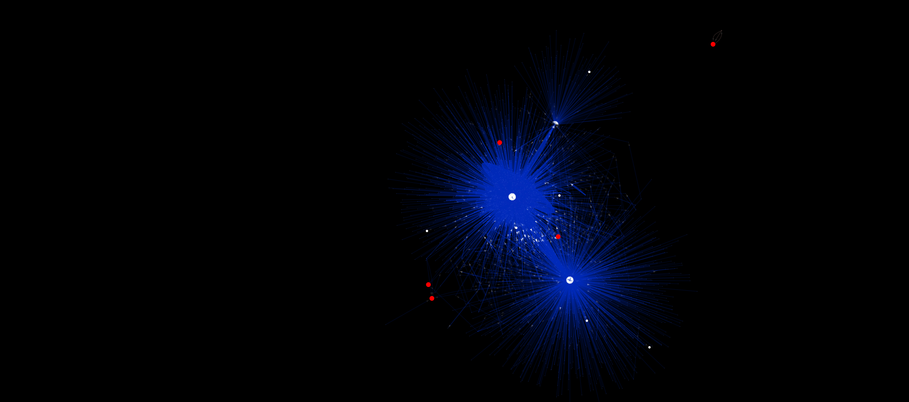

## Gnosis Token Auction's Bidders flow graph

#### Loading data and pre-processing


```scala
import org.apache.spark._
import org.apache.spark.graphx._
import org.apache.spark.rdd.RDD
import org.apache.spark.sql.SparkSession
import org.apache.spark.storage.StorageLevel
import org.apache.spark.sql.Row
import java.math.BigDecimal
import java.sql.Timestamp

import java.io._

val txs = spark.read.format("jdbc").option("url", "jdbc:postgresql://...").option("dbtable", "(select id, \"ethon__from\", \"ethon__to\", \"ethon__value\", \"_ethon__blockCreationTime\", \"_ethon__number\", \"ethon__creates\" from \"ethon__Txs\" where \"_ethon__number\" <= 3593309) as table1").option("user", "ethereumlive").option("password", "...").option("numPartitions", 100).option("partitionColumn", "id").option("lowerBound", 1).option("upperBound", 101).load(); 
txs.registerTempTable("txs");
txs.persist(StorageLevel.DISK_ONLY);
txs.count();

val contract_msgs = spark.read.format("jdbc").option("url", "jdbc:postgresql://...").option("dbtable", "(select id, \"ethon__from\", \"ethon__to\", \"ethon__value\", \"_ethon__blockCreationTime\", \"_ethon__number\", \"ethon__creates\" from \"ethon__ContractMsgs\" where \"_ethon__number\" <= 3593309) as table1").option("user", "ethereumlive").option("password", "...").option("numPartitions", 100).option("partitionColumn", "id").option("lowerBound", 1).option("upperBound", 101).load(); 
contract_msgs.registerTempTable("contract_msgs");
contract_msgs.persist(StorageLevel.DISK_ONLY);
contract_msgs.count();

val idAccts = spark.read.format("jdbc").option("url", "jdbc:postgresql://...").option("dbtable", "(select id, \"@id\" as acct from \"ethon__Accounts\") as table1").option("user", "ethereumlive").option("password", "...").option("numPartitions", 100).option("partitionColumn", "id").option("lowerBound", 1).option("upperBound", 101).load(); 
idAccts.registerTempTable("id_accts");
idAccts.persist(StorageLevel.DISK_ONLY);
idAccts.count();

val fromAccts = spark.sql("select ethon__from from txs")
fromAccts.persist(StorageLevel.DISK_ONLY)
fromAccts.count()
var fromIdAccts = fromAccts.join(idAccts, fromAccts.col("ethon__from") === idAccts.col("acct"), "inner")
fromIdAccts.registerTempTable("from_id_accts")
fromIdAccts.persist(StorageLevel.DISK_ONLY)
fromIdAccts.count()
fromIdAccts = spark.sql("select id, acct from from_id_accts")

val toAccts = spark.sql("select ifnull(ethon__to, ethon__creates) as ethon__to from txs")
toAccts.persist(StorageLevel.DISK_ONLY)
toAccts.count()
var toIdAccts = toAccts.join(idAccts, toAccts.col("ethon__to") === idAccts.col("acct"), "inner")
toIdAccts.registerTempTable("to_id_accts")
toIdAccts.persist(StorageLevel.DISK_ONLY)
toIdAccts.count()
toIdAccts = spark.sql("select id, acct from to_id_accts")

val allIdAccts = fromIdAccts.union(toIdAccts).distinct
allIdAccts.registerTempTable("all_id_accts")
allIdAccts.persist(StorageLevel.DISK_ONLY)
allIdAccts.count()

var formattedTxs = spark.sql("select ethon__from, ifnull(ethon__to, ethon__creates) as ethon__to, _ethon__blockCreationTime, ethon__value, _ethon__number from txs")
formattedTxs = formattedTxs.join(allIdAccts, formattedTxs.col("ethon__from") === allIdAccts.col("acct"), "inner").withColumnRenamed("id", "from_id").drop("acct")
formattedTxs = formattedTxs.join(allIdAccts, formattedTxs.col("ethon__to") === allIdAccts.col("acct"), "inner").withColumnRenamed("id", "to_id").drop("acct")
formattedTxs.count

var formattedContractMsgs = spark.sql("select ethon__from, ifnull(ethon__to, ethon__creates) as ethon__to, _ethon__blockCreationTime, ethon__value, _ethon__number from contract_msgs")
formattedContractMsgs = formattedContractMsgs.join(allIdAccts, formattedContractMsgs.col("ethon__from") === allIdAccts.col("acct"), "inner").withColumnRenamed("id", "from_id").drop("acct")
formattedContractMsgs = formattedContractMsgs.join(allIdAccts, formattedContractMsgs.col("ethon__to") === allIdAccts.col("acct"), "inner").withColumnRenamed("id", "to_id").drop("acct")
formattedContractMsgs.count()
```


```scala
val allAccts: RDD[(VertexId, String)] = allIdAccts.rdd.map(acctId => (acctId.getInt(0).longValue, acctId.getString(1)))
allAccts.persist(StorageLevel.DISK_ONLY)
allAccts.count()

val allFormattedEdges = formattedTxs.union(formattedContractMsgs)
allFormattedEdges.registerTempTable("all_edges")
allFormattedEdges.persist(StorageLevel.DISK_ONLY)
allFormattedEdges.count()

//case class Tx(value: Double, timestamp: Long, blockNumber: Long)
val edgesTx: RDD[Edge[(BigDecimal, Long, Long)]] = allFormattedEdges.distinct.rdd.map(tx => Edge(tx.getInt(5).longValue, tx.getInt(6).longValue, (tx.get(3).asInstanceOf[BigDecimal], tx.get(2).asInstanceOf[Timestamp].getTime()/1000, tx.getLong(4))))

edgesTx.persist(StorageLevel.DISK_ONLY)
edgesTx.count()

val graph: Graph[String, (BigDecimal, Long, Long)] = Graph(allAccts, edgesTx)
val triplets: RDD[EdgeTriplet[String, (BigDecimal, Long, Long)]] = graph.triplets
graph.vertices.count()
graph.edges.count()
graph.triplets.persist(StorageLevel.DISK_ONLY)
graph.triplets.count()
```


    75461


#### Retrieving bidder's information


```scala
// Filter the GNOSIS token auction 
val contractMsgs = spark.read.format("jdbc").option("url", "jdbc:postgresql://...").option("dbtable", "(select id, \"bidder\", \"ethon:number\" from \"Gnosis token auction bids\") as table1").option("user", "ethereumlive").option("password", "...").option("numPartitions", 10).option("partitionColumn", "\"ethon:number\"").option("lowerBound", "1").option("upperBound", "101").load(); 
contractMsgs.registerTempTable("contract_msgs");
contractMsgs.persist(StorageLevel.DISK_ONLY)
contractMsgs.count()
val gnosis_bidders = spark.sql("select distinct bidder from contract_msgs").collect().map(bidder => "http://ethereum.ethstats.io/Account_0x" + bidder(0))
```

### Pregel API definition for extracting the flow graph based on desired hops from sinks/sources


```scala
// Using Pregel API to generate the subgraph with source in one of the desired accounts
def vprog(vertexId: VertexId, value: (String, Boolean, Boolean), message: Boolean): 
    (String, Boolean, Boolean) = {

    if(message == true){
        (value._1, value._2, true)
    }
    else{
        value
    }
}

def sendMsgIn(triplet: EdgeTriplet[(String, Boolean, Boolean), (BigDecimal, Long, Long)]): 
    Iterator[(VertexId, Boolean)] = {
        val sourceVertex = triplet.srcAttr
        val destVertex = triplet.dstAttr
        
        if(sourceVertex._3 == false && destVertex._3 == true){
            Iterator((triplet.srcId, true))
        }
        else{
            Iterator.empty
        }
}

def mergeMsg(msg1: Boolean, msg2: Boolean): Boolean = {
    if(msg1 == true || msg2 == true){
        true
    }
    else{
        false
    }
}
```

### Extracting the 2nd and 3rd neighboorhood graphs fom bidders and their connected components


```scala
val modifiedBiddersGraph: Graph[(String, Boolean, Boolean), (BigDecimal, Long, Long)] = 
    graph.mapVertices((id, attr) => {
        if(gnosis_bidders.contains(attr)){
            (attr, true, true)
        }
        else{
            (attr, false, false)
        }
    });

modifiedBiddersGraph.vertices.filter{case(id, attr) => attr._3 == true}.count();
val flowBiddersGraph = modifiedBiddersGraph.pregel(false, 3, EdgeDirection.In)(vprog, sendMsgIn, mergeMsg).subgraph(vpred = (id, attr) => attr._3 == true)
val connComponents = flowBiddersGraph.connectedComponents
val connComponentsListVertices = connComponents.vertices.collect()
val mapVerticesConnComponent = connComponentsListVertices map (t => t._1 -> t._2) toMap
val graphBidderEdges = flowBiddersGraph.triplets.map(triplet => triplet.srcAttr._1 + "," + triplet.dstAttr._1 
+ "," + triplet.attr._3.toString + "," + mapVerticesConnComponent.get(triplet.srcId).get.toString + "," + 
mapVerticesConnComponent.get(triplet.dstId).get.toString + "," + triplet.srcAttr._2.toString 
                                                     + "," + triplet.dstAttr._2.toString).collect()
val pw = new PrintWriter(new File("..."))
graphBidderEdges.foreach(edge => pw.write(edge + "\n"))
pw.close

val flow2ndBiddersGraph = modifiedBiddersGraph.pregel(false, 2, EdgeDirection.In)(vprog, sendMsgIn, mergeMsg).subgraph(vpred = (id, attr) => attr._3 == true)
flow2ndBiddersGraph.vertices.count()

val conn2ndComponents = flow2ndBiddersGraph.connectedComponents
val conn2ndComponentsListVertices = conn2ndComponents.vertices.collect()
val mapVerticesConn2ndComponent = conn2ndComponentsListVertices map (t => t._1 -> t._2) toMap
val graph2ndBidderEdges = flow2ndBiddersGraph.triplets.map(triplet => triplet.srcAttr._1 + "," + triplet.dstAttr._1 
+ "," + triplet.attr._3.toString + "," + mapVerticesConn2ndComponent.get(triplet.srcId).get.toString + "," + 
mapVerticesConn2ndComponent.get(triplet.dstId).get.toString + "," + triplet.srcAttr._2.toString 
                                                     + "," + triplet.dstAttr._2.toString).collect()
val pw = new PrintWriter(new File("..."))
graph2ndBidderEdges.foreach(edge => pw.write(edge + "\n"))
pw.close
```


```scala
flow2ndBiddersGraph.edges.count()
```


    24842


### Visualization 

The figure bellow shows the flow graph where the sinks are some of the bidders extracted from the analysis, represented here as red dotted ones. For sake of visualization the edges where blurred and faded to show in special the nodes centred around the blue clouds. Those nodes represents some well-known exchange points such as *Kraken*, *Ethpool*, *Poloniex*, *Shapeshift*. 

The color of the edges represents each connected component, clearly it's possible to spot the blue connected component are made up specially by hubs nodes representing the aforementioned exchange wallets. 

According to the results, it was spotted 6 connected components from 15 identified bidders, meaning a couple of then were single nodes forests while another part belonged to this huge connected component and in specific a bidder interacting with another single one wallet. 



### Discussion

Based on the 2nd and 3rd hops flow graph sinking to some bidder's accounts we were able to identify a major connected component containing some of the most active exchange points. Some bidders might had interacted directly with the exchange wallets acquiring ETH before the GNOSIS token's auction took place. 

Initially the set of bidders is considered a forest, and along to the walking process when building the flow graph, there are merging of the flow connecting different points of the initial forest. 

Interestingly, the flow graph analysis thru Pregel API gives us enough flexibility to assess aspects of ETH flow, like further risk assessment of a party considering who are the bad counter parties in the graph and check out how those bad wallets tainted the desired account to be assessed. 

Bringing on light of the auction context, we can handle this flow graph to check out the degree of interation between of different bidders. This raises questions of how their strategies differs in terms of where they sit in the components. 

We intend to find out how topologically token rings parties interact between themselves and how the group gets in formation before play its role on an eventual auction. This will shed light on an interesting predicting problem of rings and related parties before any of their representative parties  perform actions on an eventual reported event. 
