```python
from pyspark.sql import SparkSession
from pyspark.storagelevel import StorageLevel 

spark = SparkSession\
    .builder\
    .appName("pending_tx_01_0408_18")\
    .master("spark://master:7077")\
    .getOrCreate()
spark._jsc.hadoopConfiguration().set('...', '...')
```


```python
from pyspark.sql.functions import udf,col
from pyspark.sql.types import LongType, DoubleType

get_minute = udf(lambda timestamp_received: timestamp_received - timestamp_received % 60, LongType())
fill_010818_null_diff = udf(lambda diff: diff if diff is not None else 1950.647, DoubleType())

tx_pool_status = spark.read.json("wasb://...") \
.withColumnRenamed("timestamp", "minute_timestamp")
tx_pool_status.persist(StorageLevel.DISK_ONLY)
tx_pool_status.registerTempTable("tx_pool_status")
tx_pool_status.count()

txs = spark.read.json("wasb://...") \
.withColumn("minute_timestamp", get_minute(col("timestamp_received"))) \
.withColumn("avg_daily_difficulty", fill_010818_null_diff(col("avg_daily_difficulty"))) \
.withColumn("queued_time", col("timestamp") - col("timestamp_received")) \
.withColumnRenamed("timestamp", "block_timestamp")
txs.persist(StorageLevel.DISK_ONLY)
txs.registerTempTable("txs")
txs.count()
```


    3777075


```python
joined_txs = txs.join(tx_pool_status, ["minute_timestamp"]).select("queued_time", "minute_timestamp", "avg_daily_difficulty", "block_number", "gas_price", "gas", "block_timestamp", "timestamp_received", "txpool_size", "value", "avg_gas_price", "std_gas_price")
joined_txs.registerTempTable("joined_txs")
joined_txs.count()
```


    3777075


```python
joined_txs.printSchema()
```

    root
     |-- queued_time: long (nullable = true)
     |-- minute_timestamp: long (nullable = true)
     |-- avg_daily_difficulty: double (nullable = true)
     |-- block_number: long (nullable = true)
     |-- gas_price: long (nullable = true)
     |-- gas: long (nullable = true)
     |-- block_timestamp: long (nullable = true)
     |-- timestamp_received: long (nullable = true)
     |-- txpool_size: long (nullable = true)
     |-- value: decimal(24,0) (nullable = true)
     |-- avg_gas_price: double (nullable = true)
     |-- std_gas_price: double (nullable = true)
    


```python
import pandas as pd

def _map_to_pandas(rdds):
    
    return [pd.DataFrame(list(rdds))]

def toPandas(df, n_partitions=None):

    if n_partitions is not None: df = df.repartition(n_partitions)
    df_pand = df.rdd.mapPartitions(_map_to_pandas).collect()
    df_pand = pd.concat(df_pand)
    df_pand.columns = df.columns
    return df_pand
```


```python
tx_df = toPandas(joined_txs, 100)
```


```python
tx_df = tx_df[tx_df['queued_time'] >= 0]
```


```python
#tx_df_X = tx_df[["avg_daily_difficulty", "gas_price", "gas", "txpool_size", "value", "avg_gas_price", "std_gas_price"]]
#tx_df_y = tx_df[["queued_time"]]
```


```python
import matplotlib.pyplot as plt
import seaborn as sns
%matplotlib inline
tx_df[["gas_price", "avg_gas_price"]].plot(kind="box", vert=False, title="Boxplot for gas price-related features", xlim=(0,220000000000))
```


    <matplotlib.axes._subplots.AxesSubplot at 0x7f5b48c8f6a0>


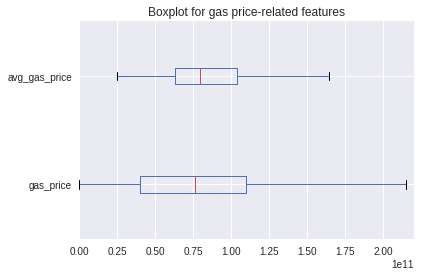


```python
tx_df[["txpool_size"]].plot(kind="box", vert=False, title="Boxplot for txpool size", xlim=(10000,40000))
```


    <matplotlib.axes._subplots.AxesSubplot at 0x7f5b48c62a20>


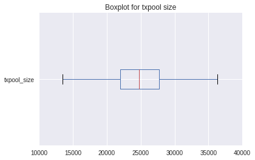


```python
tx_df[["queued_time"]].plot(kind="box", vert=False, title="Boxplot for queued time", xlim=(0,250))
```


    <matplotlib.axes._subplots.AxesSubplot at 0x7f5b45280048>


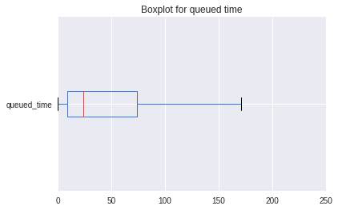


```python
tx_df[["avg_daily_difficulty"]].plot(kind="box", vert=False, title="Boxplot for network difficulty", xlim=(1700,2000))
```


    <matplotlib.axes._subplots.AxesSubplot at 0x7f5b1f4da6d8>


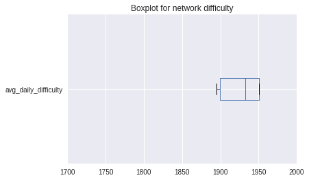


```python
import numpy as np

spearman_cor_df = tx_df[[column for column in filter(
            lambda column: column not in ['minute_timestamp', 'block_number', 'block_timestamp', 'timestamp_received'], 
            tx_df.columns)]].corr(method="spearman")
mask = np.zeros_like(spearman_cor_df, dtype=np.bool)
mask[np.triu_indices_from(mask)] = True

f, ax = plt.subplots(figsize=(11, 9))
cmap = sns.diverging_palette(220, 10, as_cmap=True)
sns.heatmap(spearman_cor_df, mask=mask, cmap=cmap,
            square=True, linewidths=.5, cbar_kws={"shrink": .5}, ax=ax)
```


    <matplotlib.axes._subplots.AxesSubplot at 0x7f5b20eda710>


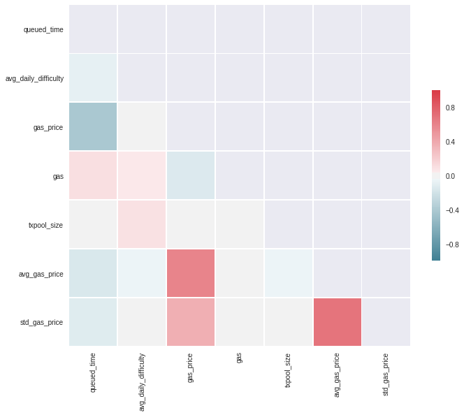


```python
rank_dict = {}
for feature_row in spearman_cor_df:
    for feature_col in spearman_cor_df:
        if feature_row != feature_col:
            if feature_row == "queued_time" or feature_col == "queued_time":
                rank_dict[','.join(sorted([feature_row, feature_col]))] = spearman_cor_df[feature_row][feature_col]

for w in sorted(rank_dict, key=rank_dict.get, reverse=True):
    print(w, rank_dict[w])
```

    gas,queued_time 0.103642641081
    queued_time,txpool_size -0.0198305354901
    avg_daily_difficulty,queued_time -0.0852150951825
    queued_time,std_gas_price -0.124243805141
    avg_gas_price,queued_time -0.150231824279
    gas_price,queued_time -0.411321591632


```python
idx = 0
columns = ["queued_time", "gas", "gas_price", "txpool_size", "avg_daily_difficulty", "std_gas_price", "avg_gas_price"]

def log_transform(df, columns_to_consider, c):
    df_log = df.copy()
    columns = df.columns
    for column in columns:
        if(column in columns_to_consider):
            df_log[column] = df[column].apply(lambda x: np.log10(np.abs(x) + c))
            
    return df_log

def scale_norm(df, columns_to_consider):
    df_norm = df.copy()
    columns = df.columns
    for column in columns:
        if(column in columns_to_consider):
            mean = df[column].mean()
            std = df[column].std()
            df_norm[column] = df[column].apply(lambda x: (x - mean) / std)
    
    return df_norm

c = 100.0
tx_df_log = log_transform(tx_df, columns, c)
tx_df_scaled = scale_norm(tx_df_log, columns)

while(idx < len(columns)):
    tx_df_scaled.ix[:,columns[idx:idx+4]].plot(kind="density", xlim=(-10,10))
    idx += 4
```


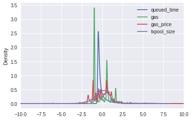


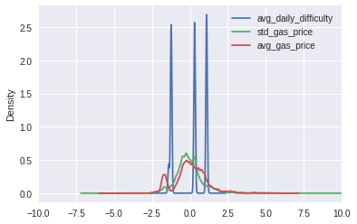


```python
import scipy

x = scipy.arange(min(tx_df.queued_time + 0.0001), max(tx_df.queued_time + 0.0001) + 3, 3)
h = plt.hist(tx_df.queued_time + 0.0001, color='w', cumulative=True, bins=np.arange(min(tx_df.queued_time + 0.0001), max(tx_df.queued_time + 0.0001), 3), normed=True)

dist_names = ['norm', 'lognorm', 'laplace', 'pareto']
for dist_name in dist_names:
    dist = getattr(scipy.stats, dist_name)
    param = dist.fit(tx_df.queued_time)
    pdf_fitted = dist.cdf(x, *param[:-2], loc=param[-2], scale=param[-1])
    plt.plot(pdf_fitted, label=dist_name)
    plt.xlim(0,60)
plt.legend(loc='lower right')
plt.xlabel("queued time T=t[seconds]")
plt.ylabel("probability(T <= t)")
plt.title("Curve fitting for Cumulative Distribution of queued time")
plt.show()
```

    /opt/conda/lib/python3.6/site-packages/scipy/stats/_distn_infrastructure.py:2303: RuntimeWarning: invalid value encountered in double_scalars
      Lhat = muhat - Shat*mu


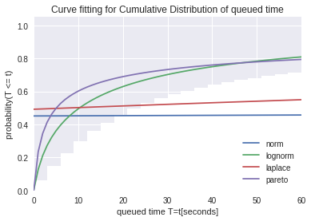


```python
from scipy import stats

fig = plt.figure()
ax1 = fig.add_subplot(211)
prob = stats.probplot(tx_df.queued_time + 100.0, dist=stats.norm, plot=ax1)
ax1.set_xlabel('')
ax1.set_title('Probplot against normal distribution')

ax2 = fig.add_subplot(212)
xt, lambda_val = stats.boxcox(tx_df.queued_time + 100.0)
prob = stats.probplot(xt, dist=stats.norm, plot=ax2)
ax2.set_title('Probplot after Box-Cox transformation')

plt.show()
```


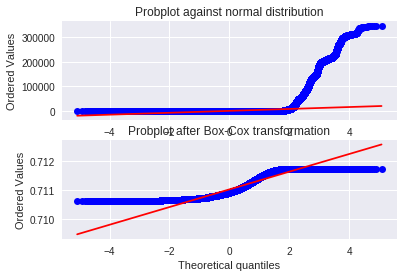


```python
from sklearn import preprocessing
from sklearn.model_selection import KFold
from sklearn.model_selection import cross_val_score
from sklearn import datasets, linear_model
from sklearn.metrics import mean_squared_error, r2_score
from sklearn.pipeline import Pipeline

log_transformer = preprocessing.FunctionTransformer(np.log1p)
scaler_md = preprocessing.StandardScaler()
regr = linear_model.LinearRegression()

pipe = Pipeline(steps = [("log", log_transformer), ("scaler", scaler_md), ("regr", regr)])

tx_df_sample = tx_df.sample(frac=.001, random_state=10)

tx_df_X = tx_df_sample[["avg_daily_difficulty", "gas_price", "gas", "txpool_size", "value", "avg_gas_price", "std_gas_price"]]
tx_df_y = scale_norm(log_transform(tx_df_sample[["queued_time"]], ["queued_time"], c = c), ["queued_time"])

kf = KFold(n_splits=10, shuffle=True)

results_r2 = cross_val_score(pipe, tx_df_X, tx_df_y, cv=kf, scoring = 'r2')
print(results_r2.mean())

results_error = cross_val_score(pipe, tx_df_X, tx_df_y, cv=kf, scoring = 'neg_mean_squared_error')
print(results_error.mean())
```

    0.242120570809
    -0.752495078596


```python
from sklearn.model_selection import GridSearchCV

ridge = linear_model.Ridge()
pipe_ridge = Pipeline(steps = [("log", log_transformer), ("scaler", scaler_md), ("ridge", ridge)])
parameters = {'ridge__alpha': [0.1, 0.5, 1.0, 10.0]}

grid_search = GridSearchCV(pipe_ridge, param_grid=parameters, cv=10, n_jobs=1, scoring='r2')
grid_search.fit(tx_df_X, tx_df_y)
print(grid_search.best_score_)

#results_ridge_r2 = cross_val_score(pipe_ridge, tx_df_X, tx_df_y, cv=kf, scoring = 'r2')
#print(results_ridge_r2.mean())

#results_ridge_error = cross_val_score(pipe_ridge, tx_df_X, tc_df_y, cv=kf, scoring = 'neg_mean_squared_error')
#print(results_ridge_error.mean())
```

    0.246418572058


```python
lasso = linear_model.Lasso()
pipe_lasso = Pipeline(steps = [("log", log_transformer), ("scaler", scaler_md), ("lasso", lasso)])
parameters = {'lasso__alpha': [0.1, 0.5, 1.0, 10.0]}

grid_search_lasso = GridSearchCV(pipe_lasso, param_grid=parameters, cv=10, n_jobs=1, scoring='r2')
grid_search_lasso.fit(tx_df_X, tx_df_y)
grid_search_lasso.best_score_
```


    0.20011735042498108


```python
%matplotlib inline
tx_df_log_sample = log_transform(tx_df_sample, columns, c)
tx_df_scaled_sample = scale_norm(tx_df_log_sample, columns)

idx = 0
while(idx < len(columns)):
    tx_df_scaled_sample.ix[:,columns[idx:idx+4]].plot(kind="density", xlim=(-10,10))
    idx += 4
```


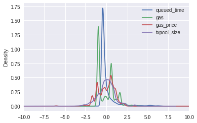


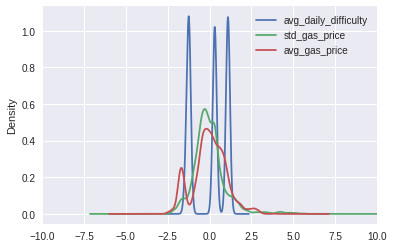


```python
from sklearn.preprocessing import PolynomialFeatures

poly = PolynomialFeatures()
regr = linear_model.LinearRegression()

pipe_poly_lin = Pipeline(steps = [("poly", poly), ("log", log_transformer), ("scaler", scaler_md), ("regr", regr)])

parameters_poly_lin = {'poly__degree': [2, 3, 4, 5]}

grid_search_poyi_lin = GridSearchCV(pipe_poly_lin, param_grid=parameters_poly_lin, cv=10, n_jobs=1, scoring='r2')
grid_search_poyi_lin.fit(tx_df_X, tx_df_y)
grid_search_poyi_lin.best_score_
```


    0.27396118971096134


```python
grid_search_poyi_lin.best_params_
```


    {'poly__degree': 2}


```python
# Class 1: til 10 seconds
# Class 2: between 11 - 20 seconds
# Class 3: between 21 - 30 seconds
# Class 4: between 31 - 40 seconds
# Class 5: between 41 - 50 seconds
# Class 6: between 51 - 60 seconds
# Class 7: more than 60 seconds

def generate_class(row):
    
    if(row['queued_time'] <= 10):
        return 1
    elif(row['queued_time'] <= 20):
        return 2
    elif(row['queued_time'] <= 30):
        return 3
    elif(row['queued_time'] <= 40):
        return 4
    elif(row['queued_time'] <= 50):
        return 5
    elif(row['queued_time'] <= 60):
        return 6
    else:
        return 7
    
tx_df_sample['class'] = tx_df_sample.apply(lambda row: generate_class(row), axis=1)
```


```python
tx_df_class = tx_df_sample[["class"]]
```


```python
tx_df_class.hist()
```


    array([[<matplotlib.axes._subplots.AxesSubplot object at 0x7f5b1e4ec048>]], dtype=object)


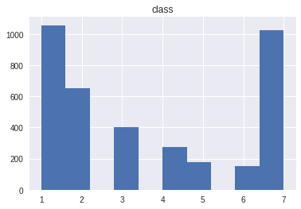


```python
from sklearn import svm

svc = svm.LinearSVC()

pipe_svc = Pipeline(steps=[("log", log_transformer), ("scaler", scaler_md), ("svc", svc)])

params_svc = {"svc__C": [0.1, 0.5, 1.0, 2.0, 5.0, 10.0, 15.0, 20.0]}

grid_search_svc = GridSearchCV(pipe_svc, param_grid=params_svc, cv=2, n_jobs=1, scoring='f1_micro')
grid_search_svc.fit(tx_df_X, tx_df_class.values.ravel())
grid_search_svc.best_score_
```


    0.41225254146602464


```python
grid_search_svc.predict(tx_df_X)
```


    array([1, 7, 1, ..., 1, 1, 7])


```python
grid_search_svc.best_params_
```


    {'svc__C': 10.0}


```python
from sklearn.neighbors import KNeighborsClassifier

knn = KNeighborsClassifier()

pipe_knn = Pipeline(steps=[("log", log_transformer), ("scaler", scaler_md), ("knn", knn)])

params_knn = {"knn__weights":["uniform", "distance"], "knn__p": [1,2], "knn__n_neighbors": [5,10,20,30,40,50,60,70,80,90,100]}

grid_search_knn = GridSearchCV(pipe_knn, param_grid=params_knn, cv=2, n_jobs=1, scoring='f1_micro')
grid_search_knn.fit(tx_df_X, tx_df_class.values.ravel())
grid_search_knn.best_params_
```


    {'knn__n_neighbors': 80, 'knn__p': 1, 'knn__weights': 'distance'}


```python
grid_search_knn.best_score_

```


    0.41118245050829322


```python
from sklearn.neighbors import KNeighborsRegressor

knn_regr = KNeighborsRegressor()

pipe_knn_regr = Pipeline(steps=[("log", log_transformer), ("scaler", scaler_md), ("knn", knn_regr)])

params_knn_regr = {"knn__weights":["uniform", "distance"], "knn__p": [1,2], "knn__n_neighbors": [5,10,20,30,40,50,60,70,80,90,100]}

grid_search_knn_regr = GridSearchCV(pipe_knn, param_grid=params_knn_regr, cv=2, n_jobs=1, scoring='f1_micro')
grid_search_knn_regr.fit(tx_df_X, tx_df_class.values.ravel())
grid_search_knn_regr.best_params_
```


    {'knn__n_neighbors': 80, 'knn__p': 1, 'knn__weights': 'distance'}


```python
grid_search_knn_regr.best_score_
```


    0.41118245050829322


```python
from sklearn.ensemble import RandomForestClassifier

forest = RandomForestClassifier()

pipe_forest = Pipeline(steps=[("log", log_transformer), ("scaler", scaler_md), ("forest", forest)])

params_forest = {"forest__n_estimators":[2, 3, 5, 7, 10, 15, 20, 25, 50, 75, 100]}

grid_search_forest = GridSearchCV(pipe_forest, param_grid=params_forest, cv=2, n_jobs=1, scoring='f1_micro')
grid_search_forest.fit(tx_df_X, tx_df_class.values.ravel())
grid_search_forest.best_params_
```


    {'forest__n_estimators': 100}


```python
grid_search_forest.best_score_
```


    0.39673622257891922


```python
from sklearn.ensemble import AdaBoostClassifier

ada = AdaBoostClassifier()

pipe_ada = Pipeline(steps=[("log", log_transformer), ("scaler", scaler_md), ("ada", ada)])

params_ada = {"ada__n_estimators": [50, 100, 150]}

grid_search_ada = GridSearchCV(pipe_ada, param_grid=params_ada, cv=2, n_jobs=1, scoring='f1_micro')
grid_search_ada.fit(tx_df_X, tx_df_class.values.ravel())
grid_search_ada.best_params_
```


    {'ada__n_estimators': 50}


```python
grid_search_ada.best_score_
```


    0.38362760834670945


```python
from sklearn.neural_network import MLPClassifier

nn = MLPClassifier()

pipe_nn = Pipeline(steps=[("nn", nn)])

params_nn = {"nn__activation": ["identity", "logistic", "tanh", "relu"], "nn__solver":["lbfgs", "sgd", "adam"], "nn__alpha":[0.0001, 0.001, 0.01], "nn__tol": [0.001], "nn__max_iter": [1000]}

grid_search_nn = GridSearchCV(pipe_nn, param_grid=params_nn, cv=2, n_jobs=1, scoring="f1_micro")
grid_search_nn.fit(tx_df_X, tx_df_class.values.ravel())
grid_search_nn.best_params_
```

    /opt/conda/lib/python3.6/site-packages/sklearn/neural_network/_base.py:91: RuntimeWarning: invalid value encountered in subtract
      tmp = X - X.max(axis=1)[:, np.newaxis]
    /opt/conda/lib/python3.6/site-packages/sklearn/neural_network/multilayer_perceptron.py:563: ConvergenceWarning: Stochastic Optimizer: Maximum iterations reached and the optimization hasn't converged yet.
      % (), ConvergenceWarning)
    /opt/conda/lib/python3.6/site-packages/sklearn/neural_network/_base.py:91: RuntimeWarning: invalid value encountered in subtract
      tmp = X - X.max(axis=1)[:, np.newaxis]
    /opt/conda/lib/python3.6/site-packages/sklearn/neural_network/multilayer_perceptron.py:563: ConvergenceWarning: Stochastic Optimizer: Maximum iterations reached and the optimization hasn't converged yet.
      % (), ConvergenceWarning)
    /opt/conda/lib/python3.6/site-packages/sklearn/neural_network/_base.py:91: RuntimeWarning: invalid value encountered in subtract
      tmp = X - X.max(axis=1)[:, np.newaxis]
    /opt/conda/lib/python3.6/site-packages/sklearn/neural_network/multilayer_perceptron.py:563: ConvergenceWarning: Stochastic Optimizer: Maximum iterations reached and the optimization hasn't converged yet.
      % (), ConvergenceWarning)
    /opt/conda/lib/python3.6/site-packages/sklearn/neural_network/_base.py:91: RuntimeWarning: invalid value encountered in subtract
      tmp = X - X.max(axis=1)[:, np.newaxis]
    /opt/conda/lib/python3.6/site-packages/sklearn/neural_network/multilayer_perceptron.py:563: ConvergenceWarning: Stochastic Optimizer: Maximum iterations reached and the optimization hasn't converged yet.
      % (), ConvergenceWarning)
    /opt/conda/lib/python3.6/site-packages/sklearn/neural_network/_base.py:91: RuntimeWarning: invalid value encountered in subtract
      tmp = X - X.max(axis=1)[:, np.newaxis]
    /opt/conda/lib/python3.6/site-packages/sklearn/neural_network/multilayer_perceptron.py:563: ConvergenceWarning: Stochastic Optimizer: Maximum iterations reached and the optimization hasn't converged yet.
      % (), ConvergenceWarning)
    /opt/conda/lib/python3.6/site-packages/sklearn/neural_network/_base.py:91: RuntimeWarning: invalid value encountered in subtract
      tmp = X - X.max(axis=1)[:, np.newaxis]
    /opt/conda/lib/python3.6/site-packages/sklearn/neural_network/multilayer_perceptron.py:563: ConvergenceWarning: Stochastic Optimizer: Maximum iterations reached and the optimization hasn't converged yet.
      % (), ConvergenceWarning)


    {'nn__activation': 'tanh',
     'nn__alpha': 0.0001,
     'nn__max_iter': 1000,
     'nn__solver': 'adam',
     'nn__tol': 0.001}


```python
grid_search_nn.best_score_
```


    0.32370251471375067


```python
nn_pred = grid_search_nn.predict(tx_df_X)
```


```python
from sklearn.metrics import classification_report

class_names = ["class1", "class2","class3","class4","class5","class6","class7"]
print(classification_report(tx_df_class.values.ravel(), nn_pred, target_names=class_names))
```

                 precision    recall  f1-score   support
    
         class1       0.29      0.90      0.44      1056
         class2       0.24      0.01      0.01       651
         class3       0.00      0.00      0.00       400
         class4       0.50      0.01      0.01       274
         class5       0.00      0.00      0.00       180
         class6       0.00      0.00      0.00       151
         class7       0.52      0.24      0.33      1026
    
    avg / total       0.30      0.32      0.22      3738
    


    /opt/conda/lib/python3.6/site-packages/sklearn/metrics/classification.py:1113: UndefinedMetricWarning: Precision and F-score are ill-defined and being set to 0.0 in labels with no predicted samples.
      'precision', 'predicted', average, warn_for)


```python
print(classification_report(tx_df_class.values.ravel(), grid_search_knn.predict(tx_df_X), target_names=class_names))
```

                 precision    recall  f1-score   support
    
         class1       1.00      1.00      1.00      1056
         class2       1.00      1.00      1.00       651
         class3       1.00      1.00      1.00       400
         class4       1.00      1.00      1.00       274
         class5       1.00      1.00      1.00       180
         class6       1.00      1.00      1.00       151
         class7       1.00      1.00      1.00      1026
    
    avg / total       1.00      1.00      1.00      3738
    


```python
print(grid_search_knn.predict(tx_df_X))
```

    [7 1 2 ..., 2 7 7]


```python
tx_df_class.values.ravel()
```


    array([7, 1, 2, ..., 2, 7, 7])


```python
print(classification_report(tx_df_class.values.ravel(), grid_search_knn.predict(tx_df_X), target_names=class_names))
```

                 precision    recall  f1-score   support
    
         class1       1.00      1.00      1.00      1056
         class2       1.00      1.00      1.00       651
         class3       1.00      1.00      1.00       400
         class4       1.00      1.00      1.00       274
         class5       1.00      1.00      1.00       180
         class6       1.00      1.00      1.00       151
         class7       1.00      1.00      1.00      1026
    
    avg / total       1.00      1.00      1.00      3738
    


```python
tx_df_test = tx_df.sample(frac=.001, random_state=9)
tx_df_test['class'] = tx_df_test.apply(lambda row: generate_class(row), axis=1)

tx_df_X_test = tx_df_test[["avg_daily_difficulty", "gas_price", "gas", "txpool_size", "value", "avg_gas_price", "std_gas_price"]]
tx_df_y_test = scale_norm(log_transform(tx_df_test[["queued_time"]], ["queued_time"], c = c), ["queued_time"])
tx_df_class_test = tx_df_test[["class"]]
```


```python
print(classification_report(tx_df_class_test.values.ravel(), grid_search_knn.predict(tx_df_X_test), target_names=class_names))
```

                 precision    recall  f1-score   support
    
         class1       0.36      0.71      0.48      1045
         class2       0.20      0.08      0.12       649
         class3       0.12      0.01      0.01       392
         class4       0.12      0.01      0.01       262
         class5       0.10      0.01      0.01       198
         class6       0.22      0.02      0.03       126
         class7       0.56      0.71      0.63      1066
    
    avg / total       0.33      0.42      0.34      3738
    


```python
def generate_class_2(row):
    
    if(row['queued_time'] <= 20):
        return 1
    elif(row['queued_time'] <= 60):
        return 2
    else:
        return 3
    
tx_df_sample['class2'] = tx_df_sample.apply(lambda row: generate_class_2(row), axis=1)
```


```python
tx_df_class2 = tx_df_sample[['class2']]
```


```python
tx_df_class2.hist()
```


    array([[<matplotlib.axes._subplots.AxesSubplot object at 0x7f5b1c0b4278>]], dtype=object)


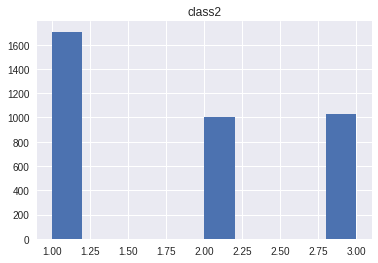


```python
grid_search_svc.fit(tx_df_X, tx_df_class2.values.ravel())
grid_search_svc.best_params_
```


    {'svc__C': 0.5}


```python
grid_search_svc.best_score_
```


    0.56875334403424294


```python
grid_search_knn.fit(tx_df_X, tx_df_class2.values.ravel())
grid_search_knn.best_params_
```


    {'knn__n_neighbors': 60, 'knn__p': 1, 'knn__weights': 'distance'}


```python
 grid_search_knn.best_score_
```


    0.55885500267522736


```python
grid_search_forest.fit(tx_df_X, tx_df_class2.values.ravel())
grid_search_forest.best_params_
```


    {'forest__n_estimators': 100}


```python
grid_search_forest.best_score_
```


    0.55484216158373467


```python
grid_search_ada.fit(tx_df_X, tx_df_class2.values.ravel())
grid_search_ada.best_params_
```


    {'ada__n_estimators': 50}


```python
grid_search_ada.best_score_
```


    0.5634028892455859


```python
grid_search_nn.fit(tx_df_X, tx_df_class2.values.ravel())

```

    /opt/conda/lib/python3.6/site-packages/sklearn/neural_network/_base.py:91: RuntimeWarning: overflow encountered in subtract
      tmp = X - X.max(axis=1)[:, np.newaxis]
    /opt/conda/lib/python3.6/site-packages/sklearn/neural_network/_base.py:91: RuntimeWarning: invalid value encountered in subtract
      tmp = X - X.max(axis=1)[:, np.newaxis]
    /opt/conda/lib/python3.6/site-packages/sklearn/neural_network/multilayer_perceptron.py:563: ConvergenceWarning: Stochastic Optimizer: Maximum iterations reached and the optimization hasn't converged yet.
      % (), ConvergenceWarning)
    /opt/conda/lib/python3.6/site-packages/sklearn/neural_network/_base.py:91: RuntimeWarning: overflow encountered in subtract
      tmp = X - X.max(axis=1)[:, np.newaxis]
    /opt/conda/lib/python3.6/site-packages/sklearn/neural_network/_base.py:91: RuntimeWarning: invalid value encountered in subtract
      tmp = X - X.max(axis=1)[:, np.newaxis]
    /opt/conda/lib/python3.6/site-packages/sklearn/neural_network/multilayer_perceptron.py:563: ConvergenceWarning: Stochastic Optimizer: Maximum iterations reached and the optimization hasn't converged yet.
      % (), ConvergenceWarning)
    /opt/conda/lib/python3.6/site-packages/sklearn/neural_network/_base.py:91: RuntimeWarning: invalid value encountered in subtract
      tmp = X - X.max(axis=1)[:, np.newaxis]
    /opt/conda/lib/python3.6/site-packages/sklearn/neural_network/multilayer_perceptron.py:563: ConvergenceWarning: Stochastic Optimizer: Maximum iterations reached and the optimization hasn't converged yet.
      % (), ConvergenceWarning)
    /opt/conda/lib/python3.6/site-packages/sklearn/neural_network/_base.py:91: RuntimeWarning: invalid value encountered in subtract
      tmp = X - X.max(axis=1)[:, np.newaxis]
    /opt/conda/lib/python3.6/site-packages/sklearn/neural_network/multilayer_perceptron.py:563: ConvergenceWarning: Stochastic Optimizer: Maximum iterations reached and the optimization hasn't converged yet.
      % (), ConvergenceWarning)
    /opt/conda/lib/python3.6/site-packages/sklearn/neural_network/_base.py:91: RuntimeWarning: invalid value encountered in subtract
      tmp = X - X.max(axis=1)[:, np.newaxis]
    /opt/conda/lib/python3.6/site-packages/sklearn/neural_network/multilayer_perceptron.py:563: ConvergenceWarning: Stochastic Optimizer: Maximum iterations reached and the optimization hasn't converged yet.
      % (), ConvergenceWarning)
    /opt/conda/lib/python3.6/site-packages/sklearn/neural_network/_base.py:91: RuntimeWarning: invalid value encountered in subtract
      tmp = X - X.max(axis=1)[:, np.newaxis]
    /opt/conda/lib/python3.6/site-packages/sklearn/neural_network/multilayer_perceptron.py:563: ConvergenceWarning: Stochastic Optimizer: Maximum iterations reached and the optimization hasn't converged yet.
      % (), ConvergenceWarning)


    GridSearchCV(cv=2, error_score='raise',
           estimator=Pipeline(steps=[('nn', MLPClassifier(activation='relu', alpha=0.0001, batch_size='auto', beta_1=0.9,
           beta_2=0.999, early_stopping=False, epsilon=1e-08,
           hidden_layer_sizes=(100,), learning_rate='constant',
           learning_rate_init=0.001, max_iter=200, momentum=0.9,
           nesterovs_momentum=True, power_t=0.5, random_state=None,
           shuffle=True, solver='adam', tol=0.0001, validation_fraction=0.1,
           verbose=False, warm_start=False))]),
           fit_params={}, iid=True, n_jobs=1,
           param_grid={'nn__activation': ['identity', 'logistic', 'tanh', 'relu'], 'nn__solver': ['lbfgs', 'sgd', 'adam'], 'nn__alpha': [0.0001, 0.001, 0.01], 'nn__tol': [0.001], 'nn__max_iter': [1000]},
           pre_dispatch='2*n_jobs', refit=True, return_train_score=True,
           scoring='f1_micro', verbose=0)


```python
grid_search_nn.best_params_
```


    {'nn__activation': 'logistic',
     'nn__alpha': 0.0001,
     'nn__max_iter': 1000,
     'nn__solver': 'sgd',
     'nn__tol': 0.001}


```python
grid_search_nn.best_score_
```


    0.48689138576779029


