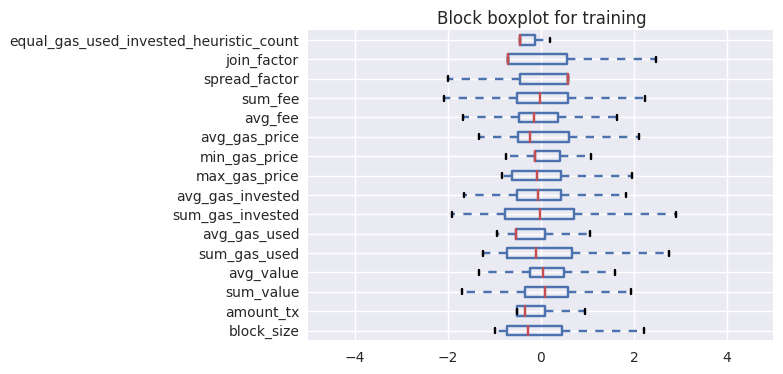

## Introduction

 [A reported](https://www.bokconsulting.com.au/blog/ethereum-network-attackers-ip-address-is-traceable/) addressed a couple of attacks against Ethereum network, ranging from DOS to creation of a mass of empty accounts, triggered fundamentaly by malicious contracts.
 
 The present work intends to experiment 2 lowest cost Anomaly Detection models to spot anomalous transactions and blocks as an indicative of such attacks being performed against the Ethereum network. The retrieved pieces of information considers the network's dynamics, such as value of transactions, fees paid, gas used and spent to run contracts, aggregated low cost information per blocks such as statistic average of fees, price of gas across transactions in a block and amount of gas invested and used, in average, for transctions spotted in a block as some examples of metrics defined.

## Methodology

The data for experiments were extracted from native data of Ethereum's blockchain, and contains information of transactions and blocks confirmed to the main chain. The data were extracted by a simple crawler that requested information from a local Ethereum go client JSON-RPC API. Al the data for the experiments where pulled to blob files where a spark cluster runs on the database for batch processing.

Each transaction and block are modelled as vectors of features. Each feature is understood as a measurement of an aspect from that entity. Each transaction contains atomic features in respect of its state(exrtacted in a straightforward way to our experiment environment). On the other hand, some aggregations were performed in order to extract block features grouping transactions per block number.

For sake of consistency, it was followed the best practices of Machine Learning: it was built the sets of training, model validation and testing for both transaction and block entities. Each anomaly detection model was trained using the knowledge available at the training set, validated on our validation set for model parameter selection and then the selected model is tested against the test fold to check how the model would perform with unseen data.

Both validation and test assemments take in account the ROC curve where is possible to match precision against recall for the anomaly detection algorithm. These two criteria lead us to base ou decision on the best compromise between predicting correctly at some cost of false positives.

## Features

For transactions the features used were:

* _fee_
* _value_
* _gas invested_
* _gas used_ 
* _price of the gas_

For blocks the features used were:

* _amount of transactions where the gas used is equals the gas invested_
* _amount of transactions_
* _sum of values_
* _average of values_
* _sum of gas used_
* _average of gas used_
* _sum of gas invested_
* _average of gas invested_
* _average of the price of gas_ 
* _max price of gas_
* _min price of gas_
* _sum of fees_
* _average of fees_
* _spread factor_
* _join factor_

## Contracts and reported attacks

There are ilustrated bellow some cases of diferent attacks and pointed out the contracts related with them.

### DOS reported attack #1


According to the [reported analysis](https://www.reddit.com/r/ethereum/comments/544y1p/some_blockchain_analysis_of_the_current_dos/) we are able to collect a bunch of blocks where this DOS attack-related transactions where mined to.

Contract [0xd6a64D7E8C8A94fa5068ca33229D88436A743B14](https://etherscan.io/address/0xd6a64d7e8c8a94fa5068ca33229d88436a743b14) and its apparent copied contract [0x0c40cF6dd1B74c6eDfC4729021A11f57B31e3c27](https://etherscan.io/address/0x0c40cf6dd1b74c6edfc4729021a11f57b31e3c27) were reported to be associated with the DOS attack and promoting delay in txs mining after 1 hour from the beginning of the attack. 

### Memory Crash attack #2

The contract [0xb284e6a25d0972f9a92fec45d2075067db2d49b0](https://etherscan.io/address/0xb284e6a25d0972f9a92fec45d2075067db2d49b0) was reported to contain code that compromised nodes and caused memory crash.

### SUICIDE and CREATE code bloating contract #3

The attacker sent low cost transactions to create many millions of empty accounts on the blockchain, slowing down the processing of the Ethereum node clients.

The contract [0x6a0a0fc761c612c340a0e98d33b37a75e5268472](https://etherscan.io/address/0x6a0a0fc761c612c340a0e98d33b37a75e5268472) is the one that created the empty **SUICIDE** accounts,while the contract [0x7c20218efc2e07c8fe2532ff860d4a5d8287cb31](https://etherscan.io/address/0x7c20218efc2e07c8fe2532ff860d4a5d8287cb31) created the empty **CREATE** accounts.

### Second Wave of Attacks #4

It was [reported](https://www.reddit.com/r/ethereum/comments/589l6b/lol_i_think_its_another_attack_contract_burns/), a new wave of attacks was triggered less than a day after the Gas Reprice fork involving the contracts [0xbd37ee00e47c0fe0def80bd95c498698b4a15235](https://etherscan.io/address/0xbd37ee00e47c0fe0def80bd95c498698b4a15235) and [0xb6389d6575966f946e190b9d538c3259857ed2c7](https://etherscan.io/address/0xb6389d6575966f946e190b9d538c3259857ed2c7)

## Data retrieval: Transactions and blocks


```pyspark
import pyspark
from pyspark import SparkConf
from pyspark import SparkContext
from pyspark.sql import SQLContext
import matplotlib
matplotlib.rcParams['backend'] = "Qt5Agg"
import matplotlib.pyplot as plt
from pyspark.sql import functions as F
from pyspark.sql import Row
from pyspark.sql.types import *
import atexit
from numpy import array
import numpy as np
import datetime

txs = sqlContext.read.json("wasb://taka-data@infuratakastorage.blob.core.windows.net/txs/*.json")
blocks = sqlContext.read.json("wasb://taka-data@infuratakastorage.blob.core.windows.net/blocks/*.json")

#Create fee column
txs = txs.withColumn('fee', txs.decGas * txs.decGasPrice)
block_activity = txs.groupBy('decBlockNumber')\
.agg(\
     F.count(F.when(txs.decGasUsed == txs.decGas, 1)).alias('equal_gas_used_invested_heuristic_count'), \
     F.count(F.when(F.col('contractCreated').isNotNull(), 1)).alias('amount_contract_creation'), \
     F.count('*').alias('amount_tx'), \
     F.sum('decValue').alias('sum_value'), \
     F.avg('decValue').alias('avg_value'), \
     F.stddev('decValue').alias('std_value'), \
     F.sum('decGasUsed').alias('sum_gas_used'), \
     F.avg('decGasUsed').alias('avg_gas_used'), \
     F.stddev('decGasUsed').alias('std_gas_used'), \
     F.sum('decGas').alias('sum_gas_invested'), \
     F.avg('decGas').alias('avg_gas_invested'), \
     F.stddev('decGas').alias('std_gas_invested'), \
     F.max('decGasPrice').alias('max_gas_price'), \
     F.min('decGasPrice').alias('min_gas_price'), \
     F.avg('decGasPrice').alias('avg_gas_price'), \
     F.avg('fee').alias('avg_fee'), \
     F.sum('fee').alias('sum_fee'), \
     F.stddev('fee').alias('std_fee'), \
     F.stddev('decGasPrice').alias('std_gas_price'), \
     F.countDistinct('to').alias('spread_factor'), \
     F.countDistinct('from').alias('join_factor')\
    )\
.withColumnRenamed('decBlockNumber', 'block_number')

blocks = blocks.drop('hash').drop('number').drop('parent_hash').drop('miner').drop('difficulty')\
.drop('gas_limit').drop('gas_used').drop('size')\
.withColumnRenamed('decDifficulty', 'difficulty').withColumnRenamed('decGasLimit', 'gas-limit')\
.withColumnRenamed('decGasUsed', 'gas-used').withColumnRenamed('decNumber', 'number')\
.withColumnRenamed('decSize', 'size')

txs = txs.drop('blockHash').drop('index').drop('contractCreated').drop('value')\
.drop('gas').drop('gasPrice').drop('input').drop('gasUsed').drop('blockNumber')\
.withColumnRenamed('decValue', 'value').withColumnRenamed('decGas', 'gas')\
.withColumnRenamed('decBlockNumber', 'block-number').withColumnRenamed('decGasPrice', 'gas-price')\
.withColumnRenamed('decGasUsed', 'gas-used')

txs.cache()
txs.count()
blocks.cache()
blocks.count()
block_activity.cache()
block_activity.count()

block_activity.registerTempTable('block_activity')
blocks.registerTempTable('blocks')
txs.registerTempTable('txs')
```


```pyspark
block_activity_modified = spark.sql(
"select blocks.number as block_number," +
"blocks.size as block_size,"+
"ifnull(block_activity.amount_tx, 0) as amount_tx,"+
"ifnull(block_activity.sum_value, 0) as sum_value,"+
"ifnull(block_activity.avg_value, 0) as avg_value,"+
"ifnull(block_activity.sum_gas_used, 0) as sum_gas_used,"+
"ifnull(block_activity.avg_gas_used, 0) as avg_gas_used,"+
"ifnull(block_activity.sum_gas_invested, 0) as sum_gas_invested,"+
"ifnull(block_activity.avg_gas_invested, 0) as avg_gas_invested,"+
"ifnull(block_activity.max_gas_price, 0) as max_gas_price,"+
"ifnull(block_activity.min_gas_price, 0) as min_gas_price,"+
"ifnull(block_activity.avg_gas_price, 0) as avg_gas_price,"+
"ifnull(block_activity.avg_fee, 0) as avg_fee,"+
"ifnull(block_activity.sum_fee, 0) as sum_fee,"+
"ifnull(1.0 - ((ifnull(block_activity.amount_tx, 0) - "+
    "ifnull(block_activity.spread_factor, 0))/ifnull(block_activity.amount_tx, 0)), 0) as spread_factor,"+
"ifnull((ifnull(block_activity.amount_tx, 0) - "+
    "ifnull(block_activity.join_factor, 0))/ifnull(block_activity.amount_tx, 0), 0) as join_factor,"+
"ifnull(block_activity.equal_gas_used_invested_heuristic_count, 0) as equal_gas_used_invested_heuristic_count "+
"from blocks left outer join block_activity on blocks.number = block_activity.block_number where amount_tx > 0"
)

block_activity_modified.cache()
block_activity_modified.count()
block_activity_modified.registerTempTable("global_block_activity")
```

## Building training, validation and test folds for blocks


```pyspark
attack_tainted_block_activity = spark.sql("select *, 1 as label from global_block_activity where block_number in "
                                          +"(select distinct `block-number` from txs "
                                          +"where to == '0xd6a64d7e8c8a94fa5068ca33229d88436a743b14' "
                                          +"or to == '0x0c40cf6dd1b74c6edfc4729021a11f57b31e3c27' "
                                          +"or to == '0xb284e6a25d0972f9a92fec45d2075067db2d49b0' "
                                          +"or to == '0x6a0a0fc761c612c340a0e98d33b37a75e5268472' "
                                          +"or to == '0x7c20218efc2e07c8fe2532ff860d4a5d8287cb31' "
                                          +"or to == '0xbd37ee00e47c0fe0def80bd95c498698b4a15235' "
                                          +"or to == '0xb6389d6575966f946e190b9d538c3259857ed2c7')")
not_attack_tainted_block_activity = spark.sql("select *, 0 as label from global_block_activity where block_number in"
                                              +" (select distinct `block-number` from txs where "
                                              +"to != '0xd6a64d7e8c8a94fa5068ca33229d88436a743b14' "
                                              +"and to != '0x0c40cf6dd1b74c6edfc4729021a11f57b31e3c27' "
                                              +"and to != '0xb284e6a25d0972f9a92fec45d2075067db2d49b0' "
                                              +"and to != '0x6a0a0fc761c612c340a0e98d33b37a75e5268472' "
                                              +"and to != '0x7c20218efc2e07c8fe2532ff860d4a5d8287cb31' "
                                              +"and to != '0xbd37ee00e47c0fe0def80bd95c498698b4a15235' "
                                              +"and to != '0xb6389d6575966f946e190b9d538c3259857ed2c7')")
count_tainted_blocks = spark.sql("select `block-number`, count(*) tainted_txs from txs where "
                                 +"to == '0xd6a64d7e8c8a94fa5068ca33229d88436a743b14' "
                                 +"or to == '0x0c40cf6dd1b74c6edfc4729021a11f57b31e3c27' "
                                 +"or to == '0xb284e6a25d0972f9a92fec45d2075067db2d49b0' "
                                 +"or to == '0x6a0a0fc761c612c340a0e98d33b37a75e5268472' "
                                 +"or to == '0x7c20218efc2e07c8fe2532ff860d4a5d8287cb31' "
                                 +"or to == '0xbd37ee00e47c0fe0def80bd95c498698b4a15235' "
                                 +"or to == '0xb6389d6575966f946e190b9d538c3259857ed2c7' "
                                 +"group by `block-number` order by tainted_txs desc")
attack_tainted_block_activity.cache()
attack_tainted_block_activity.count()
attack_tainted_block_activity.registerTempTable("tainted_block_activity")
not_attack_tainted_block_activity.cache()
not_attack_tainted_block_activity.count()
not_attack_tainted_block_activity.registerTempTable("not_tainted_block_activity")
count_tainted_blocks.cache()
count_tainted_blocks.count()
count_tainted_blocks.registerTempTable("tainted_blocks_df")
```


```pyspark
block_activity_training = spark.sql("select * from not_tainted_block_activity order by rand() limit 6000")
block_activity_training.cache()
block_activity_training.count()
block_activity_training.registerTempTable("training_block_activity")
block_activity_validation = spark.sql("select * from not_tainted_block_activity order by rand() limit 2000").unionAll(
    spark.sql("select * from tainted_block_activity where block_number in "
              +"(select `block-number` from tainted_blocks_df limit 500) order by rand() limit 10"))
block_activity_validation.cache()
block_activity_validation.count()
block_activity_validation.registerTempTable("validation_block_activity")
block_activity_test = spark.sql("select * from not_tainted_block_activity order by rand() limit 2000").unionAll(
    spark.sql("select * from tainted_block_activity where block_number in "
              +"(select `block-number` from tainted_blocks_df limit 500) order by rand() limit 10"))
block_activity_test.cache()
block_activity_test.count()
block_activity_test.registerTempTable("test_block_activity")
```


```pyspark
%%sql -q -o df_training -n -1
select * from training_block_activity
```


```pyspark
%%sql -q -o df_validation -n -1
select * from validation_block_activity
```


```pyspark
%%sql -q -o df_test -n -1
select * from test_block_activity
```

## Building training, validation and test folds for transactions


```pyspark
attack_txs = spark.sql("select *, 1 as label from txs where to == '0xd6a64d7e8c8a94fa5068ca33229d88436a743b14' "
                       +"or to == '0x0c40cf6dd1b74c6edfc4729021a11f57b31e3c27' "
                       +"or to == '0xb284e6a25d0972f9a92fec45d2075067db2d49b0' "
                       +"or to == '0x6a0a0fc761c612c340a0e98d33b37a75e5268472' "
                       +"or to == '0x7c20218efc2e07c8fe2532ff860d4a5d8287cb31' "
                       +"or to == '0xbd37ee00e47c0fe0def80bd95c498698b4a15235' "
                       +"or to == '0xb6389d6575966f946e190b9d538c3259857ed2c7'")
attack_txs.cache()
attack_txs.count()
attack_txs.registerTempTable("attack_txs")
normal_txs = spark.sql("select *, 0 as label from txs where to != '0xd6a64d7e8c8a94fa5068ca33229d88436a743b14' "
                       +"and to != '0x0c40cf6dd1b74c6edfc4729021a11f57b31e3c27' "
                       +"and to != '0xb284e6a25d0972f9a92fec45d2075067db2d49b0' "
                       +"and to != '0x6a0a0fc761c612c340a0e98d33b37a75e5268472' "
                       +"and to != '0x7c20218efc2e07c8fe2532ff860d4a5d8287cb31' "
                       +"and to != '0xbd37ee00e47c0fe0def80bd95c498698b4a15235' "
                       +"and to != '0xb6389d6575966f946e190b9d538c3259857ed2c7'")
normal_txs.cache()
normal_txs.count()
normal_txs.registerTempTable("normal_txs")
```


```pyspark
txs_training = spark.sql("select * from normal_txs order by rand() limit 6000")
txs_training.cache()
txs_training.count()
txs_training.registerTempTable("txs_training")
txs_validation = spark.sql("select * from normal_txs order by rand() limit 2000").unionAll(
    spark.sql("select * from attack_txs order by rand() limit 10"))
txs_validation.cache()
txs_validation.count()
txs_validation.registerTempTable("txs_validation")
txs_test = spark.sql("select * from normal_txs order by rand() limit 2000").unionAll(
    spark.sql("select * from attack_txs order by rand() limit 10"))
txs_test.cache()
txs_test.count()
txs_test.registerTempTable("txs_test")
```


```pyspark
%%sql -q -o df_tx_training -n -1
select * from txs_training
```


```pyspark
%%sql -q -o df_tx_validation -n -1
select * from txs_validation
```


```pyspark
%%sql -q -o df_tx_test -n -1
select * from txs_test
```

## Feature transformation

Applying _log_ to every feature, shifting to 100.0 is the heuristic used to approximate each feature to a normal distribution with mean 0.0 and standard deviation of 1.0


```pyspark
%%local
import numpy as np

def projecting_numeric_df(df_del):
    del df_del['block_number']

def log_transform(df, excluded_columns, c):
    columns = df.columns
    for column in columns:
        if(column not in excluded_columns):
            df[column] = df[column].apply(lambda x: np.log10(np.abs(x) + c))
            
    return df

def scale_norm(df, excluded_columns):
    columns = df.columns
    for column in columns:
        if(column not in excluded_columns):
            mean = df[column].mean()
            std = df[column].std()
            df[column] = df[column].apply(lambda x: (x - mean) / std)
    
    return df
    
#Function useful for feature scaling
c = 100.0 # 1.0 is the default. Change c to get the right transformation. Especialy when you have long tails

df_training_log = log_transform(df_training, ['label', 'block_number'], c)
df_validation_log = log_transform(df_validation, ['label', 'block_number'], c)
df_test_log = log_transform(df_test, ['label', 'block_number'], c)
df_training_transformed = scale_norm(df_training_log, ['label', 'block_number'])
df_validation_transformed = scale_norm(df_validation_log, ['label', 'block_number'])
df_test_transformed = scale_norm(df_test_log, ['label', 'block_number'])

df_tx_training_log = log_transform(df_tx_training, ['label', 'block-number', 'to', 'timestamp', 'from', 'hash'], c)
df_tx_validation_log = log_transform(df_tx_validation, ['label', 'block-number', 'to', 'timestamp', 'from', 'hash'], c)
df_tx_test_log = log_transform(df_tx_test, ['label', 'block-number', 'to', 'timestamp', 'from', 'hash'], c)
df_tx_training_transformed = scale_norm(df_tx_training_log, 
                                        ['label', 'block-number', 'to', 'timestamp', 'from', 'hash'])
df_tx_validation_transformed = scale_norm(df_tx_validation_log,
                                          ['label', 'block-number', 'to', 'timestamp', 'from', 'hash'])
df_tx_test_transformed = scale_norm(df_tx_test_log, ['label', 'block-number', 'to', 'timestamp', 'from', 'hash'])
```

## Transaction features distribution for each fold built


```pyspark
%%local
%matplotlib inline
df_tx_training_transformed[[column for column in filter(
            lambda column: column not in ['label', 'block-number', 'to', 'timestamp', 'from', 'hash'], 
            df_tx_training_transformed.columns)]].plot(
    kind="box", vert=False, xlim=(-10, 10), title="Transaction boxplot for training")
df_tx_validation_transformed[[column for column in filter(
            lambda column: column not in ['label', 'block-number', 'to', 'timestamp', 'from', 'hash'],
            df_tx_training_transformed.columns)]].plot(
    kind="box", vert=False, xlim=(-10, 10), title="Transaction boxplot for validation")
df_tx_test_transformed[[column for column in filter(
            lambda column: column not in ['label', 'block-number', 'to', 'timestamp', 'from', 'hash'], 
            df_tx_training_transformed.columns)]].plot(
    kind="box", vert=False, xlim=(-10, 10), title="Transaction boxplot for testing")

idx = 0
columns = []
excluded_columns = ['label', 'block-number', 'to', 'timestamp', 'from', 'hash']
for column in df_tx_training_transformed.columns:
    if(column not in excluded_columns):
        columns.append(column)

while(idx < len(columns)):
    df_tx_training_transformed.ix[:,columns[idx:idx+4]].plot(kind="density", xlim=(-10,10))
    idx += 4
```


## Block features distributions for each fold built


```pyspark
%%local
%matplotlib inline
df_training_transformed[[column for column in filter(
            lambda column: column not in ['label', 'block_number'],
            df_training_transformed.columns)]].plot(
    kind="box", vert=False, xlim=(-5, 5), title="Block boxplot for training")
df_validation_transformed[[column for column in filter(
            lambda column: column not in ['label', 'block_number'], 
            df_training_transformed.columns)]].plot(
    kind="box", vert=False, xlim=(-5, 5), title="Block boxplot for validation")
df_test_transformed[[column for column in filter(
            lambda column: column not in ['label', 'block_number'],
            df_training_transformed.columns)]].plot(
    kind="box", vert=False, xlim=(-5, 5), title="Block boxplot for testing")

idx = 0
columns = []
excluded_columns = ['block_number', 'label']
for column in df_training_transformed.columns:
    if(column not in excluded_columns):
        columns.append(column)

while(idx < len(columns)):
    df_training_transformed.ix[:,columns[idx:idx+4]].plot(kind="density", xlim=(-10,10))
    idx += 4
```





## Dimensionality reduction

Studying what features are hight positive or negative correlated is a necessary step to eliminate redundancy when feeding the models, besides minimizing unecessary costs.


```pyspark
%%local
import matplotlib.pyplot as plt
import seaborn as sns
%matplotlib inline
spearman_cor_tx_df = df_tx_training_transformed[[column for column in filter(
            lambda column: column not in ['label', 'block-number', 'to', 'timestamp', 'from', 'hash'], 
            df_tx_training_transformed.columns)]].corr(method="spearman")
mask_tx = np.zeros_like(spearman_cor_tx_df, dtype=np.bool)
mask_tx[np.triu_indices_from(mask_tx)] = True

f, ax = plt.subplots(figsize=(11, 9))
cmap = sns.diverging_palette(220, 10, as_cmap=True)
sns.heatmap(spearman_cor_tx_df, mask=mask_tx, cmap=cmap,
            square=True, linewidths=.5, cbar_kws={"shrink": .5}, ax=ax)

spearman_cor_df = df_training_transformed[[column for column in filter(
            lambda column: column not in ['label', 'block_number'], 
            df_training_transformed.columns)]].corr(method="spearman")
mask = np.zeros_like(spearman_cor_df, dtype=np.bool)
mask[np.triu_indices_from(mask)] = True

f, ax = plt.subplots(figsize=(11, 9))
cmap = sns.diverging_palette(220, 10, as_cmap=True)
sns.heatmap(spearman_cor_df, mask=mask, cmap=cmap,
            square=True, linewidths=.5, cbar_kws={"shrink": .5}, ax=ax)
```


    <matplotlib.axes._subplots.AxesSubplot at 0x7f012bc1c410>


```pyspark
%%local
# Get rank of features pairs strongly correlated (corr value >= .9)
rank_dict = {}
for feature_row in spearman_cor_df:
    for feature_col in spearman_cor_df:
        if feature_row != feature_col:
            if spearman_cor_df[feature_row][feature_col] >= 0.9 or spearman_cor_df[feature_row][feature_col] <= -0.9:
                rank_dict[','.join(sorted([feature_row, feature_col]))] = spearman_cor_df[feature_row][feature_col]

for w in sorted(rank_dict, key=rank_dict.get, reverse=True):
    print w, rank_dict[w]
```

    sum_fee,sum_gas_invested 0.937834129268
    avg_gas_price,max_gas_price 0.93404426278
    block_size,sum_gas_used 0.915184988121


```pyspark
%%local
del df_training_transformed['sum_fee']
del df_training_transformed['avg_gas_price']
del df_training_transformed['sum_gas_used']

del df_validation_transformed['sum_fee']
del df_validation_transformed['avg_gas_price']
del df_validation_transformed['sum_gas_used']

del df_test_transformed['sum_fee']
del df_test_transformed['avg_gas_price']
del df_test_transformed['sum_gas_used']
```

## Anomaly detection models

Here we make experiments using 2 well known state-of-art models for anomaly detection problem: _Multivaritate independent and dependent gaussian mixture_ models.

It's applied these 2 models to spot anomalous transactions and blocks based on the reported attacks and considering how the training, validation and testing folds were built.


```pyspark
%%local
import math
from numpy.linalg import inv

#Normal distribution
def gaussian(x, mu, sigma):
    return 1./(math.sqrt(2*math.pi)*sigma)*np.exp(-np.power((x - mu)/(math.sqrt(2)*sigma),2))

def diag_product_Matrix(A,B):
    diagonal = []
    for i in range(A.shape[0]):
        Arow = np.asmatrix(A[i,:])
        Arow_trans = Arow.T
        prod = Arow*B*Arow_trans
        diagonal.append(prod.item(0))
    
    return diagonal

def gaussian_mixture(x, mu, covariance_det_sqrt, invSigma):
    n = invSigma.shape[0]
    constant = 2*math.pi**(n/2) 
    xt = x.T
    diff = xt - mu
    diag_transp_cov_prod = np.asarray(diag_product_Matrix(np.array(diff),invSigma))
    exponential_part = np.exp(-(float(1)/2)*diag_transp_cov_prod)
    return 1./(constant*covariance_det_sqrt)*exponential_part
```

### Transaction anomaly detection model


```pyspark
%%local

#TRAINING

from numpy.linalg import inv

#Step 4: Fit parameters (mu := mean, sigma := standard deviation, sigma_sqr = variance)
mu = df_tx_training_transformed[[column for column in filter(
            lambda column: column not in ['label', 'block-number', 'to', 'timestamp', 'from', 'hash'], 
            df_tx_training_transformed.columns)]].mean() 
sigma = df_tx_training_transformed[[column for column in filter(
            lambda column: column not in ['label', 'block-number', 'to', 'timestamp', 'from', 'hash'], 
            df_tx_training_transformed.columns)]].std()
sigma_sqr = np.power(sigma,2)#Same as sigma for this data due to transformation
Sigma = np.cov(df_tx_training_transformed[[column for column in filter(
                lambda column: column not in ['label', 'block-number', 'to', 'timestamp', 'from', 'hash'], 
                df_tx_training_transformed.columns)]].T)
covariance_det_sqrt = np.abs(np.linalg.det(Sigma))**(float(1)/2)
invSigma = inv(np.matrix(Sigma))

print mu
print sigma
print Sigma
print invSigma
```

    gas         -5.904616e-13
    gas-price    5.710002e-13
    gas-used    -1.123254e-12
    value       -3.520027e-15
    fee         -2.102604e-13
    dtype: float64
    gas          1.0
    gas-price    1.0
    gas-used     1.0
    value        1.0
    fee          1.0
    dtype: float64
    [[ 1.         -0.02998218  0.55119556 -0.40468912  0.4257995 ]
     [-0.02998218  1.          0.01970108  0.05882325  0.87814933]
     [ 0.55119556  0.01970108  1.         -0.57999813  0.25485172]
     [-0.40468912  0.05882325 -0.57999813  1.         -0.11705807]
     [ 0.4257995   0.87814933  0.25485172 -0.11705807  1.        ]]
    [[ 10.43120802  17.30041113  -0.92599577   0.40146807 -19.35096084]
     [ 17.30041113  34.19667778  -0.53748027   0.320884   -37.22175614]
     [ -0.92599577  -0.53748027   1.85523188   0.78978761   0.48591844]
     [  0.40146807   0.320884     0.78978761   1.54630111  -0.47300068]
     [-19.35096084 -37.22175614   0.48591844  -0.47300068  41.74668383]]


```pyspark
%%local

#VALIDATING

for column in df_tx_validation_transformed[[column for column in filter(
            lambda column: column not in ['label', 'block-number', 'to', 'timestamp', 'from', 'hash'], 
            df_tx_validation_transformed.columns)]]:
        df_tx_validation_transformed[column +  "_gaussian"] = df_tx_validation_transformed[column].map(
            lambda x: gaussian(x, mu[column], sigma[column]))

df_tx_validation_transformed["prob"] = df_tx_validation_transformed[[column for column in filter(
            lambda column: "gaussian" in column, df_tx_validation_transformed.columns)]].apply(np.prod, axis=1)

for column in df_tx_validation_transformed[[column for column in filter(
            lambda column: column not in ['label', 'block-number', 'to', 'timestamp', 'from', 'hash', 'prob'], 
            df_tx_validation_transformed.columns)]]:
    if("gaussian" in column):
        del df_tx_validation_transformed[column]

df_tx_validation_transformed["prob_mixture"] = gaussian_mixture(
    df_tx_validation_transformed[[column for column in filter(
                lambda column: column not in ['label', 'block-number', 'to', 'timestamp', 'from', 'hash', 'prob'], 
                df_tx_validation_transformed.columns)]].T, mu, covariance_det_sqrt, invSigma)
```


```pyspark
%%local
df_tx_validation_transformed["prob"] = (1 - df_tx_validation_transformed["prob"]**(float(1)/5) - 0.5)/0.5
```


```pyspark
%local
df_tx_validation_transformed["prob_mixture"] = (1 - df_tx_validation_transformed["prob_mixture"]**(float(1)/5))
```


```pyspark
%%local 
import matplotlib.pyplot as plt
from sklearn.metrics import roc_curve, auc
%matplotlib inline

plt.figure()
lw=2
fpr, tpr, thresholds = roc_curve(df_tx_validation_transformed['label'], df_tx_validation_transformed['prob'])
roc_auc = auc(fpr, tpr)

fpr_mixture, tpr_mixture, thresholds_mixture = roc_curve(
    df_tx_validation_transformed['label'], df_tx_validation_transformed['prob_mixture'])
roc_auc_mixture = auc(fpr_mixture, tpr_mixture)

plt.plot(fpr, tpr, color='darkgreen',
         lw=lw, label='ROC curve (area = %0.2f)' % roc_auc)
plt.plot(fpr_mixture, tpr_mixture, color='darkred',
         lw=lw, label='ROC curve (area = %0.2f)' % roc_auc_mixture)
plt.plot([0, 1], [0, 1], color='navy', lw=lw, linestyle='--')
plt.xlim([0.0, 1.0])
plt.ylim([0.0, 1.05])
plt.xlabel('False Positive Rate')
plt.ylabel('True Positive Rate')
plt.title('ROC curve for transaction validation')
plt.legend(loc="lower right")
plt.show()
```


```pyspark
%%local
indices = [i for i in xrange(0, len(tpr))]
[(tp,fp,t,i) for (tp,fp,t,i) in zip(tpr, fpr, thresholds, indices) if tp > 0.8 and fp < 0.2][:5]
```


    [(1.0, 0.122, 0.58092786490488058, 221),
     (1.0, 0.1225, 0.58019168643912922, 222),
     (1.0, 0.123, 0.57953415953383014, 223),
     (1.0, 0.1235, 0.57909331143423715, 224),
     (1.0, 0.124, 0.57721644304417219, 225)]


```pyspark
%%local

#TESTING

for column in df_tx_test_transformed[[column for column in filter(
            lambda column: column not in ['label', 'block-number', 'to', 'timestamp', 'from', 'hash'], 
            df_tx_test_transformed.columns)]]:
        df_tx_test_transformed[column +  "_gaussian"] = df_tx_test_transformed[column].map(
            lambda x: gaussian(x, mu[column], sigma[column]))

df_tx_test_transformed["prob"] = df_tx_test_transformed[[column for column in filter(
            lambda column: "gaussian" in column, df_tx_test_transformed.columns)]].apply(np.prod, axis=1)

for column in df_tx_test_transformed[[column for column in filter(
            lambda column: column not in ['label', 'block-number', 'to', 'timestamp', 'from', 'hash'], 
            df_tx_test_transformed.columns)]]:
    if("gaussian" in column):
        del df_tx_test_transformed[column]

df_tx_test_transformed["prob_mixture"] = gaussian_mixture(df_tx_test_transformed[[column for column in filter(
                lambda column: column not in ['label', 'block-number', 'to', 'timestamp', 'from', 'hash', 'prob'], 
                df_tx_test_transformed.columns)]].T, mu, covariance_det_sqrt, invSigma)
```


```pyspark
%%local
df_tx_test_transformed["prob"] = (1 - df_tx_test_transformed["prob"]**(float(1)/5) - 0.5)/0.5
df_tx_test_transformed["prob_mixture"] = (1 - df_tx_test_transformed["prob_mixture"]**(float(1)/5))
```


```pyspark
%%local 
%matplotlib inline

plt.figure()
lw=2
fpr, tpr, thresholds = roc_curve(df_tx_test_transformed['label'], df_tx_test_transformed['prob'])
roc_auc = auc(fpr, tpr)

fpr_mixture, tpr_mixture, thresholds_mixture = roc_curve(df_tx_test_transformed['label'], 
                                                         df_tx_test_transformed['prob_mixture'])
roc_auc_mixture = auc(fpr_mixture, tpr_mixture)

plt.plot(fpr, tpr, color='darkgreen',
         lw=lw, label='ROC curve (area = %0.2f)' % roc_auc)
plt.plot(fpr_mixture, tpr_mixture, color='darkred',
         lw=lw, label='ROC curve (area = %0.2f)' % roc_auc_mixture)
plt.plot([0, 1], [0, 1], color='navy', lw=lw, linestyle='--')
plt.xlim([0.0, 1.0])
plt.ylim([0.0, 1.05])
plt.xlabel('False Positive Rate')
plt.ylabel('True Positive Rate')
plt.title('ROC curve for transation testing')
plt.legend(loc="lower right")
plt.show()
```


```pyspark
%%local
indices = [i for i in xrange(0, len(tpr))]
[(tp,fp,t,i) for (tp,fp,t,i) in zip(tpr, fpr, thresholds, indices) if t >= 0.58 and t <= 0.59][:5]
```


    [(0.90000000000000002, 0.129, 0.58796725878235478, 228),
     (0.90000000000000002, 0.1295, 0.58739101277003014, 229),
     (0.90000000000000002, 0.13, 0.58653529855720965, 230),
     (0.90000000000000002, 0.1305, 0.58581099320918661, 231),
     (0.90000000000000002, 0.13100000000000001, 0.58563958618429846, 232)]


### Block anomaly detection model


```pyspark
%%local 

#TRAINING

mu = df_training_transformed[[column for column in filter(
            lambda column: column not in ['label', 'block_number', 'to', 'timestamp', 'from', 'hash'], 
            df_training_transformed.columns)]].mean() 
sigma = df_training_transformed[[column for column in filter(
            lambda column: column not in ['label', 'block_number', 'to', 'timestamp', 'from', 'hash'], 
            df_training_transformed.columns)]].std()
sigma_sqr = np.power(sigma,2)#Same as sigma for this data due to transformation
Sigma = np.cov(df_training_transformed[[column for column in filter(
                lambda column: column not in ['label', 'block_number', 'to', 'timestamp', 'from', 'hash'], 
                df_training_transformed.columns)]].T)
covariance_det_sqrt = np.abs(np.linalg.det(Sigma))**(float(1)/2)
invSigma = inv(np.matrix(Sigma))

print mu
print sigma
print Sigma
print invSigma
```

    block_size                                 3.534952e-14
    amount_tx                                 -9.990800e-13
    sum_value                                  2.602150e-15
    avg_value                                  9.382520e-15
    avg_gas_used                              -5.799391e-13
    sum_gas_invested                          -1.027867e-13
    avg_gas_invested                          -2.821513e-13
    max_gas_price                             -1.716481e-13
    min_gas_price                              3.101380e-13
    avg_fee                                    8.685556e-14
    spread_factor                             -2.640631e-11
    join_factor                               -1.274692e-11
    equal_gas_used_invested_heuristic_count   -1.920920e-12
    dtype: float64
    block_size                                 1.0
    amount_tx                                  1.0
    sum_value                                  1.0
    avg_value                                  1.0
    avg_gas_used                               1.0
    sum_gas_invested                           1.0
    avg_gas_invested                           1.0
    max_gas_price                              1.0
    min_gas_price                              1.0
    avg_fee                                    1.0
    spread_factor                              1.0
    join_factor                                1.0
    equal_gas_used_invested_heuristic_count    1.0
    dtype: float64
    [[ 1.          0.7929033   0.29434786  0.05595734  0.3026823   0.78402668
       0.22112343  0.05104525 -0.07666099  0.11053898 -0.42197256  0.51844047
       0.39992363]
     [ 0.7929033   1.          0.31227781  0.09467463 -0.01020335  0.59083935
      -0.00683319  0.01934544 -0.06604413 -0.06469041 -0.28633868  0.52192664
       0.39901796]
     [ 0.29434786  0.31227781  1.          0.95877951 -0.29888809  0.23006997
      -0.239596    0.02055015 -0.09158639 -0.22943498 -0.15359516  0.19897493
       0.27137502]
     [ 0.05595734  0.09467463  0.95877951  1.         -0.34822154  0.00527475
      -0.2807209   0.02060564 -0.05840163 -0.23444514 -0.02471102  0.02346327
       0.15161829]
     [ 0.3026823  -0.01020335 -0.29888809 -0.34822154  1.          0.43606468
       0.64358966  0.040123    0.00816541  0.48260784 -0.0938063  -0.03420939
      -0.04289957]
     [ 0.78402668  0.59083935  0.23006997  0.00527475  0.43606468  1.
       0.65169423 -0.01058769 -0.11810988  0.38326267 -0.28517332  0.5265247
       0.21995093]
     [ 0.22112343 -0.00683319 -0.239596   -0.2807209   0.64358966  0.65169423
       1.         -0.03177796 -0.0273384   0.69534089  0.13584002  0.09073864
      -0.21491118]
     [ 0.05104525  0.01934544  0.02055015  0.02060564  0.040123   -0.01058769
      -0.03177796  1.          0.42165229  0.64908428 -0.07555383 -0.06756555
       0.06981061]
     [-0.07666099 -0.06604413 -0.09158639 -0.05840163  0.00816541 -0.11810988
      -0.0273384   0.42165229  1.          0.35359061  0.00984254 -0.08572541
      -0.04043585]
     [ 0.11053898 -0.06469041 -0.22943498 -0.23444514  0.48260784  0.38326267
       0.69534089  0.64908428  0.35359061  1.          0.07946574 -0.01897204
      -0.16922733]
     [-0.42197256 -0.28633868 -0.15359516 -0.02471102 -0.0938063  -0.28517332
       0.13584002 -0.07555383  0.00984254  0.07946574  1.         -0.05424922
      -0.49796689]
     [ 0.51844047  0.52192664  0.19897493  0.02346327 -0.03420939  0.5265247
       0.09073864 -0.06756555 -0.08572541 -0.01897204 -0.05424922  1.
       0.01612473]
     [ 0.39992363  0.39901796  0.27137502  0.15161829 -0.04289957  0.21995093
      -0.21491118  0.06981061 -0.04043585 -0.16922733 -0.49796689  0.01612473
       1.        ]]
    [[  6.54188117e+00  -2.38099383e+00   2.59714477e+00  -2.25102450e+00
       -1.56522195e+00  -5.58815165e+00   3.13082224e+00  -1.42914933e-01
       -5.42960442e-02  -8.01831585e-03   2.02592751e-01  -1.02170913e-02
       -8.74030265e-02]
     [ -2.38099383e+00   3.77387880e+00  -7.96320006e-01   1.13053859e+00
        7.01232972e-01  -1.44662008e+00   1.39724054e+00   2.23594494e-01
       -7.72001827e-02  -2.73675694e-01  -6.34547485e-01   2.82970389e-02
       -2.41872310e-01]
     [  2.59714477e+00  -7.96320006e-01   4.84853214e+02  -4.29945274e+02
       -2.12116975e-02  -1.92238964e+02   1.20211261e+02   1.67298118e-01
        4.83594993e-02   2.61865499e-01  -7.72098763e+00   2.64092930e+00
       -2.84621307e+00]
     [ -2.25102450e+00   1.13053859e+00  -4.29945274e+02   3.82666982e+02
        4.16088175e-01   1.68953479e+02  -1.05655400e+02  -3.60929715e-01
       -4.94154953e-02   3.47621637e-02   6.50261375e+00  -1.92663165e+00
        2.55430876e+00]
     [ -1.56522195e+00   7.01232972e-01  -2.12116975e-02   4.16088175e-01
        2.35053051e+00   7.75737561e-01  -1.79840786e+00  -2.15067495e-01
       -7.84448417e-03   2.59298008e-01   2.06261794e-01   2.76166861e-01
       -1.06154239e-02]
     [ -5.58815165e+00  -1.44662008e+00  -1.92238964e+02   1.68953479e+02
        7.75737561e-01   9.00502169e+01  -5.94698446e+01  -2.46907854e+00
        1.34400121e-01   3.60315613e+00   5.12998004e+00  -3.86433682e+00
        2.14818487e-01]
     [  3.13082224e+00   1.39724054e+00   1.20211261e+02  -1.05655400e+02
       -1.79840786e+00  -5.94698446e+01   5.25387233e+01   1.15909694e+01
        1.35048185e+00  -1.79357949e+01  -4.28380641e+00   3.01881754e+00
       -8.98634125e-02]
     [ -1.42914933e-01   2.23594494e-01   1.67298118e-01  -3.60929715e-01
       -2.15067495e-01  -2.46907854e+00   1.15909694e+01   1.00148764e+01
        7.19966399e-01  -1.37728074e+01  -5.38092517e-01   6.25850157e-01
       -2.76673041e-01]
     [ -5.42960442e-02  -7.72001827e-02   4.83594993e-02  -4.94154953e-02
       -7.84448417e-03   1.34400121e-01   1.35048185e+00   7.19966399e-01
        1.43548349e+00  -1.96404167e+00   4.10614138e-03   1.31556184e-03
       -1.53393745e-02]
     [ -8.01831585e-03  -2.73675694e-01   2.61865499e-01   3.47621637e-02
        2.59298008e-01   3.60315613e+00  -1.79357949e+01  -1.37728074e+01
       -1.96404167e+00   2.16321827e+01   8.52622926e-01  -8.15147683e-01
        3.80626371e-01]
     [  2.02592751e-01  -6.34547485e-01  -7.72098763e+00   6.50261375e+00
        2.06261794e-01   5.12998004e+00  -4.28380641e+00  -5.38092517e-01
        4.10614138e-03   8.52622926e-01   2.01971107e+00  -6.12773462e-01
        4.39056745e-01]
     [ -1.02170913e-02   2.82970389e-02   2.64092930e+00  -1.92663165e+00
        2.76166861e-01  -3.86433682e+00   3.01881754e+00   6.25850157e-01
        1.31556184e-03  -8.15147683e-01  -6.12773462e-01   2.26518007e+00
        5.55565550e-01]
     [ -8.74030265e-02  -2.41872310e-01  -2.84621307e+00   2.55430876e+00
       -1.06154239e-02   2.14818487e-01  -8.98634125e-02  -2.76673041e-01
       -1.53393745e-02   3.80626371e-01   4.39056745e-01   5.55565550e-01
        1.74234377e+00]]


```pyspark
%%local

#VALIDATING

for column in df_validation_transformed[[column for column in filter(
            lambda column: column not in ['label', 'block_number'], df_validation_transformed.columns)]]:
    df_validation_transformed[column +  "_gaussian"] = df_validation_transformed[column].map(
        lambda x: gaussian(x, mu[column], sigma[column]))

df_validation_transformed["prob"] = df_validation_transformed[[column for column in filter(
            lambda column: "gaussian" in column, df_validation_transformed.columns)]].apply(np.prod, axis=1)

for column in df_validation_transformed[[column for column in filter(
            lambda column: column not in ['label', 'block_number'], df_validation_transformed.columns)]]:
    if("gaussian" in column):
        del df_validation_transformed[column]

df_validation_transformed["prob_mixture"] = gaussian_mixture(df_validation_transformed[[column for column in filter(
                lambda column: column not in ['label', 'block_number', 'prob'], 
                df_validation_transformed.columns)]].T, mu, covariance_det_sqrt, invSigma)
```


```pyspark
%%local
df_validation_transformed["prob"] = (1 - df_validation_transformed["prob"]**(float(1)/13) - 0.5)/0.5
```


```pyspark
%local
df_validation_transformed["prob_mixture"] = (1 - df_validation_transformed["prob_mixture"]**(float(1)/13))
```


```pyspark
%%local 
%matplotlib inline

plt.figure()
lw=2
fpr_block, tpr_block, thresholds_block = roc_curve(
    df_validation_transformed['label'], df_validation_transformed['prob'])
roc_auc = auc(fpr, tpr)

fpr_block_mixture, tpr_block_mixture, thresholds_block_mixture = roc_curve(
    df_validation_transformed['label'], df_validation_transformed['prob_mixture'])
roc_auc_block_mixture = auc(fpr_block_mixture, tpr_block_mixture)

plt.plot(fpr_block, tpr_block, color='darkgreen',
         lw=lw, label='ROC curve (area = %0.2f)' % roc_auc)
plt.plot(fpr_block_mixture, tpr_block_mixture, color='darkred',
         lw=lw, label='ROC curve (area = %0.2f)' % roc_auc_block_mixture)
plt.plot([0, 1], [0, 1], color='navy', lw=lw, linestyle='--')
plt.xlim([0.0, 1.0])
plt.ylim([0.0, 1.05])
plt.xlabel('False Positive Rate')
plt.ylabel('True Positive Rate')
plt.title('ROC curve for block validation')
plt.legend(loc="lower right")
plt.show()
```


```pyspark
%%local
indices = [i for i in xrange(0, len(tpr))]
[(tp,fp,t,i) for (tp,fp,t,i) in zip(tpr_block_mixture, fpr_block_mixture, thresholds_block_mixture, indices) 
 if tp > 0.8 and fp < 0.2][:5]
```


    [(0.90000000000000002, 0.087999999999999995, 0.58741273019100793, 181),
     (0.90000000000000002, 0.088499999999999995, 0.58701041670955978, 182),
     (1.0, 0.088499999999999995, 0.58656102108017238, 183),
     (1.0, 0.088999999999999996, 0.58530885339840522, 184),
     (1.0, 0.089499999999999996, 0.5849278942054319, 185)]


```pyspark
%%local

#TESTING

for column in df_test_transformed[[column for column in filter(
            lambda column: column not in ['label', 'block_number'], df_test_transformed.columns)]]:
        df_test_transformed[column +  "_gaussian"] = df_test_transformed[column].map(
        lambda x: gaussian(x, mu[column], sigma[column]))

df_test_transformed["prob"] = df_test_transformed[[column for column in filter(
            lambda column: "gaussian" in column, df_test_transformed.columns)]].apply(np.prod, axis=1)

for column in df_test_transformed[[column for column in filter(
            lambda column: column not in ['label', 'block_number'], df_test_transformed.columns)]]:
    if("gaussian" in column):
        del df_test_transformed[column]

df_test_transformed["prob_mixture"] = gaussian_mixture(df_test_transformed[[column for column in filter(
                lambda column: column not in ['label', 'block_number', 'prob'], 
                df_test_transformed.columns)]].T, mu, covariance_det_sqrt, invSigma)
```


```pyspark
%%local
df_test_transformed["prob"] = (1 - df_test_transformed["prob"]**(float(1)/13) - 0.5)/0.5
df_test_transformed["prob_mixture"] = (1 - df_test_transformed["prob_mixture"]**(float(1)/13))
```


```pyspark
%%local 
%matplotlib inline

plt.figure()
lw=2
fpr, tpr, thresholds = roc_curve(df_test_transformed['label'], df_test_transformed['prob'])
roc_auc = auc(fpr, tpr)

fpr_mixture, tpr_mixture, thresholds_mixture = roc_curve(df_test_transformed['label'], 
                                                         df_test_transformed['prob_mixture'])
roc_auc_mixture = auc(fpr_mixture, tpr_mixture)

plt.plot(fpr, tpr, color='darkgreen',
         lw=lw, label='ROC curve (area = %0.2f)' % roc_auc)
plt.plot(fpr_mixture, tpr_mixture, color='darkred',
         lw=lw, label='ROC curve (area = %0.2f)' % roc_auc_mixture)
plt.plot([0, 1], [0, 1], color='navy', lw=lw, linestyle='--')
plt.xlim([0.0, 1.0])
plt.ylim([0.0, 1.05])
plt.xlabel('False Positive Rate')
plt.ylabel('True Positive Rate')
plt.title('ROC curve for block testing')
plt.legend(loc="lower right")
plt.show()
```


```pyspark
%%local

indices = [i for i in xrange(0, len(tpr))]
[(tp,fp,t,i) for (tp,fp,t,i) in zip(tpr_block_mixture, fpr_block_mixture, thresholds_block_mixture, indices) 
 if t >= 0.58656102108017238 and t <= 0.58656102108017238][:5]
```


    [(1.0, 0.088499999999999995, 0.58656102108017238, 183)]


## Conclusions

This present work explored the data extracted from transactions and blocks. Based on malicious reported contracts we were able to anotate transactions as malicious if contained any of those reported contracts and create an heuristic to anotate tainted blocks based on the frequency of tainted transactions inside that block. 

The ability of 2 simple models based on Gaussian distributions were used in the context of Ethereum Attacks detection, under transactions and blocks perspective. We intend to use such models in production to get us a better clue and automatically detect tainted transactions and blocks that suggest to be under attack based on its organic and/or aggregated features with low cost to be calculated.

Based on information retrieval metrics Recall and Precision we were able to address the best model for each context: multivariate independent gaussian mixture model for transactions and multivariate dependent gaussian mixture model for blocks. We created 3 datasets for training, validation for model selection, following the best practices when assessing Machine Learning and Statistics models.

We were able to validate our Anomaly Detection model for transactions and have found the best compromise precision-recall of 100% and 13% with the threshold of 0.58796725878235478. This means our transactions anomaly detection model was able to classify correctly all tainted transactions in the validation set under the cost of false positives of 13%. Consistently, we were able to keep such levels for the testing data, meaning we can keep the levels consistent for unseen data.

For blocks our best compromise precision-recall was 100% of tainted blocks retrieved with the cost of almost 9% of false positives for a threshold of 0.58656102108017238 keeping this level consistently across the tested data.

As future steps we vision to code and deploy both models to production and integrate them with other products in the company.

We are identifying attacks at the moment they happened based on most recent past learning process. There is interest on creating predictive models to anticipate when attacks takes place and we might use the same perspective to analyse what happened with data before spoted attacks.
